# 需求分析

## 1. 核心考点脑图 (Mindmap)

```mermaid
flowchart TD
    %% 第一层：需求分析总分类
    A["需求分析分类<br>(Requirements Analysis)"] --> B1["应用需求<br>(Application)"]
    A --> B2["性能需求<br>(Performance)"]
    A --> B3["安全需求<br>(Security)"]
    A --> B4["容灾与冗余需求<br>(Disaster Recovery & Redundancy)"]
    A --> B5["管理需求<br>(Management)"]

    %% 第二层：各分类分支
    B1 --> C1["网络模型划分<br>(单机/对等网/CS/BS/分布式)"]
    B1 --> C2["实时性敏感度<br>(实时应用/非实时应用)"]

    B2 --> D1["带宽 (Bandwidth)<br>物理链路最大传输速率 (bps)<br>例如: 1080P监控>=4Mbps"]
    B2 --> D2["时延 (Delay)<br>发送+传播+处理+排队时延<br>音视频<=50ms, 数据<=200ms"]
    B2 --> D3["抖动 (Jitter)<br>数据包延迟的变化幅度<br>通常要求控制在 1%-2%"]
    B2 --> D4["丢包率 (Packet Loss)<br>丢失包占总包比例<br>轻度1%-4%, 重度5%-15%"]

    B3 --> E1["安全三要素 (CIA)<br>机密性/完整性/可用性"]
    B3 --> E2["边界防范与访问控制"]

    B4 --> F1["物理/设备冗余 (Redundancy)<br>双上联/VRRP/堆叠"]
    B4 --> F2["地理/站点容灾 (DR)<br>应对地震/火灾等外部灾害"]
    B4 --> F3["容灾恢复指标<br>RTO (恢复时间) / RPO (恢复点)"]

    B5 --> G1["管理方式 (带内/带外网管)"]
    B5 --> G2["监控协议 (SNMP/NetFlow/RMON)"]

    %% 样式与配色美化
    style A fill:#e3f2fd,stroke:#1565c0,stroke-width:2px
    style B2 fill:#fff3e0,stroke:#ef6c00,stroke-width:2px
    style D1 fill:#ffe0b2,stroke:#f57c00,stroke-width:1px
    style D2 fill:#ffe0b2,stroke:#f57c00,stroke-width:1px
    style D3 fill:#ffe0b2,stroke:#f57c00,stroke-width:1px
    style D4 fill:#ffe0b2,stroke:#f57c00,stroke-width:1px

    style B1 fill:#f3e5f5,stroke:#7b1fa2,stroke-width:1px
    style B3 fill:#e8f5e9,stroke:#2e7d32,stroke-width:1px
    style B4 fill:#ffebee,stroke:#c62828,stroke-width:1px
    style B5 fill:#eceff1,stroke:#37474f,stroke-width:1px
```

---

## 2. 深度理论解析 (Theory & Concepts)

### 需求分析重要性与方法论
**需求分析（Requirements Analysis）**是网络规划设计生命周期的首要阶段，也是决定整个网络工程成败的关键所在。如果在这一阶段对用户需求理解出现偏差，将会导致逻辑设计与物理设计偏离业务实际，引发后期高额的方案变动风险，甚至造成网络上线后用户满意度低下。

为了保障需求收集的准确性与全面性，设计团队通常会采用以下方法论：
*   **用户访谈（Interviews）**：与项目干系人进行面对面沟通。区分不同层级的访谈对象：决策层（关注商业战略、预算和建设目标）、技术管理层（关注标准合规、安全架构和运维难度）、一线运维及业务骨干（关注实际使用痛点和日常操作限制）。
*   **问卷调查（Surveys）**：针对企业内广泛的终端用户，收集对现有网络满意度、常见应用卡顿频率、高频使用时段以及对新网络功能期望等定量/定性数据。
*   **数据抓包分析（Traffic Analysis / Packet Sniffing）**：在现有网络关键节点（如出口路由器、核心交换机镜像口）部署抓包工具（如 Wireshark、网络分析仪）或开启 NetFlow 统计，分析真实的协议分布（如 HTTP/HTTPS 占比、TCP 重传率、平均报文大小等），为网络升级提供科学的现状基线（Baseline）数据。
*   **现场物理勘查（Site Survey）**：实地走访弱电间、机房、布线管道、光缆走向等，确认物理空间的供电、制冷、防雷及空间容量约束，避免物理设计阶段的硬伤。
*   **历史日志分析（Log Analysis）**：调取现有网络设备、安全设备的 Syslog、告警日志和网管性能报表，分析历史网络链路峰值利用率、丢包频次和常见故障点。

---

### 应用需求分析与分类
不同的网络应用对网络资源（带宽、时延、可靠性等）的消耗和敏感度存在本质差异。在需求分析中，需要对网络应用进行深入的分类剖析。

#### 1. 按网络软件模型分类
*   **单机软件**：无需网络支撑或仅进行极少量的本地认证，不产生持续的网络流量，对网络规划无影响。
*   **对等网软件（P2P Application）**：没有中心服务器，每个节点既是客户端也是服务器（如 BitTorrent、IPFS 等）。P2P 流量通常占用极高的上行/下行带宽，产生海量的并发 TCP/UDP 连接数，会对网络出口及汇聚交换机的 NAT 转化表项产生剧烈冲击。在设计时需要专门考虑限速及防火墙策略。
*   **C/S 结构软件（Client/Server）**：客户端承担一部分处理逻辑（如胖客户端），核心数据库及业务逻辑集中在服务器端。通信过程通常是高突发性的，流量从客户端向服务器集群汇聚，对核心交换机的吞吐量和服务器接入带宽要求极高。
*   **B/S 结构软件（Browser/Server）**：瘦客户端模式，终端仅运行浏览器，所有的业务逻辑与页面呈现都由 Web 服务器与应用服务器处理。此类流量集中在 HTTP/HTTPS（80/443端口），对单条链路吞吐量要求适中，但对高并发连接建立性能、服务器的 CPU 负载和 SSL 解密能力提出了较高要求。
*   **分布式计算系统（Distributed Computing）**：多台服务器通过高带宽、极低延迟的网络协同工作（如 Hadoop、Spark 大数据计算平台，或者 AI 大模型分布式训练集群）。其通信模式为多对多（Many-to-Many）的大吞吐量数据同步（All-Reduce 等操作），要求网络提供无阻塞的非阻塞 Clos 架构（如 InfiniBand 或 RoCEv2 RDMA 网络）。

#### 2. 按实时性敏感度分类
*   **实时应用（Real-time Applications）**：如交互式 VoIP 语音、视频会议、在线实时交易系统。其特征是：
    *   **时延敏感**：双向会话要求单向延迟尽量控制在 150ms 以内，单点排队时延过大会导致会话脱节。
    *   **抖动敏感**：延迟的波动会导致音视频卡顿、画面撕裂、声音断续。
    *   **带宽要求中等偏高**：以高频、小包发送为主，协议头占比大，容易受丢包影响。
*   **非实时应用（Non-real-time Applications）**：如网页浏览（Web）、文件传输（FTP/SFTP）、电子邮件（Email）、后台备份（Backup）。其特征是：
    *   **时延容忍度高**：延迟几秒甚至几十秒不影响应用可用性。
    *   **吞吐要求高（对带宽有较高诉求）**：主要关注单位时间内传输的数据总量，追求链路的最大利用率。
    *   **高可靠性**：依赖 TCP 协议的重传机制，容许数据包丢失但必须保证最终传输数据的完整性。

---

### 网络性能指标深度剖析（重点）

#### 1. 带宽 (Bandwidth)
*   **定义**：物理信道在单位时间内所能传输的最大数据量速率。单位通常为 **bps**（bits per second），在以太网规划中常用 Mbps 或 Gbps。
*   **物理带宽 vs 吞吐量**：物理带宽是链路的最大理论速率（如 10Gbps 光纤）；吞吐量（Throughput）是网络在实际运行中，扣除协议开销、冲突、丢包重传后，应用层能够达到的真实传输速率。
*   **典型业务带宽指标**：
    *   *1080P 高清视频监控*：采用 H.264 编码时，单路一般需要保障 4Mbps 以上的恒定/渐变码率；若采用较新的 H.265 编码，单路可降至 2Mbps 左右。
    *   *4K 超高清音视频会议*：单路必须保障 20Mbps 到 25Mbps 以上。
    *   *VoIP 语音*：G.711 编码的净荷带宽为 64Kbps，加上 RTP/UDP/IP/Ethernet 报头开销后，每路实际占用约为 80Kbps - 90Kbps。

#### 2. 时延 (Delay)
*   **定义**：数据包从发送端发出，穿越网络介质，最终到达接收端所经历的端到端总时间（One-Way Delay 或 Round-Trip Time RTT）。
*   **时延的四种组成要素**：
    1.  **发送时延 (Transmission Delay)**：发送设备将数据帧的全部比特推入传输介质所需的时间。计算公式：$$\text{发送时延} = \frac{\text{数据帧长度 (bits)}}{\text{信道带宽 (bps)}}$$。因此，链路带宽越窄，发送时延越大。
    2.  **传播时延 (Propagation Delay)**：电磁信号在传输物理介质（如光纤、铜缆、电磁波）中传播特定距离所需的时间。在光纤中，光的传播速度约为 $$2.0 \times 10^8 \text{ m/s}$$（即大约 200 km/ms，或折合为每公里耗时约 5μs）。这是一个由物理学规律决定的硬指标，不可通过网络 QoS 技术优化。
    3.  **处理时延 (Processing Delay)**：交换机或路由器接收到报文后，进行硬件 CRC 校验、解析报头、查找路由表/MAC表以及决定转发端口所需的时间。现代 ASIC 芯片处理时间通常在微秒（μs）甚至纳秒（ns）级别。
    4.  **排队时延 (Queuing Delay)**：报文在网络节点的输出端口队列中等待发送的时间。当网络发生拥塞，或者有大流量突发时，队列迅速堆积，排队时延会呈现指数级增长。**排队时延是端到端时延中波动最大、最易受网络调度策略（QoS）影响的部分**。
*   **时延的业务标准**：交互式音视频单向时延应控制在 **50ms - 150ms** 以内；普通非实时业务时延控制在 200ms 以内用户无感知。

#### 3. 抖动 (Jitter)
*   **定义**：指数据包穿越网络时，**延迟的变化幅度**（即最大延迟与最小延迟之差，或连续数据包延迟的标准差）。
*   **成因**：由于网络负载动态起伏，数据包在中间路由器的输出队列中排队时间忽长忽短，导致到达目的地的时间间隔不均匀。
*   **危害与优化**：抖动对交互式实时音视频是致命的。严重的抖动会导致声音忽快忽慢、变调甚至卡顿，视频画面出现局部破碎或马赛克。抖动通常需要严格控制在 **1% - 2%** 以内（或者绝对值在 20ms 以内）。在接收端通常会部署**抖动缓冲区（Jitter Buffer）**，缓存一定量的数据包以平滑输出，但这会引入额外的固定延迟。

#### 4. 丢包率 (Packet Loss Rate)
*   **定义**：在传输中丢失的包数占总发送包数的比例：$$\text{丢包率} = \frac{\text{被丢弃报文数量}}{\text{全部报文数量}} \times 100\%$$。
*   **丢包成因**：
    *   *接口缓冲区溢出*：网络发生拥塞，数据包到达速度大于端口发送速度，导致路由器/交换机缓存耗尽，后续进入的包被直接丢弃（尾丢弃 Tail Drop）。
    *   *信道噪声干扰*：铜缆电磁干扰或光纤衰耗过大，导致接收端校验（CRC）失败，数据包被硬件直接丢弃。
    *   *策略丢包*：因网络安全策略、流量监管（Policing）超额丢包等。
*   **业务容忍度**：
    *   *轻度丢包*（1% - 4%）：对 TCP 应用而言会触发拥塞窗口减半，导致吞吐率大幅降低；对语音应用会造成轻微爆音或杂音。
    *   *重度丢包*（5% - 15%）：导致音视频会议完全瘫痪、TCP 频繁超时重传、链路实际可用性极低。
    *   *设计目标*：语音和视频流的丢包率必须控制在 **1%** 以内（通常建议 < 0.5%）。

---

### 容灾与冗余需求分析
在进行网络高可用性设计前，必须清晰界定“冗余”与“容灾”的概念及需求。

*   **冗余 (Redundancy)**：
    *   *定义*：在网络设计中引入备份的物理设备（如双核心交换机、双防火墙）、物理链路（如双上联 LACP 链路）或关键部件（如双电源模块），用以解决设备单点故障（SPOF）。
    *   *范围*：通常局限于**局域网机房内部**或**单一物理站点内**。
    *   *切换速度*：要求高，通常在毫秒到秒级（如 BFD 联动路由切换可达 50ms 内，VRRP 备份切换约 3 秒）。
*   **容灾 (Disaster Recovery, DR)**：
    *   *定义*：针对地震、火灾、洪水、大面积断电、战争等物理灾害，在不同地理位置建设灾备站点，当主站点整体瘫痪时，备用站点能接管业务。
    *   *范围*：**跨地域、多物理站点**的安全保障。
    *   *关键性能指标*：
        *   **RTO (Recovery Time Objective，恢复时间目标)**：灾害发生后，网络及业务系统从中断到恢复正常运行所能承受的最大时间跨度。RTO 越短，意味着恢复手段越自动化（如热备切换），成本越高。
        *   **RPO (Recovery Point Objective，恢复点目标)**：灾备系统可以恢复的数据状态点。它代表了灾害发生时，可能丢失的数据在时间维度上的最大允许范围。例如 RPO = 1 小时，意味着备用中心的数据最多比主中心滞后 1 小时，发生灾难时这 1 小时内的数据将永久丢失。

### 安全需求分析（重点）

安全需求分析是需求分析阶段不可跳过的核心环节。设计团队必须从**合规性要求**、**安全架构模型**和**技术实现约束**三个层面进行系统化的评估。

#### 1. 网络安全等级保护（等保 2.0）
**《信息安全技术 网络安全等级保护基本要求》（GB/T 22239-2019）**是国内网络规划设计的强制性合规基线。等保 2.0 将信息系统按重要程度划分为五个等级：

| 等级 | 名称 | 受损影响 | 典型场景 | 核心安全设计要求 |
| :--- | :--- | :--- | :--- | :--- |
| **一级** | 用户自主保护级 | 仅损害公民个人权益 | 个人博客、小型网站 | 基本身份鉴别、访问控制。 |
| **二级** | 系统审计保护级 | 损害公民/组织权益 | 中小企业 OA、学校教务系统 | 增加安全审计、入侵防范、恶意代码防范。 |
| **三级** | 安全标记保护级 | 损害社会秩序和公共利益 | 三甲医院 HIS、银行核心业务、政务服务平台 | 强制访问控制（MAC）、数据完整性与保密性、双因素认证、异地灾备。 |
| **四级** | 结构化保护级 | 严重损害社会秩序和公共利益 | 电力调度系统、证券交易系统、民航管制系统 | 形式化安全策略模型、可信路径、隐蔽信道分析。 |
| **五级** | 访问验证保护级 | 损害国家安全 | 国家军事指挥系统、国家级核心机密系统 | 由国家保密部门专门审批与监管，极少涉及普通商业项目。 |

*   **设计要求**：在需求分析阶段，必须明确项目所承载业务系统的等保定级，从而确定网络边界隔离强度、身份认证机制、审计日志存储周期以及数据加密等级等核心设计约束。

#### 2. 安全三要素 (CIA Triad)
所有安全需求均可归纳为三个核心维度：
*   **机密性 (Confidentiality)**：确保数据不被未授权方读取。实现手段包括传输加密（TLS/IPSec）、存储加密、网络隔离（VLAN/VPN/安全域）。
*   **完整性 (Integrity)**：确保数据在传输和存储过程中不被篡改。实现手段包括数字签名、哈希校验（SHA-256）、消息认证码（MAC）。
*   **可用性 (Availability)**：确保授权用户在需要时能可靠地访问数据和资源。实现手段包括冗余设计（双核心/VRRP）、容灾备份（RTO/RPO）、DDoS 防护。

#### 3. 合规性法律法规
*   **《网络安全法》**：要求关键信息基础设施运营者必须在境内存储重要数据，并定期进行安全检测与风险评估。
*   **《数据安全法》**：对数据实行分类分级保护，核心数据禁止出境，重要数据需进行安全评估。
*   **《个人信息保护法》**：对个人信息的收集、存储、使用和传输设定了严格的合法性基础与最小必要原则。
*   **设计影响**：在需求分析阶段，如果项目涉及用户个人信息、金融交易数据或政务敏感数据，必须在逻辑设计和物理设计中纳入数据加密传输（IPSec/TLS）、数据脱敏存储、访问审计日志等安全控制措施。

---

### 管理需求分析

管理需求决定了网络建成后的运维管理模式、监控手段和组织架构。在设计初期就必须规划，否则会导致运维困难、故障响应慢、管理成本居高不下。

#### 1. 管理方式：带内管理 vs 带外管理
*   **带内管理 (In-Band Management)**：管理流量与业务数据流量共享同一条物理链路和网络通道。优点是部署简单、无需额外布线；缺点是当业务网络拥塞或瘫痪时，管理通道也会同时中断，导致运维人员在最需要管理设备时反而失去控制权。
*   **带外管理 (Out-of-Band Management)**：为设备管理构建**独立的物理网络通道**（如独立的管理网口、专用的管理交换机、终端服务器/Console Server）。优点是管理通道与业务通道完全隔离，即使业务网络全面瘫痪，运维人员依然可以通过带外通道远程登录设备进行排障和恢复；缺点是需要额外的设备投资和布线成本。
*   **设计建议**：核心层和汇聚层的关键设备必须支持带外管理。在大型数据中心和核心机房中，通常部署独立的**管理网络**和**Console Server（如 Opengear/Avocent）**，实现所有设备的远程串口管理。

#### 2. 网络管理协议选型
*   **SNMP (Simple Network Management Protocol)**：
    *   最广泛的网络设备管理协议。通过轮询（Polling）或陷阱（Trap）机制，采集设备的接口流量、CPU/内存利用率、温度等运行指标。
    *   **SNMP v2c**：使用明文 Community String 认证（类似密码），安全性较低，适用于内网隔离的管理网络。
    *   **SNMP v3**：增加了用户认证（HMAC-MD5/SHA）和数据加密（DES/AES），适合跨安全域或经过公网传输的管理场景。**等保三级及以上系统强制要求使用 SNMP v3**。
*   **NetFlow / sFlow / IPFIX**：
    *   流量分析协议。设备将流经端口的报文按五元组聚合后，发送给流分析服务器，用于流量构成分析、异常流量检测和容量规划。
    *   NetFlow（Cisco 私有）和 IPFIX（IETF 标准）提供全流或采样流统计；sFlow（多厂商标准）采用固定比例采样，适合高速链路（10G/40G/100G）。
*   **Syslog**：
    *   设备日志传输协议。将设备告警、配置变更记录、安全事件等日志消息集中发送到日志服务器（如 ELK/Splunk/Graylog），用于合规审计和故障溯源。

#### 3. 运维组织架构需求
在需求分析中，还需了解客户的运维组织架构与人力配置：
*   **集中运维 vs 分布式运维**：总部集中管理还是各分支机构独立运维？这直接影响网管系统的部署架构（集中式 vs 分布式采集器）。
*   **运维人员技能水平**：是否需要高度自动化的运维工具？是否需要图形化网管界面？是否需要厂商驻场运维支持？
*   **ITIL/ITSS 流程需求**：是否需要对接企业的 IT 服务管理（ITSM）系统，实现告警→工单→处理→关闭的闭环流程？

---

## 3. 核心技术对比与设计 (Technical Comparisons & Design)

针对上述四大性能指标，下表对比了它们的定义、在实时音视频中的关键阈值、恶化诱因以及相对应的 QoS 与设计优化手段。

| 性能指标 (Metric) | 指标定义 (Definition) | 交互式语音/视频关键阈值 (VoIP/Video Threshold) | 指标恶化主要原因 (Degradation Causes) | 网络优化手段 (Optimizations) |
| :--- | :--- | :--- | :--- | :--- |
| **带宽 (Bandwidth)** | 物理链路在单位时间内所能传输的最大数据流量速率（单位：bps）。 | 单路1080P视频>=4Mbps；单路VoIP语音（G.711）约80Kbps；4K会议>=20Mbps。 | 物理链路媒介规格受限、背景流量过大、网络拥塞。 | 1. 链路聚合（LACP）； 2. 流量限速与流量整形（Traffic Shaping / Policing）； 3. 升级高速链路介质（如万兆光纤）。 |
| **时延 (Delay)** | 数据包从源端发出到目的端接收所经历的时间之和（发送+传播+处理+排队时延）。 | 单向端到端时延 <= 150ms（ITU-T G.114推荐）；音视频抖动缓冲区控制在 <= 50ms。 | 远距离传输（传播延迟）、路由器缓存排队（拥塞）、低带宽发送慢。 | 1. QoS队列机制（如EF队列、PQ优先调度）； 2. 缩短路由跳数，优化物理路径； 3. 边缘计算/CDN部署就近访问。 |
| **抖动 (Jitter)** | 数据包穿越网络时延迟的变化幅度（即最大延迟与最小延迟之差或统计偏差）。 | 通常需要控制在 1% - 2% 以内（或绝对抖动时间 < 20ms）。 | 网络负载不均导致不同报文在中间节点排队时间忽长忽短。 | 1. 优先级队列（PQ）保障低抖动业务优先发送； 2. 流量整形（Shaping）平滑突发流量； 3. 接收端配置抖动缓冲区（Jitter Buffer）。 |
| **丢包率 (Packet Loss Rate)** | 传输过程中丢失的数据包占发送总数据包的百分比。 | 语音通话丢包率应 < 1%（最好 < 0.5%）；视频丢包率应 < 1%。 | 接口缓冲区溢出（拥塞）、信道物理噪声干扰、错误校验报文丢弃。 | 1. 拥塞避免算法：WRED（加权随机早期检测）； 2. 拥塞管理：WFQ / CBWFQ 等队列调度； 3. 流量监管与丢弃策略（CAR）。 |

---

## 4. 历年真题与即学即练 (Typical Exam Questions & Analysis)

### 📥 典型真题 1：视频会议带宽需求计算（计算分析题）
**【问题描述】**  
某政企网络需要升级总部与分部之间的广域网（WAN）链路带宽。在设计过程中，需要评估 300 名并发用户同时参加 1080P 高清交互式视频会议的带宽需求。
已知：
1. 视频会议系统采用 H.265 编码，单路视频的净载荷码率（Payload Bitrate）为 4 Mbps。
2. 视频数据包的平均净载荷大小（Payload Size）为 1000 字节。
3. 传输层使用 UDP 协议，网络层使用 IPv4 协议，数据链路层为标准以太网。
4. 各协议头部开销如下：RTP 头部为 12 字节，UDP 头部为 8 字节，IPv4 头部为 20 字节。以太网帧头部及 FCS 校验占 18 字节（不考虑前导码和帧间隙）。
5. 视频会议的伴音语音流及控制信令流带宽估算为视频带宽的 5%。
6. 为了应对突发流量，保证链路的高可用性，广域网链路的设计安全冗余系数设为 1.5（即预期总流量占链路物理带宽的比例不得超过 66.7%）。

**【计算任务】**
1. 请计算单路 1080P 视频流在以太网传输时的实际吞吐量（占用的物理链路带宽，单位为 Mbps，保留两位小数）。
2. 请计算总部 WAN 出口链路至少需要规划的物理带宽设计值（单位为 Mbps，结果向上取整）。

**【参考答案】**
1. **单路视频的以太网实际吞吐量为：4.23 Mbps**  
2. **总部 WAN 出口物理带宽设计值为：2000 Mbps（或 2 Gbps）**

**【解题核心解析】**
*   **第一步：计算单路视频流的协议报头总开销**
    单路视频包的头部开销包括：以太网帧头尾（18 B） + IPv4 报头（20 B） + UDP 报头（8 B） + RTP 报头（12 B）。  
    $$\text{协议开销} = 18 + 20 + 8 + 12 = 58 \text{ 字节 (Bytes)}$$
*   **第二步：计算数据包的物理层总大小与净载荷比例**
    单个数据包在以太网线缆上传输的总长度为：  
    $$\text{总长度} = \text{净载荷} + \text{协议开销} = 1000 + 58 = 1058 \text{ 字节}$$  
    物理层总带宽与净载荷带宽的比例为：  
    $$\text{带宽膨胀系数} = \frac{1058}{1000} = 1.058$$
*   **第三步：计算单路视频的实际带宽占用**
    $$\text{实际占用带宽} = 4 \text{ Mbps} \times 1.058 = 4.232 \text{ Mbps} \approx 4.23 \text{ Mbps}$$
*   **第四步：计算 300 名并发用户的视频及语音总流量**
    $$\text{300路视频总流量} = 300 \times 4.232 \text{ Mbps} = 1269.6 \text{ Mbps}$$  
    加入 5% 的语音和信令流量后，业务总流量为：  
    $$\text{业务总流量} = 1269.6 \text{ Mbps} \times (1 + 5\%) = 1269.6 \times 1.05 = 1333.08 \text{ Mbps}$$
*   **第五步：计入安全冗余系数计算物理链路带宽**
    按照 1.5 倍的安全系数设计物理带宽：  
    $$\text{物理链路带宽} = 1333.08 \text{ Mbps} \times 1.5 = 1999.62 \text{ Mbps}$$  
    向上取整后为 **2000 Mbps**。

---

### 📥 典型真题 2：企业 WAN 出口 QoS 队列设计（单选题）
**【单选题】**  
某企业逻辑网络设计方案中，WAN 出口路由器面临多种业务的流量竞争：包含关键的 ERP 交易系统流量（时延与丢包高度敏感）、VoIP 语音会议流（时延和抖动极度敏感）、视频监控视频流（高吞吐且有一定实时性要求）以及普通员工的外网 Web 浏览流量（吞吐量敏感，时延不敏感）。在设计该 WAN 口的 QoS 队列调度机制时，下列配置设计中最合理、最符合业界最佳实践的是（ ）。

*   A. 采用 **SP（Strict Priority）** 调度算法。将 VoIP 划为最高优先级，ERP 交易设为次高，视频监控为中，Web 浏览为最低。这样可以保障关键流量完美优先。
*   B. 采用 **WFQ（Weighted Fair Queuing）** 调度算法。所有流量根据五元组哈希自动进入不同队列，并根据流的优先级自动分配权重，无需手动设计复杂的队列模板。
*   C. 采用 **CBWFQ（Class-Based Weighted Fair Queuing）** 结合 **LLQ（Low Latency Queue）** 调度算法。将 VoIP 流量送入 LLQ 队列进行绝对优先调度；为 ERP 交易和视频监控分别配置固定带宽保证的 BQ 队列；普通 Web 流量归入默认 WFQ 队列。
*   D. 采用 **FIFO（First In First Out）** 调度算法。鉴于该企业已经将 WAN 物理带宽由原先的 100Mbps 升级至 1Gbps，带宽非常充沛，完全可以通过扩大管道消除拥塞，无需配置复杂的 QoS 策略。

**【参考答案】**：**C**  

**【核心解析】**：
*   **A 选项错误**：SP（严格优先级）算法会使得高优先级队列（如 VoIP、ERP）只要有数据发送，低优先级队列（如 Web 流量）就永远得不到服务，造成严重的“**队列饿死（Starvation）**”现象。
*   **B 选项错误**：WFQ（加权公平队列）对于小包（如语音包）能够提供一定的公平性，但**无法提供确定性的超低延迟与低抖动保障**，因此不适合高实时性的交互式语音业务。
*   **C 选项正确**：CBWFQ（基于类的加权公平队列）能够按照管理员定义的业务类分配带宽，避免低优先级流量饿死。而 **LLQ（低延迟队列）** 实质上是带流量监管的优先队列，专门用来承载 VoIP 这种需要绝对优先调度且流量相对恒定的实时媒体流。这是企业广域网边界 QoS 设计的标准推荐架构。
*   **D 选项错误**：虽然升级带宽可以极大缓解拥塞，但在 WAN 边界（从高速内网局域网到相对低速的广域网）必然存在漏斗效应，一旦发生大文件传输（如系统备份）引起的瞬间拥塞，FIFO 会无差别丢弃所有流量，直接导致交互式语音卡顿。因此，**“拓宽带宽”不能完全替代“QoS 队列设计”**。

---

## 5. 备考与实践建议 (Exam Tips & Practical Advice)

### 📝 下午案例分析（下午 I）高频考点汇总
在下午案例分析题中，需求分析阶段主要围绕**带宽估算**、**SLA 约束**和**需求调研核对表（Checklist）**展开：

#### 1. 带宽估算通用公式
下午题目常要求考生计算某一部门或整栋大楼所需的 Internet 出口带宽。掌握通用带宽计算公式：
$$B = \sum_{i=1}^{m} (N_i \times C_i \times U_i) \times f_t$$
*   $$N_i$$：该类型业务的并发用户数。
*   $$C_i$$：该业务单用户所需的平均带宽。
*   $$U_i$$：并发率（通常在 20% 到 50% 之间）。
*   $$f_t$$：网络冗余安全系数（通常取 1.2 到 1.5，用于抵消协议开销和流量突发）。

#### 2. SLA (服务等级协议) 可用性计算
SLA 评估中，系统可用性（Availability）的计算是常考数学题。可用性一般由平均无故障时间（MTBF）和平均修复时间（MTTR）决定：
$$\text{可用性 } A = \frac{\text{MTBF}}{\text{MTBF} + \text{MTTR}} \times 100\%$$
*   **MTBF (Mean Time Between Failures)**：设备或系统平均两次故障之间的正常运行时间，数值越大越好。
*   **MTTR (Mean Time To Repair)**：系统发生故障后，将其修复并重新恢复服务所需的平均时间，数值越小越好。

**SLA 可用性级别与年度停机时间换算表**：
在答题时，若提到“X个九”的可用性，需对应其年度最大允许中断时间，这对于评估冗余设计是否达标至关重要：

| 可用性级别 (SLA) | 年度最大允许停机时间 (Max Annual Downtime) | 典型网络架构与设计支撑 |
| :--- | :--- | :--- |
| **99.9%** (三个九) | 8.76 小时 | 单核心，单链路，无自动化热备，依赖人工快速排障。 |
| **99.99%** (四个九) | 52.56 分钟 | 双核心冗余，双上行链路，VRRP/MSTP，实现秒级收敛。 |
| **99.999%** (五个九) | 5.26 分钟 | 电信级可用性。核心层硬件不中断，部署 BFD 联动静态路由/OSPF，实现毫秒级（50ms内）故障倒换。 |

#### 3. 需求收集核对表 (Checklist)
案例分析问答题中，可能会问：“网络工程师在进行需求分析时，应对现有网络和业务应用收集哪些核心数据？”
答题要点应涵盖：
1.  **应用系统清单**：网络中运行的核心业务系统（如 ERP、Mail、Web、VoIP、数据库）及其端口和通信模型。
2.  **用户分布与并发规模**：用户物理位置、各区域并发用户数、峰值在线比例。
3.  **流量特征**：总流量大小、下行/上行比例、协议构成、对时延和丢包的敏感度。
4.  **约束条件与预算**：工期限制、建设预算、兼容现有老旧设备的合规性要求。
5.  **安全合规底线**：是否需要符合国家网络安全等级保护（等保）标准、行业保密要求。
