# 第四章：通信规范分析

> [!NOTE] 💡 软考论文写作素材 (客观工程版)
> **【应用场景】**：可用于“论网络规划与设计中的通信规范分析”、“论企业级网络流量模型设计”等论文。
>
> **1. 通信模式与流量流向评估**
> *   **【展开版】**：在本项目初期，鉴于核心业务系统采用典型B/S多层架构，外部Web服务器承载高并发非对称流量，而内部应用与数据库间表现为低延迟RPC交互。为防止边缘节点性能瓶颈，团队通过流量矩阵工具精确刻画了各业务模块的Source/Dest及协议特征，将内外网边界流量与数据中心内部横向流量进行严格区分。基于此通信流分析，我们在逻辑设计前界定了关键节点的并发基准，保障了业务高峰期的无阻塞转发。
> *   **【浓缩版】**：针对B/S架构特性，深入分析内外网非对称流量及内部RPC通信机制。通过流量矩阵刻画Source/Dest路径，识别潜在性能瓶颈，为逻辑拓扑提供量化工程依据。
>
> **2. 关键业务流量量化与容量规划**
> *   **【展开版】**：为确保网络具备高可靠并发处理能力，工程团队开展了严格的通信量测量。通过历史基线收集与新业务增量预测，计算出特定骨干链路在峰值状态下的平均流量与并发连接数。针对视频监控与分布式计算等大吞吐量节点，通过量化计算直接推导出千兆接入与万兆上行的物理信道选型需求。此量化分析有效避免了经验主义带来的带宽浪费或欠缺，确保网络容量既满足业务需求又具备五年平滑演进空间。
> *   **【浓缩版】**：通过历史基线数据与业务增量预测，精确计算核心链路峰值吞吐量与并发连接数。基于量化指标指导万兆骨干及防火墙性能选型，确保网络容量满足业务五年演进需求。
>
> **3. 网络基准测量与QoS策略输出**
> *   **【展开版】**：在通信规范说明书的编制过程中，团队对现有网络的运行状况实施了基准基线测量，获取了延迟、丢包率与抖动率等关键指标。结合新引入业务的低延迟敏感特性，工程团队明确了数据报文的优先级划分机制，形成了完善的通信规范标准。该规范最终转化为核心交换层上的QoS队列策略与边界防火墙的ACL访问控制列表，使得高优先级流在链路拥塞时仍能获得低于20ms的转发保障。
> *   **【浓缩版】**：通过测量旧网运行基准（延迟、抖动、丢包），结合新业务敏感特性，制定精确的流量优先级规范。输出QoS与ACL配置基线，保障核心业务在拥塞状态下仍达设计标准。
## 1. 核心考点脑图 (Mindmap)

```mermaid
flowchart TD
    %% 第一层：通信规范分析总流程
    A["通信规范分析流程<br>(Communication Specification Analysis)"] --> B1["1. 通信模式分析<br>(Patterns)"]
    A --> B2["2. 通信边界分析<br>(Boundaries)"]
    A --> B3["3. 通信流分析<br>(Flows)"]
    A --> B4["4. 通信量分析<br>(Volumes)"]
    A --> B5["5. 网络基准分析<br>(Baselines)"]
    A --> B6["6. 编写通信规范<br>(Specification)"]

    %% 第二层：各分支深度扩展
    B1 --> C1["软件应用网络处理模型"]
    C1 --> D1["对等通信模式 (P2P)<br>去中心化 / 双向高度对称 / 易占满上行带宽"]
    C1 --> D2["客户机/服务器模式 (C/S)<br>非对称 / 瓶颈常在服务器网卡与接入交换机"]
    C1 --> D3["浏览器/服务器模式 (B/S)<br>多层架构 / 响应链长 / Web服务器对外流量大"]
    C1 --> D4["分布式计算通信模式<br>Many-to-Many / 高频大吞吐 / 延时与丢包极敏感"]

    B2 --> E1["划分内/外流量边界"]
    B2 --> E2["LAN内部流量 / WAN边界 / Internet出口路线分析"]

    B3 --> F1["流向分析 (Source/Dest/Path)"]
    B3 --> F2["确定传输协议与业务优先级 (QoS队列与ACL)"]

    B4 --> G1["估算特定链路上的流量大小"]
    B4 --> G2["计算峰值流量、平均流量与并发包数"]

    B5 --> H1["测量旧网运行状况"]
    B5 --> H2["收集网络性能对比基准 (Baselines)"]

    B6 --> I1["产出《通信规范说明书》"]
    B6 --> I2["指导逻辑网络设计 (提供量化输入)"]

    %% 样式与配色美化
    style A fill:#e3f2fd,stroke:#1565c0,stroke-width:2px
    style B1 fill:#f3e5f5,stroke:#7b1fa2,stroke-width:1.5px
    style B2 fill:#e8f5e9,stroke:#2e7d32,stroke-width:1.5px
    style B3 fill:#ffebee,stroke:#c62828,stroke-width:1.5px
    style B4 fill:#fff3e0,stroke:#ef6c00,stroke-width:1.5px
    style B5 fill:#eceff1,stroke:#37474f,stroke-width:1.5px
    style B6 fill:#e0f7fa,stroke:#00838f,stroke-width:1.5px

    style C1 fill:#f9f9f9,stroke:#666,stroke-width:1px
    style E1 fill:#f9f9f9,stroke:#666,stroke-width:1px
    style F1 fill:#f9f9f9,stroke:#666,stroke-width:1px
    style G1 fill:#f9f9f9,stroke:#666,stroke-width:1px
    style H1 fill:#f9f9f9,stroke:#666,stroke-width:1px
    style I1 fill:#f9f9f9,stroke:#666,stroke-width:1px
```

---

## 2. 深度理论解析 (Theory & Concepts)

### 通信规范分析的核心价值
**通信规范分析（Communication Specification Analysis）**是连接“需求分析”与“逻辑设计”的关键桥梁。在网络规划设计生命周期中，仅凭需求分析阶段收集的定性与定量指标（如用户数、业务类型等），设计者无法直接开展设备选型、拓扑设计与路由协议规划。

核心价值主要体现在以下几个方面：
*   **量化需求，发现瓶颈**：通过细致地拆解业务应用的通信规律，设计者能够提前预测在极端负载或日常运行中，网络中哪个节点、哪条链路会成为瓶颈。例如，是否需要对特定链路进行扩容、是否需要在某些交换机间配置链路聚合、是否需要引入负载均衡、是否需要在广域网边界实施严格的 QoS 策略。
*   **提供网络规划的工程依据**：通信规范分析产出的流量矩阵、通信流向以及性能基准，为逻辑网络拓扑（核心、汇聚、接入层）和物理层（设备背板带宽、包转发率、端口密度）的规划设计提供精确的工程依据，防止经验主义设计带来的资源浪费或架构缺陷。

---

### 通信规范分析的六大核心步骤

1.  **通信模式分析**：确定软件的应用网络处理模型。这是流量分析的基础。不同的软件架构（如 P2P、C/S、B/S、分布式计算）决定了流量在空间分布上的根本差异，也决定了对网络可靠性、时延和吞吐的要求。
2.  **通信边界分析**：分析数据流量在局域网内部、广域网边界、Internet 出口的流动路线，划分内/外流量边界。明确哪些是纯局域网内部流量，哪些是需要跨越 WAN 或通往 Internet 的外部流量。这有助于后续合理划分安全区域（如 DMZ、内网、外网）及部署防火墙、NAT 策略。
3.  **通信流分析（Flow Analysis）**：详细分析流量的源（Source）、目的（Destination）、物理/逻辑路径（Path）、传输协议（TCP/UDP 端口号）以及优先级要求（CoS/QoS）。这不仅用于路由规划，还直接指导安全访问控制列表（ACL）和 QoS 队列的配置。
4.  **通信量分析（Volume Analysis）**：估算特定链路上、特定方向的流量大小（如平均流量、峰值流量、并发包数）。这为物理信道选型（百兆/千兆/万兆）、物理拓扑设计（如双上联链路聚合）以及 NAT/防火墙性能选型（并发连接数、吞吐量指标）提供精确的定量支撑。
5.  **网络基准分析（Baselines）**：对于升级改造网络，需对现有旧网进行运行状况测量，收集包括网络带宽利用率、延迟、抖动、丢包率和常见故障发生时段在内的关键性能基准指标，以此为参考来指导新网的性能目标设定与对比验证。
6.  **编写通信规范**：将上述分析成果汇总为《通信规范说明书》，其中应包含详尽的流量矩阵表、应用流向图以及通信模型列表。这是逻辑设计阶段的最重要输入，是指导逻辑网络拓扑与安全边界规划的核心依据。

---

### 四大网络通信模式深度剖析（重点）

#### 1. 对等通信模式 (P2P)
*   **工作机制**：去中心化。每个节点（Peer）既是数据的接收者（客户端），又是数据的发送者（服务器）。
*   **流量特征**：双向且高度对称。与传统的下行远大于上行的模式不同，P2P 应用中用户的上传流量同样巨大。
*   **网络冲击**：极易占满广域网的上行带宽，导致其他业务受阻。此外，P2P 客户端为了加速下载，会建立成百上千个并发 TCP/UDP 会话，严重消耗边缘网络设备（如防火墙、路由器）的 NAT 会话表资源，甚至导致设备死机。

#### 2. 客户机/服务器模式 (C/S)
*   **工作机制**：客户端承担一部分处理逻辑（胖客户端），与后端专用服务器进行紧密通信，数据高度集中在服务器端。
*   **流量特征**：非对称流量。客户端向服务器发送少量控制和查询请求，服务器向客户端返回中/小量结构化数据（如数据库查询结果、报表数据等）。
*   **瓶颈定位**：流量从四面八方向服务器集群汇聚，容易在服务器的网卡、接入交换机上行链路以及服务器内部的 CPU/内存上产生瓶颈。在局域网内，需要对服务器区采用高速链路（如万兆双上行或三层聚合）进行重点保障。

#### 3. 浏览器/服务器模式 (B/S)
*   **工作机制**：瘦客户端模式。终端仅运行浏览器，所有的业务逻辑与页面呈现都由多层级服务器处理。通常是三层（Browser $\rightarrow$ Web Server $\rightarrow$ App Server $\rightarrow$ Database Server）或更多层架构。
*   **流量特征**：流量链条长且复杂。在最外层（Browser $\rightarrow$ Web Server），多为 HTTP/HTTPS 协议，流量大且呈现非对称性（Web 服务器对外的流量远大于其对内的请求流量）；而在内层（Web Server $\rightarrow$ App Server $\rightarrow$ Database Server），则是高频、低延迟的内部 RPC/数据库交互。
*   **瓶颈定位**：外部瓶颈通常在 Web 服务器的并发连接处理能力、SSL 解密吞吐量以及 Internet 链路出口；内部瓶颈通常在应用服务器与数据库服务器之间的物理链路上。

#### 4. 分布式计算通信模式
*   **工作机制**：多台独立计算节点通过高速网络协同完成同一项庞大的计算任务（如大模型 AI 训练、Hadoop 大数据处理等）。
*   **流量特征**：节点对多节点（Many-to-Many）通信。流量呈现高频、超大吞吐量和极强突发性。在计算节点执行同步（如 All-Reduce）时，所有节点同时向外发送和接收数据，导致瞬间流量暴增。
*   **延迟与丢包**：此类模式对网络的延迟和丢包极其敏感。在 RoCEv2 或 InfiniBand 网络中，极低的丢包率（如 0.1%）都可能导致整个计算集群的计算吞吐量下降 50% 以上。
*   **瓶颈定位**：瓶颈不在于单个节点，而在于核心网络交换机的无阻塞转发能力（Non-blocking Fabric）以及网络拥塞控制协议（如 PFC/ECN）的调优能力。

---

## 3. 核心技术对比与设计 (Technical Comparisons & Design)

针对上述四大通信模式，下表从多个维度进行深度对比，并提供了相应的网络设计应对策略：

| 通信模式 | 对称性 | 流量流动方向 | 系统可扩展性 | 常见瓶颈点 | 网络设计对策 |
| :--- | :--- | :--- | :--- | :--- | :--- |
| **对等通信模式 (P2P)** | 高度对称 (上传与下载流量相当) | 节点与节点之间直接互传，去中心化 | 极高 (节点越多，系统总带宽越大) | 1. 广域网上行带宽耗尽； 2. NAT 设备连接数超载。 | 1. 在边缘防火墙配置流量限速 (Rate Limiting) 与应用层识别阻断； 2. 限制单 IP 最大并发连接数； 3. 规划专用的大容量 NAT 表项网关。 |
| **客户机/服务器模式 (C/S)** | 显著非对称 (服务器发送数据远多于客户端请求) | 客户端 $\rightarrow$ 服务器 (少量请求)； 服务器 $\rightarrow$ 客户端 (中/小量数据) | 一般 (受限于服务器单点或集群处理能力) | 1. 服务器网卡带宽不足； 2. 接入层交换机上行链路拥塞； 3. 服务器 CPU/IO 负载过高。 | 1. 对服务器组配置链路聚合 (LACP)； 2. 服务器双归属上联 (Dual-homing)； 3. 采用千兆/万兆接入核心； 4. 核心层配置 QoS (ERP 业务优先)。 |
| **浏览器/服务器模式 (B/S)** | 极度非对称 (响应流量通常百倍于请求流量) | 浏览器 $\rightarrow$ Web 服务器 $\rightarrow$ 内部多级响应链 $\rightarrow$ 浏览器 | 较高 (可通过前端负载均衡轻松横向扩展) | 1. 出口 Internet 带宽瓶颈； 2. 负载均衡器 (LB) 并发处理瓶颈； 3. Web/APP 服务器的 SSL 握手与 CPU 瓶颈。 | 1. 部署服务器负载均衡 (SLB) 和全局负载均衡 (GSLB)； 2. 启用 SSL 加速卡 (卸载 SSL 处理)； 3. 规划 CDN 节点就近缓存； 4. 在 Internet 出口部署多运营商 BGP 链路。 |
| **分布式计算通信模式** | 混合对称 (各计算节点之间大流量双向同步) | 节点 $\leftrightarrow$ 多节点 (Any-to-Any / All-Reduce) | 极高 (但受限于网络通信效率) | 1. 核心交换机背板带宽与无阻塞转发能力瓶颈； 2. 缓存溢出引起物理包丢失； 3. 拥塞导致的长尾延迟。 | 1. 采用无阻塞 Clos 拓扑架构 (如 Leaf-Spine)； 2. 部署极低延迟以太网 (RoCEv2) 或 InfiniBand； 3. 配置拥塞管理策略 (PFC + ECN) 保证无损网络 (Lossless Network)。 |

---

## 4. 历年真题与即学即练 (Typical Exam Questions & Analysis)

### 📥 典型真题 1：企业网络流量矩阵与 WAN 链路容量规划（单选题）

**【问题描述】**  
某大型集团公司正在规划其总部与分支机构 Branch A 之间的广域网（WAN）链路容量。该集团公司的核心业务应用主要包含以下三类：
1.  **ERP 系统**（C/S 架构）：所有服务器集中在总部数据中心。分支机构的客户端向总部发起高频交易请求。经过网络基准分析，平均每名 ERP 用户在工作期间每秒发送 2 个请求包（每个包大小为 200 字节），服务器对应的响应为 2 个数据包（平均每个包大小为 1500 字节）。
2.  **企业 OA 办公系统**（B/S 架构）：分支机构用户通过浏览器访问总部的 Web 服务器。平均每个用户每分钟产生 5 次页面加载，每次加载平均产生 250 KB 的下行数据流量和 10 KB 的上行请求流量。
3.  **日常 VoIP 语音**：分支机构用户与总部之间的网络直连通话，使用 G.729 编码。每路通话双向对称占用 30 Kbps 的带宽。

已知 Branch A 的并发在线用户分布如下：
*   并发使用 ERP 的用户数：50 人
*   并发使用 OA 系统的用户数：80 人
*   并发 VoIP 语音通话路数：10 路

其他设计要求：
*   WAN 链路上各业务的并发率和安全系数已体现在上述并发人数中。
*   考虑到突发流量和网络吞吐效率，网络规划要求 WAN 链路的总带宽设计必须保留 40% 的余量（即设计总带宽利用率不超过 60%）。
*   协议开销已包含在上述包大小与速率中。

**【选择题】**  
根据上述分析与计算，为了保障 Branch A 的业务质量，规划连接 Branch A 到总部的全双工 WAN 专线链路，其最小物理带宽设计值应为（ ）。
*   A. 3.0 Mbps
*   B. 4.8 Mbps
*   C. 6.8 Mbps
*   D. 8.0 Mbps

**【参考答案】**：**D**

**【核心解析】**：
让我们分步骤计算 Branch A 到总部的上下行流量及总流量：
1.  **ERP 系统流量计算**：
    *   单个 ERP 用户的上行流量：$$2 \text{ 包/秒} \times 200 \text{ 字节/包} = 400 \text{ 字节/秒} = 3.2 \text{ Kbps}$$。
    *   单个 ERP 用户的下行流量：$$2 \text{ 包/秒} \times 1500 \text{ 字节/包} = 3000 \text{ 字节/秒} = 24.0 \text{ Kbps}$$。
    *   Branch A 共有 50 名并发 ERP 用户：
        *   ERP 总上行 = $$50 \times 3.2 \text{ Kbps} = 160 \text{ Kbps}$$。
        *   ERP 总下行 = $$50 \times 24.0 \text{ Kbps} = 1200 \text{ Kbps} = 1.2 \text{ Mbps}$$。
2.  **OA 系统流量计算**：
    *   单个 OA 用户的上行流量：$$10 \text{ KB} / 60 \text{ 秒} = 10 \times 1024 \times 8 / 60 \approx 1.37 \text{ Kbps}$$。
    *   单个 OA 用户的下行流量：$$250 \text{ KB} / 60 \text{ 秒} = 250 \times 1024 \times 8 / 60 \approx 34.13 \text{ Kbps}$$。
    *   Branch A 共有 80 名并发 OA 用户：
        *   OA 总上行 = $$80 \times 1.37 \text{ Kbps} \approx 109.6 \text{ Kbps}$$。
        *   OA 总下行 = $$80 \times 34.13 \text{ Kbps} \approx 2730.4 \text{ Kbps} \approx 2.73 \text{ Mbps}$$。
3.  **VoIP 语音流量计算**：
    *   10 路并发通话，每路双向对称占用 30 Kbps（即上行 30 Kbps，下行 30 Kbps）。
    *   VoIP 总上行 = $$10 \times 30 \text{ Kbps} = 300 \text{ Kbps}$$。
    *   VoIP 总下行 = $$10 \times 30 \text{ Kbps} = 300 \text{ Kbps}$$。
4.  **计算总业务流量（吞吐量）与物理带宽设计**：
    *   由于广域网专线链路通常是全双工的（发送与接收通道独立，对称分配带宽），我们需要分别评估上行与下行方向的峰值流量，并以最大方向的流量作为带宽设计的决策依据。
    *   **上行总流量** = ERP 上行 (160 Kbps) + OA 上行 (109.6 Kbps) + VoIP 上行 (300 Kbps) = **569.6 Kbps**。
    *   **下行总流量** = ERP 下行 (1200 Kbps) + OA 下行 (2730.4 Kbps) + VoIP 下行 (300 Kbps) = **4230.4 Kbps** (约 4.23 Mbps)。
    *   瓶颈方向在下行，流量大小为 4.23 Mbps。
    *   根据设计要求，链路总带宽设计利用率不超过 60%，因此：
        $$\text{链路物理带宽设计值} \ge \frac{4.23 \text{ Mbps}}{0.6} = 7.05 \text{ Mbps}$$
    *   对照选项，8.0 Mbps（D 选项）是满足此约束的最小标准带宽设计规格。因此，正确答案为 D。

---

### 📥 典型真题 2：分布式计算环境中的网络规范与架构设计（多选题）

**【多选题】**  
某大数据中心正在为一套大规模分布式机器学习训练集群规划网络架构。该训练系统涉及上百个 GPU 节点，各节点在训练过程中需高频交互大尺寸参数模型（例如 All-Reduce 操作）。为了满足分布式计算通信模式的要求，网络设计团队在编写《通信规范说明书》并进行方案设计时，应采纳的合理设计包括（ ）。
*   A. 选用传统的三层层次化以太网拓扑（接入-汇聚-核心），并在核心层与汇聚层之间部署堆叠以简化二层逻辑。
*   B. 网络物理拓扑采用无阻塞的 Leaf-Spine (Clos) 架构，利用 ECMP (等价多路径) 实现所有物理链路的横向负载均衡。
*   C. 启用 PFC（优先无损流控）与 ECN（显式拥塞通知）的协同调度机制，提供 RDMA (RoCEv2) 无损以太网传输。
*   D. 由于分布式计算对时延极其敏感，为节省端口队列开销，应关闭核心交换机的所有 QoS 功能，直接采用 FIFO 转发。
*   E. 网卡端引入 GPUDirect RDMA 技术，允许 GPU 显存数据跨过 CPU 和系统内存，通过网卡直接在节点间传输，大幅降低系统传输延迟。

**【参考答案】**：**B C E**

**【核心解析】**：
*   **A 选项错误**：传统三层架构容易产生“收敛比过大”的问题，核心-汇聚链路容易成为大数据/分布式计算流的瓶颈。且堆叠技术由于控制面集中，在大规模高并发流量下容易成为协议处理瓶颈，业界在大规模数据中心已全面转向三层 Leaf-Spine 架构。
*   **B 选项正确**：Leaf-Spine 拓扑提供两级 Clos 架构，任意两个 Leaf 之间均有相同的多条物理路径，利用三层路由的 ECMP 可以在多条物理路径上均匀分摊流量，避免局部拥塞。
*   **C 选项正确**：分布式计算（如 RoCEv2 RDMA 网络）极其忌讳丢包（丢包会导致重传，重传会让整个多节点同步挂起等待）。PFC (Priority-based Flow Control) 可以对指定优先级队列发送暂停帧避免溢出，ECN (Explicit Congestion Notification) 可在出方向队列拥塞时在 IP 头中打上标记让发送端主动降速，二者结合是实现“无损以太网”的标准设计。
*   **E 选项正确**：GPUDirect RDMA 是分布式 GPU 计算中的关键技术，允许网卡直接读写其他节点的 GPU 显存，跳过了 CPU 和系统内存的多次复制拷贝，极大地压缩了节点间的传输时延。
*   **D 选项错误**：分布式计算流量极具突发性，如果关闭所有 QoS 采用 FIFO，会导致关键控制流与高突发数据流无差别竞争缓存，极易导致重要报文被丢弃、时延增大。必须通过精细的 QoS 配置（如划分专用的 RoCE 流量队列）来保障数据传输的确定性低延迟。

---

## 5. 备考与实践建议 (Exam Tips & Practical Advice)

### 📝 上午选择题与下午案例高频考点分析

在网络规划设计师的考试中，通信规范分析主要在**上午的选择题**（考核通信模型特征、QoS机制等）和**下午的案例分析题**（考核流量计算、流量矩阵表及网络架构演进）中出现。考生需重点掌握以下几个方向：

#### 1. 流量 80/20 规则的逆转与设计应对
*   **传统 80/20 规则**：在传统的局域网设计中，80% 的流量是在本地工作组（LAN）内部流动，仅有 20% 的流量需要跨越主干网或防火墙到达外部网络（如 WAN、Internet）。因此，传统设计提倡“将服务器部署在靠近用户的地方”。
*   **现代“逆 80/20 规则”（20/80 规则）**：由于企业云计算、SaaS 化办公、集中化数据中心以及虚拟桌面（VDI）的普及，80% 以上的流量都需要流向外部云平台、总部数据中心或 Internet，本地流量仅占 20% 甚至更低。
*   **设计对策**：
    *   **核心吞吐与会话数**：核心交换机和出口防火墙必须进行超大吞吐量和高并发 NAT 会话数设计，防止因会话表溢出导致的网络瘫痪。
    *   **收敛比设计**：在设计交换机上行链路时，不能再基于“本地就近转发”假设使用较大的收敛比（如 3:1 或 4:1），应尽量降低接入到汇聚/核心的收敛比，甚至在关键业务区采用 1:1 的无收敛带宽设计。

#### 2. 流量矩阵表（Traffic Matrix）的设计与应用
在下午案例分析题中，常常要求考生根据用户部门、地理位置绘制“流量矩阵表”或分析特定链路上的流量流向。
*   **设计逻辑**：流量矩阵是一个双维度矩阵，以“源地址/发起部门”为行，以“目的地址/接收服务区”为列，交叉点填写两点间的通信流量值（包括平均流量与峰值流量）。
*   **实践价值**：
    1.  **识别物理链路热点**：通过矩阵求和，可以直接发现核心网络中哪条物理链路的流量最集中，从而指导链路聚合（LACP）的成员数量配置。
    2.  **配置合理的路由 Cost 值**：在 OSPF 等动态路由协议中，通过流量矩阵识别的主/备路径，可以人工微调链路 Cost 值，强制让大流量业务走高速物理路径，避开窄带或共享链路。
    3.  **确定安全策略边界**：流量矩阵清晰地展示了哪些节点之间需要通信，直接为配置防火墙的安全策略（Permit/Deny）提供精确的业务白名单。

#### 3. 编写《通信规范说明书》的工程交付要点
在实际的企业级网络设计项目中，通信规范说明书是一份关键的交付件。考生应在下午论文或案例中，能够熟练列举其包含的关键要素：
*   **网络应用清单**：详细登记网络中所有运行的应用系统，包括协议类型、TCP/UDP 端口号、通信模式（C/S、B/S 等）。
*   **网络性能基准数据（Baseline）**：记录旧网络在典型工作日及峰值期的带宽利用率、延时和丢包情况。
*   **特定链路的流量估计与矩阵**：量化计算各部门到数据中心、各分支到总部的流量数据。
*   **QoS 调度与安全策略建议**：基于各业务流量的优先级敏感度，给出网络逻辑设计阶段的 QoS 队列规划方案。
