# 第五章：逻辑网络设计

## 1. 核心考点脑图 (Mindmap)

```mermaid
flowchart TD
    %% 核心节点：逻辑网络设计子学科
    A["逻辑网络设计<br>(Logical Network Design)"] --> B1["1. 拓扑结构设计<br>(Topology)"]
    A --> B2["2. 内部硬件架构设计<br>(Hardware Architecture)"]
    A --> B3["3. 高可用与冗余技术<br>(HA & Redundancy)"]
    A --> B4["4. IP规划与安全设计<br>(IP & Security)"]

    %% 拓扑结构设计分支
    B1 --> C1["单核心架构<br>（简单、低成本、SPOF单点故障风险）"]
    B1 --> C2["双核心架构<br>（高吞吐、高可用、双归冗余、网关备份）"]
    B1 --> C3["环网架构 (ERPS / RRPP)<br>（节省光纤、50ms快速收敛、工业/接入网）"]

    %% 内部硬件架构设计分支
    B2 --> D1["主控板 (MPU)<br>【控制平面，主备冗余】"]
    B2 --> D2["交换网板 (SFU)<br>【数据平面，N+1/N+M分担】"]
    B2 --> D3["接口板 (LPU)<br>【物理接入与线速查表】"]
    B2 --> D4["业务板 (SPU)<br>【防火墙/AC/安全旁挂】"]
    B2 --> D5["冗余电源与风扇<br>【N+1/双路供电保证】"]

    %% 高可用与冗余技术分支
    B3 --> E1["链路级冗余：LACP / M-LAG"]
    B3 --> E2["网关级冗余：VRRP / HSRP"]
    B3 --> E3["二层防环：MSTP 多实例生成树"]
    B3 --> E4["路由级冗余：OSPF / BGP FRR"]

    %% IP地址与安全设计分支
    B4 --> F1["IP规划原则：唯一、连续汇总、可扩展、业务分类"]
    B4 --> F2["安全域划分：DMZ区、核心区、研发区、访客区"]
    B4 --> F3["边界ACL设计：默认拒绝、最小特权显式允许"]

    %% 样式与配色美化
    style A fill:#e3f2fd,stroke:#1565c0,stroke-width:2px
    style B1 fill:#f3e5f5,stroke:#7b1fa2,stroke-width:1.5px
    style B2 fill:#e8f5e9,stroke:#2e7d32,stroke-width:1.5px
    style B3 fill:#ffebee,stroke:#c62828,stroke-width:1.5px
    style B4 fill:#fff3e0,stroke:#ef6c00,stroke-width:1.5px
```



---

## 2. 深度理论解析 (Theory & Concepts)

### 网络架构拓扑设计

#### 1. 单核心架构
*   **定义**：全网（或整个园区/数据中心）仅使用一台物理核心交换机作为三层网关与骨干数据转发中心，所有汇聚或接入交换机均单归属上联至该核心设备。
*   **优点**：
    *   **架构简单**：网络拓扑结构清晰，没有复杂的二层环路或多路径三层路由选择问题。
    *   **配置与维护容易**：所有网关和安全策略集中在单台设备上，运维人员只需管理一台核心设备，排障难度低。
    *   **建设成本极低**：节省昂贵的核心交换机采购费用，也减少了光纤及光模块的使用数量。
*   **缺点**：
    *   **存在单点故障 (SPOF, Single Point of Failure)**：核心交换机是整个网络的“心脏”。一旦该交换机发生主板烧毁、电源故障、系统死机或遭遇物理损坏，整个网络将立即瘫痪。
    *   **链路缺乏冗余**：上联链路只有单条，物理线缆被挖断或端口损坏都会导致下挂区域断网。
    *   **性能瓶颈**：所有跨子网（VLAN）流量全部在单台核心交换机上进行三层转发，在大规模高并发网络中，容易突破其吞吐量限制。

#### 2. 双核心架构
*   **定义**：在核心层部署两台物理核心交换机，汇聚或接入层设备通过**双归属（Dual-homing）**同时连接至两台核心设备，提供设备级与链路级的双重冗余备份。
*   **如何实现冗余与负载分担**：
    1.  **物理与逻辑虚拟化技术**：
        *   **网络堆叠（如华为 CSS / iStack，思科 VSS）**：将两台物理核心交换机通过专用堆叠线缆连接，虚拟化为一台逻辑交换机。在汇聚层或接入层上联时，采用跨物理设备的**链路聚合 (Eth-Trunk)** 接入。这不仅消除了物理环路，而且不再需要运行 STP，两台核心交换机同时处于活跃状态，实现 100% 的带宽利用率与毫秒级链路收敛。
        *   **跨设备链路聚合 (M-LAG)**：双核心设备在控制面上相互独立，仅通过 Peer-Link 链路同步表项。接入交换机通过双归接入，两台核心以负载分担（Active-Active）方式转发数据。比堆叠更安全，消除了单点控制平面故障风险，支持平滑升级。
    2.  **网关协议冗余 (VRRP / HSRP)**：
        *   当两台核心交换机在控制面上独立运行时，通过 VRRP 将它们的 VLANIF 三层网关接口绑定为同一个虚拟路由器，提供一个共同的**虚拟 IP（VIP）**。
        *   **负载分担配置**：通常将核心-A 设为 VLAN 10 的 Master、VLAN 20 的 Backup；将核心-B 设为 VLAN 20 的 Master、VLAN 10 的 Backup。通过这种**多备份组 (Multi-VRRP)** 设计，不同 VLAN 的终端分别走不同的核心交换机上行，不仅实现了网关冗余备份，更充分利用了双核心的转发性能。
    3.  **多实例生成树 (MSTP)**：
        *   在传统的 MSTP + VRRP 架构中，MSTP 负责将 VLAN 分组映射到不同的生成树实例（MSTI）中。例如，Instance 1 包含 VLAN 10，其根桥（Root Bridge）设在核心-A；Instance 2 包含 VLAN 20，其根桥设在核心-B。
        *   配合 VRRP 状态，Instance 1 阻断通往核心-B 的备份链路，Instance 2 阻断通往核心-A 的备份链路。这在防环的同时实现了二层链路的流量负载分担。

#### 3. 环网架构（ERPS / RRPP / RPR）
*   **ERPS (G.8032)**：以太网环保护倒换协议，是目前业界最主流的开放式环网标准。
*   **RRPP**：快速环网保护协议，多为国内厂商（如华为、华三）私有标准。
*   **RPR**：弹性分组环，偏向早期城域网/广域网层面的物理光纤传输技术。
*   **技术特点**：
    *   **极高光纤利用率**：相比于星型或全网状（Mesh）拓扑，环网只需要用一根物理光纤依次串联所有节点即可闭环，能**大幅节省管线铺设和光纤敷设成本**。
    *   **50ms级故障收敛**：环网通过指定一个节点为**主节点**，并在正常情况下逻辑阻塞环路上的一个端口（称为 **RPL Owner 端口**）来防止广播风暴。一旦环路中任意一处物理链路或节点发生断开，主节点会在 50 毫秒内感知（通过物理层失链或控制 OAM 报文），立即打开 RPL 阻塞端口，并在全网通告刷新 MAC 地址表，实现电信级的快速网络恢复。
*   **主要应用场景**：
    *   **轨道交通**（地铁、轻轨车站接入环网）。
    *   **电力配网及工业自动化控制网络**（对高可靠、抗恶劣环境要求极高的场景）。
    *   **市政/平安城市视频监控**（沿道路敷设光纤，天然呈现环状拓扑结构）。

---

### 网络设备内部硬件架构设计（重点）

高端框式交换机（Chassis Switch）采用控制面、数据面和管理面彻底分离的分布式硬件架构，其内部板卡分工极为明确：

```
+-----------------------------------------------------------------------+
|                       框式交换机机箱 (Chassis)                       |
|                                                                       |
|  +--------------------------+           +--------------------------+  |
|  |    主控板 MPU (Active)   |           |    主控板 MPU (Standby)  |  |
|  +-------------+------------+           +-------------+------------+  |
|                |                                      |               |
|                | 控制/管理通道 (PCIe/Ethernet)         |               |
|                +------------------+-------------------+               |
|                                   |                                   |
|  +--------------------------------+--------------------------------+  |
|  |                     内部背板 (Backplane)                        |  |
|  +---+---------------+----------------+---------------+------------+  |
|      |               |                |               |               |
|  +---+---+       +---+---+        +---+---+       +---+---+           |
|  |  LPU  |       |  LPU  |        |  SFU  |       |  SFU  |           |
|  |接口板1|       |接口板2|        |网板1  |       |网板2  |           |
|  +---+---+       +---+---+        +---+---+       +---+---+           |
|      |               |                |               |               |
|      |               +--------+-------+               |               |
|      |                        | 数据交换信道 (SerDes)  |               |
|      +------------------------+-----------------------+               |
+-----------------------------------------------------------------------+
```

#### 1. 核心交换机硬件组成
1.  **主控板/引擎 (MPU, Main Processing Unit)**：
    *   **运行平面**：控制平面（Control Plane）与管理平面（Management Plane）。
    *   **职责**：负责整机协议计算、路由表（RIB）生成与分发、全局设备管理、配置解析与存储、状态监控、安全ACL下发以及 ARP/ND 的解析。它拥有独立的通用 CPU（如 Intel/ARM）和内存。
    *   **冗余机制**：核心交换机必须配置**双主控（1+1 热备份）**。主备主控板之间进行实时状态同步（Hot Standby）。当主用 MPU 发生崩溃或被拔出时，备用 MPU 能够实现无缝的主备倒换（NSF/GR），转发业务不受影响。
2.  **交换网板 (SFU, Switch Fabric Unit)**：
    *   **运行平面**：数据平面（Data Plane）。
    *   **职责**：是交换机的“超级立交桥”。SFU 包含专用的交换芯片矩阵（Switching Fabric），负责在不同物理接口板（LPU）之间进行极高速的报文穿梭。它不处理任何业务控制逻辑，仅专注于**无阻塞（Non-blocking）的高速交叉连接**。
    *   **冗余机制**：采用 **N+1 或 N+M 冗余配置**（例如配置 4 块交换网板，其中 3 块工作即可满足满负载带宽，另外 1 块作为备份）。所有在线 SFU 共同分担流量。当某一块网板损坏时，其他网板继续分担工作，仅整机总背板带宽按比例下降，保证系统不瘫痪。
3.  **接口板 (LPU, Line Processing Unit)**：
    *   **运行平面**：数据平面。
    *   **职责**：即常说的“线卡（Linecard）”，提供各种物理以太网接口（GE、10GE、40GE、100GE 等）。每个 LPU 拥有板载的 ASIC 转发芯片和三态内容寻址存储器（TCAM）或网络处理器（NP）。当报文从物理端口输入时，LPU 直接在本地查找硬件转发表（FIB表、MAC表），实现**本地硬件级线速转发**；只有当遇到未知单播、广播或需要主控板处理的控制报文时，才送往主控板。
4.  **业务板 (SPU, Service Processing Unit)**：
    *   **运行平面**：服务/增值数据平面。
    *   **职责**：提供超越普通二三层转发的高级网络服务。例如：旁挂或直挂式的**硬件防火墙卡、无线 AC 控制器卡、IPSec VPN 加密卡、深层行为审计卡、服务器负载均衡卡**。SPU 可以避免在网络中额外部署物理独立旁路设备，简化布线，并且能利用交换机背板总线的高带宽。
5.  **其他关键组件（电源与风扇）**：
    *   **电源冗余**：高端核心设备支持双路市电输入，并配备多个独立电源模块，采用 **N+1** 或 **N+N (1+1, 2+2) 备份模式**。
    *   **风扇冗余**：配备独立的双风扇框，风扇框内部采用多风扇并联，支持**温控调速**与**单个风扇故障时的热插拔更换**，保证风道气压不降低。

#### 2. 设备级冗余标准建议
为了实现网络的高可靠性，在进行物理拓扑与设备选型时，各层设备需满足不同的冗余标准：
*   **接入层**：
    *   通常采用固定配置的盒式交换机，由于预算敏感，可配置**单/双电源（双电防市电故障）**，但通常仅为**单主控引擎**。可靠性主要由上联的双归链路和核心网关冗余协议保障。
*   **汇聚层**：
    *   推荐配置**双路电源（N+1）**。如果采用盒式设备，则需成对部署并通过堆叠/M-LAG 虚拟化；如果采用框式设备，必须配置**单/双主控**与**单交换网板（或主控交换一体板）**。
*   **核心层**：
    *   必须使用高端框式交换机，必须强制配置：**双电源输入 + N+N 冗余电源模块**、**双主控板 (MPU)**、**多块独立交换网板 (SFU，满足 N+1 冗余)**、**跨板卡链路聚合 (LACP)**，避免任何单点物理组件失效。

---

### 高可用与网络冗余技术（系统级）

#### 1. 链路冗余 (LACP)
*   **协议原理**：IEEE 802.3ad 规范。通过在两台直连的以太网设备间交互 LACPDU（Link Aggregation Control Protocol Data Unit）报文，动态协商将多条物理链路捆绑为一条逻辑链路（Eth-Trunk）。
*   **关键机制**：
    *   **主动与被动模式**：主动端（Active）会主动发送 LACPDU；被动端（Passive）只有收到对方的 LACP 报文后才会回应。
    *   **最大活跃端口数**：可以配置活跃端口上限（如捆绑 8 条物理链路，但限制最大活跃数为 4）。当有物理链路发生中断时，备份链路在毫秒级自动接管。
    *   **流量负载分担算法**：Eth-Trunk 支持基于**源MAC、目的MAC、源IP、目的IP、源端口和目的端口**进行 Hash 计算。在进行逻辑设计时，必须根据实际业务流特征选择 Hash 模式，防止出现因单一 IP 大流量导致“单根链路跑满，其余链路闲置”的**非对称链路拥塞（转发不均）**现象。

#### 2. 网关冗余 (VRRP)
*   **协议原理**：RFC 3768。将局域网内同一 VLAN 的多台三层设备（核心交换机或路由器）的 VLANIF/接口虚拟化为一台逻辑路由器。
*   **状态机切换与工作机制**：
    1.  **初始化 (Initialize)**：接口激活，若配置优先级为 255（物理接口 IP 与虚拟 IP 相同），直接转为 Master；否则转为 Backup。
    2.  **主用状态 (Master)**：
        *   定期发送 VRRP 宣告报文（默认间隔 1s）。
        *   用虚拟 MAC 地址（`00-00-5E-00-01-VirtualRouterID`）响应终端的 ARP 请求。
        *   负责实际转发终端发送的报文。
    3.  **备用状态 (Backup)**：
        *   接收 Master 发送的 VRRP 宣告报文。
        *   如果超过 `Master_Down_Interval`（通常为 $3 \times \text{Advertisement_Interval} + \text{Skew_Time}$，约 3.6 秒）仍未收到主用宣告包，或者收到的宣告包优先级比自己低，则立即切换为 Master 状态。
*   **VRRP 联动 (Association / Tracking)**：
    *   **问题**：当 Master 设备对外的上行 WAN 链路断开时，其 VRRP 状态无法感知，依然在 LAN 侧担当 Master，导致局域网流量被“黑洞化”（即流量发给 Master，但 Master 无法发往外网）。
    *   **对策**：配置 **VRRP 联动跟踪 (VRRP Tracking)** 机制。让 Master 设备监控其上行物理接口或追踪三层路由（如通过 BFD、NQA 测试组）。一旦上行接口 Down 或链路质量劣化，Master 将**主动降低自身的 VRRP 优先级**（如从默认的 120 降低 30 点至 90），使其低于 Backup 设备的默认优先级（100）。Backup 发现对方优先级降低后，瞬间抢占（Preemption）成为 Master，接管流量转发，实现真正的端到端高可用。

#### 3. 二层防环冗余
*   **MSTP (802.1s)**：
    *   将局域网中成百上千个 VLAN 分类划归到有限的几个**生成树实例（MSTI）**中。
    *   在每个实例内部单独计算无环拓扑。这样在 Instance 1（对应网关在核心-A）中阻塞核心-B 方向的端口，在 Instance 2（对应网关在核心-B）中阻塞核心-A 方向的端口。
    *   解决了传统 STP/RSTP 无法实现负载分担、备用链路常年闲置的带宽浪费弊端。
*   **M-LAG**：
    *   跨设备链路聚合技术。在控制平面，两台核心交换机是完全独立运作的系统（各自运行 OSPF、BGP，没有脑裂风险），仅通过一条专用的物理互联链路（Peer-Link）使用二层封装协议实时同步 MAC、ARP 表项。
    *   对于下挂的汇聚或接入层设备，使用标准的 LACP（Eth-Trunk）双归上联至两台核心，核心交换机在数据层面将这两个端口视作同一个逻辑 Eth-Trunk 的成员端口。
    *   **优势**：在彻底消除 STP 阻塞端口、释放 100% 链路带宽的同时，避免了传统堆叠（CSS）因为两台设备共享同一个控制引擎所带来的“单点配置失误全网瘫痪、软件升级必须全网中断”等缺陷，是现代大型网络设计的首选。

---

### IP地址规划与安全设计

#### 1. IP 地址规划原则
*   **唯一性 (Uniqueness)**：
    这是基础。一个网络内不能存在重复的 IP 地址，防止引起 ARP 冲突与路由混乱。
*   **连续性 (Continuity)**：
    指分配给同一区域、同一物理位置或同一类型业务的子网 IP 应在二进制最高位上尽可能一致。例如，总部研发区分配 `10.10.16.0/24` 到 `10.10.31.0/24`。
    *   **工程价值**：极其便利于在汇聚层或核心层交换机向骨干网宣告时，进行**路由汇总（Route Aggregation）**。上述 16 个 /24 子网可以被完美汇总为一条 `10.10.16.0/20` 路由，大幅压缩核心层路由表条目，减少 CPU 查表开销，并能防止局部子网频繁 Up/Down 导致的全局路由震荡。
*   **可扩展性 (Scalability)**：
    在划分子网掩码长度时，必须预留足够的地址空间。一般要求分配的子网容量能够满足未来 3-5 年 30% 到 50% 的终端增长需求。同时在整个 IP 地址大段中，应为新增园区或新业务预留连续的未分配网段。
*   **业务分类管理 (Business Categorization)**：
    按业务属性划分网段（如管理网段、语音网段、视频监控网段、员工办公网段、生产服务器网段等）。这不仅便于网管系统依据 IP 快速定位设备属性，更重要的价值在于**便于在防火墙和核心网关上基于网段（Object Groups）统一编写访问控制策略与 QoS 规则**。

#### 2. 安全设计与安全域划分
**安全域（Security Zones）**是指具有相同安全防护等级和相同访问控制策略的逻辑网络区域。在逻辑设计阶段，必须打破物理边界限制，基于业务可信任度对网络进行区域划分，并在边界上实施控制：

```
                    [ 外网出口 / Internet ]
                              |
                     +--------+--------+
                     |   核心防火墙    |
                     +---+----+----+---+
                         |    |    |
           +-------------+    |    +-------------+
           |                  |                  |
   +-------+-------+  +-------+-------+  +-------+-------+
   |   DMZ安全域   |  | 内网核心安全域 |  |  研发安全域   |
   | (对外公共服务)|  | (数据库/服务器)|  | (高机密研发)  |
   +---------------+  +---------------+  +---------------+
```

*   **典型安全域设计**：
    1.  **DMZ (非军事化隔离区)**：
        *   *用途*：存放企业对外公开提供服务的服务器（如 Web 服务器、外部邮件服务器、DNS 服务器等）。
        *   *策略*：允许 Internet 用户访问其指定端口（80/443/25），但**绝对禁止从 DMZ 区域向内网核心区发起主动的三层连接**，防止 DMZ 区的服务器被黑客攻陷后作为跳板渗透内网。
    2.  **内网核心区 (Intranet Core Zone)**：
        *   *用途*：企业内部业务处理核心，存放 ERP 服务器、财务数据库、内部 AD 域控制器等核心系统。
        *   *策略*：只允许受信任的内网办公区用户进行特定端口访问，禁止外网用户直接访问。
    3.  **研发区 (R&D Zone)**：
        *   *用途*：存放企业机密代码、专利图纸、核心技术机密。
        *   *策略*：与普通办公区和访客区进行强物理/逻辑隔离。进出研发区的所有流量必须通过深度包检测（DPI）与数据防泄露（DPL）系统。
    4.  **访客区 (Guest Zone)**：
        *   *用途*：供外部来访客户使用无线接入 Internet。
        *   *策略*：该区域的无线 AP 划归独立 VLAN，在核心层仅允许其访问 Internet 出口，**默认拒绝其访问任何其他内部 VLAN**。
*   **边界 ACL 策略设计原则**：
    *   **默认拒绝原则（Default Deny）**：安全域边界防火墙或网关的 ACL 末尾必须隐式或显式包含一条 `deny ip any any`（或 `deny ipv6 any any`）。
    *   **最小特权原则（Least Privilege）**：仅允许业务所需的特定协议和端口。例如，只允许办公区（`10.20.0.0/16`）访问数据库服务器（`10.10.10.5`）的 TCP 1433 端口（SQL Server），其余流量一律阻断。
    *   **单向发起控制（Stateful Inspection）**：利用状态防火墙，允许内网用户访问 Internet 产生的回程流量通过，但拦截从 Internet 发起的对内网的连接请求。

### 路由协议设计

路由协议的选择与设计是逻辑网络设计的核心子项之一，直接决定了网络的收敛速度、路径优化和可扩展性。

#### 1. 路由协议选型原则

| 协议类型 | 适用场景 | 优点 | 缺点 | 典型部署位置 |
| :--- | :--- | :--- | :--- | :--- |
| **静态路由** | 小型网络、末梢网络（Stub） | 配置简单、无协议开销、路径确定可控 | 无自动故障收敛、大型网络维护成本极高 | 出口默认路由、单链路分支互联 |
| **OSPF (开放最短路径优先)** | 中大型企业内网、园区网骨干 | 收敛快（秒级）、支持多区域分层、无环路 | 仅支持单一自治系统内、大型拓扑消耗 CPU | 核心层/汇聚层内部互联、数据中心骨干 |
| **BGP (边界网关协议)** | 多运营商出口、大型数据中心互联、跨域路由 | 高度可控的路由策略（Route-Policy）、支持海量路由 | 收敛慢、配置复杂、不适合内网快速收敛 | Internet 出口多线路、跨数据中心 DCI 互联 |

#### 2. 多区域 OSPF 设计
*   **区域划分原则**：将骨干区域设为 **Area 0**，所有非骨干区域必须直接与 Area 0 相连（或通过虚链路 Virtual Link 连接）。每个区域内部维护独立的链路状态数据库（LSDB），区域间通过 ABR（区域边界路由器）传递汇总路由，大幅减少全局路由表条目。
*   **特殊区域类型**：
    *   **Stub 区域**：阻止外部 AS 的 Type-5 LSA 进入，ABR 自动下发默认路由。适用于末梢分支。
    *   **Totally Stub 区域**：进一步阻止区域间的 Type-3 LSA，仅保留一条默认路由。路由表极简，适合小型分支。
    *   **NSSA (Not-So-Stubby Area)**：在 Stub 的基础上允许本区域引入外部路由（Type-7 LSA），同时阻止外部 Type-5 LSA 进入。

#### 3. 路由策略与过滤
*   **Route-Policy（路由策略）**：在路由引入、发布和接收过程中，对路由条目进行条件匹配（如前缀列表、AS-Path 过滤）和属性修改（如修改 Cost/Preference/MED/Local-Pref），实现精细化的流量工程控制。
*   **Filter-Policy（过滤策略）**：控制哪些路由条目可以进入路由表或从路由协议中发布出去，防止不必要的路由条目扩散，减小路由表规模。
*   **路由重分发 (Redistribution)**：在不同路由协议之间（如 OSPF ↔ 静态路由、OSPF ↔ BGP）互相引入路由条目。必须配合 Route-Policy 精确控制引入范围，防止路由环路和路由振荡。

---

### VLAN 设计

VLAN（虚拟局域网）是二层网络逻辑隔离的基础手段，合理的 VLAN 设计是网络安全与广播控制的前提。

#### 1. VLAN 划分原则
*   **按部门划分（最常用）**：每个业务部门分配独立的 VLAN，如研发部 VLAN 10、财务部 VLAN 20、访客 VLAN 100。优点是安全策略清晰、广播域隔离彻底。
*   **按楼层/物理位置划分**：每层楼分配一个或若干个 VLAN。优点是布线管理简单，但跨楼层的同一部门用户会分散在不同 VLAN 中。
*   **按业务类型划分**：语音 VLAN、数据 VLAN、视频监控 VLAN、管理 VLAN 各自独立。常用于多业务融合网络中，便于 QoS 策略的差异化部署。
*   **VLAN ID 规划建议**：
    *   管理 VLAN：通常使用 VLAN 1 或专用管理 VLAN（如 VLAN 99），禁止将管理流量与业务流量混用。
    *   预留 VLAN：为未来业务预留连续的 VLAN ID 段，避免后期零散分配。
    *   避免使用 VLAN 1 作为业务 VLAN（VLAN 1 是许多协议的默认 VLAN，容易成为攻击目标）。

#### 2. VLAN 间路由方案
*   **单臂路由 (Router-on-a-Stick)**：在一台路由器的单个物理接口上配置多个子接口（Sub-interface），每个子接口对应一个 VLAN 的三层网关。优点是成本低；缺点是单物理接口成为带宽瓶颈，且存在单点故障。**仅适用于小型网络**。
*   **三层交换 (Layer 3 Switching)**：在三层交换机上创建 **VLANIF（SVI, Switch Virtual Interface）** 逻辑接口，每个 VLANIF 作为对应 VLAN 的三层网关，利用硬件 ASIC 芯片实现 VLAN 间的**线速三层转发**。这是中大型网络的标准方案。

#### 3. VLAN 注册协议
*   **GVRP (GARP VLAN Registration Protocol)**：IEEE 标准协议，允许交换机之间自动注册和传播 VLAN 信息，减少手工逐台配置 VLAN 的工作量。
*   **VTP (VLAN Trunking Protocol)**：Cisco 私有协议，功能类似 GVRP，在 Cisco 生态中广泛使用。需注意 VTP 的域名和密码匹配，配置不当可能导致全网 VLAN 被意外删除。
*   **设计建议**：在大规模网络中，推荐使用 GVRP 或自动化脚本批量下发 VLAN 配置，避免人工逐台配置导致的遗漏和不一致。

---

### 网络管理架构设计

网络管理架构是逻辑网络设计中常被忽视但极其重要的子项，直接影响网络的可运维性和故障响应效率。

#### 1. 管理网络设计
*   **带内管理 vs 带外管理**（详见第 3 章需求分析）：在逻辑设计阶段，需要明确规划管理 VLAN 的 IP 地址段、管理通道的路由策略以及管理流量的 QoS 保障。
*   **管理 IP 规划**：为每台网络设备分配一个专用的管理 IP（通常配置在 Loopback 接口上），确保即使某个物理接口故障，管理 IP 依然可通过路由可达。管理 IP 使用独立的地址段（如 `10.255.0.0/16`），与业务 IP 严格分离。

#### 2. SNMP 版本选型
*   **SNMP v2c**：使用 Community String 进行简单认证（类似明文密码），适合内网隔离环境下的快速部署。
*   **SNMP v3**：提供用户认证（Authentication）、数据加密（Privacy）和消息完整性校验，适合跨安全域的管理场景。**等保三级及以上系统要求必须使用 SNMP v3**。
*   **Trap 与 Inform 机制**：设备在发生告警事件时，主动向网管服务器发送 SNMP Trap 报文（UDP 162）。Inform 是 Trap 的增强版本，支持网管服务器的确认应答，防止告警丢失。

#### 3. 网管系统架构
*   **集中式架构**：在总部部署统一的网管平台（如华为 eSight、华三 iMC），集中管理全网设备。适合中小型网络或管理集中度高的场景。
*   **分布式架构**：在总部部署中心网管服务器，在各分支机构部署**分布式采集器/探针**，本地采集数据后定期上报至中心服务器。适合大型分布式网络，减少跨 WAN 的轮询流量。
*   **北向接口集成**：网管平台通过北向接口（REST API / SNMP Trap / Syslog）将告警数据推送至上层 ITSM/ITIL 运维平台，实现网络告警与业务工单的闭环流转。

---

## 3. 核心技术对比与设计 (Technical Comparisons & Design)

### 表 1：单核心 vs 双核心 vs 环网 (ERPS) 拓扑结构对比

| 对比维度 | 单核心架构 (Single Core) | 双核心架构 (Dual Core) | 环网架构 (ERPS) |
| :--- | :--- | :--- | :--- |
| **高可用性与容错**<br>(Resiliency) | **极低**。核心设备是单一故障点（SPOF），核心损坏将导致全网彻底瘫痪。 | **极高**。消除了单点故障，支持设备级、链路级、网关级多重冗余。 | **极高**。支持单点物理链路或节点断开时的自愈，提供可靠的数据环路备份。 |
| **链路带宽利用率**<br>(Link Utilization) | **100%**。所有物理链路都在工作（因为没有冗余，不存在环路）。 | **50% 到 100%**。在 MSTP 模式下约为 50%；若采用 M-LAG / 堆叠，则可达 100%。 | **较高 (接近100%)**。仅阻塞一条 RPL 链路，其他环内所有链路均线速转发。 |
| **光纤/物理介质消耗**<br>(Fiber Usage) | **低**。每台接入/汇聚设备仅需单根光纤单归属连接到核心机房。 | **极高**。各接入/汇聚设备需要双归属物理光纤分别连接到两台核心设备。 | **极低**。仅需一根光纤环路串联所有节点，相较星型拓扑可节省 50% 以上光纤。 |
| **配置与运维复杂度**<br>(Complexity) | **极低**。网关单一，没有多路径路由，容易配置和故障定位。 | **中到高**。需要配置 MSTP、VRRP、M-LAG 或堆叠，需要精细设计防脑裂。 | **中等**。需要配置 ERPS 环、划分控制 VLAN 和保护 VLAN，防环逻辑严密。 |
| **建设与设备成本**<br>(Cost) | **极低**。仅需采购一台核心设备，少量的光模块和布线。 | **极高**。必须成对采购高端交换机，光模块和冗余线缆用量翻倍。 | **中等**。需要接入设备支持 ERPS 协议，但由于光纤敷设成本大降，总成本很划算。 |

---

### 表 2：网络设备核心板卡对比 (MPU vs SFU vs LPU vs SPU)

| 比较维度 | 主控板 (MPU) | 交换网板 (SFU) | 接口板 (LPU) | 业务板 (SPU) |
| :--- | :--- | :--- | :--- | :--- |
| **主导平面**<br>(Primary Plane) | **控制平面**与**管理平面** | **数据平面 (核心交换矩阵)** | **数据平面 (物理收发与转发)** | **服务与增值平面** |
| **核心职责**<br>(Responsibilities) | 运行路由协议（OSPF、BGP等）；解析和保存系统配置；设备状态监控；处理控制和协议报文。 | 负责不同 LPU 线卡之间的极高速、无阻塞报文交换，提供纯粹的数据通道。 | 提供物理光电接口；在本地通过硬件芯片（ASIC/NP）线速查找 FIB/MAC 表并转发报文。 | 提供防火墙、无线AC、IPSec VPN、深层行为审计、硬件负载均衡等高级增值安全/服务。 |
| **单板失效影响**<br>(Failure Impact) | **中等（有冗余时）**。单板失效会触发主备倒换，备用板无缝接管，业务不中断。若双板皆失则整机瘫痪。 | **低（有冗余时）**。单 SFU 失效仅导致整机内部总交换容量按比例下降，业务流量不中断，整机不瘫痪。 | **局部断网**。该接口板上连接的所有物理链路中断，但其他 LPU 线卡上的流量正常转发。 | **局部服务中断**。交换机基本转发功能不受影响，但由该 SPU 提供的安全过滤、AC控制等服务中止。 |
| **冗余设计规范**<br>(Redundancy Config) | **1+1 热备份**。整机强制配置两块 MPU，分别插在专用的主备槽位上。 | **N+1 或 N+M 负载分担冗余**。整机配置多块 SFU 共同工作，留出备份余量。 | **跨板卡聚合保护**。关键服务器或链路分别连接在不同的 LPU 接口板上，防线卡单板失效。 | **旁路/冷备冗余**。通过双 SPU 负载分担或在局域网内设计备用物理安全网关。 |

---

## 4. 历年真题与即学即练 (Typical Exam Questions & Analysis)

### 📥 典型真题 1：VRRP 联动跟踪与 OSPF 路径优化的综合应用（案例分析题）

**【问题描述】**  
某企业数据中心网络的局域网二层核心采用两台框式交换机 Core-1 和 Core-2，这两台交换机在控制平面独立运行，并通过 MSTP + VRRP 实现高可用。Core-1 担任 VLAN 10（网段为 `192.168.10.0/24`）的 Master 网关，其 VRRP 优先级为 120，Core-2 担任 VLAN 10 的 Backup 网关，优先级为 100。
VLAN 10 内的虚拟网关 IP 为 `192.168.10.254`，Core-1 的真实接口 IP 为 `192.168.10.251`，Core-2 的真实接口 IP 为 `192.168.10.252`。

Core-1 与 Core-2 的上行接口均通过 OSPF 协议连接至出口三层防火墙 FW-1。Core-1 上行物理口为 10GE 1/0/1，其被宣告在 OSPF 区域 0 中；Core-2 上行物理口为 10GE 2/0/1，同样宣告在 OSPF 中。Core-1 与 Core-2 之间连有互联物理链路（Trunk 链路，透传 VLAN 10）。

```
           +------------------+
           |     FW-1 防火墙  |
           +---+----------+---+
               |          |
      OSPF Cost=10       OSPF Cost=10
               |          |
       10GE 1/0/1        10GE 2/0/1
         +-----+          +-----+
         |Core-1|----------|Core-2|
         +-----+  Inter-   +-----+
        (Master   Link    (Backup
        VLAN 10)          VLAN 10)
            \               /
             \             /
              \           /
            +---------------+
            | 接入层交换机  |
            +-------+-------+
                    |
              VLAN 10 终端
             (网关: .254)
```

**【问题与需求】**
1.  **链路故障分析**：在未配置 VRRP Track 的情况下，当 Core-1 的上行链路 10GE 1/0/1 因物理故障 Down 掉时，下挂的 VLAN 10 终端去往外网的流量会遭遇怎样的物理路径转发过程？是否存在“次优路径”？
2.  **联动技术配置**：为了实现网关状态的秒级自愈并避免流量绕行，设计团队应如何配置 VRRP 联动跟踪？请写出核心配置逻辑（以主流厂商命令行逻辑为例）。
3.  **OSPF 路径倒换设计**：当 Core-1 上行链路断开、VRRP 状态顺利切往 Core-2 后，为了保证外网向 VLAN 10 终端发送的回程数据流（下行流量）也不经过次优路径，防火墙 FW-1 上去往 VLAN 10 的路由路径应当如何被同步调整？

**【参考答案与深度解析】**

1.  **链路故障分析与次优路径**：
    *   *现象*：在未配置 VRRP Track 时，虽然 Core-1 的上行链路 10GE 1/0/1 断开，但 Core-1 本身并未死机，其在局域网（LAN）侧的 VLANIF 10 接口依然处于 Up 状态。因此，Core-1 的 VRRP 优先级保持 120 不变，**继续担任 VLAN 10 的 Master 网关**。
    *   *转发路径（上行）*：VLAN 10 终端的默认网关是虚拟 IP `192.168.10.254`（指向 Core-1 的 MAC）。终端发出的上行数据包到达接入交换机后，被送往 Core-1。
    *   *次优路径产生*：由于 Core-1 上行往 FW-1 的直连链路已经 Down，其 OSPF 路由表中关于默认路由（`0.0.0.0/0`）的下一跳将调整为通过 Core-1 与 Core-2 之间的互联链路（Inter-Switch Link）。数据包将被转交给 Core-2，再由 Core-2 通过 10GE 2/0/1 送至 FW-1。
    *   *结论*：上行流量被迫在 Core-1 与 Core-2 之间多绕行了一跳（产生了次优路径/绕行路径）。如果互联链路带宽较窄，这会极易导致局域网内部链路拥塞甚至丢包。

2.  **联动技术配置**：
    为了消除上述绕行路径，必须让 Core-1 的 VRRP 备份组能够监控其上行接口 10GE 1/0/1。
    *   *华为设备命令行（VRP）核心逻辑*：
        ```text
        [Core-1] interface Vlanif 10
        [Core-1-Vlanif10] vrrp vrid 1 virtual-ip 192.168.10.254
        [Core-1-Vlanif10] vrrp vrid 1 priority 120
        [Core-1-Vlanif10] vrrp vrid 1 track interface 10GE 1/0/1 reduced 30
        ```
    *   *配置解析*：Core-1 监控 10GE 1/0/1 接口。一旦该接口 Down 掉，Core-1 在 VLAN 10 的 VRRP 优先级将主动下降 30 点（从 120 降至 90）。由于 90 低于备用交换机 Core-2 的默认优先级（100），Core-2 将立即通过抢占机制升级为 Master 状态，开始以 Master 身份接收并转发网关流量。此时终端的上行流量通过二层直接送达 Core-2，并通过 10GE 2/0/1 直达 FW-1，避开了绕行。

3.  **OSPF 下行回程路径倒换设计**：
    *   *问题所在*：上行流量切往 Core-2 后，我们必须确保回程流量（FW-1 $\rightarrow$ 终端）也直接走 Core-2。如果 FW-1 依然把去往 `192.168.10.0/24` 的下一跳指向 Core-1，回程数据包还是会先到达 Core-1，然后再通过互联链路转给 Core-2，形成下行方向的次优路径。
    *   *OSPF 自适应倒换机制*：当 Core-1 的 10GE 1/0/1 接口 Down 时，Core-1 与 FW-1 之间的 OSPF 邻居关系立即中断（Neighbor State 转为 Down）。FW-1 的 OSPF 数据库（LSDB）会重新进行 SPF 计算。
    *   *结果*：FW-1 会在毫秒级撤销通过 Core-1 接口达到的 `192.168.10.0/24` 路由，仅保留下一跳为 Core-2（接口 10GE 2/0/1）的 OSPF 路由条目。
    *   *结论*：由于 OSPF 邻居随物理接口 Down 而中断，下行方向的路由条目会自动完成无感倒换，回程路径直接切往 Core-2，从而保证了上下行流量的对称性与最优转发。

---

### 📥 典型真题 2：框式核心交换机背板容量与 SFU 冗余计算（计算题）

**【问题描述】**  
某企业在设计其核心机房时，计划采购一台高性能框式核心交换机。该交换机拥有 4 个可用的业务接口板卡（LPU）插槽，以及 4 个独立的交换网板（SFU）插槽。设计团队采购了 4 块不同规格的 LPU 线卡，具体配置如下：
*   **插槽 1 & 插槽 2**：各安装一块 24 端口 10GE 光接口板（全双工线速）加 2 端口 100GE 光接口板（全双工线速）。
*   **插槽 3 & 插槽 4**：各安装一块 48 端口 10GE 光接口板（全双工线速）。

交换机芯片转发标准：
*   以太网最小报文大小为 64 字节，前导码（Preamble）占 8 字节，帧间隙（IFG）占 12 字节。
*   交换机厂商规定，为了达到绝对无阻塞转发（Non-blocking Forwarding），交换机的总内部交换容量（指 SFU 提供的双向总吞吐能力）必须至少为所有物理端口单向总带宽的 **2.4 倍**（包含协议内部开销因子与余量设计）。
*   要求 SFU 必须以 **N+1** 冗余模式工作。

**【数学计算要求】**
1.  计算该交换机配置的所有端口的**最大单向接口带宽总和**（Bps）。
2.  计算该交换机要实现全端口包线速转发，整机需要达到的**最大整机包转发率**（PPS / Mpps）。
3.  根据厂商的无阻塞转发容量标准，计算整机所需的**最小内部交换容量**（Bps）。
4.  若每块 SFU 的单板交换容量为 **1.6 Tbps**，在满足 N+1 冗余要求的前提下，需要配置几块 SFU？请通过计算过程予以说明。

**【参考答案与核心解析】**

1.  **最大单向接口带宽总和计算**：
    *   *插槽 1 & 2 单板带宽*：
        $$\text{Bandwidth}_{\text{LPU-1/2}} = 24 \times 10 \text{ Gbps} + 2 \times 100 \text{ Gbps} = 240 \text{ Gbps} + 200 \text{ Gbps} = 440 \text{ Gbps}$$
    *   *插槽 3 & 4 单板带宽*：
        $$\text{Bandwidth}_{\text{LPU-3/4}} = 48 \times 10 \text{ Gbps} = 480 \text{ Gbps}$$
    *   *单向接口带宽总和*：
        $$\text{Total Bandwidth} = 2 \times 440 \text{ Gbps} + 2 \times 480 \text{ Gbps} = 880 \text{ Gbps} + 960 \text{ Gbps} = 1840 \text{ Gbps} = 1.84 \text{ Tbps}$$
    *   *答*：最大单向接口带宽总和为 **1.84 Tbps**。

2.  **最大整机包转发率计算**：
    *   *线速转发包速率公式*：对于以太网接口，计算线速转发时，每个报文需要在 64 字节（512 bits）的物理层数据帧基础之上，额外加上前导码（8 字节 = 64 bits）和帧间隙（12 字节 = 96 bits），即每个报文实际在物理介质上传输占用 $$64 + 8 + 12 = 84 \text{ 字节} = 672 \text{ bits}$$。
    *   *各速率端口包转发率标准*：
        *   10GE 端口线速包转发率 = $$\frac{10 \times 10^9 \text{ bps}}{672 \text{ bits}} \approx 14,880,952 \text{ pps} \approx 14.88 \text{ Mpps}$$
        *   100GE 端口线速包转发率 = $$\frac{100 \times 10^9 \text{ bps}}{672 \text{ bits}} \approx 148,809,523 \text{ pps} \approx 148.81 \text{ Mpps}$$
    *   *整机物理端口数量汇总*：
        *   10GE 端口总数 = $$(24 \times 2) + (48 \times 2) = 48 + 96 = 144$$ 个。
        *   100GE 端口总数 = $$2 \times 2 = 4$$ 个。
    *   *整机最大包转发率*：
        $$\text{Total PPS} = 144 \times 14.88 \text{ Mpps} + 4 \times 148.81 \text{ Mpps} = 2142.72 \text{ Mpps} + 595.24 \text{ Mpps} = 2737.96 \text{ Mpps}$$
    *   *答*：该核心交换机要实现线速转发，最大整机包转发率应达到 **2737.96 Mpps**（或约 2.74 Bpps）。

3.  **整机最小内部交换容量计算**：
    *   根据厂商设计标准，无阻塞交换容量必须是单向接口带宽总和的 2.4 倍：
        $$\text{Switch Fabric Capacity} = 1.84 \text{ Tbps} \times 2.4 = 4.416 \text{ Tbps}$$
    *   *答*：整机所需的最小内部交换容量为 **4.416 Tbps**。

4.  **SFU 数量及 N+1 冗余配置计算**：
    *   设正常工作时，满足 4.416 Tbps 容量所需的最小 SFU 数量为 $k$。
    *   已知单板 SFU 交换容量为 1.6 Tbps。
        $$k \times 1.6 \text{ Tbps} \ge 4.416 \text{ Tbps} \implies k \ge \frac{4.416}{1.6} = 2.76$$
    *   由于板卡数量必须为整数，向上取整得到正常工作所需的最少 SFU 数量为：
        $$k = 3 \text{ 块}$$
    *   在满足 N+1 冗余方案（即允许任意 1 块 SFU 坏掉而不降低整机无阻塞转发性能）的前提下，需要额外配置 1 块备用网板。
    *   $$\text{实际配置 SFU 数量} = k + 1 = 3 + 1 = 4 \text{ 块}$$
    *   *结论验证*：若配置 4 块 SFU，其中 1 块发生硬件故障时，存活的 3 块 SFU 提供的交换容量总和为 $$3 \times 1.6 \text{ Tbps} = 4.8 \text{ Tbps}$$，依然大于整机所需的 4.416 Tbps，满足无阻塞线速转发要求。
    *   *答*：在满足 N+1 冗余要求下，整机需要配置 **4 块 1.6 Tbps 交换网板**。

---

## 5. 备考与实践建议 (Exam Tips & Practical Advice)

### 📝 论文与下午案例分析避坑与提分指南

#### 1. VRRP Tracking 的实战配置思维（下午案例分析高频）
在下午的案例分析中，考题经常给出一个逻辑拓扑，询问：“若 Core-A 上行链路断开，如何实现快速倒换？”。
*   **踩坑点**：很多考生只写“在 Core-A 上配置 VRRP Track 监控上行接口”。这样答题仅能拿到一半的分数。
*   **标准得分点**：
    1.  必须显式写出**降低优先级的具体数值**。例如：“配置 Core-A 的 VRRP 联动跟踪，当监控接口 Down 时，优先级降低 25（使优先级从 110 降至 85，低于备用交换机 Core-B 的 100）”。如果不写降级数值，或者降级数值扣除后依然大于备用交换机优先级（如只降了 5 点，110 降为 105，依然大于 100），则网关无法成功抢占倒换。
    2.  必须指出在备份网关（Core-B）上要开启**抢占模式（Preemption Mode）**。若备用网关关闭了抢占功能，即便主用网关优先级跌落，备用网关也不会接管 Master 身份。
    3.  结合**抢占延迟时间 (Preempt Delay)**。为了防止链路物理状态频繁抖动（Flapping）引发网关频繁倒换，应在备用网关上配置 5-10 秒的抢占延迟。

#### 2. CSS / iStack 堆叠与 MAD 分裂检测机制（设计重点）
双核心架构中如果采用堆叠（CSS）或盒式机堆叠（iStack），控制平面融为一体，但需要警惕**堆叠分裂（脑裂）**风险。
*   **分裂危害**：当连接两台核心交换机之间的物理堆叠线缆全部断开时，原单一的堆叠系统会分裂为两个独立的单板系统。由于它们共享一套配置，两台设备会同时启动相同的 VLANIF 网关 IP 和 MAC 地址，引发全网严重的 IP 地址冲突与路由瘫痪。
*   **设计对策（MAD 机制）**：在逻辑设计中必须规划**多活性检测 (MAD, Multi-Active Detection)** 通道：
    *   **直连 MAD**：通过在两台堆叠设备间建立一条专用的普通物理以太网链路，配置直连 MAD 检测协议。
    *   **代理 MAD (Relay MAD)**：利用堆叠设备下接的汇聚/接入层交换机，在其双归属的 Eth-Trunk 链路上启用 MAD 代理功能。
    *   *分裂处理逻辑*：一旦堆叠分裂，两台设备通过 MAD 检测到对方存在，会通过竞选保留主用交换机处于 Active 状态；将备用交换机的所有物理业务接口强行关闭（进入 Recovery 状态），从而避免 IP 冲突，保护网络不瘫痪。

#### 3. IP 路由汇总（聚合）与子网划分的数学计算
下午案例计算常考给定数个子网，要求写出最佳汇总后的超网（Supernet）路由。
*   **计算秘诀**：
    1.  将子网的第三个（或第四个）字节写成**二进制**形式。
    2.  找出所有子网从左起**完全相同**的二进制位数。
    3.  相同的位数即为汇总路由的新掩码长度；将相同位后面的二进制位全部清零，转换回十进制，即为汇总路由的网络地址。
*   **经典例题**：汇总 `172.16.12.0/24`、`172.16.13.0/24`、`172.16.14.0/24`、`172.16.15.0/24`。
    *   二进制展开第三字节：
        *   12 = `0000 1100`
        *   13 = `0000 1101`
        *   14 = `0000 1110`
        *   15 = `0000 1111`
    *   前 6 位完全相同，均为 `0000 11`。
    *   原掩码为 24 位（前两个字节 16 位 + 第三字节前 8 位）。现在第三字节只取前 6 位，所以汇总掩码长度为 $$16 + 6 = 22$$ 位。
    *   第三字节清零后位 `0000 1100` = 12。
    *   *汇总路由结果*：`172.16.12.0/22`。
*   **防黑洞与环路设计**：进行路由汇总设计时，必须在汇总节点上配置一条指向 **Null0** 接口的静态汇总路由（如 `ip route-static 172.16.12.0 255.255.252.0 Null0`），防止因访问汇总网段内未分配的子网而产生明细路由丢失，从而在核心与出口路由器间形成**路由黑洞环路**。
