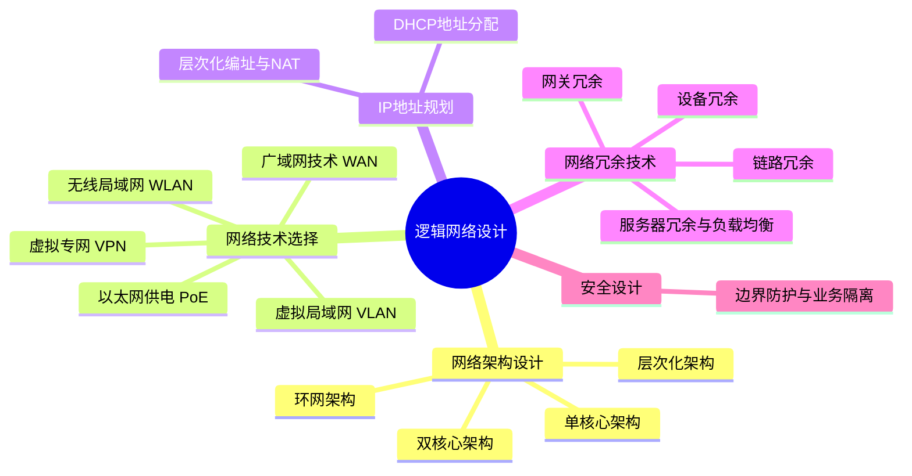

# 第五章：逻辑网络设计

## 1. 核心考点脑图 (Mindmap)

---

## 2. 深度理论解析 (Theory & Concepts)

### 2.1 网络架构设计
常见的局域网架构包括单核心架构、双核心架构、环网架构和层次化架构：
*   **单核心架构**：网络中只有1台核心交换机。
    *   *优点*：网络结构简单、节约成本，访问效率高。
    *   *缺点*：存在单点故障，核心故障会影响全网通信；扩展能力不足、对核心交换机端口密度要求高。
*   **双核心架构**：网络中有2台核心交换机，通过配置网关冗余协议（VRRP）、生成树（STP）和端口聚合（Eth-Trunk）等技术，能有效提升网络可靠性，避免单点失效。通过并行链路提供流量分担可以提高网络带宽性能。
*   **环网架构**：主要通过 RPR、RRPP 和 ERPS 等环网协议将网络设备互联，形成物理环网。
    *   *特点*：能大幅节省光纤资源，实现 50ms 快速切换。但投资和实施难度相对较高。
    *   *场景*：一般用于运营商城域网、校园网核心互联等场景。
*   **层次化架构**：应用最广泛的局域网架构，分为核心层、汇聚层和接入层（详情见三层网络架构章节）。

### 2.2 网络技术选择

#### 1. 虚拟局域网 (VLAN) 设计
VLAN 是现网应用非常广泛的技术。网络规划设计时需要重点考虑：
*   **VLAN的划分方法**与**规划方案**。
*   **VLAN跨设备互联**（Trunk）和**VLAN间路由**（通过路由器或三层交换机实现VLAN间通信）。

#### 2. 无线局域网 (WLAN) 设计
无线网络规划通常包括：规划目标定义及需求分析 $\rightarrow$ 传播模型校正及无线网络预规划 $\rightarrow$ 站址初选与勘察 $\rightarrow$ 无线网络详细规划。
*   **AP 选型与勘测**：根据场景选用高密 AP、墙面 AP、分布式 AP 或室外 AP。现场工勘后输出 **AP 部署位置图**和 **AP 统计表**。
*   **无线信道规划**：2.4G 频段只有 **1、6、11** 三个不重叠信道。实际部署中，必须保证相邻 AP 使用不重叠信道，并进行合理的三维信道设计（考虑上下楼层穿透干扰）。
*   **AP 功率优化**：降低或增强 AP 发射功率，减小同频干扰盲区，保障漫游体验。
*   **无线桥接**：对于相隔较远（如 3km）、难以布线的区域（如油田、森林），可使用室外 AP 进行无线桥接。优点是成本低，缺点是受天气影响大且要求可视无遮挡。
*   **无线认证**：公共场所常采用 **Portal 网页认证**；企业内网采用 **802.1X 认证**（安全性高，配合 NAC）；仅允许特定哑终端接入时采用 **MAC 认证**；家庭网常用 PSK 密码认证。

#### 3. 广域网技术与分支互联
广域网骨干网技术正从传统的 **TDM 时分复用（SDH/MSTP，常用于语音骨干网）** 升级为 **IP 分组交换（EPON/GPON/以太网，用于数据骨干网）**。
总分机构互联线路常见配置：
*   **裸光纤**：运营商仅提供物理线路，带宽由用户光模块决定，无安全保障，易被挖断。
*   **光纤专线**：运营商提供虚拟线路，底层有环网等保护机制，可靠性更高，按带宽收费。
*   **IPSec VPN**：基于互联网，建设成本最低，但质量受限于公网质量。
*   **SD-WAN**：性价比高，灵活调度，是目前分支互联的发展趋势。

#### 4. 虚拟专网 (VPN) 技术
*   **IPSec VPN**：主要用于总分机构端到端互联。
*   **SSL VPN**：主要用于员工出差远程移动办公（基于浏览器）。
*   **MPLS VPN**：主要用于业务和部门间的严格逻辑隔离（如电子政务外网中隔离财政、海关、公安等部门）。

#### 5. PoE 以太网供电技术
通过网线直接为 AP、摄像头等设备供电，免去强电施工，标准供电距离为 100 米。
*   **标准划分**：**PoE** (802.3af, 15W)；**PoE+** (802.3at, 30W，用于 802.11ax/室外 AP)；**PoE++** (802.3bt, 60~90W，用于球机/门禁)。
*   **供电方式**：末端跨接法（使用 1/2/3/6 传输数据兼供电）；中间跨接法（使用 4/5/7/8 空闲脚供电）。室外网络建设（如校园室外 AP）强烈建议采用 PoE 供电以保障防雷与用电安全。

### 2.3 IP 地址规划
IP 地址规划一般分为三步：确定IP数量 $\rightarrow$ 考虑 NAT 技术 $\rightarrow$ 子网划分与层次化规划（以便于路由汇总）。
*   **规划原则**：
    1.  **层次化编址**：方便网络故障排查与路由聚合。
    2.  **统一规划授权**：中心授权机构统一管理，防止私网和公网地址冲突浪费。
    3.  **动态与静态结合**：普通终端通过 DHCP 动态分配，服务器/网络设备配置静态 IP。
    4.  **私有地址+NAT**：内部使用 RFC 1918 私有地址（`10.0.0.0/8`, `172.16.0.0/12`, `192.168.0.0/16`），出口通过路由器进行 NAT 转换。
*   **DHCP 地址分配方式**：
    *   **自动分配**：为主机指定永久 IP（常用于固定终端）。
    *   **动态分配**：带租期的动态 IP 分配（只有此方式可以回收重复使用地址）。
    *   **手工分配**：管理员基于 MAC 地址绑定指定 IP。

### 2.4 网络冗余技术
网络高可用性依赖于系统级与设备级的多重冗余设计：
*   **设备冗余**：
    *   分为电源冗余、引擎冗余、交换网板冗余。
    *   接入交换机通常为单电源+单引擎。
    *   汇聚/核心交换机通常实现电源冗余和主控引擎冗余。
    *   **核心设备硬件架构（以 S12700E 为例）**：
        1. **主控板/引擎 (MPU)**：负责系统控制平面。
        2. **交换网板 (SFU)**：负责系统数据平面，提供高速无阻塞数据通道。高端核心设备实现引擎冗余+交换网板冗余。
        3. **接口板 (LPU)**：负责数据转发，提供光电接口。
        4. **业务板 (SPU)**：提供防火墙、无线 AC 等安全与增值功能。
*   **链路冗余**：采用链路聚合（LACP）或双归属设计。
*   **网关冗余**：使用 VRRP 协议实现局域网网关的主备热切换。
*   **服务器冗余与负载均衡**：避免单台服务器宕机导致应用不可用，网络层面通过负载均衡设备分担并发流量。

---

## 3. 核心技术对比与设计 (Technical Comparisons & Design)

### 3.1 广域网互联线路对比表

| 互联方式 | 工作原理与特点 | 优势 | 劣势 |
| :--- | :--- | :--- | :--- |
| **裸光纤 (同城)** | 纯净光纤线路，中间不经过任何交换机/路由器。带宽由两端光模块决定。 | 灵活扩展带宽无二次费用，独享物理介质。 | 底层无保护，被挖断即断网；按距离收费，远距离成本极高。 |
| **光纤专线** | 经过运营商设备模拟出的虚拟线路，底层具有物理环网保护机制。 | 可靠性高，有运营商 SLA 保障。 | 带宽扩展需付费；按带宽收费，成本较高。 |
| **IPSec VPN** | 依托普通互联网线路，在出口设备上建立加密隧道。 | 建设成本极低。 | 质量无保障，受限于公网拥塞情况。 |
| **SD-WAN** | 依托互联网线路并叠加智能调度控制设备。 | 建设成本较低，质量相对有保障。 | 技术较新，可能存在厂商绑定风险。 |

### 3.2 无线认证方式对比表

| 认证方式 | 认证设备/网关 | 典型应用场景 | 特点 |
| :--- | :--- | :--- | :--- |
| **802.1X 认证** | 交换机/NAC | 校园网、企业内网 | 安全性高，通常需要 PC 端安装认证客户端或证书。 |
| **Portal 认证** | 认证网关/服务器 | 商场、酒店、机场、访客网 | 网页重定向认证，无需客户端，便捷性高，安全性偏低。 |
| **MAC 认证** | 认证服务器 | 打印机、摄像头等哑终端 | 基于设备物理地址白名单，初次报备即可静默接入。 |
| **PPPoE 认证** | BRAS / BAS | 家庭宽带拨号 | 不太适合企业级大规模无线网络接入。 |

---

## 4. 历年真题与即学即练 (Typical Exam Questions & Analysis)

### 📥 真题 1：双核心架构与负载分担（2019年11月）
**【题目】** 为了保证网络拓扑结构的可靠性，某单位构建了一个双核心局域网络。对于单核心和双核心局域网络结构，下列描述中错误的是（54）。双核心局域网通过设置双重核心交换机满足可靠性，避免了单点失效，下列关于双核心局域网描述错误的是（55）。
(54) A. 单核心核心机单点故障容易导致整网失效
B. 双核心网络在路由层面可以实现无缝热切换
C. 单核心网络结构中桌面用户访问服务器效率更高
D. 双核心网络结构中桌面用户访问服务器可靠性更高
(55) A. 双链路能力相同时，可以运行负载均衡协议均衡流量
B. 双链路能力不同时，可以运行策略路由机制分担流量
C. 负载分担通过并行链路提供流量分担提高了网络的性能
D. 负载分担通过并行链路提供流量分担提高了服务器的性能

**【参考答案】** (54) C， (55) D
**【解析】** 单核心并不能提升访问效率，只能节省资金与简化结构；负载分担可以增加网络带宽，提高网络整体性能，但绝对无法提升应用服务器本身的计算/处理性能。

### 📥 真题 2：校园 WLAN 规划与供电设计（2015年11月）
**【题目】** 某大学建设无线校园网，要求室外绝大部分区域覆盖，不允许非本校师生接入。室外供电方案应采用（56），本校师生设备 IP 分配宜采用（57），对接入用户进行身份认证，只允许备案过的设备接入，宜采用（58）。
(56) A. 太阳能供电 B. 地下电缆 C. 高空电缆 D. PoE方式供电
(57) A. DHCP自动分配 B. DHCP动态分配 C. DHCP手工分配 D. 静态IP
(58) A. MAC认证 B. IP认证 C. 用户名密码认证 D. 物理位置认证

**【参考答案】** (56) D，(57) B，(58) A
**【解析】** 室外部署强烈建议 PoE 供电，防雷且免布强电。DHCP 有自动（永久）、动态（带租期可回收）、手工三种，普通师生手机接入必然需要地址可回收，选动态。题目要求“只允许在学校备案过的设备”，对应基于硬件白名单的 MAC 地址认证。

### 📥 真题 3：广域网互联线路案例分析（2022年11月）
**【问题】** 某分支与总部互联线路可以用裸光纤或光纤专线。请简要说明这两种配置的特点和利弊。
**【参考答案】** 
*   **裸光纤**：纯净物理光纤。优势：带宽由两端光模块决定，后续提速扩容无需向运营商二次付费；劣势：底层无安全和冗余保障，挖断即断网，且按距离计费远距离昂贵。
*   **光纤专线**：运营商虚拟的逻辑线路。优势：底层依托运营商传输环网，即便某段光纤被挖断也能自动倒换，可靠性极高；劣势：按带宽计费，扩容成本高昂。

---

## 5. 备考与实践建议 (Exam Tips & Practical Advice)

1. **无线 AP 部署与信道规划（下午案例设计画图题）**：
    在下午案例中，如考察无线网络规划，切记强调“相邻 AP 使用 1、6、11 不重叠信道”，并在规划时提到“结合三维空间（上下楼层穿透）进行信道和功率的交叉规避优化”。
2. **高端交换机硬件分工（概念陷阱）**：
    千万不要把控制平面和数据平面混淆。MPU（主控）负责控制平面（运行 OSPF、ARP 学习、下发配置）；SFU（网板）纯粹负责数据的高速物理交换；LPU（接口板卡）负责实际接收光电信号和基于硬件表项转发报文。高端交换机的高可用体现在：MPU 1+1 热备，SFU N+1 负载分担冗余。
3. **网关冗余实战拓展（VRRP 联动 / Tracking）**：
    虽然课件中提到双核心架构的 VRRP，但在实际网络规划与软考下午题中，必须考虑“上行链路断开但本地 VRRP 接口未 Down”导致的黑洞问题。**实战拓展**：必须在核心交换机上配置 VRRP 监控（Track）上行物理接口或上行链路 BFD 状态，一旦上行中断，主动 `reduced`（降低）自身 VRRP 优先级，促使备用交换机抢占为 Master。
