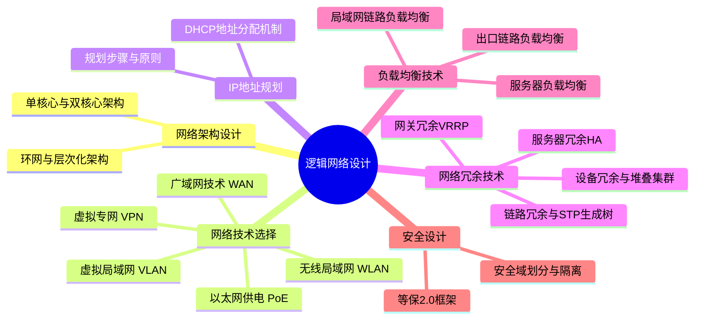

# 第五章：逻辑网络设计

## 1. 核心考点脑图 (Mindmap)

---

## 2. 深度理论解析 (Theory & Concepts)

### 2.1 网络架构设计
常见的局域网架构包括单核心架构、双核心架构、环网架构和层次化架构：
*   **单核心架构**：网络中只有1台核心交换机。优点是网络结构简单、节约成本，访问效率高。缺点是存在单点故障，核心故障会影响全网通信；扩展能力不足、对核心交换机端口密度要求高。
*   **双核心架构**：网络中有2台核心交换机，通过配置网关冗余协议（VRRP）、生成树和端口聚合等技术，能有效提升网络可靠性。
*   **环网架构**：主要通过 RPR、RRPP 和 ERPS 等环网协议将网络设备互联，形成环网。优点是能节省光纤资源，实现 50ms 快速切换；缺点是投资和实施难度相对较高。一般用于运营商城域网、校园网核心互联等场景。
*   **层次化架构**：应用最广泛，分为核心层、汇聚层和接入层。
    *   **网络出口**：负责广域网接入、地址转换、出口策略。
    *   **核心层**：负责服务器接入、路由选择。
    *   **汇聚层**：负责流量汇聚、设备/链路冗余、路由选择、策略控制。
    *   **接入层**：负责用户接入、接入安全、访问控制。

### 2.2 网络技术选择

#### 1. 虚拟局域网 (VLAN) 设计
在网络规划设计时需要重点考虑：VLAN 的划分方法、VLAN 规划方案、VLAN 跨设备互联和 VLAN 间路由。实现 VLAN 间通信最常见的方式是借助路由器或三层交换机。

#### 2. 无线局域网 (WLAN) 设计
一个完整的无线网络规划通常包括四个步骤：规划目标定义及需求分析 $\rightarrow$ 传播模型校正及预规划 $\rightarrow$ 站址初选与勘察 $\rightarrow$ 无线网络详细规划。
*   **AP 选型与勘测**：针对不同场景需求选用高密 AP、墙面 AP、分布式 AP 和室外 AP。现场勘测确定数量位置后，需输出**AP 部署位置图**和**AP 统计表**。
*   **无线信道规划**：若信道设计不合理会导致严重同频干扰。2.4G 频段不重叠信道只有 **1、6、11** 信道。部署时应保持相邻信道不重叠，并设计合理的**三维信道规划**（考虑上下楼层穿透）。
*   **AP 功率优化**：必须配置合理的射频功率（降低或增强），避免覆盖不足或同频干扰。
*   **无线桥接**：对于相隔较远（如 3km）无法部署有线的区域，可通过室外 AP 实现无线网桥互联（应用于油田、森林）。优点是部署简单成本低；缺点是稳定性差受天气影响大，且中间必须无遮挡处于可视距离。
*   **无线认证方式**：
    *   **802.1X**（认证设备为交换机/NAC）：用于校园网、企业网，安全性高，一般需要安装客户端。
    *   **Portal**（认证网关/服务器）：用于商超、公共场所，网页/短信认证，安全性低，便捷性高。
    *   **MAC认证**（认证服务器）：用于打印机等哑终端，初次认证后后续直接放行。
    *   **PPPoE/IPoE**（BRAS/BAS）：常用于宽带拨号，不适合大型无线企业网。

#### 3. 广域网技术与分支互联
广域网骨干网技术正从传统的 **TDM 时分复用（SDH/MSTP，语音骨干网）** 升级为 **IP 分组交换（EPON/PON/以太网，数据骨干网）**。
常见分支互联线路选项：
*   **裸纤 (同城)**：纯净光纤线路，中间不经过任何交换机/路由器。**优点**：带宽由两端光模块决定，可灵活扩展无二次带宽费；**缺点**：底层无安全保障机制，一旦挖断即断网，按距离收费成本高。
*   **专线**：运营商设备模拟出的一条虚拟线路。**优点**：底层有环网等技术保障，被挖断不一定中断，可靠性极高；**缺点**：带宽扩展不灵活需再付费，按带宽收费。
*   **IPSec**：依托普通互联网线路。**优点**：建设成本较低；**缺点**：质量不如裸纤和专线，维护难度大。
*   **SD-WAN**：依托互联网建立组网。**优点**：建设成本较低，质量相对有保障；**缺点**：技术较新，存在厂商绑定。

#### 4. 虚拟专网 (VPN) 技术
*   **IPSec VPN**：主要用于总分机构端到端互联。
*   **SSL VPN**：主要用于员工出差远程移动办公。
*   **MPLS VPN**：主要用于业务和部门隔离（如电子政务外网中，隔离财政、海关、公安等部门）。
*   广域网优化技术：包括数据压缩、协议优化、链路聚合、带宽预留、对话公平等。

#### 5. PoE 以太网供电技术
PoE 技术通过以太网线直接为 IP电话、AP、摄像头供电，避免铺设电力线，标准供电距离 100 米。室外 AP 强烈推荐使用 PoE 供电以防雷击。
*   **三种标准**：**PoE** (802.3af, 15W常规供电)；**PoE+** (802.3at, 30W用于 802.11ax/室外AP)；**PoE++** (802.3bt, 60~90W用于大功率球机/门禁)。
*   **跨接法**：
    *   末端跨接法 (End-span)：使用 1、2、3、6 线同时供电和传输数据（1/2正极，3/6负极）。
    *   中间跨接法 (Mid-span)：使用 4、5、7、8 空闲脚专门供电（4/5正极，7/8负极）。

### 2.3 IP 地址规划
IP 规划步骤：确定数量 $\rightarrow$ 考虑 NAT $\rightarrow$ 子网划分与层次化设计（可汇总）。
*   **规划原则**：
    1.  层次化 IP 编址：方便故障排查与路由汇总。
    2.  统一规划授权：中心授权机构统一管理，防止后期冲突浪费。
    3.  动态与静态结合：终端 DHCP 动态编址，服务器配置静态。
    4.  使用私有地址+NAT：内部使用 RFC1918 私网地址段（`10.0.0.0/8`, `172.16.0.0/12`, `192.168.0.0/16`），出口做 NAT 转换。
*   **DHCP 地址分配机制**：
    1.  **自动分配 (Automatic)**：给主机指定永久性 IP，租用后永久使用（适用于服务器等）。
    2.  **动态分配 (Dynamic)**：指定具有时间限制的 IP，到期或放弃后可被回收重复使用（适用于普通终端）。
    3.  **手工分配 (Manual)**：管理员手工绑定分配（通常基于 MAC 地址进行分配）。

### 2.4 网络冗余设计与集群技术
网络高可用性依赖于设备级与链路级的多重冗余设计。

#### 1. 设备级冗余架构
*   设备级冗余包括电源冗余、引擎冗余、交换网板冗余。接入层常为单电源/单引擎，高端核心交换机实现引擎+交换网板双冗余。
*   **典型高端设备硬件架构**（以 S12700E 为例）：
    1.  **主控板/引擎 (MPU)**：负责系统的控制平面。
    2.  **交换网板 (SFU)**：负责系统的数据平面，提供高速无阻塞数据通道。
    3.  **接口板 (LPU)**：负责数据转发功能，提供不同速率的光/电接口。
    4.  **业务板 (SPU)**：提供防火墙、AC 等增值功能模块。

#### 2. 多设备虚拟化（堆叠与集群）
使用堆叠/集群技术将独立交换机虚拟化成逻辑交换机。盒式交换机称为堆叠 (iStack)，框式交换机称为集群 (CSS)。
*   **优势**：
    1.  控制面板合一，简化网络规划复杂度，只需管理虚拟化后的逻辑设备。
    2.  逻辑交换机之间使用**链路聚合**技术，无需再部署 STP / VRRP 防环。
    3.  所有链路均参与数据转发，链路利用率达到 100%。
    4.  设备或链路单点故障不影响业务，实现毫秒级无缝热切换。
*   **劣势与隐患**：
    1.  私有协议，无法跨厂商堆叠。
    2.  **存在极大安全隐患**：控制面统一相当于“把鸡蛋放在一个篮子里”，如果逻辑设备的控制平面出故障（如遭受攻击或管理员误操作重启），将导致整个网络瘫痪。
    3.  受此影响，部分核心架构依然保留使用传统的 **MSTP+VRRP** 组网方式。

### 2.5 链路冗余与负载均衡技术

#### 1. 链路冗余与防环
*   **主备路径 (接口备份 / Standby Interface)**：在路由器上为接口配置优先级，主链路故障时，流量优先切换到优先级高的备份接口（值越大优先级越高）。
*   **以太网链路聚合 (Eth-Trunk)**：将多个物理口捆绑为一个逻辑接口。可用于交换机之间、服务器与交换机之间、堆叠系统间、甚至防火墙双机热备的心跳线。
*   **生成树技术 (STP/RSTP/MSTP)**：
    *   复杂的冗余网络会产生二层物理环路，进而引发**广播风暴**（现象：网络慢、指示灯高速闪烁、CPU 使用率极高、MAC 地址表疯狂震荡）。STP 通过逻辑阻塞特定端口打破环路。
    *   **桥 ID (Bridge ID)**：由 2 字节优先级（默认 **32768**）和 6 字节 MAC 地址构成。
    *   **路径开销 (Path Cost)**：与端口带宽成反比，默认采用 802.1t 标准。
    *   **STP 四大选举操作**：
        1. **选举根桥 (Root Bridge)**：选举桥 ID（优先级+MAC）最小的网桥。
        2. **选举根端口 (Root Port)**：非根桥到达根桥开销最小的接口；若开销相同，则比较接口上收到 BPDU 的网桥 ID 及 端口 ID（优先级 128 + 接口号，越小越优）。
        3. **选举指定端口 (Designated Port)**：每个网段选出一个指定桥及其指定端口。
        4. **选举非指定端口**：未被选上的端口将被逻辑阻塞。
    *   **协议演进**：802.1d STP (收敛慢, 30-50s) $\rightarrow$ 802.1w RSTP (快, 6s内) $\rightarrow$ 802.1s MSTP (支持多 VLAN 实例的负载分担)。
*   **Smart Link**：解决双上行组网环路，一条转发一条阻塞待命；秒级切换，配置简单且支持故障恢复回切。
*   **环网技术**：ERPS / RRPP / REP 等协议，实现环网毫秒级切换。

#### 2. 多出口链路负载均衡策略
为充分利用多运营商带宽，常见的多出口负载均衡策略（共 8 种）包括：
1. **基于源 IP 地址的策略路由**。
2. **基于目的 IP 地址的策略路由**。
3. **基于应用的策略路由**（例如视频走 ISP1，Web 走 ISP2）。
4. **基于链路优先级的负载均衡**。
5. **基于链路权重的负载均衡**。
6. **根据链路质量的负载均衡**。
7. **根据链路带宽的负载均衡**。
8. **根据综合指标的负载均衡**。

#### 3. Eth-Trunk 内部链路负载均衡模式
*   由于链路聚合存在多条物理链路，如果基于包负载可能导致到达时间不一致引起乱序。因此推荐**基于流 (逐流)** 的负载分担。
*   常见模式：源IP、源MAC、目的IP、目的MAC、源目IP、源目MAC等。
*   **原则**：实际业务中哪种参数变化越频繁，选用与其相关的算法越容易实现极致均衡。

### 2.6 网关冗余与服务器集群
*   **网关冗余 (VRRP)**：通过将多台路由器联合成一台虚拟路由器 (Virtual IP 作为真实网关)，保证网关故障时的毫秒级切换。常与 MSTP 生成树结合，既防环路又做网关主备。
*   **服务器集群负载均衡**：可通过专业硬件负载设备 (F5/A10/深信服，支持散列、轮询、最少连接算法)、NAT 映射分发、DNS 轮询解析来实现。
*   **服务器高可用集群 (HA)**：
    *   由两台服务器通过以太网或 RS232 心跳线监测对方并同步数据。
    *   **单活模式 (Active/Passive)**：一台活跃一台待机热备（常用于 SQL Server 数据库）。**注意：热备机器同样需要心跳线监控活跃机器并保持数据同步**。
    *   **双活模式 (Active/Active)**：两台同时活跃处理业务（常用于 Oracle 数据库）。

### 2.7 网络安全设计规划
*   **设计原则**：
    1.  **安全域划分**：根据功能（教学/宿舍/办公）或网络架构（核心/出口/服务器区）划分为多个区域，减小被攻击蔓延的风险。
    2.  **边界隔离**：逻辑隔离（部署防火墙/IPS）与物理隔离（部署网闸）。
*   **等保 2.0 (GB/T 22239-2019)**：
    *   分为物理环境安全 + **“一个中心，三重防御”**：安全管理中心、安全通信网络、安全区域边界、安全计算环境。

---

## 3. 核心技术对比与设计 (Technical Comparisons & Design)
*(详见上述深度理论解析板块相关的广域网互联对比、堆叠/传统架构对比等内容)*

---

## 4. 历年真题与即学即练 (Typical Exam Questions & Analysis)

### 📥 真题 1：多出口链路负载策略（2023年5月案例分析）
**【题目】** 为充分利用两个运营商的带宽，请提供至少 4 种多出口链路负载策略。
**【参考答案】** 
(1) 基于源 IP 地址的策略路由（例如 Server 区走 ISP1，PC 区走 ISP2）；(2) 基于目的 IP 地址的策略路由；(3) 基于应用的策略路由（例如视频会议走 ISP1，Web 走 ISP2）；(4) 基于链路带宽负载均衡；(5) 基于链路权重负载均衡；(6) 根据链路质量负载均衡；(7) 根据综合指标负载均衡。

### 📥 真题 2：链路聚合 CRC 错误影响（2021年11月）
**【题目】** 将 1 和 2 两条链路聚合成链路 G1，管理员发现链路 2 出现 CRC 错误告警，该网络区域可能会发生的现象是？
**【参考答案】** 部分用户上网将会出现延迟卡顿。
**【解析】** Eth-Trunk 链路聚合采用哈希负载分担，只有哈希到故障链路 2 上的数据流会受到 CRC 丢包影响出现卡顿，经过链路 1 的用户则完全无影响，故表现为“部分用户卡顿”。

### 📥 真题 3：生成树 STP 根桥与端口选举（2019年11月）
**【题目】** 在两台交换机间启用 STP 协议，其中 SWA 配置了 `STP root primary`，SWB 配置了 `STP root secondary`，两机双线相连。请问如何选举并阻塞哪个端口？
**【参考答案】** SWB 的某一个接口会被阻塞。
**【解析】**
1. SWA 配置为 primary，优先级最高成为根桥。根桥上的所有接口均为指定端口。
2. 非根桥 SWB 到达根桥路径开销均相同，需比较 SWA（对端）发来的 BPDU 接口编号。SWA 接口编号更小的那个链路被 SWB 选为根端口。
3. SWB 剩下的另一个接口未竞争过，成为非指定端口并被逻辑阻塞。

### 📥 真题 4：MSTP 与 Trunk 聚合的严谨配置（2022年11月）
**【题目】** SWA 的接口 1 配置了 GVRP 且允许 vlan 1 和 10 通过，接口 2 也配置为 trunk 但未开启 GVRP。如果要将两者加入同一个链路聚合组，会发生什么？
**【参考答案】** 只有将接口 2 的配置改为与接口 1 完全一致，二者才能加入同一个聚合组。
**【解析】** 链路聚合要求参与捆绑的所有物理接口的物理参数（速率/双工）与逻辑参数（Trunk类型/允许通过的 VLAN 列表/GVRP配置）必须 100% 一致。

### 📥 真题 5：高可用服务器集群（2018年11月）
**【题目】** 方案一：采用高可用性集群，SQL server 单活工作模式。方案二：Oracle 双活工作模式。对此描述错误的是？
**【参考答案】** 描述错误的是：“单活工作模式下热备服务器不需要监控活跃服务器并实现数据同步”。
**【解析】** 无论是单活还是双活，热备服务器都必须通过心跳线实时监测活跃服务器状态并保持数据同步，否则发生故障时无法进行无缝接管。

### 📥 真题 6：网络冗余设计考点（2018年11月）
**【题目】** 以下关于网络冗余设计的叙述中，错误的是？
**【参考答案】** “备用路径提高了网络的可用性，分担了主路径部分流量” 是错误的。
**【解析】** 纯粹的“备用路径（如 Standby Interface）”在主链路正常时是完全阻塞的，并不分担任何流量。只有启用了“负载分担”设计时，多条链路才会并行转发流量。

### 📥 真题 7：广域网互联线路（2022年11月案例分析）
**【题目】** 某分支与总部互联线路可以用裸光纤或光纤专线。请说明这两种配置的特点和利弊。
**【参考答案】** 
*   **裸光纤**：纯净物理光纤。优势是带宽由两端光模块决定，后续扩容无需二次付费；劣势是底层无环网保护，挖断即断网，且按距离计费远距离昂贵。
*   **光纤专线**：运营商虚拟的逻辑线路。优势是底层依托传输环网保护，即便挖断也能自动倒换，可靠性极高；劣势是按带宽计费，扩容成本高昂。

---

## 5. 备考与实践建议 (Exam Tips & Practical Advice)

1. **生成树 (STP) 的经典四大选举步骤（下午画图必考逻辑）**：
    先选老大（**根桥**：桥ID优先） $\rightarrow$ 找离家最近的路（**根端口**：看开销 $\rightarrow$ 对端桥ID $\rightarrow$ 对端PID） $\rightarrow$ 每个网段选村长（**指定端口**） $\rightarrow$ 剩下的全闭嘴（**非指定端口阻塞**）。在排错题中，如果出现全网指示灯狂闪、MAC地址疯狂震荡，必须第一反应是**二层环路引发了广播风暴**。
2. **堆叠设计“鸡蛋不放同一个篮子”的架构妥协**：
    课件大力推崇使用 CSS/iStack 虚拟化来消除 STP 并提升链路利用率。但在实际大型金融/政企项目中，高端核心层往往拒绝使用设备级堆叠。因为堆叠会导致“控制面板合一”，一旦发生管理板故障或遭遇恶意攻击溢出，将导致双机同时宕机瘫痪。传统的三层路由协议（OSPF）+ ECMP 等价路由组网，在核心层依然具备强大的不可替代性。
3. **DHCP 地址池分配细节（上午选择题常客）**：
    死记硬背三个分配机制的词眼：**自动分配 = 永久IP**（适合服务器），**动态分配 = 带租期+可重复回收利用**（适合师生终端接入），**手工分配 = MAC地址绑定静态配置**。
