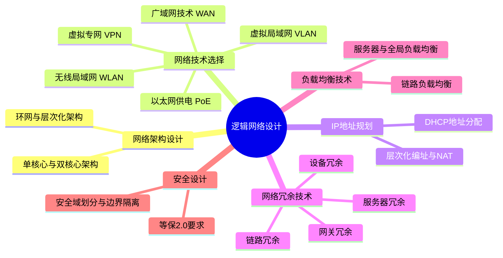

# 第五章：逻辑网络设计

## 1. 核心考点脑图 (Mindmap)

---

## 2. 深度理论解析 (Theory & Concepts)

### 2.1 网络架构设计
常见的局域网架构包括单核心架构、双核心架构、环网架构和层次化架构：
*   **单核心架构**：网络中只有1台核心交换机。网络结构简单、节约成本，访问效率高；但存在单点故障，扩展能力不足。
*   **双核心架构**：网络中有2台核心交换机，通过配置网关冗余协议（VRRP）、生成树（STP）和端口聚合等技术，能有效提升网络可靠性，避免单点失效。
*   **环网架构**：主要通过 RPR、RRPP 和 ERPS 等环网协议将网络设备互联，形成物理环网，能大幅节省光纤资源，实现 50ms 快速切换。一般用于运营商城域网、校园网核心互联。
*   **层次化架构**：应用最广泛，分为核心层、汇聚层和接入层。

### 2.2 网络技术选择
*   **虚拟局域网 (VLAN) 设计**：考虑 VLAN 划分方法、规划方案、VLAN跨设备互联和 VLAN 间路由（借助路由器或三层交换机）。
*   **无线局域网 (WLAN) 设计**：
    *   **AP 选型与勘测**：输出 AP 部署位置图和 AP 统计表。
    *   **无线信道规划**：2.4G 频段不重叠信道为 1、6、11。需进行合理的三维信道设计。
    *   **AP 功率优化**：调整发射功率，降低同频干扰。
    *   **无线桥接**：室外 AP 解决远距离（如 3km）网络互联。
    *   **无线认证**：公共场所（Portal）、企业（802.1X）、哑终端（MAC认证）、家庭（PSK）。
*   **广域网技术与分支互联**：
    *   **互联线路对比**：裸光纤（物理线，无保护，按距离收费）、光纤专线（有环网保护，按带宽收费）、IPSec VPN（成本低，质量随公网）、SD-WAN（高性价比组网）。
*   **虚拟专网 (VPN) 技术**：IPSec（总分互联）、SSL（远程办公）、MPLS VPN（业务隔离）。
*   **PoE 以太网供电技术**：
    *   分为 PoE(15W)、PoE+(30W)、PoE++(60-90W)。
    *   **供电方式**：末端跨接法（1,2,3,6线数据兼供电），中间跨接法（4,5,7,8空闲脚供电）。

### 2.3 IP 地址规划
*   **规划原则**：层次化 IP 编址、统一规划授权、动态编址与静态分配结合、使用私有地址(RFC1918)结合 NAT。
*   **DHCP 地址分配方式**：自动分配（永久IP给固定主机）、动态分配（带租期，可重复使用回收地址）、手工分配（根据MAC地址固定分配）。

### 2.4 网络冗余与高可用设计
网络高可用性依赖于系统级与设备级的多重冗余设计：

#### 1. 设备冗余
*   **核心设备硬件架构**：
    1.  **MPU (主控板/引擎)**：负责控制平面。
    2.  **SFU (交换网板)**：负责数据平面，提供高速无阻塞数据通道。高端设备支持引擎+网板双重冗余。
    3.  **LPU (接口板)**：提供光电接口，负责数据转发。
    4.  **SPU (业务板)**：提供防火墙、无线 AC 等功能。
*   **堆叠与集群 (CSS / iStack)**：
    *   **优势**：将多台物理设备虚拟为一台逻辑设备，消除二层环路，无需部署 STP/VRRP；链路聚合实现 100% 链路利用率；单设备故障业务无缝切换。
    *   **劣势**：私有协议存在厂商绑定；控制层面集中带来了“把鸡蛋放在一个篮子里”的安全性隐患（例如核心路由表被毁导致整机瘫痪）。

#### 2. 链路冗余
*   **主备路径 (接口备份 / Standby Interface)**：主接口故障时，根据优先级切换到备份接口（值越大优先级越高）。
*   **生成树技术 (STP/RSTP/MSTP)**：
    *   解决因物理环路造成的**广播风暴**（现象为网络极慢、指示灯狂闪、CPU使用率极高）。
    *   **桥ID (Bridge ID)**：2字节优先级（默认32768） + 6字节MAC地址。
    *   **STP 选举步骤**：1. 选举根桥 (Root Bridge) $\rightarrow$ 2. 每个非根桥选举根端口 (Root Port) $\rightarrow$ 3. 每个网段选举指定端口 (Designated Port) $\rightarrow$ 4. 阻塞非指定端口。
*   **Smart Link**：解决双上行组网的环路问题，主备链路秒级切换，配置比 STP 更简单。
*   **端口聚合 / 链路聚合 (Eth-Trunk)**：将多个物理接口捆绑为一个逻辑接口。支持基于包或基于流（推荐，防乱序）的负载分担，分担模式包含：源IP、源MAC、目的IP、目的MAC等。

#### 3. 网关冗余
*   **VRRP 协议**：将多台物理路由器组成一台虚拟路由器，配置虚拟 IP (VIP) 作为终端网关。常与 MSTP 结合使用，既防止环路，又实现网关主备切换与流量负载均衡。

#### 4. 服务器冗余与集群
*   高可用性集群 (HA) 通常采用心跳线监控对方状态：
    *   **单活模式 (Active/Passive)**：一台处理业务，另一台热备待机（如 SQL Server 常配置单活）。
    *   **双活模式 (Active/Active)**：两台同时处理业务（如 Oracle 常配置双活）。

### 2.5 负载均衡技术
*   **出口链路负载分担策略**：包含基于源 IP、目的 IP、应用协议、链路优先级、链路权重、链路质量、链路带宽及综合指标 8 种策略。
*   **服务器负载均衡**：可通过专业负载均衡设备 (F5 / 深信服等)、NAT 地址转换、DNS 轮询解析等实现。

### 2.6 网络安全设计
1. **安全域划分与边界隔离**：
   *   逻辑隔离：部署防火墙、入侵检测设备。
   *   物理隔离：部署网闸设备。
2. **等级保护 2.0 (GB/T 22239-2019)**：
   *   **一个中心，三重防御**：安全管理中心；安全通信网络、安全区域边界、安全计算环境。外加物理和环境安全。

---

## 3. 核心技术对比与设计 (Technical Comparisons & Design)

### 3.1 广域网互联线路对比表
| 互联方式 | 工作原理与特点 | 优势 | 劣势 |
| :--- | :--- | :--- | :--- |
| **裸光纤** | 纯净物理线路，无中间交换机，带宽看光模块。 | 灵活提速，无二次带宽费用。 | 底层无保护，被挖断即断网；远距离成本极高。 |
| **光纤专线** | 运营商提供虚拟线路，底层有环网保护机制。 | 可靠性极高，即使部分挖断也不影响。 | 带宽提速需持续付费，整体成本较高。 |
| **IPSec VPN** | 依托互联网线路配置加密隧道。 | 建设成本最低，维护容易。 | 质量无保障，受限于公网拥堵。 |
| **SD-WAN** | 依托互联网建立智能路由覆盖网络。 | 性价比高，组网灵活。 | 技术较新，存在一定的厂商绑定风险。 |

### 3.2 堆叠/集群 vs 传统 STP+VRRP 对比
| 对比维度 | 堆叠/集群 (横向虚拟化) | 传统 STP + VRRP 架构 |
| :--- | :--- | :--- |
| **链路利用率** | 100% (跨设备链路聚合，所有链路同时转发) | 低 (STP 会强制阻塞部分冗余链路) |
| **网络收敛/切换** | 单台设备故障时业务几乎无感知切换。 | 依赖 STP 与 VRRP 协议定时器，需要数秒收敛。 |
| **管理复杂度** | 极低 (多台设备变成一台逻辑设备统一管理配置) | 高 (需对每台设备单独配置复杂的 STP 和 VRRP 实例) |
| **风险与普适性** | 存在控制层面单点风险；绑定同一厂商。 | 业界标准化协议，兼容所有厂商设备，控制层面隔离。 |

---

## 4. 历年真题与即学即练 (Typical Exam Questions & Analysis)

### 📥 真题 1：多出口链路负载均衡策略（2023年5月案例分析）
**【题目】** 为充分利用两个运营商的带宽，请提供至少 4 种多出口链路负载策略。
**【参考答案】** 
(1) 基于源 IP 地址的策略路由（例如 Server 区走 ISP1，PC 区走 ISP2）；(2) 基于目的 IP 地址的策略路由；(3) 基于应用的策略路由（例如视频会议走 ISP1，Web 走 ISP2）；(4) 基于链路带宽负载均衡；(5) 基于链路权重负载均衡；(6) 基于链路质量负载均衡。

### 📥 真题 2：生成树 STP 根桥与端口选举（2019年11月、2015年11月）
**【题目归纳】** 交换机 SWA 配置了 `STP root primary`，SWB 配置了 `STP root secondary`，两根线互连，判断阻塞端口。
**【解析】**
1. **根桥 (Root Bridge)**：SWA 配置了 primary，优先级最高，成为根桥。根桥上的所有接口均为**指定端口 (Designated Port)**，处于转发状态。
2. **根端口 (Root Port)**：SWB 上到达根桥最近的端口。若开销一致，则比较对端（SWA）接口的 Port ID（默认优先级128+接口号）。SWA 接口号小的更优，故 SWB 连接 SWA 较小接口号的那个口被选举为根端口。
3. **阻塞端口 (Alternate/Block Port)**：SWB 剩下的另一个接口由于没有竞争过指定端口和根端口，最终成为**非指定端口**，被逻辑阻塞。

### 📥 真题 3：链路聚合故障影响（2021年11月）
**【题目】** 将 1 和 2 两条链路聚合成链路 G1 (Eth-Trunk)，管理员发现链路 2 出现 CRC 错误告警，该网络区域可能会发生的现象是？
**【参考答案】** 部分用户上网将会出现延迟卡顿。
**【解析】** 链路聚合使用负载分担机制，被哈希到故障链路 2 上的数据流会受到 CRC 丢包影响出现卡顿，而哈希到链路 1 的用户完全无感。

### 📥 真题 4：服务器双机集群高可用（2018年11月）
**【题目】** 方案一：使用 SQL Server 数据库采用高可用集群单活模式。方案二：使用 Oracle 采用双活工作模式。对比单活和双活。
**【参考答案】** 单活模式下一台活跃一台待机，**热备服务器也必须通过心跳线实时监控活跃服务器并进行数据同步**，以防主服务器宕机。

---

## 5. 备考与实践建议 (Exam Tips & Practical Advice)

1. **生成树 (STP) 的选举逻辑死记口诀**：
    先选老大（根桥） $\rightarrow$ 找最近回家的路（选根端口，看对端开销，再看对端PID） $\rightarrow$ 每个村选村长（网段选指定端口） $\rightarrow$ 剩下的全闭嘴（阻塞）。
2. **高端设备冗余与堆叠设计的“矛盾”**：
    下午设计题中，如果在核心层使用了高端机架式设备（如配置了主控板+网板冗余），虽然课件推荐使用 CSS/iStack 虚拟化来简化运维，但**从架构高可用性角度讲，大型政务/金融网络往往避免核心层虚拟化**。因为虚拟化会将两台设备的“控制面”合并，一旦遭到攻击或路由表溢出，将导致双机同时挂掉（鸡蛋放在了一个篮子里）。因此，高端核心层使用“路由技术（OSPF等）+ ECMP 等价路由负载”也是一种优秀的架构选择。
3. **链路聚合与 MSTP 的防互斥原则**：
    如果要将两个物理接口加入同一个 Eth-Trunk，这两个接口的物理属性（速率、双工）和逻辑属性（Trunk / Access、许可通过的 VLAN）**必须完全一致**，否则无法聚合。
