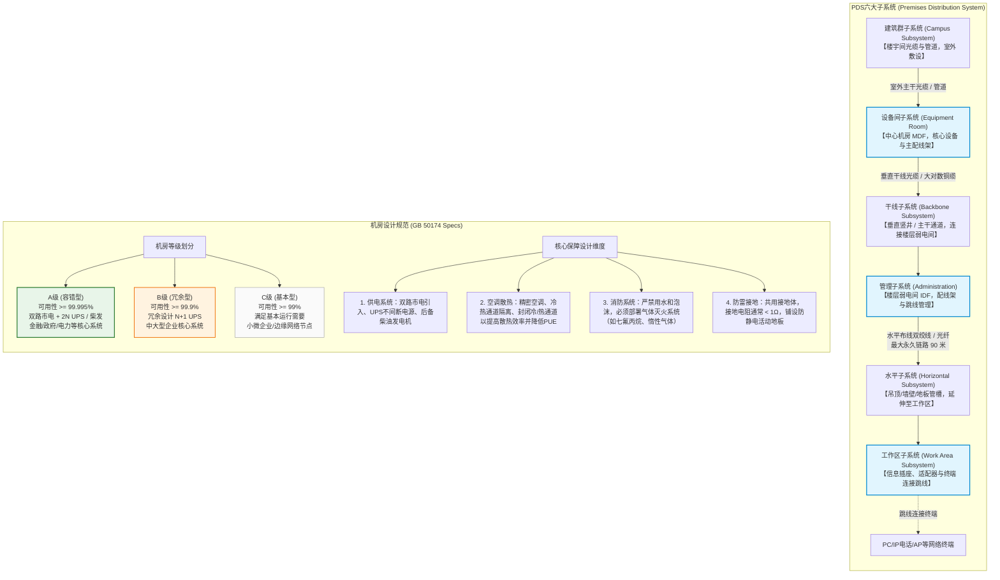

# 第六章：物理网络设计

## 1. 核心考点脑图 (Mindmap)

---

## 2. 深度理论解析 (Theory & Concepts)

### 综合布线系统 (PDS, Premises Distribution System) 概述
综合布线系统是一种模块化、灵活性极高的建筑物内或建筑群之间的信息传输通道。它在物理上将所有语音、数据、图像、多媒体设备及楼宇自控信号统一进行集成，形成标准化、结构化的配线系统。
*   **物理屏蔽与接口一致性**：PDS 的核心作用是**屏蔽传输介质差异**。它通过统一的信息插座（如 RJ-45 插孔或光纤适配器接口）、标准配线架以及跳线，使得不同的通信终端（PC、电话、监控、无线 AP）能够无缝接入物理网，实现即插即用。
*   **模块化与灵活扩展**：传统布线方式通常是“专线专用”（如电话用单对屏蔽线，电脑用双绞线），一旦业务变更需要重新拉线。而综合布线系统通过配线架的交叉连接（Patching），可以在不需要重新布线的情况下，通过改变跳线接法灵活调整业务网络的逻辑划分（例如，快速将一个普通办公点位切换为财务局域网）。

---

### 六大子系统详解（核心考点）

#### 1. 工作区子系统 (Work Area Subsystem)
工作区子系统是由终端设备连接到信息插座之间的设备组成。
*   **核心组件**：信息插座（如 RJ-45 双绞线插座、光纤插头座）、连接跳线（UTP/STP 跳线或光纤跳线）和适配器。
*   **配置标准**：
    *   **单口配置**：每个工作区仅配置 1 个信息插座，多用于单纯的数据网接入或单纯的语音电话点位。
    *   **双口配置（推荐）**：每个工作区至少配置 2 个信息插座，一个对应数据，另一个对应语音（或备份数据点位）。对于现代化办公区域，通常按每 5~10 平方米设置一个工作区进行点位预留。
*   **长度限制**：为了防止信号衰减和波形畸变，工作区连接跳线的最大长度**不能超过 5 米**。

#### 2. 水平子系统 (Horizontal Subsystem)
水平子系统负责连接楼层管理间（配线架）与工作区信息插座，主要在建筑物同一楼层的水平方向上进行走线。
*   **物理走向**：通常在吊顶内的金属桥架、墙壁内的预埋钢管或防静电地板下的线槽中敷设。
*   **最大布线长度（极其高频的考点）**：
    *   **永久链路 (Permanent Link)**：水平双绞线铜缆的最大敷设长度**严格限制为 90 米**。
    *   **信道 (Channel)**：加上工作区跳线（上限 5 米）以及管理区配线架跳线与设备连接线（合计上限 5 米），整条信道（从网络交换机端口到终端网卡）的物理通道总长度**不得超过 100 米**。
*   **介质选择**：
    *   铜缆：Cat6（六类）或 Cat6A（超六类）双绞线是当前最主流的选择。
    *   光纤：在有强电磁干扰环境、机密性要求极高或需要超大带宽（如 10G 到桌面）的场景下，可以采用多模或单模光纤走水平系统（即光纤到桌面，FTTD）。

#### 3. 管理子系统 (Administration Subsystem)
管理子系统是布线系统灵活性与可管理性的核心，通常位于楼层弱电间（IDF）。
*   **核心组件**：RJ-45 铜缆配线架、光纤配线架（ODF）、理线器、机柜、配线柜以及交叉连接跳线。
*   **功能机制**：它负责将水平子系统的线缆端接在配线架背面，然后通过前端的交叉跳线与干线子系统或者网络交换机连接。管理员只需在配线架上插拔跳线，即可快速完成终端的割接、环路排除和网络段的划分。
*   **标识与颜色标准**：遵从 ANSI/TIA-606-B 标准，要求对不同用途的线缆和配线架进行色标划分（例如：绿色代表主干，蓝色代表水平，紫色代表公共设备输入，白色代表一级主干等），并且每个信息点和配线架端口必须有唯一的永久性标签。

#### 4. 干线子系统 (Backbone / Vertical Subsystem)
干线子系统（垂直子系统）提供了建筑物内主设备间（MDF）与各楼层管理间（IDF）之间的骨干路由。
*   **布线路由**：通常沿建筑物的弱电竖井（Ducts/Shafts）进行垂直敷设，或者通过管道连接。
*   **承载流量**：需要汇聚和承载各楼层分流而来的汇总流量，因此对带宽和可靠性要求极高。
*   **介质选择**：
    *   **光缆（绝对主流）**：万兆多模光纤（如 OM3/OM4，适用于建筑内中短距离）或单模光纤（OS2，适用于高带宽、远距离）。
    *   **大对数铜缆**：主要用于传统的模拟电话语音骨干网传输（如 25 对、50 对或 100 对三类大对数电缆）。

#### 5. 设备间子系统 (Equipment Room Subsystem)
设备间子系统是整个建筑物或园区布线系统的中心，通常是指中心机房（MDF）。
*   **功能与部署**：主要部署核心交换机、服务器集群、主配线架（MDF）、网管系统、防火墙以及其他公共网络设备。
*   **物理环境标准**：作为物理架构的核心节点，设备间必须保证物理安全、良好的温湿度控制、独立的消防系统、可靠的防雷接地以及稳定的双路冗余电源输入。
*   **线缆端接**：垂直干线和外来建筑群主干光缆统一汇聚并端接在设备间的主配线架上。

#### 6. 建筑群子系统 (Campus Subsystem)
建筑群子系统将一栋大楼的综合布线系统延伸到校园或园区内的其他建筑物，实现多栋楼宇之间的数据互联。
*   **核心组件**：跨楼宇的光缆、室外大对数铜缆、保护过载的避雷器等。
*   **敷设方式及对比**：
    *   **管道敷设（首选）**：通过地下水泥管道或塑料管道穿线。优点是便于以后的电缆维护、增设和升级，且线缆受外界物理损伤的概率低；缺点是前期基建开挖和铺设管道成本较高。
    *   **直埋敷设**：直接将铠装光缆埋入地下沙土中。优点是建造成本低于管道；缺点是线缆容易因地质变动、白蚁啃咬或第三方野蛮施工被挖断，且故障排查与更换极为困难。
    *   **架空敷设**：通过电线杆在空中挂设吊线来敷设光缆。优点是施工速度极快，不破坏地表，成本低；缺点是容易受到台风、雷击、暴风雪等自然灾害破坏，影响美观，且存在高压触电安全隐患。

---

### 国家标准机房设计规范 (GB 50174)

国家标准 **GB 50174-2017《数据中心设计规范》** 是网络规划设计师必考的机房标准。规范根据电子信息系统运行中断将造成的经济损失及社会影响程度，将机房分为 **A级、B级、C级** 三个等级。

#### 机房等级划分与设计原则
*   **A级（容错型）**：
    *   *设计核心*：**容错（Fault-Tolerant）**。机房的电力、制冷等基础设施在运行期间，不能因任何单一组件的故障、单条配电线路的损坏或单次人为误操作而导致业务中断。
    *   *典型场景*：国家级金融机构、证券交易所、国防/航天调度中心、大型互联网企业核心数据中心。
*   **B级（冗余型）**：
    *   *设计核心*：**冗余（Redundant）**。关键基础设施设备有备份（如 N+1 配置），但部分管线可能为单路布置。单个设备故障时系统可依靠冗余备份继续运行，但若关键主干管线损坏可能会导致短暂中断。
    *   *典型场景*：三甲医院、省属高校、中大型企业总部、地市级政务数据中心。
*   **C级（基本型）**：
    *   *设计核心*：**基本系统**。仅满足电子信息系统运行的基本要求，设备和管线通常没有冗余，系统发生硬件故障或进行计划维护时需要停机。
    *   *典型场景*：小微企业自用机房、普通办公楼层弱电间。

#### 机房核心保障设计

#### 1. 供电系统
由于服务器和网络设备对电源的质量与稳定性要求极高，机房供电系统采用以下层级保障：
*   **双路市电引入**：A 级机房应引入两路来自不同变电站的独立市电电源，当一路断电时，另一路自动无缝接管。
*   **UPS（不间断电源）冗余设计**：
    *   **2N（双系统）**：A 级机房标准配置。由两套完全独立、对等的 UPS 系统同时向服务器的双电源模块供电。任一套 UPS 系统（包括其输入开关、变压器、蓄电池、逆变器及母线）完全损坏时，另一套仍能承载全网 100% 负载。
    *   **M+N（冗余系统）**：通过增加 N 台备份 UPS 模块来保护 M 台工作 UPS 模块，提供共享备份（如 3+1，N=1 代表 1 台备份）。
*   **柴油发电机（发电机组后备）**：作为市电完全中断后的后备动力，要求其燃油存储量在 A 级机房中应能支持运行 12~24 小时以上。

#### 2. 空调与散热（气流组织与 PUE）
*   **精密空调与恒温恒湿**：机房采用精密恒温恒湿空调系统。A 级机房的温度通常控制在 **18℃~27℃** 之间，相对湿度维持在 **35%~65%** 之间（具体以露点温度为计算依据），防止冷凝水析出（湿度过高）或静电放电（湿度过低）。
*   **冷热通道隔离设计（Cold/Hot Aisle）**：
    *   传统的机房散热是“大空间混风”，效率极低。现代机房要求机柜按**“面对面、背对背”**布置。
    *   **冷通道**：两个机柜正面相对的通道。空调的冷风从地板下方的通风孔送入冷通道，服务器的进风口吸入冷空气。
    *   **热通道**：两个机柜背面相对的通道。服务器排出的热风汇聚到热通道，并被机房上方的空调回风口吸走。
    *   **冷/热通道封闭**：为了阻止冷热空气混合，采用钢化玻璃或防火材料将冷通道（或热通道）顶部和两端封闭。这种设计能显著提高换热效率，降低空调功耗，使机房的 **PUE 值（电源使用效率 = 数据中心总能耗 / IT设备能耗）** 降至 1.5 以下。

#### 3. 消防系统
*   **介质禁忌**：机房内存放着极其昂贵且带高压电的电子设备。根据消防规范，机房的电子信息设备区**绝对禁止配置水喷淋系统或普通泡沫灭火系统**，因为水和泡沫会导致设备短路损坏及数据永久丢失。
*   **气体灭火系统**：必须部署气体自动灭火系统。常用灭火气体包括**七氟丙烷 (HFC-227ea / FM200)** 或 **惰性气体 (IG541)**。当烟感和温感探测器同时报警时，系统会自动切断空调，延迟 30 秒（留出人员疏散时间）后喷射惰性气体或灭火剂，通过物理冷却和化学抑制窒息火源，对电子元件无物理腐蚀或导电残留。

#### 4. 防雷与接地系统
*   **共用接地体**：现代机房规范要求防雷接地、交流工作接地、安全保护接地、直流工作接地等共用一组接地装置，称为**“共用接地系统”**。防止因不同接地极之间存在电位差，导致雷击时发生地电位反击烧毁设备。
*   **接地电阻限值**：共用接地系统的接地电阻通常要求 **< 1Ω**。
*   **防静电活动地板**：机房地面通常铺设防静电活动地板（金属材质或防静电饰面），地板下必须架设接地铜箔网并连接到大楼的等电位连接带上，使人体或设备摩擦产生的静电荷得以及时释放，避免静电高压击穿芯片。

### 设备选型原则与关键指标

物理网络设计阶段必须将逻辑设计转化为具体的设备采购清单。设备选型不仅要看厂商宣传的"标称参数"，更需要结合实际业务场景进行精确的容量计算。

#### 1. 核心交换机选型关键指标
*   **背板带宽 (Switching Capacity / Backplane Bandwidth)**：
    *   *定义*：交换机内部交换矩阵（Switch Fabric）所能提供的最大数据交换吞吐能力，单位为 Gbps 或 Tbps。
    *   *计算公式*：为了实现全端口无阻塞线速转发，背板带宽应满足：
        $$\text{背板带宽} \ge \sum (\text{端口速率} \times \text{端口数量}) \times 2$$
    *   *解释*：乘以 2 是因为每个端口均为全双工（同时发送和接收），双向带宽需叠加。例如：一台交换机配置 48 个 GE 口 + 4 个 10GE 口，则最低背板带宽 = $(48 \times 1 + 4 \times 10) \times 2 = 176 \text{ Gbps}$。
    *   *框式交换机注意*：对于高端框式交换机，厂商通常还会标注一个 2.0~2.4 倍的内部开销因子（含帧间隙、前导码、内部封装等），需用单向接口带宽总和乘以该因子来计算实际所需的交换网板容量（详见第 5 章真题解析）。
*   **包转发率 (Packet Forwarding Rate / PPS)**：
    *   *定义*：交换机每秒能够处理并转发的数据包数量，单位为 Mpps（百万包每秒）或 Bpps（十亿包每秒）。
    *   *计算方法*：以太网线速转发包转发率以最小以太网帧（64 字节 + 8 字节前导码 + 12 字节帧间隙 = 84 字节 = 672 bits）为基准：
        *   GE 端口线速包转发率 = $\frac{1 \times 10^9}{672} \approx 1.488 \text{ Mpps}$
        *   10GE 端口线速包转发率 = $\frac{10 \times 10^9}{672} \approx 14.88 \text{ Mpps}$
        *   100GE 端口线速包转发率 = $\frac{100 \times 10^9}{672} \approx 148.81 \text{ Mpps}$
    *   *整机包转发率* = 各速率端口的包转发率之和。若设备标称包转发率低于计算值，说明在处理大量小包时会出现丢包。
*   **端口密度与接口类型**：根据汇聚层/接入层上行链路的数量和速率需求，选择具备足够端口密度的设备。需考虑当前使用端口数 + 未来 3~5 年扩展预留（一般预留 30%~50%）。

#### 2. 汇聚比/收敛比设计 (Oversubscription Ratio)
*   **定义**：汇聚比是指下级（接入层）所有端口的总带宽与上行（到汇聚层/核心层）链路带宽的比值。
    $$\text{汇聚比} = \frac{\text{接入层所有下行端口总带宽}}{\text{接入层上行链路总带宽}}$$
*   *例如*：一台接入交换机有 48 个 GE 下行端口（总带宽 48 Gbps），通过 2 条 10GE 链路上行至汇聚层（上行总带宽 20 Gbps），则汇聚比为 $48:20 = 2.4:1$。
*   **设计原则**：
    *   **接入层到汇聚层**：一般办公网络可接受 **4:1** 至 **8:1** 的汇聚比（因为终端用户不会同时跑满带宽）。
    *   **汇聚层到核心层**：建议控制在 **2:1** 至 **4:1**。
    *   **服务器接入/关键业务区**：应采用 **1:1**（无收敛）的设计，确保服务器流量不存在瓶颈。
    *   **现代数据中心趋势**：由于云计算和虚拟化带来的"逆 80/20"流量模型，汇聚比应尽可能降低。Leaf-Spine 架构追求 **1:1 或接近 1:1** 的无收敛设计。

#### 3. 防火墙/安全设备选型指标
*   **吞吐量 (Throughput)**：在开启基本安全策略（ACL + NAT）时的最大转发带宽。注意区分"纯三层转发吞吐量"和"开启 IPS/AV 深度检测后的吞吐量"——后者通常只有前者的 30%~50%。
*   **新建连接速率 (CPS, Connections Per Second)**：每秒能够新建的 TCP 连接数，直接影响 Web 服务器前端的用户体验。
*   **最大并发连接数 (Concurrent Connections)**：设备能同时维护的最大 TCP/UDP 会话表项数。企业级防火墙通常需要支持百万级以上的并发连接。

---

## 3. 核心技术对比与设计 (Technical Comparisons & Design)

### 3.1 综合布线传输介质对比

综合布线设计中，需要根据传输距离、带宽需求、物理电磁环境来选择合适的介质：

| 介质类型 | 支持带宽 (Bandwidth) | 最大传输距离 (Max Distance) | 主要应用场景 | 接口/连接器类型 | 物理特性与成本 |
| :--- | :--- | :--- | :--- | :--- | :--- |
| **Cat6 六类双绞线** | 250 MHz / 1 Gbps (10 Gbps 可支持至 37-55m) | 100 米 (永久链路限长 90m) | 商业办公网千兆桌面接入、水平子系统。 | RJ-45 | 内部有十字骨架，铜径较粗，成本低，安装简便。 |
| **Cat6A 超六类双绞线** | 500 MHz / 10 Gbps | 100 米 (永久链路限长 90m) | 万兆桌面接入、服务器机架互联、短距离干线。 | RJ-45 (通常带金属屏蔽外壳) | 铜径更粗，通常具有屏蔽层 (STP/FTP)，抗干扰极强，成本中等，弯曲半径大。 |
| **OM3 万兆多模光纤** | 2000 MHz·km / 10 Gbps (40G/100G 极限支持 100m) | 10G 下最大 300 米 | 楼宇内垂直干线子系统、机房机架间高速互联。 | LC / SC / MPO | 纤芯 50μm，使用激光（VCSEL）光源，性价比高的短距万兆方案。 |
| **OM4 万兆多模光纤** | 4700 MHz·km / 10 Gbps (40G/100G 极限支持 150m) | 10G 下最大 400 米 | 高密度数据中心垂直骨干、高带宽核心互联。 | LC / SC / MPO | 纤芯 50μm，相比 OM3 带宽更大，传输距离更远，多用于 40G/100G 升级环境。 |
| **OS2 单模光纤** | 理论无限 / 100 Gbps+ | 数十公里 (通常可达 10km - 40km) | 园区建筑群子系统、跨楼宇光缆、广域网/城域网互联。 | LC / SC | 纤芯 9μm，使用半导体激光器光源，光衰极小。光缆本身便宜，但光模块成本高。 |

---

### 3.2 GB 50174 机房等级对比

下表归纳了国标 GB 50174 对于 A、B、C 三级数据中心机房的关键物理指标要求：

| 对比维度 | A级 (容错型 - Tier IV 级别) | B级 (冗余型 - Tier III 级别) | C级 (基本型 - Tier II/I 级别) |
| :--- | :--- | :--- | :--- |
| **核心设计理念** | **容错 (Fault-Tolerant)**：任何单点故障均不影响系统运行。 | **冗余 (Redundant)**：系统组件有备份，但管线路径不一定完全冗余。 | **基本型**：满足基本物理环境，基本无备用组件或管路。 |
| **市电供电要求** | 两路独立市电引入，来自不同的变电站。 | 双路市电引入（或单路市电加备用发电机组）。 | 单路市电引入即可。 |
| **UPS 系统冗余** | **2N (双系统并联)** 或 **M+N 无中断自动切换**。 | **N+1 冗余并联**。 | **N (单机运行)**，无冗余备份。 |
| **精密空调冗余** | 双路水源/双路管网，空调配置 **N+X 冗余（容错控制）**。 | 单路水源/单路管网，空调配置 **N+1 冗余**。 | 空调配置 **N (无冗余)** 或普通商业空调。 |
| **容许年停机时间** | **0 小时**（高可用性 $\ge 99.995\%$） | **$\le 7.5$ 小时**（可用性 $\ge 99.9\%$） | **$\le 72$ 小时**（可用性 $\ge 99\%$） |
| **消防灭火介质** | 气体自动灭火系统（如七氟丙烷、IG541）。 | 气体自动灭火系统（如七氟丙烷、IG541）。 | 气体灭火系统或手提式气体灭火器（绝对禁水）。 |
| **典型应用场景** | 金融总部数据中心、国家级超算中心、关键政务云平台。 | 三甲医院中心机房、高校主数据中心、中大型企业核心机房。 | 小型办公区弱电点、小微企业自用设备间。 |

---

## 4. 历年真题与即学即练 (Typical Exam Questions & Analysis)

### 4.1 历年真题 1：水平子系统铜缆用量与箱数计算

#### 【问题描述】
某网络规划设计师在承接一栋写字楼的综合布线设计方案。已知该写字楼某层办公区内，从楼层弱电管理间（IDF）配线架到最远端信息插座的物理敷设距离为 **75米**，到最近端信息插座的物理敷设距离为 **25米**。该层共设计有 **160个** 双绞线数据信息点（RJ-45接口）。
若在水平子系统敷设中统一采用标准的超五类非屏蔽双绞线（每箱标准包装线长为 **305米**），请问：
1. 平均每个信息点的双绞线布线用量为多少米？
2. 敷设该楼层的水平双绞线共需要采购多少箱网线（计算结果向上取整，且不计单独的施工耗损）？

#### 【可选选项】
A. 28 箱
B. 30 箱
C. 32 箱
D. 35 箱

#### 【参考答案】
**C. 32 箱**

#### 【详细解析】
**第一步：掌握计算水平双绞线用量的标准公式。**
在软考及综合布线工程实践中，水平子系统每个信息点的平均双绞线长度计算公式为：
$$L_{avg} = 0.55 \times (L_{max} + L_{min}) + S$$
*   其中：
    *   $L_{max}$ 为楼层配线架到最远端信息点的距离（本题中为 75 米）。
    *   $L_{min}$ 为楼层配线架到最近端信息点的距离（本题中为 25 米）。
    *   $0.55$ 系数来源：平均距离为 $(L_{max} + L_{min}) / 2 = 0.5 \times (L_{max} + L_{min})$，并考虑了大约 10% 的敷设弯曲及冗余损耗（即 $0.5 \times 1.1 = 0.55$）。
    *   $S$ 为两端备用余量（Termination Slack），一般包括：
        *   工作区端预留（通常为 0.3 ~ 0.5 米）。
        *   配线架管理间端预留（通常为 1.5 ~ 3 米，用以理线、容错及二次端接）。
        *   国家标准及考题惯例中，备用余量 $S$ 通常取值为 **6 米**（即两端各预留约 3 米，或包含富余量）。

**第二步：代入数据计算平均长度。**
$$L_{avg} = 0.55 \times (75 + 25) + 6$$
$$L_{avg} = 0.55 \times 100 + 6 = 55 + 6 = 61 \text{ 米}$$
即，平均每个信息点的双绞线用量为 **61 米**。

**第三步：计算总用线长度。**
全层共有 160 个信息点，因此水平子系统的总用线量为：
$$C_{total} = L_{avg} \times n = 61 \times 160 = 9760 \text{ 米}$$

**第四步：计算所需采购的网线箱数。**
每箱网线的标准长度为 305 米，所需的网线箱数 $N$ 为：
$$N = \frac{C_{total}}{305} = \frac{9760}{305} \approx 32.00 \text{ 箱}$$
由于每箱线不能零拆（如果计算结果为 31.02 箱，也必须向上取整采购 32 箱以保证连续线缆敷设），因此本题至少需要采购 **32 箱** 网线。

---

### 4.2 历年真题 2：GB 50174 机房设计规范合规性评判

#### 【问题描述】
某省政务服务中心计划新建一套“互联网+政务”服务系统机房，用于承载全省居民的户籍、社保、税务等核心数据的在线办理与存储。一旦该系统中断，将造成全省大面积政务服务停滞，引发社会秩序中度混乱与重大的公共损失。
网络设计师提交了如下机房设计方案，其中**正确且完全符合 GB 50174 标准**的一项是：

A. 鉴于该机房的重要度，应按照 B 级标准设计。供电设备仅引入一路市政电源，UPS 系统采用多台设备进行 N+1 并联冗余，并配备额定功率满足 IT 负载的柴油发电机组。
B. 为防止设备过热导致宕机，机房内安装普通商用中央空调。机房内温度控制在 25℃ 左右。考虑到湿度对人体的舒适度影响，应加装加湿器将机房空气相对湿度保持在 70% ~ 80% 之间。
C. 机房主机房区（电子信息设备区）面积较大，为防止火灾蔓延，设计师在吊顶内安装了联动自动水喷淋系统；为保障电气安全，水喷淋管路采用防渗水不锈钢管，并与机柜保持 1.5 米以上的水平安全净距。
D. 该数据中心必须按照 A 级标准设计。供电由两路来自不同变电站的独立市政电源引入，IT 设备采用双路配电，UPS 采用 2N 冗余配置。为了保证高效的制冷与节能，机柜采用“面对面、背对背”方式排列，并对冷通道进行封闭处理。

#### 【参考答案】
**D. 该数据中心必须按照 A 级标准设计。供电由两路来自不同变电站的独立市政电源引入，IT 设备采用双路配电，UPS 采用 2N 冗余配置...**

#### 【详细解析】
*   **选项 A 错误**：该系统关乎全省户籍、社保等核心业务，中断会引发社会秩序混乱和重大损失，依据 GB 50174 的机房等级划分原则，必须设计为 **A级（最高级别）** 机房。同时，A级机房要求引入**两路独立的外部市电**，只引入一路属于重大设计隐患。
*   **选项 B 错误**：机房内**严禁使用普通的商业中央空调**，必须使用可精确控温控湿的精密恒温恒湿空调。另外，A级机房的相对湿度标准为 35% ~ 65%，**70% ~ 80% 湿度过高**，容易使电子元器件表面凝结微小水珠（凝露），导致电路板发生微短路或金属接插件氧化。
*   **选项 C 错误**：机房内存在高压电气设备与精密磁介质，**主机房区严禁部署水喷淋系统**。一旦漏水或灭火时喷水，会导致全网硬件短路烧毁、数据彻底损坏。必须采用**气体灭火系统**（如七氟丙烷）。
*   **选项 D 正确**：系统定位为 A 级，采用双路市电引入、2N 冗余 UPS 配电，完全符合 A 级“容错型”无单点故障的基本要求。气流组织采用冷热通道隔离，并封闭冷通道，是现代高效节能绿色数据中心的标准物理设计方案方案。

---

## 5. 备考与实践建议 (Exam Tips & Practical Advice)

### 下午案例分析常考点提示

#### 1. 水平布线“90米超限”故障诊断
*   **出题场景**：下午案例题中，通常会给出一张楼层平面图，标注出弱电管理间（IDF）的物理位置，并说明“某些位于角落的办公室信息插座距离配线架钢管敷设路径长度为 95 米，工程测试发现丢包严重”。
*   **标准答题套路**：
    1.  **指出问题**：水平子系统铜缆永久链路限长为 **90米**（信道总长限制 100 米）。该设计中敷设长度达 95 米，超出了超五类/六类双绞线传输的物理极限，导致信号严重衰减和阻抗失配，从而引发丢包。
    2.  **给出解决方案**（通常要求答出至少两点）：
        *   **调整物理位置**：将弱电管理间（IDF）移动至该层的中部位置，缩短至所有信息插座的最长距离。
        *   **增设弱电间**：在该层另一侧增设一个辅助弱电间（Sub-IDF），分担远端办公室的信息点接入。
        *   **改变传输介质**：将超限信息点的传输介质由双绞线铜缆改为**多模/单模光纤**，配合光纤收发器或带光口的终端，光纤不受 90 米限制。
        *   **部署中继设备**：在距离大于 90 米的途中安装接入级交换机作为中继（较少推荐，因为涉及供电和防盗物理安全）。

#### 2. 配线架标签管理标准 (ANSI/TIA-606-B)
在下午的规划设计分析题中，要求设计师补全综合布线的标签体系：
*   考点要求：不仅设备要贴标签，配线架（Patch Panel）、跳线、甚至墙壁插座都需要按照结构化命名。
*   示例：`1F-A-01-24` 代表“1楼（1F）、A弱电间（A）、01号机柜（01）、配线架第24个端口”。必须在答题中强调“统一标识、防脱落标签、色彩管理”的规范。

#### 3. 机房环境的温湿度与 PUE 优化
*   下午题中可能要求针对“绿色数据中心”提出改造建议。
*   **解题钥匙**：
    *   **冷热通道不隔离**是导致 PUE 居高不下的主要诱因。必须提出“冷通道封闭（Cold Aisle Containment, CAC）”，使冷气 100% 通过服务器机柜内部，防止旁路损失，降低空调出风温度设定值，节省电能。
    *   **接地电阻问题**：防雷系统与交流工作接地分开会导致地电位反击。必须回答“共用接地系统，接地电阻控制在 1Ω 以下，进行等电位连接（Grid Grounding）”。
