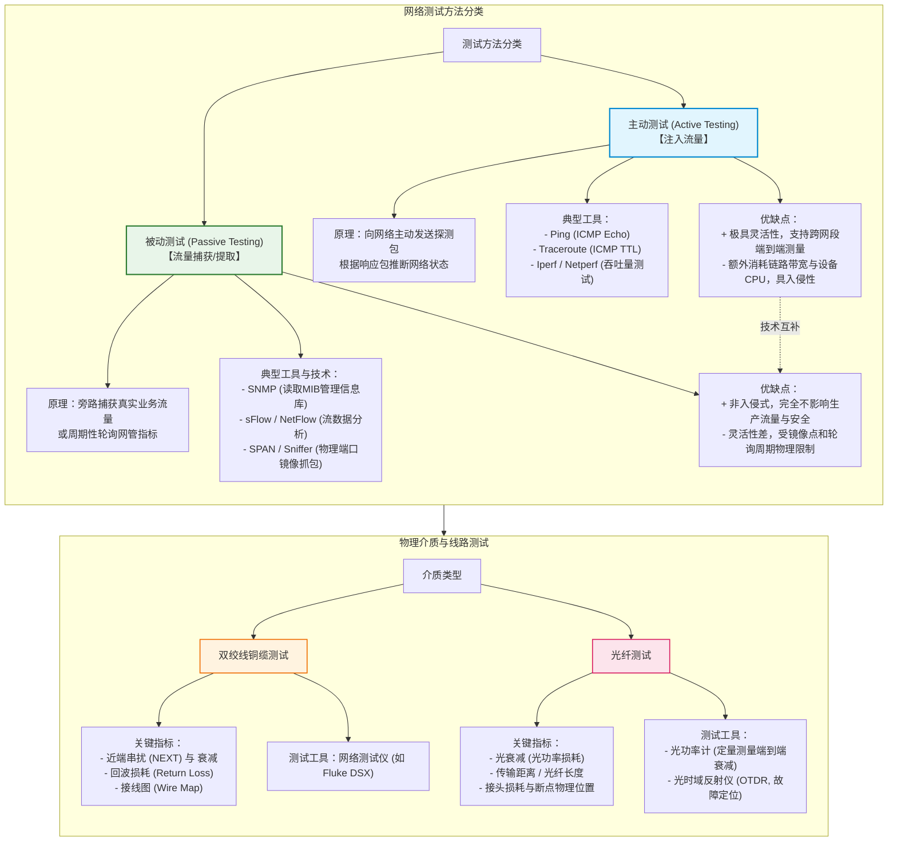

# 第七章：网络测试与运维

## 1. 核心考点脑图 (Mindmap)



---

## 2. 深度理论解析 (Theory & Concepts)

### 网络测试概述与分类
在网络规划、设计和部署生命周期中，**网络测试**是不可或缺的环节。它的核心目的在于：
1.  **验证设计达标**：验证物理线路与逻辑拓扑的设计是否达到规划的技术指标（如带宽、延时、可用性）。
2.  **建立性能基线**：在系统刚上线或运行正常的健康状态下，记录网络性能特征，为后续运维过程中的故障排查和扩容规划提供参考基准。
3.  **故障定位诊断**：当网络发生异常（如链路闪断、业务缓慢）时，通过测试手段快速定位瓶颈或物理损坏点。

网络测试按方法可划分为**主动测试**和**被动测试**两大阵营；按层级则可划分为**物理介质测试**、**设备基准测试**和**网络性能/应用测试**。

---

### 主动测试 (Active Testing) 详解

#### 1. 工作原理
主动测试（又称入侵式测试）通过测试终端或专用设备，向被测网络中**主动注入自定义的探测流量（Test Traffic）**，接着收集并分析这些流量在网络中的传输行为（如是否到达、往返时间、序列错乱、丢包比例等），从而推断网络协议的运行状态以及链路物理性能。

```
[源测试主机] --(主动注入探测包/测试流)--> [网络设备/链路] --(到达或反射)--> [目的主机/源主机]
      |                                                                 |
      +---------------------(分析时延、丢包、吞吐量)---------------------+
```

#### 2. 典型工具与应用
*   **Ping**：利用 **ICMP Echo Request**（类型 8）和 **Echo Reply**（类型 0）报文，测量端到端连通性与单包往返时延（RTT）。
*   **Traceroute**：通过发送具有渐增 **TTL (Time to Live)** 值的探测包（UDP、ICMP 或 TCP），利用沿途路由器返回的 **ICMP Time Exceeded**（类型 11，代码 0）报文以及目的端返回的 **ICMP Port Unreachable**（类型 3，代码 3）报文，逐跳勾勒出数据包所经过的路由路径。
*   **Iperf / Netperf**：专门用于吞吐量压测的开源软件。通过在源端和目的端之间建立 TCP/UDP 连接，以最大速率或设定的带宽发送数据，测试网络在饱和状态下的极限吞吐量、抖动及丢包率。

#### 3. 优缺点分析
*   **优点**：
    *   **灵活性极高**：只要IP可达，测试不受物理位置和设备品牌限制，可以模拟任意时间、任意速率的业务流量。
    *   **测量维度精准**：能够精确获取实时的端到端时延、瞬时抖动、连续丢包率等核心服务质量指标（QoS）。
    *   **无需底层设备配合**：通常只需要测试端点支持，不需要在网络沿途交换机和路由器上开启特殊的镜像口或数据流分析功能。
*   **缺点**：
    *   **侵入性 (Intrusive)**：主动注入的测试流量会额外消耗被测链路的带宽资源，如果压测流量过高，会对生产环境的真实业务造成冲击。
    *   **计算消耗**：生成和处理高并发探测数据包需要消耗测试主机及沿途网络设备的 CPU 资源。
    *   **安全合规风险**：高频率的探测（如快速 Ping 或端口扫描）可能会触发网络安全系统（防火墙、IDS/IPS）的防御警报，导致测试 IP 被自动封禁，或引发网络安全审计风波。

---

### 被动测试 (Passive Testing) 详解

#### 1. 工作原理
被动测试（又称非侵入式测试）**绝不向网络中注入任何额外的背景流量**。它采用“旁路监听”或“周期提取”的方式，利用网络设备自身的统计机制或物理旁路通道，去捕获、过滤、记录和分析在生产网中传输的真实业务流量（Live Traffic），或者定时读取网络设备的内部性能指标。

```
                     [真实业务流量流向]
[用户终端] ======================================> [服务器]
                          || (光电旁路镜像)
                          \/
                  [网络流量分析/审计仪]
```

#### 2. 典型技术与工具
*   **SNMP (简单网络管理协议)**：网管系统（NMS）通过定期（如每 5 分钟）轮询读取网络设备中 **MIB (管理信息库)** 的计数器，获取交换机端口的发送/接收字节数、错误帧数、设备 CPU/内存利用率等。
*   **物理旁路抓包 (SPAN / RSPAN / ERSPAN)**：在交换机上配置端口镜像（Switch Port Analyzer），将指定端口或 VLAN 的流量复制一份发送到接有 Wireshark 或 Sniffer 分析仪的监控端口，进行深度包分析（DPI）。
*   **流控技术 (NetFlow / sFlow / IPFIX)**：网络设备将流经端口的报文按照特定的五元组进行聚合，或进行固定比例（如 1:1000）采样，打包发送给网络流分析服务器，用于监控流量构成、应用占比及异常攻击。

#### 3. 优缺点分析
*   **优点**：
    *   **完全非侵入式 (Non-intrusive)**：零背景测试流量，完全不占用网络可用带宽，不会对网络设备带来因“发包”而产生的额外处理负担。
    *   **高安全性与合规性**：对正在运行的业务系统无任何潜在破坏性风险，非常适合在金融、医疗等极度敏感的生产网进行长期在线监控。
    *   **数据真实度高**：所分析的数据全部来源于网内真实的业务交互，能够准确还原真实用户的应用分布和行为特征。
*   **缺点**：
    *   **灵活性不足**：被动测试严重依赖抓包探针的部署物理位置。如果镜像点选择不合理，将无法捕获到跨区域、跨网段的完整流量。
    *   **实时性与精度受限**：网管系统轮询 MIB 存在时间间隔限制（通常是分钟级），难以捕捉到毫秒级的网络微突发（Micro-burst）。
    *   **存储与计算成本昂贵**：在高带宽（如 10G/40G/100G）骨干链路上进行全流量被动抓包分析，会产生海量的数据，对分析仪的磁盘写入速度和存储容量提出了极高的挑战。

---

### 物理介质与线路测试

网络工程在物理施工完毕后，必须对传输介质进行严格的物理特性测试，确保布线工程符合国家及国际规范。

#### 1. 双绞线铜缆测试
使用专业的网络电缆认证测试仪（如 Fluke DTX/DSX 系列）进行测试，主要关注以下四个关键物理指标：
*   **接线图 (Wire Map)**：检测双绞线 8 芯线的物理连接关系，确认是否存在开路（断路）、短路、错对（Crossed Pairs）及串绕对（Split Pairs）等接线错误。
*   **衰减 (Attenuation / Insertion Loss)**：信号在铜缆中传输时的能量损失。衰减随着缆线长度增加及信号频率升高而增大。
*   **近端串扰 (NEXT, Near-End Crosstalk)**：在一个线对中发送信号时，在同一端的相邻线对中感应到的电磁干扰信号。NEXT 值越大，说明抗串扰性能越好（因为 NEXT 实际上是测量“信号与干扰的差值”或者“耦合损耗的倒数”，常用正的分贝数表示，值越大意味着泄露过去的噪声越小）。
*   **回波损耗 (Return Loss, RL)**：由于电缆物理阻抗不均匀（如折弯、压扁或接头制作粗糙），导致部分发射信号发生反射，折返回发送端。回波损耗过低会导致反射波与后续信号叠加，引发码间干扰。

#### 2. 光纤线路测试
光纤测试根据工程阶段和测试要求，主要采用以下两种仪器：
*   **光功率计 (Optical Power Meter)**：
    *   **测试原理**：在光纤一端接入标准光源发光（Tx），另一端连接光功率计接收（Rx），测量接收到的光功率大小。
    *   **应用场景**：属于**一级测试（Tier 1）**。用于定量测量整条光纤链路的端到端光衰减（Loss，单位为 dB），是光纤链路可否通过验收的最基本指标。
*   **光时域反射仪 (OTDR, Optical Time Domain Reflectometer)**：
    *   **测试原理**：向光纤中注入高功率的窄脉冲光，当光脉冲在光纤内传输时，由于玻璃纤芯的瑞利散射和菲涅尔反射，会不断产生微弱的背向反射光折返回输入端。OTDR 内部的接收机通过测量返回光的时间和光功率大小，勾勒出反射光功率随距离变化的曲线。
    *   **应用场景**：属于**二级测试（Tier 2）**。OTDR 不仅能测出整条链路的总损耗，更擅长**空间定位**——可以精确定位光纤中的熔接接头位置、法兰盘连接器点、严重弯曲点，以及光纤的断裂位置（断点），测量出它们到测试端点的精确距离（精确到米）。

```
光功率 (dB) 
    ^
    |  [菲涅尔反射 - 输入端连接器]
    |\
    | \__________ [瑞利散射曲线，斜率代表光纤衰减率]
    |            \
    |             \ [非反射阶跃衰减 - 熔接损耗 / 弯曲损耗]
    |              \__________
    |                         \ [菲涅尔反射 - 末端反射 / 断点]
    |                          |\
    |                          | \
    +----------------------------------------------------------> 距离 (km)
```

---

### 网络设备基准测试标准 (RFC 2544)

为了在选择或评测交换机、路由器、防火墙等网络设备时拥有统一的行业标准，IETF 制定了 **RFC 2544**《网络互联设备基准测试方法》。该标准规范了四大核心性能指标的测试流程：

1.  **吞吐量 (Throughput)**：
    *   **定义**：在不丢失任何一个数据包的情况下，设备所能转发的最大数据包速率（常以 Mbps 或 pps 帧转发率表示）。
    *   **测试方法**：在设备输入端以一定速率发送特定大小的帧，如果接收端未丢包，则提高发送速率；若发生丢包，则降低发送速率。通过迭代逼近，找出零丢包的极限发送速率。
2.  **时延 (Latency)**：
    *   **定义**：数据包从发送端进入设备，到从设备输出端发出之间的时间间隔（通常为微秒级 $\mu s$）。
    *   **测试方法**：在吞吐量测试得出的最大安全转发速率下，发送测试帧流，并在流的中间标记一个特定的“时间戳帧”，计算该帧进出设备的时间差。通常连续测试多次取平均值。
3.  **丢包率 (Packet Loss Rate)**：
    *   **定义**：在不同的网络负载（从极限带宽的 10% 到 100% 递增）下，未能被设备成功转发而被丢弃的帧占输入总帧数的百分比。
    *   **测试方法**：以恒定速率发送指定数量的帧，统计接收到的帧数，利用公式：$\text{丢包率} = \frac{\text{输入帧数} - \text{输出帧数}}{\text{输入帧数}} \times 100\%$ 计算。
4.  **背对背 (Back-to-Back) 帧发送**：
    *   **定义**：在设备达到零丢包转发的前提下，以设备输入物理链路的极限线速（Line Rate），连续发送突发帧（Burst Frames）而不产生丢包的最大连续帧数。
    *   **工程意义**：衡量设备的内部缓冲区（Buffer）在处理突发大流量流量时的容纳和消纳能力。

### 网络工程验收流程

网络工程从施工完成到正式交付使用，必须经过规范的验收流程。验收是确保设计指标落地、施工质量达标的核心保障环节。

#### 1. 验收三阶段
*   **初步验收（初验）**：
    *   *时间节点*：物理施工完毕、设备安装调试完毕后。
    *   *核心工作*：
        1.  **物理链路测试**：对所有水平子系统和干线子系统的双绞线进行 Fluke 铜缆认证测试（接线图、衰减、NEXT、回波损耗），对光纤链路进行光功率计衰减测试和 OTDR 曲线测试。
        2.  **设备加电测试**：确认所有网络设备正常加电、风扇运转正常、板卡状态指示灯正常、无硬件告警。
        3.  **逻辑功能验证**：验证 VLAN 划分、路由协议收敛、ACL 安全策略、VRRP 冗余切换等逻辑功能是否符合设计方案。
        4.  **文档核对**：核对竣工图纸（拓扑图、布线图、机柜布局图）是否与实际施工一致。
*   **试运行**：
    *   *时间节点*：初验通过后，进入 **1~3 个月**的试运行期。
    *   *核心工作*：将新建网络接入生产环境，在实际业务负载下观察网络运行稳定性。重点监测：链路利用率峰值、设备 CPU/内存使用趋势、OSPF/BGP 路由稳定性、丢包率与时延指标。记录试运行期间发生的所有故障事件及处理情况。
*   **最终验收（终验）**：
    *   *时间节点*：试运行期满，且试运行期间无重大故障。
    *   *核心工作*：
        1.  审核试运行期间的网络运行报告，确认各项性能指标均达到设计要求。
        2.  进行 **RFC 2544 基准测试**，记录各主干链路的吞吐量、时延、丢包率和背对背帧数，形成初始性能基线文档。
        3.  审核全部竣工文档的完整性与准确性。
        4.  各方签署《网络工程竣工验收报告》，项目正式交付运维。

#### 2. 验收交付文档清单
网络工程竣工验收时，设计方和施工方需向甲方提交以下标准文档：

| 文档名称 | 主要内容 | 重要性 |
| :--- | :--- | :--- |
| **竣工拓扑图** | 网络物理拓扑与逻辑拓扑的最终实际状态（含设备型号、接口编号、IP 地址）。 | 极高 |
| **综合布线竣工图** | 各楼层信息点分布图、配线架端口对应表、线缆走向图。 | 极高 |
| **设备配置文档** | 所有网络设备最终的 running-config 配置文件及版本记录。 | 极高 |
| **测试报告** | 铜缆/光纤物理测试报告（Fluke/OTDR）、RFC 2544 性能基准测试报告。 | 高 |
| **IP 地址分配表** | 全网 IP 地址的分配规划与使用状态。 | 高 |
| **运维操作手册** | 日常巡检清单、常见故障处理手册、应急预案、厂商维保联系方式。 | 高 |
| **培训记录** | 对甲方运维人员的设备操作与故障处理培训记录。 | 中 |

#### 3. 验收常见问题与整改
*   **水平布线超 90 米**：部分远端信息点的铜缆永久链路超过 90 米限制，测试不通过。整改方案：增设弱电间或改用光纤。
*   **标签缺失或错误**：施工队未按 TIA-606-B 标准粘贴标签，导致配线架端口与信息点无法对应。整改方案：重新测试并对全部端口进行标签补录。
*   **光模块不匹配**：短距光纤使用了长距光模块，导致接收端光功率过高（过载）。整改方案：在法兰处串接光衰减器或更换适配光模块。

---

## 3. 核心技术对比与设计 (Technical Comparisons & Design)

### 3.1 主动测试与被动测试的全方位对比

在进行网络运维方案设计或故障排查时，应根据实际需求合理搭配使用主动和被动测试技术。

| 对比维度 | 主动测试 (Active Testing) | 被动测试 (Passive Testing) |
| :--- | :--- | :--- |
| **工作机制** | 向被测网络主动注入人工构造的探测包。 | 旁路采集、过滤分析网内的真实业务流或统计指标。 |
| **入侵与干扰级别** | **入侵式 (Intrusive)**，产生额外测试背景流量。 | **非入侵式 (Non-intrusive)**，不产生任何背景流量。 |
| **网络资源消耗** | 占用被测链路的部分带宽，消耗设备的 CPU 资源。 | 基本上不占用网络传输带宽，但对存储和深度分析计算有较高要求。 |
| **测试灵活性** | 极高，不受物理拓扑和时间段限制，随时进行。 | 较低，受限于网络抓包探针或镜像口配置的物理位置。 |
| **指标获取优势** | 擅长测量精确的**端到端单向时延、抖动、路由跳数**。 | 擅长测量**流量流向构成、网络应用分布、长期运行基线**。 |
| **网络安全性** | 如果流量过高可能诱发广播风暴，或触发网络安全拦截。 | 极高，对运行中的业务系统毫无安全和性能影响。 |
| **典型测试工具** | Ping, Traceroute, Iperf, Netperf, Linkrunner | Wireshark, SNMP MIB, NetFlow, sFlow, SPAN镜像 |

---

### 3.2 RFC 2544 设备基准测试四项指标对比

| 测试指标 | 定义 (Definition) | 测试方法 (Testing Method) | 工程与设计意义 (Engineering Significance) |
| :--- | :--- | :--- | :--- |
| **吞吐量 (Throughput)** | 在**零丢包**（不发生任何帧丢失）前提下，网络设备每秒转发的最大帧数或比特数。 | 通过二分法或递增步长法迭代发送测试流，寻找无丢包转发的极限负荷点。 | 评估设备在核心节点承受极限大业务流量时的实际转发硬实力，防范瓶颈。 |
| **时延 (Latency)** | 数据包的首比特进入网络设备，到其尾比特离开设备的物理时间差。 | 在吞吐量限制内持续发包，在帧流中插入带时间戳的标记帧，计算往返或单向时间差。 | 决定高实时性业务（如 VoIP、在线金融高频交易、视频会议）在该设备上的运行质量。 |
| **丢包率 (Packet Loss Rate)** | 由于设备处理能力不足或缓冲区溢出，被设备丢弃的帧占所有发送帧的比例。 | 以从 10% 到 100% 线速的不同阶梯流量加载发包，在测试终点统计发送与接收的帧数差。 | 揭示设备在超出其额定转发极限后的过载降级表现及协议栈的健壮程度。 |
| **背对背 (Back-to-Back)** | 以物理介质的最大传输速率（线速）连续发送突发帧时，设备不丢包的最大连续包数。 | 设定测试设备以 100% 线速发送连续的突发包包群，逐步增加包数直到设备出现丢包，记录临界包数。 | 评估设备吸收网络微突发大流量（例如数据库大量同步备份、大文件下载瞬间）的缓冲能力。 |

---

## 4. 历年真题与即学即练 (Typical Exam Questions & Analysis)

### 4.1 历年真题 1：主动测试与被动测试的区别与选择

#### 【问题描述】
某大型企业网络中心计划对总部与跨省分支机构之间的广域网链路进行为期一个月的性能评估。网络工程师提出了两种测试方案：方案一是使用网管系统（NMS）通过标准协议定时收集各路由器接口的利用率与丢包计数；方案二是使用专门的测试主机，在工作时间每隔 5 分钟向对端分支机构的服务器发送 100 个 1500 字节的探测包，测量往返延时与丢包情况。
关于这两种方案所代表的测试方法，下列叙述中**正确**的是：

A. 方案一属于主动测试，因为它是网管系统通过下发指令“主动”去读取设备信息的。
B. 方案二属于被动测试，因为它不会影响服务器上真实业务的处理流程。
C. 方案一（被动测试）无法获取端到端的精确应用层延迟，而方案二（主动测试）容易因为沿途防火墙的安全策略导致测试包被丢弃，造成测试数据失真。
D. 为了获取最准确的极限带宽指标，方案二在测试时应该一直使用 100% 的带宽进行压测，此举对生产网络完全安全。

#### 【可选选项】
A. A
B. B
C. C
D. D

#### 【参考答案】
**C**

#### 【详细解析】
*   **选项 A 错误**：虽然网管系统定期读取设备计数器是一个“主动发请求”的过程，但**测试方法的分类（主动/被动）并不取决于网管系统是否发请求，而是取决于“是否向生产网注入了测试流量”**。方案一只是读取设备中真实流量流经端口时留下的统计计数，没有注入新背景流量，因此属于**被动测试**。
*   **选项 B 错误**：方案二通过测试主机主动向网络中发送了 100 个探测包，这些包是额外产生的背景测试数据，因此方案二属于典型的**主动测试**。
*   **选项 D 错误**：在生产网中长时间以 100% 带宽进行吞吐量压测会彻底堵塞正常的生产通道，造成真实的生产系统出现严重的超时宕机，存在极高的安全生产事故风险。
*   **选项 C 正确**：方案一（被动测试）仅能读取路由器接口统计，无法测算出应用层报文端到端的实际抖动和延迟；方案二（主动测试）由于发送的是 ICMP 或自定义 UDP 探测包，在跨越安全域时，沿途的防火墙或安全设备出于防御扫描的策略，经常会把此类探测包直接丢弃，这就导致测试主机记录了很高的“丢包率”，但实际上真实业务的 TCP 连接并没有丢包。这是主动测试在实际工程中常遇到的干扰因素。

---

### 4.2 历年真题 2：光纤链路 OTDR 故障诊断与计算

#### 【问题描述】
某市电子政务专网一条单模光纤链路（OS2，全长设计为 12 公里）发生业务中断故障。网络管理员使用 OTDR（光时域反射仪）在局端弱电间对该光纤进行单端测量，测得的 OTDR 反射波形曲线如下图（示意）所示：
1. 在距离测试端点 0.0 公里处有一个高反射峰。
2. 随后曲线呈平缓的均匀线性下降，直到 4.2 公里处，曲线突然出现一个陡峭的、向下的阶跃状波形（无反射峰，但光电平在此处突降了 2.5 dB）。
3. 之后曲线继续线性下降，在距离测试端点 8.5 公里处，出现了一个极高的菲涅尔反射峰，随后反射信号强度彻底跌入底部的杂乱电平噪声区。

```
光功率 (dB) 
    ^
    |  [A点 - 0.0km 局端]
    |\
    | \__________ 
    |            \ [B点 - 4.2km 突降 2.5dB]
    |             \__________
    |                        \ [C点 - 8.5km 强反射峰后跌入噪声]
    |                         |\
    |                         | \
    +----------------------------------------------------------> 距离 (km)
```

结合该测试结果，关于本案例的物理事件判定与故障分析，下列说法**错误**的是（ ）。

A. 0.0km 处的反射峰是 OTDR 与光纤跳线法兰盘连接器对接时产生的输入端反射，属于正常现象。
B. B点（4.2 公里处）损耗达 2.5dB 且没有反射峰，说明该位置光纤发生了严重的微弯，或者熔接质量极差，产生了大量的光散射损耗。
C. C点（8.5 公里处）产生的高反射峰和随后的平坦噪声带，表明该光纤在此处发生了断裂，该点是整条链路的物理断点。
D. 该光纤链路虽然在 8.5km 处断裂，但通过加大局端光模块的发光功率，可以绕过断点继续与 12km 处的对端正常通信。

#### 【可选选项】
A. A
B. B
C. C
D. D

#### 【参考答案】
**D**

#### 【详细解析】
*   **选项 A 正确**：0.0km 处的反射峰是 OTDR 与光纤跳线法兰盘连接器对接时由于玻璃与空气的折射率骤变而产生的菲涅尔反射，属于正常现象。
*   **选项 B 正确**：4.2km 处突降了 2.5dB。正常的单模光纤在 1310nm/1550nm 波长下的熔接损耗通常应小于 0.08dB，达到 2.5dB 的损耗说明此处有严重的熔接不良或机房理线时弯曲半径严重超标。没有反射峰证明不是物理断开或法兰盘接口，故判定为非反射事件（微弯或熔接点不良）。
*   **选项 C 正确**：8.5km 处出现的大反射峰，后面紧接着电平坠入噪声底，表示光脉冲无法继续向前传输。由于该光纤链路原设计长度为 12 公里，现在在 8.5 公里处曲线就终止了，故 8.5 公里处即为光纤遭外力挖断或严重损坏的物理断点。
*   **选项 D 错误**：8.5km 处光纤已经断裂，光信号彻底无法传导到后面的段落，相当于物理层链路彻底断开。加大局端光模块的发光功率根本无法穿透断点实现二层/三层通信，物理断点必须通过光纤熔接机重新熔接或者更换光缆来修复。

---

## 5. 备考与实践建议 (Exam Tips & Practical Advice)

### 下午案例分析核心配置常考点

#### 1. SPAN/RSPAN/ERSPAN 端口镜像配置
网络测试被动分析中，如何将流量无感复制并传递至分析仪是常考的实操题。考生须熟练掌握 Cisco/华为 交换机镜像指令：

##### Cisco 交换机端口镜像 (SPAN) 配置：
将源物理端口 `GigabitEthernet 0/1` 的双向流量（发送与接收）镜像到连接 Wireshark 分析仪的本地 `GigabitEthernet 0/24` 接口。
```text
! 定义镜像源端口，both 代表双向流量（也可为 rx 只接收 / tx 只发送）
monitor session 1 source interface GigabitEthernet0/1 both
! 定义镜像目的端口，连接分析仪
monitor session 1 destination interface GigabitEthernet0/24
```

##### 华为交换机本地观察端口镜像配置：
```text
# 进入系统视图
system-view
# 配置观察端口，即连接测试仪器的目的接口
observe-port 1 interface GigabitEthernet 0/0/24
# 进入需要被监控的源接口
interface GigabitEthernet 0/0/1
# 在源接口使能端口镜像，复制双向流量（both）到观察端口 1
port-mirroring to observe-port 1 both
```

> [!TIP]
> **RSPAN (Remote SPAN)** 适用于源端口与目的端口不在同一台交换机，但处于同一个二层局域网的场景；而 **ERSPAN (Encapsulated RSPAN)** 则通过将流量封装在 GRE 隧道报文中，实现跨越三层路由网络进行流量收集。

---

#### 2. 光模块与接收光功率健康指标计算

下午题在涉及“光路故障定位”时，常提供网络设备命令行输出的 **DDM (数字诊断监控)** 状态数据，要求分析链路衰减是否超标。

##### 关键计算公式与阈值：
1.  **光路损耗 (dB) 计算**：
    $$\text{链路光衰减 (dB)} = \text{发送端发送光功率 (dBm)} - \text{接收端接收光功率 (dBm)}$$
    *   *例如*：交换机 A 发射光功率为 `-3.0 dBm`，对端交换机 B 接收光功率为 `-22.0 dBm`，则整条光纤链路中法兰、熔接点、光纤介质带来的总衰减为：
        $$\text{衰减} = -3.0 - (-22.0) = 19.0 \text{ dB}$$
2.  **阈值防范与故障定位**：
    *   **接收光功率过低（低于灵敏度上限，如 -25 dBm）**：会导致光衰减过大，出现丢包、接口频繁 Up/Down 震荡。原因为光纤断裂、脏污、熔接质量差、过度折弯或选用模块传输距离不够。
    *   **接收光功率过高（高于饱和光功率上限，如 -3 dBm）**：主要发生在短距离光纤直连但使用了超长距（如 40km/80km）光模块时，强光会导致接收端光探头光强饱和，甚至烧毁光模块物理层硬件。
    *   **应对措施**：当接收光功率过高时，必须在法兰处串接**光衰减器 (Optical Attenuator)**，人为降低光强至安全区间内（例如加入一个 10dB 的衰减器）。

> [!WARNING]
> 光模块接口严禁用肉眼直接直视！单模/多模光纤发射的激光多为红外不可见光，直接注视会导致视网膜永久性灼伤失明。测试光强必须使用光功率计。

---

#### 3. RFC 2544 验收测试报告分析
在工程项目验收阶段的案例题中，通常会提供一张第三方测试仪（如 IXIA、TestCenter）出具的 RFC 2544 吞吐量和时延测试报告表，让设计师找出问题。

##### 报告解读关键钥匙：
*   **64字节小包转发瓶颈**：如果在测试 1518 字节大包时吞吐量达到 100% 线速，但在 64 字节小包测试时，吞吐量骤降至 60% 甚至更低。
    *   **诊断结论**：说明被测网络设备的**包转发率 (pps, packets per second)** 达到了硬件架构极限。因为小包数量极多，设备需要对每一个数据包进行三层寻址或安全过滤，CPU/ASIC 引擎的处理瓶颈（每秒能处理的包头数上限）被提前触及。
    *   **解决思路**：在规划时，核心交换节点应优先选用具备“线速转发（Line-rate forwarding）”的硬件 ASIC 芯片交换机，并减少在核心层启用复杂的访问控制列表（ACL）和报文深检（DPI）。
