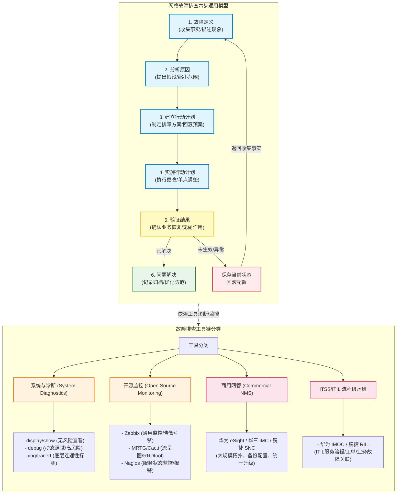

# 第八章：网络故障排查与处理

## 1. 核心考点脑图 (Mindmap)



---

## 2. 深度理论解析 (Theory & Concepts)

### 2.1 网络故障排查通用模型

网络故障排查不仅是一项技术性工作，更是一门讲究流程与逻辑的方法学。通用的六步排障模型广泛应用于软考规范和大型企业运维实践中，具体步骤及任务如下：

```
[故障定义] ➔ [分析原因] ➔ [建立行动计划] ➔ [实施行动计划] ➔ [验证结果] ➔ [问题解决]
    ▲                                                           │
    │ (若验证未生效或产生新故障，保存当前状态并彻底回滚)            ▼
    └───────────────────────────────────────────────────────────┘
```

1. **故障定义 (Define the Problem)**
   * **核心任务**：收集故障的原始现象与具体事实。
   * **具体工作**：明确受影响的用户范围、具体的业务系统、故障发生的精确时间、故障发生时的具体报错信息。排障人员需要分清用户口中的“网络慢”是 DNS 解析问题、局域网拥塞、WAN 延迟，还是应用服务器过载，避免先入为主的误判。
2. **分析原因 (Analyze Causes)**
   * **核心任务**：通过信息对比与假设推导，缩小故障范围。
   * **具体工作**：将当前异常状态的数据与网络健康时的“基线数据”进行对比，识别变动点。提出可能导致故障的 2~3 个假设，并结合排障方法论（如 OSI 分层法、分段法）逐一排除不合理的选项，锁定最可能的根源。
3. **建立行动计划 (Establish Action Plan)**
   * **核心任务**：针对最可能的成因设计针对性的变更方案与防灾预案。
   * **具体工作**：拟定具体的修复步骤与需要修改的配置。**特别强调**：行动计划中必须包含清晰的**回滚方案 (Rollback Plan)**。回滚方案是指若修改未达到预期，如何快速、无损地恢复到初始状态的预案。
4. **实施行动计划 (Implement Action Plan)**
   * **核心任务**：安全、可控地实施配置修改。
   * **具体工作**：严格按照计划步骤进行。原则上**一次只做一项配置更改**，以便准确评估每一项操作的具体效果。如需修改多台设备，应按逻辑顺序（如先接入后核心，或先主后备）单点进行。
5. **验证结果 (Verify Results)**
   * **核心任务**：确认故障是否消除，评估修改带来的副作用。
   * **具体工作**：通过应用测试、连通性探测或网管监控确认受影响的业务是否完全恢复正常。同时，密切观察整网性能（如 CPU、链路带宽、路由震荡情况），确认修改没有引入新的故障（即无副作用）。
6. **问题解决 (Problem Solved)**
   * **核心任务**：闭环归档，从应急处理转为长效防范。
   * **具体工作**：将临时配置固化并保存（`save`），更新网络拓扑与相关文档，将故障排查过程写成技术案例记录归档。对于突出的网络设计缺陷，应提出长期的架构优化建议。

> [!IMPORTANT]
> **异常回滚机制**：在“验证结果”阶段，如果发现行动计划**未生效**，或者**引发了更严重的次生故障**，排障人员应立即停止尝试性修改。必须首先**保存当前状态**（记录当前报错与配置），紧接着**执行回滚方案，将所有配置恢复至更改前的初始状态**，然后重新返回到**收集事实（故障定义）阶段**，重新评估并制定新的行动计划。严禁在生产网上进行盲目的、不回滚的连续“打补丁式”尝试。

---

### 2.2 常见排障方法论

#### 1. OSI 分层排障法
依据 OSI 七层参考模型（在网络工程中通常简化为五层），自底向上或自顶向下地进行逻辑排查：

* **物理层**：排查物理介质（网线、光纤）是否受损、光模块的光衰减（接收光功率）是否在合理阈值内、端口物理状态（Up/Down）、双工模式（Full/Half）与速率协商是否匹配。
* **数据链路层**：排查 STP/RSTP 拓扑状态（是否存在接口被异常阻塞、是否存在物理环路导致广播风暴）、VLAN 划分是否正确、主备网关的 ARP/MAC 表项是否异常，以及是否存在 MAC 地址漂移。
* **网络层**：排查接口 IP 地址与掩码、网关指向、静态路由或 OSPF/BGP 动态路由表的收敛情况、路由下一跳可达性，以及安全策略/ACL 是否意外拦截了协议流量。
* **传输层**：排查 TCP 三次握手是否成功、目的端口是否在监听（例如通过 `telnet` 或 `nmap` 探测端口）、防火墙是否拦截了特定端口的报文。
* **应用层**：排查 DNS 域名解析是否正常、业务应用服务器资源是否耗尽（如 HTTP 500/502 错误）、软件协议版本是否存在不兼容。

#### 2. 分段排障法
将端到端的复杂网络通信路径，划分为不同的物理或管理边界分段进行排查。例如，将一条分支机构到总部服务器的路径划分为：
`[分支局域网] ➔ [分支出口网关] ➔ [广域网/运营商网络] ➔ [总部防火墙] ➔ [总部核心交换机] ➔ [业务服务器]`
通过在关键分段点（如分支网关、总部出口）进行探测或抓包，利用二分查找法快速界定是局域网内部故障、运营商 WAN 抖动，还是总部数据中心的安全策略拦截，从而极大地缩减多部门协同排障的排查范围。

---

### 2.3 系统与诊断命令剖析

在设备命令行界面（CLI）中，诊断命令可以分为静态读取类、动态协议调试类与端到端探测类。

#### 1. `display / show` 命令
* **工作机制**：从控制平面的内存中读取当前的运行配置（running-config）、转发表项（ARP/Routing/MAC/ND）以及系统静态日志。
* **风险评估**：**零风险**。属于只读操作，不占用额外的业务转发带宽，不会修改系统配置，CPU 消耗极低且可控，是排障初期收集事实阶段的最核心手段。

#### 2. `debug / debugging` 命令
* **工作机制**：在控制平面中开启特定协议模块的实时动态追踪。当设备收到或产生与该模块相关的报文、状态机发生变动时，系统会实时生成调试日志并输出到终端。
* **风险评估**：**高风险**。`debug` 进程拥有极高的 CPU 优先级。在生产环境中，如果网络流量巨大、协议收敛震荡严重，开启大范围的 `debug`（例如直接开启 `debugging all` 或未加过滤条件的 `debugging ip packet`）会导致控制平面瞬间被海量调试日志淹没。CPU 占用率会直线上升至 100%，引发控制平面饥饿，导致与邻居交换机交互的 Keepalive/Hello 报文被丢弃，引起 OSPF/BGP 邻居关系中断、全网路由震荡，甚至造成交换机死机和全网业务瘫痪。
* **生产网安全使用原则**：
  1. **限制使用**：在生产网中非必要绝不开启 `debug`，尽量先通过 `display` 和日志定位。
  2. **精确过滤**：开启时必须添加严格的过滤条件，例如利用 ACL 限制特定的源/目的 IP 或是特定的接口。
  3. **避开高峰**：选择在业务低峰期（如凌晨深夜）进行调试。
  4. **立即关闭**：调试完成或观察到关键信息后，必须**立即关闭**所有调试开关。在华为设备上执行 `undo debugging all`，在思科/华三设备上执行 `no debug all`。

#### 3. `ping` 与 `tracert` 命令
* **`ping` 底层原理**：基于 **ICMP** 协议（网际控制报文协议）。源端发送 **ICMP Echo Request** (Type 8, Code 0) 报文，目的端收到后必须回应 **ICMP Echo Reply** (Type 0, Code 0)。因为 `ping` 必须有去有回，所以它验证的是**双向连通性**。如果 Ping 不通，无法简单判定是“去程路由丢失”还是“回程路由丢失”，需要结合分段排查。
* **`tracert / traceroute` 底层原理**：利用 IP 首部的 **TTL (Time to Live)** 字段与 ICMP 差错报文实现路径溯源。
  * **Windows 实现**：默认发送 **ICMP Echo Request** 报文。第一批报文的 TTL = 1，第一跳路由器收到后 TTL 减 1 变为 0，丢弃该包并向源端返回 **ICMP Time Exceeded** (Type 11, Code 0) 报文，从而获取第一跳的 IP；接着发送 TTL = 2 的报文，以此类推。当报文最终到达目的端时，目的端响应 **ICMP Echo Reply**，探测结束。
  * **Linux/网络设备实现**：默认发送 **UDP** 探测报文，其目的端口为大于 30000 的随机高端口（如 33434）。沿途路由器在 TTL 超时后同样返回 **ICMP Time Exceeded**。当报文到达目的端时，因为该高端口没有应用在监听，目的主机将返回 **ICMP Port Unreachable** (Type 3, Code 3) 报文，源端据此判断已到达终点。

---

### 2.4 网管与监控工具链

根据管理层级与运维侧重点的不同，网管工具可以划分为三个层级：

```
[ 流程级高级运维 (ITIL/ITSS) ]  <--- (告警、工单流转、业务关联)
             │
[ 网元级统一管理 (商用NMS) ]     <--- (拓扑发现、备份配置、固件升级)
             │
[ 指标与状态监控 (开源网管) ]     <--- (SNMP轮询流量、状态主动告警)
```

#### 1. 基础与开源网管（指标与状态监控）
* **Zabbix**：通用型的企业级分布式监控系统。支持 Agent 代理端和 SNMP 轮询/Trap。具有极强的**告警引擎**，可以通过自定义的触发器（Trigger）实现多级警报，并支持历史性能数据的趋势图表绘制。
* **Cacti / MRTG**：网络流量绘图的常青树。Cacti 采用 PHP 编写，核心基于 **SNMP** 协议轮询网络设备端口的计数器，并使用 **RRDtool (环形数据库)** 存储数据。它只存储固定大小的历史数据，专门用于生成直观的链路带宽利用率和端口流量图。
* **Nagios**：状态监控与报警工具。它采用主动轮询的插件机制，专注于监控主机（Up/Down）和服务（Ping、SMTP、HTTP）的**存活状态**。一旦发现状态异常，立即触发警报通知，但其本身不擅长流量图表的精细绘制。

#### 2. 商用网管（网元管理级 - EMS）
* **代表产品**：华为 **eSight**、华三 **iMC**、锐捷 **SNC**。
* **核心定位**：原厂提供的商业级网元管理系统。
* **关键功能**：在大规模园区或数据中心内，对本厂商及主流第三方设备进行**统一的拓扑发现与可视化管理**。支持设备配置的**自动批量备份**、设备系统固件的**集中升级与补丁分发**、资产漏洞防盗审计，以及细粒度的物理板卡与端口健康度监控。

#### 3. 高级运维管理（ITSS/ITIL 流程级）
* **代表产品**：华为 **IMOC**、锐捷 **RIIL**、广通、北塔等。
* **核心定位**：符合 ITIL（IT 基础架构库）或 ITSS（信息技术服务标准）规范的综合运维管理平台。
* **关键功能**：它超越了纯技术维度的监控，将**网络设备与真实的业务系统进行关联绑定**（例如：某台核心交换机下挂了财务系统，当该交换机宕机时，系统会自动评估并报警“财务业务中断”，而不是简单报“接口 Down”）。同时，它提供规范化的**故障工单流转、事件升级、变更申请审批**等 ITIL 流程化管理，实现运维的制度化与闭环管理。

### 2.5 配置备份与灾难恢复策略

配置备份是网络运维的"最后一道防线"。当设备硬件故障、人为误操作或恶意攻击导致配置丢失时，完善的配置备份策略能够在最短时间内恢复网络运行。

#### 1. 配置文件备份方式

| 备份方式 | 工作机制 | 优点 | 缺点 | 适用场景 |
| :--- | :--- | :--- | :--- | :--- |
| **TFTP (简单文件传输)** | 基于 UDP 69 端口的无连接文件传输协议，设备将 running-config 上传至 TFTP 服务器。 | 配置简单、几乎所有网络设备均支持。 | 无认证、无加密、传输不可靠（UDP），适合内网隔离环境。 | 小型内网环境下的快速备份。 |
| **FTP (文件传输协议)** | 基于 TCP 20/21 端口，支持用户名/密码认证。 | 有基本认证、传输可靠（TCP）。 | 密码和数据明文传输，存在被窃听风险。 | 需要认证的备份场景（内网）。 |
| **SFTP/SCP (安全文件传输)** | 基于 SSH 加密通道传输配置文件。 | 数据全程加密、认证安全。 | 设备需支持 SSH 服务端/客户端功能。 | **推荐方案**，尤其适用于跨安全域或等保三级及以上环境。 |
| **网管自动备份** | 商用网管（eSight/iMC）或开源工具（如 Oxidized/RANCID）定期自动采集设备配置。 | 全自动、定时执行、支持配置版本差异比对（Diff）。 | 需要部署专用服务器和软件。 | 中大型企业的标准运维方案。 |

#### 2. 配置版本管理
*   **版本命名规范**：每次配置变更前，以`设备名_变更日期_变更内容`的格式保存配置快照。例如：`Core-SW1_20260618_add_VLAN30.cfg`。
*   **变更前后对比**：在执行重大配置变更前，先备份当前 running-config。变更完成后，通过 `diff` 或网管系统的配置比对功能，确认变更内容与预期一致。
*   **定期自动备份策略**：
    *   核心层设备：**每日**自动备份。
    *   汇聚层设备：**每 2~3 日**自动备份。
    *   接入层设备：**每周**自动备份。
    *   每次重大配置变更后**立即触发**增量备份。

#### 3. 应急配置恢复流程
当设备因硬件更换、配置损坏或误操作导致配置丢失时，按以下流程进行恢复：

```
[发现配置丢失/设备更换] 
    ↓
[从备份服务器获取最近一次有效配置]
    ↓
[通过 Console/带外管理进入设备]
    ↓
[上传配置文件至设备 (TFTP/SFTP copy)]
    ↓
[校验配置完整性 (检查关键接口/VLAN/路由/ACL)]
    ↓
[保存配置 (save / write memory)]
    ↓
[验证业务恢复 (Ping/路由/应用层测试)]
```

*   **关键注意事项**：
    1.  **更换设备后**：新设备的管理 IP、设备名称和 License 可能需要手动修改后再导入备份配置，防止 IP 冲突。
    2.  **版本兼容性**：如果新设备的固件版本与备份配置时的版本不一致，部分命令可能不兼容。需先阅读版本 Release Notes，必要时手动调整配置语法。
    3.  **回滚准备**：恢复操作本身也应准备回滚方案——如果恢复后的配置导致更严重的问题，应立即回退到出厂默认配置并重新评估。

---

## 3. 核心技术对比与设计 (Technical Comparisons & Design)

### 3.1 诊断与探测命令对比

| 诊断命令 | 执行平面 (Execution Plane) | 风险等级 | 核心用途 | 生产网最佳实践 (Best Practice) |
| :--- | :--- | :--- | :--- | :--- |
| **`display / show`** | 控制平面 (Control Plane) | **极低 (零风险)** | 查看系统当前配置、接口状态、路由转发表、CPU利用率、历史日志等。 | 作为排障信息收集的首选，随时可运行。在大并发下注意避免一次性输出过长配置。 |
| **`debug / debugging`** | 控制平面 (Control Plane) | **极高** | 动态追踪协议运行状态、报文交互过程及内部状态机切换。 | **严禁全局开启**。必须绑定 ACL 限制源/目的 IP 过滤；必须在业务低峰期执行；调试完必须立即运行 `undo debugging all` 关闭。 |
| **`ping`** | 数据平面 (Data Plane) | **低** | 快速验证源与目的端之间的双向网络层连通性与往返延迟。 | 默认包大小和次数无风险。在大包压测（`ping -s` 或 `ping -g`）时需注意不要过分占用链路带宽。 |
| **`tracert / traceroute`** | 数据/控制平面 (混合) | **低** | 逐跳追踪数据包在网络中经过的路由器路径，定位丢包或路由环路位置。 | 频繁 Tracert 可能会触发沿途路由器的 ICMP 限速保护（表现为中途丢包），属正常现象。 |

---

### 3.2 网管与监控工具链对比

| 工具类别 | 核心定位 (Primary Positioning) | 实现机制 (Mechanism) | 主要优势 (Strengths) | 主要劣势 (Weaknesses) | 部署建议 (Recommendation) |
| :--- | :--- | :--- | :--- | :--- | :--- |
| **开源网管**<br>(以 Zabbix / Cacti 为代表) | 基础设备指标监控与动态趋势图表绘制。 | 基于标准的 SNMP 轮询（Poll）、SNMP Trap、Agent 代理及 ICMP 探测。 | 1. 软件开源免费，社区庞大。<br>2. 监控指标自定义极强。<br>3. 告警触发器引擎非常灵活。 | 1. 缺乏大厂商设备私有 MIB 的原生深度支持。<br>2. 自动化配置备份与固件批量升级功能较弱。 | 适用于中小型企业、互联网公司或作为商用网管的性能监控补充，监控服务器与网络设备的基本状态。 |
| **商用网管**<br>(eSight / iMC / SNC) | 大规模企业网的统一设备拓扑与网元全生命周期管理。 | SNMP、NETCONF、Syslog、Telnet/SSH 自动脚本，及厂商私有协议。 | 1. 原生完美兼容本厂设备，拓扑发现精准。<br>2. 提供**自动配置备份与固件批量升级**。<br>3. 提供板卡级的健康监控。 | 1. 商业授权费用昂贵。<br>2. 对竞争对手厂商的设备管理深度受限。 | 适用于设备量在百台以上、厂商集中的中大型企业园区、金融网或政府专网，作为核心网络管理平台。 |
| **协议分析仪**<br>(以 Wireshark 为代表) | 网络数据包底层的协议字段解析与流量微观分析。 | 结合交换机物理镜像端口（SPAN）或分路器（TAP），旁路捕获原始数据帧。 | 1. 能精确展示每一个数据包的报文头部与载荷。<br>2. 极其擅长分析复杂的应用层握手与协议故障。 | 1. 只能单点捕获，无法做到全局拓扑级监控。<br>2. 高速链路上抓包对分析仪的写入性能与存储要求极高。 | 部署于运维PC或专用抓包服务器上。不进行日常轮询监控，仅在定位疑难杂症（如间歇性丢包、协议协商失败）时启用。 |

---

## 4. 历年真题与即学即练 (Typical Exam Questions & Analysis)

### 4.1 模拟题一：OSPF 邻居震荡故障定位
**【单选题】**
某大型园区网的两台骨干交换机之间通过光纤链路连接，并配置了 OSPF 协议。在网络运行过程中，网管系统频繁上报 OSPF 邻居关系震荡（OSPF Neighbor Flapping）告警，在设备上通过命令行查看，发现邻居状态在 `ExStart`、`Exchange` 与 `Down` 之间反复切换。以下关于该故障原因的推分析中，最可能的是（ ）。

A. 两端接口的 OSPF Hello 报文发送间隔（Hello Interval）配置不一致
B. 两端接口的 MTU 配置不一致，且两端都激活了 OSPF MTU 检查功能（`mtu-enable`）
C. 物理光纤的单股（Rx/Tx）发生断裂，导致 Hello 报文出现单向不可达
D. 两端交换机配置的 OSPF 区域类型不匹配（例如一端为标准区域，另一端为 Stub 区域）

**【参考答案】** **B**

**【试题解析】**
* **A 选项错误**：OSPF 要求邻居两端的 Hello Interval 必须完全一致才能建立邻居。如果配置不一致，两端设备在接收到 Hello 报文时会由于参数不匹配直接拒绝建立邻居，邻居状态会一直卡在 `Down`，而不会上升到 `ExStart` 或 `Exchange` 状态。
* **B 选项正确**：在 OSPF 状态机中，`ExStart`（准启动状态）和 `Exchange`（交换状态）是邻居双方交互 DD（Database Description，数据库描述）报文的阶段。若在接口下配置了 `ospf mtu-enable`，OSPF 会检查接收到的 DD 报文中的 MTU 值是否大于本端接口的 MTU。如果对端发送的 DD 报文的 MTU 大于本端接口 MTU，本端会直接丢弃该报文。这导致 DD 报文重传超时，OSPF 状态机无法向 `Loading` 或 `Full` 转化，超时后邻居关系断开重连，在命令行上表现为状态在 `ExStart/Exchange` 与 `Down` 之间频繁震荡。
* **C 选项错误**：如果光纤单股断裂导致单向不可达（即 A 能收到 B 的包，但 B 收不到 A 的包），收不到 Hello 包的一端会保持在 `Down` 状态，而能收到的一端会卡在 `Init` 状态（因为收到的 Hello 包的 Neighbor 列表中没有自己的 Router ID），不会进入协商 DD 报文的 `ExStart` 阶段。
* **D 选项错误**：区域类型（如 Stub 属性）在 OSPF Hello 报文的 Options 字段中承载。如果区域类型不一致，两端在最开始的 Hello 包协商时就会失败，邻居关系卡在 `Down`。

---

### 4.2 模拟题二：多厂商混合企业园区网管选型设计
**【单选题】**
某大型企业集团计划对其新建的多厂商混合园区网络（核心层为华为设备，汇聚/接入层混用华三与锐捷设备）部署网管监控系统。设计方案中对系统功能的指标要求包括：①实现全网拓扑的自动发现与可视化；②实现全网设备配置文件的每日自动备份与系统固件的集中分发升级；③实现网络故障告警与企业 IT 服务管理（ITSM）系统的工单流程无缝对接。针对该需求，以下方案设计中最合理的是（ ）。

A. 仅部署一套开源的 Zabbix 系统，依靠其强大的自定义模板替代商用网管，实现上述所有①②③功能
B. 核心层使用华为 eSight，汇聚/接入层使用华三 iMC，分别独立管理，日常运维时通过 Wireshark 抓包实现两套网管数据的对齐
C. 采用华为 eSight 或华三 iMC 商业网管作为底层网元管理系统（EMS），实现拓扑发现与配置备份（①和②），并通过北向接口（API/SNMP/REST）将告警数据推送到上层的符合 ITIL 规范的高级运维平台（如 RIIL 或 IMOC）以实现工单闭环（③）
D. 部署开源的 Cacti 并结合 RRDtool 数据库，利用其自带的配置审计插件替代原厂商业网管，以实现全网的固件升级与工单流转

**【参考答案】** **C**

**【试题解析】**
* **A 选项不合理**：Zabbix 是一款极其优秀的开源性能与告警监控系统（擅长指标采集与告警），但它原生并不具备对大规模异构网络设备进行可靠的配置自动备份、固件升级及固件防盗审计功能。要实现这些功能需要开发大量复杂的自定义脚本，且安全风险高，不符合企业级稳健运维的要求。
* **B 选项不合理**：同时部署两套商业网管会增加投资成本，且割裂了整网的拓扑视图。Wireshark 是一款单点协议分析仪（抓包工具），根本无法用于两套网管平台的数据对齐与同步。
* **C 选项正确**：在大规模多厂商网络中，通常采用**分层管理架构**。底层部署主流厂商的商用网元管理级网管（如 eSight 或 iMC，它们通过标准的 MIB 和原厂私有协议能非常完美地实现拓扑呈现、异构设备的基本配置备份和固件集中升级，解决需求①和②）；再通过商用网管的北向接口（Northbound Interface，如 REST API 或 SNMP Trap），将网络告警上报给企业统一的 ITSS/ITIL 流程级运维平台（如 RIIL、IMOC，解决需求③的业务关联与工单流程流转），这是大型企业网络规划的最佳实践。
* **D 选项不合理**：Cacti/RRDtool 核心定位是“端口流量图表绘制”，完全没有企业级的固件集中升级和 ITSM 工单流程管理功能。

---

## 5. 备考与实践建议 (Exam Tips & Practical Advice)

### 5.1 案例分析题避坑：生产网 Debug 的金科律玉
在下午的案例分析中，经常会要求考生指出“在运行中的生产网交换机上为了排查 OSPF 故障，使用 `debug ospf packet` 命令时需要注意哪些安全规范”。考生必须条理清晰地回答出以下四大得分点：
1. **范围限制**：绝对不能直接执行宽泛的调试。必须先配置 ACL 过滤规则（如只匹配特定源 IP 或特定直连接口），在命令后携带 `acl` 参数进行限速与过滤。
2. **时段选择**：操作必须申请变更窗口，在**业务低峰期**进行，避免对高峰期生产业务造成冲击。
3. **监控资源**：开启调试期间，必须开辟另一个 SSH/Telnet 窗口实时监控设备的 CPU 占用率（使用 `display cpu-usage`）。一旦 CPU 占用率异常飙升（如超过 70%），必须立即终止调试。
4. **即用即关**：观察并记录到所需的协议报文后，必须立即执行 `undo debugging all`，确保所有调试进程彻底关闭。

### 5.2 案例分析题重点：Ping 与 Tracert 的报文差异与故障研判
* **命令细节考点**：
  * Tracert 过程中，若中间某些跳显示为 `* * *`，代表该路由器**关闭了 ICMP 差错报文的发送功能**或**防火墙过滤了 TTL 超时的 ICMP 报文**，并非代表网络在此处中断。只要最后一跳能正常返回结果，说明端到端依然是通的。
  * 若 Tracert 停在某一跳后，后续全部为 `* * *` 且无法到达终点，说明故障点就在**该跳的下一跳设备**上，或者下一跳设备丢失了返回源端的路由。
* **双向可达性概念**：
  * 网络层通信是双向的。Ping 不通时，切记在下午题中分析“去程路由正常，但回程路由在某处缺失（例如防火墙未放行回程 ICMP 响应，或中间路由器没有源IP网段的路由）”的可能性。

### 5.3 论文与案例术语规范：ITIL/ITSS 运维词汇区分
在论文写作与下午大题中，切忌混淆“事件”与“问题”的概念。阅卷老师会严格根据 ITIL/ITSS 标准术语进行扣分或给分：

| 运维概念 | 定义与核心目标 | 下午题与论文标准场景示例 |
| :--- | :--- | :--- |
| **事件管理 (Incident Management)** | 核心目标是**尽快恢复受影响的业务**，降低对业务运行的负面影响。允许使用临时规避手段（Workaround）。 | 网络中断后，运维人员通过**切换至备份链路**、**重启交换机**或**临时旁路防火墙**来让业务先跑起来。此时无需彻底查明故障根源。 |
| **问题管理 (Problem Management)** | 核心目标是**找出导致事件的根本原因 (Root Cause)**，并制定永久性的解决方案，防止同类事件再次发生。 | 业务恢复后，运维团队收集设备崩溃日志，联系厂商分析发现是固件版本存在内存泄漏 Bug，于是**安排业务低峰期统一升级固件**以彻底消除隐患。 |
