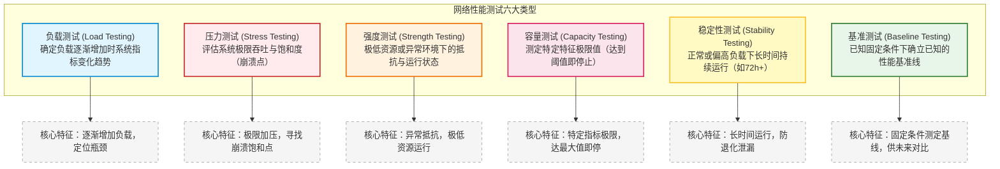

# 第九章：网络性能管理

> [!NOTE] 💡 软考论文写作素材 (客观工程版)
> 
> **1. 网络性能验证与基线确立**
> *   **【展开版】** 在新建大型数据中心网络割接上线前，我们制定并执行了严谨的性能验证与基准测定规范。在网络部署初期且处于完全空载状态下，引入RFC 2544标准测试流量集，精确测定全网骨干链路的吞吐量、单向排队时延及丢包率，以此生成系统初始性能基线报告。随后开展梯次递增的负载测试，通过软件探针与硬件打流仪模拟渐进叠加的业务并发访问压力，监测核心网关在不同流量梯队下的转发性能与资源占用曲线。该阶段有效识别了网络架构中的早期转发瓶颈，为后续的带宽扩展和QoS策略调优提供了量化依据。
> *   **【浓缩版】** 网络上线前在空载状态下执行RFC 2544基准测试以确立初始性能标尺。结合平滑递增的负载测试模拟业务并发，精确绘制设备资源消耗与时延演变曲线，有效定位网络潜在瓶颈，为QoS优化提供量化参考。
> 
> **2. 极限性能评估与容量规划**
> *   **【展开版】** 为应对未来业务突发性激增及海量终端接入场景，我们对核心网元实施了高强度的容量验证与压力测试。在容量测试环节，针对IPsec VPN网关与核心防火墙的并发会话建立数进行单维度极限逼近，直至指标达到设计上限且拒绝新连接，从而精确圈定设备并发容量边界。在压力测试环节，我们施加远超设备标称转发上限的小包流量予以持续轰击，旨在探明数据平面极限饱和情况下的系统崩溃点及流量洪峰卸载后的协议自愈能力。此举为骨干网的长期冗余设计与防范大规模突发流量提供了硬核数据支持。
> *   **【浓缩版】** 针对核心网关执行单一维度的容量测试以确定最大并发会话等关键指标的边界。结合超越标称值的极限压力测试，探明高压负载下的设备崩溃点与卸载自愈能力，从而为整网冗余设计与扩容提供核心数据支撑。
> 
> **3. 长期运行稳定性与鲁棒性验证**
> *   **【展开版】** 鉴于业务专网对连续性的极高要求，在网络投入正式运行前，我们引入了长周期稳定性测试与极端环境强度测试。通过向主干网络注入恒定偏高吞吐流量，并保持72小时以上的不间断运行，密切监控系统内存池余量与设备底噪变动，成功规避了由内存泄漏或硬件热衰减导致的隐蔽缺陷。此外，在强度测试中人为构造设备内存极低、路由大面积震荡等极端恶劣工况，重点核查协议的重收敛速率及系统的优雅降级能力，最大程度保障了网络在资源匮乏状态下的韧性。
> *   **【浓缩版】** 在网络上线前施加恒定偏高负载进行72小时以上的稳定性拷机测试，排查内存泄漏与硬件热衰退隐患。配合人为限制资源的强度测试验证协议重收敛与优雅降级能力，全面保障核心网络在长期运行及恶劣工况下的韧性。

## 1. 核心考点脑图 (Mindmap)

---

## 2. 深度理论解析 (Theory & Concepts)

### 2.1 网络性能管理的基本内涵

在国际标准化组织（ISO）定义的网络管理功能域（**FCAPS**）中，**性能管理 (Performance Management)** 占有极其重要的地位。它与故障管理、配置管理、计费管理和安全管理并列，专注于**监测、分析和控制网络资源的运行效率**，确保网络服务质量（QoS）满足业务需求。

*   **核心目标**：评估全网及单个网元的转发效率与资源健康度，发现潜在瓶颈，为网络扩容、配置优化以及服务等级协议（SLA）保障提供量化依据。
*   **核心监控指标**：
    1.  **链路利用率 (Link Utilization)**：评估主干与接入链路的带宽消耗情况，预防由于拥塞引起的排队时延。
    2.  **丢包率 (Packet Loss Rate)**：反映网络拥塞、硬件故障或传输干扰程度，对 TCP 吞吐量及实时业务（语音、视频）影响极大。
    3.  **时延 (Latency / RTT)**：数据包从源端发送到目的端接收所需的往返时间，包含传播时延、发送时延、排队时延与处理时延。
    4.  **时延抖动 (Jitter)**：时延的变化量，反映网络队列调度的稳定性，高抖动会导致实时多媒体业务卡顿。
    5.  **吞吐量与转发率 (Throughput & Forwarding Rate)**：网络设备或链路在单位时间内实际转发的数据量（常以 bps 或 pps 衡量）。
    6.  **系统资源占用率**：交换机/路由器控制平面与数据平面的 CPU 占用率、内存使用率、缓冲区（Buffer）占用率等。

---

### 2.2 六大性能测试类型深度剖析（核心考点）

根据测试目的、负载施加方式以及终止标准的不同，网络性能测试主要分为以下六种类型：

#### 1. 负载测试 (Load Testing)
*   **定义**：在各种不同的工作负载下测试软件/网络的性能，确定负载逐渐增加时系统各项指标的变化趋势。
*   **测试方法**：从低负载开始，**逐渐、平滑地增加工作负载**，同时严密监测系统资源利用率（CPU、内存、缓冲区）以及网络转发性能指标（丢包、延迟、吞吐量）。
*   **核心目的**：为了**发现系统性能瓶颈或过度消耗点**。通过分析性能随负载变化的曲线，判断系统在何时会出现转发效率拐点，提前进行资源优化或扩容规划。

#### 2. 压力测试 (Stress Testing)
*   **定义**：测试系统的极限性能和饱和度（如最大吞吐量、最大转发率、最大路由表项支持等）。
*   **测试方法**：可以看作是特殊的负载测试。通过对系统施加**超出常规或接近极限的安全工作负载（高压）**，持续轰击系统，直至系统资源饱和或发生丢包、服务异常。
*   **核心目的**：用以**确定系统在何时会“崩溃” (Breaking Point)**，验证系统在极端过载情况下的转发上限，以及系统在卸载超额压力后的自愈与恢复能力。

#### 3. 强度测试 (Strength Testing)
*   **定义**：**强调在系统资源特别低（如低内存、低 CPU 空间、磁盘空间极其紧张，或异常高温物理环境等）的极端/恶劣状况下**，软件系统或网络设备的运行状态与业务维持能力。
*   **测试方法**：人为**剥夺或限制系统可用资源**，或在存在配置错误、协议震荡等异常软件环境下，再向系统输入正常或略低的业务流量，观察系统是否能够维持基本运转、会否发生数据损坏或直接崩溃。
*   **核心目的**：用于**检查系统对异常情况和恶劣环境的抵抗能力（健壮性与鲁棒性）**，评估系统在资源极其匮乏时的优雅降级能力。

#### 4. 容量测试 (Capacity Testing)
*   **定义**：在系统主要功能正常运行的前提下，测试反应软件/网络系统应用特征的**某项特定指标的极限值**。
*   **测试方法**：针对网络设计中某项核心容量指标（例如系统可处理的同时在线最大并发用户数、NAT最大会话数、最大VPN隧道数、单机最大 MAC 地址学习量等）进行**单一维度的递增测试**。
*   **终止条件**：**当达到最大可接受阈值（即该指标达到上限，导致无法建立新会话或 QoS 性能劣化到不可容忍界限）时，立即停止测试**。
*   **核心目的**：测定并记录该特定设计指标的物理或逻辑边界值，为业务容量规划和策略部署提供硬性指标参考。

#### 5. 稳定性测试 (Stability Testing / Reliability Testing)
*   **定义**：测试系统在正常或偏高负载下，**长时间（如 72 小时、7天甚至更久）持续运行**时的转发状态和系统资源变化。
*   **测试方法**：向系统输入恒定且偏高（如设计吞吐量的 70%~80%）的流量负载，使其不间断地长时间运转，在此期间持续监测设备状态。
*   **核心目的**：观察系统的出错概率、**内存泄露 (Memory Leak)**，软件缓冲区溢出以及硬件温升引发的性能退化趋势，从而在系统上线生产前尽可能暴露出隐蔽的长周期运行缺陷。

#### 6. 基准测试 (Baseline Testing)
*   **定义**：通过在已知且固定的软硬件配置、数据规模、测试拓扑和加密策略下进行测试，确立一个**已知的性能基准线 (Baseline)**。
*   **测试方法**：在空载或已知正常状态下，运行标准化的测试脚本或流量套件，记录网络在理想环境下的丢包、时延、吞吐量等初始性能数据。
*   **核心目的**：建立性能的“健康度标尺”，将其作为后续网络扩容、软硬件版本升级、配置策略优化或排查突发性能故障时的**对比基线**。

---

### 2.3 网络性能管理与测试工具

在实际网络工程和软考案例中，网络性能测试分为硬件级与软件级两种层面的工具链：

#### 1. 硬件级流量生成与分析仪
*   **代表工具**：SmartBits（思博伦早代产品）、Spirent TestCenter（思博伦测试中心）、IXIA（艾科夏）。
*   **工作机制**：通过专用的测试卡和高精度硬件级 FPGA 芯片，在物理端口上以**线速（Line Rate）**生成、捕获并分析原始数据包。
*   **核心应用**：
    *   测试网络设备（如核心交换机、高性能防火墙）的芯片转发吞吐量、线速小包（如 64 字节包）转发率。
    *   执行 **RFC 2544 标准测试**。RFC 2544 是网络设备评测的国际标准，定义了四个核心测试项目：**吞吐量 (Throughput)**、**时延 (Latency)**、**丢包率 (Frame Loss Rate)** 和 **背靠背 (Back-to-Back)** 突发缓冲能力。
    *   模拟高并发的物理链路噪声、电磁干扰和各种帧差错，验证设备在异常物理媒介下的纠错与自适应能力。

#### 2. 软件级流量测试与性能监测工具
*   **Iperf3 / Netperf**：
    *   **工作机制**：基于主机（Server/Client 架构）生成 TCP、UDP 或 SCTP 数据流。
    *   **核心功能**：测试端到端应用层的实际最大带宽吞吐量、丢包率与时延抖动。在 UDP 模式下，可以指定带宽发包以评估网络传输通道的承载能力。
*   **Apache JMeter / Webbench**：
    *   **工作机制**：基于应用层模拟多线程并发。
    *   **核心功能**：主要用于测试 HTTP/HTTPS、DNS、FTP 等应用协议的并发连接容量，模拟海量虚拟用户（Virtual Users）同时发起业务请求，评估应用层网关和负载均衡器的应用层容量边界。

---

## 3. 核心技术对比与设计 (Technical Comparisons & Design)

以下是六大性能测试类型的多维度对比，用于帮助在规划设计与试题解析中快速甄别：

| 测试类型 | 测试主要目标 (Goal) | 负载施加与调整方式 (Workload) | 系统内部资源状态 (Resource) | 测试停止/结束标准 (Termination) | 典型网络规划与设计应用场景 (Real-world Scenario) |
| :--- | :--- | :--- | :--- | :--- | :--- |
| **负载测试** (Load) | 发现系统转发或计算性能瓶颈，观察指标变化趋势。 | **逐渐、平滑地增加**业务流量或连接请求数。 | 正常运行至偏高状态，资源随负载呈线性/非线性上升。 | 达到预设的规划负载上限，或资源指标到达瓶颈值。 | 逐步增加模拟办公终端的并发数量，测试核心交换机在并发数从 100 增至 5000 时的 CPU 与时延走势。 |
| **压力测试** (Stress) | 测试系统极限吞吐，寻找系统在过载下的崩溃点。 | 直接加压到系统设计的上限甚至**超出上限，持续高压**。 | **饱和或超负荷**状态（如核心 CPU/内存占用接近 100%）。 | 设备**彻底崩溃（死机/服务中断/丢包率100%）**。 | 使用 IXIA 流量仪对防火墙施加超越其标称值的 64 字节小包线速流量，测试其最大包转发极限及死机临界点。 |
| **强度测试** (Strength) | 评估系统在**极端资源受限**或恶劣环境下的自愈健壮性。 | 人为**剥夺/限制系统可用资源**或构造严重的软件错误。 | **极低或匮乏**（如可用内存极少，硬件环境异常）。 | 运行完指定的异常测试周期，或记录下系统故障表现。 | 在防火墙控制面 CPU 占用率已达 95%（人为占用）的情况下，输入业务流量，测试其是否能稳定维护 OSPF 邻居状态。 |
| **容量测试** (Capacity) | 测定系统特定关键指标的**最大业务量极限值**。 | 针对**特定指标**（如隧道数、会话数）进行递增输入。 | 正常至极限状态，随着特定指标饱和，内存/表项耗尽。 | **达到该指标的最大可接受阈值（如新连接无法建立）时即停止**。 | 测试 IPsec VPN 网关能同时建立并维持的并发 VPN 隧道数量，当第 2001 条隧道无法建立或出现高延迟时停止。 |
| **稳定性测试** (Stability) | 发现长时间运行下可能暴露的内存泄露或性能衰退。 | 维持**恒定且偏高**的正常业务负载（如 70% 吞吐）。 | 稳定且偏高，在此状态下持续监测。 | 达到**预设的长时间跨度（如连续运行 72 小时以上）**。 | 对新建核心骨干链路持续灌入 7Gbps 模拟流量，连续跑 72 小时，验证光纤和光模块是否存在间歇性误码或发热宕机。 |
| **基准测试** (Baseline) | 确立**标准性能基准线**，为后续升级与排障提供对比参考。 | 在**已知且固定**的配置和拓扑下，运行标准测试套。 | 受控、已知且通常处于空载或标准的轻载状态。 | 运行完标准的基线测量套件并输出基线报告。 | 新建网络链路刚布放完成时，空载状态下运行 RFC 2544 测试，记录下每条链路的时延和吞吐，归档为初始性能基线。 |

---

## 4. 历年真题与即学即练 (Typical Exam Questions & Analysis)

### 4.1 历年真题：软件性能测试类型选择（2019年11月上午真题）
**【单选题】**
软件性能测试有多种不同类型测试方法，其中，**（1）**用于测试在系统资源特别少的情况下考查软件系统运行情况；**（2）**用于测试系统可处理的同时在线的最大用户数量。

(1) A. 强度测试 &nbsp;&nbsp;&nbsp;&nbsp; B. 负载测试 &nbsp;&nbsp;&nbsp;&nbsp; C. 压力测试 &nbsp;&nbsp;&nbsp;&nbsp; D. 容量测试
(2) A. 强度测试 &nbsp;&nbsp;&nbsp;&nbsp; B. 负载测试 &nbsp;&nbsp;&nbsp;&nbsp; C. 压力测试 &nbsp;&nbsp;&nbsp;&nbsp; D. 容量测试

**【参考答案】** **(1) A &nbsp;&nbsp;&nbsp;&nbsp; (2) D**

**【详细解析】**
*   **第一空解析**：
    *   题干指出“在系统资源特别少的情况下考查软件系统运行情况”。
    *   **强度测试 (Strength Testing)** 关注系统在硬件资源受限（如内存极小、CPU 可用率极低等）或异常软件/环境状态下，软件或网络设备是否仍能运行以及如何响应。这完全符合强度测试的定义，故选 **A**。
    *   相比之下，**压力测试**侧重于在“常规资源”下不断加码工作负载直至系统崩溃，而非限制资源；**负载测试**侧重于在各种不同负载下监测性能趋势；**容量测试**侧重于测量特定指标的上限。
*   **第二空解析**：
    *   题干指出“用于测试系统可处理的同时在线的最大用户数量”。
    *   “最大用户数量”、“最大并发 VPN 隧道数”、“最大在线 TCP 连接数”等均属于反应网络/系统应用特征的**某项特定容量指标的极限值**。
    *   根据定义，测试此类特定指标极限值且达到阈值即停止的测试方法属于 **容量测试 (Capacity Testing)**，故选 **D**。

---

### 4.2 模拟预测题：数据中心网络割接前性能测试设计
**【单选题】**
在对某大型企业新建核心网络割接上线前进行性能验证时，网络设计师设计了以下三项测试活动：
① 在全网设备空载、配置固定的情况下，使用 Spirent 流量仪向骨干链路发送标准测试流，测试并记录各段光纤的单向时延、抖动及包转发率，生成基线文档归档。
② 模拟早高峰时段，以每 5 分钟增加 1000 个模拟用户登录并发的速率持续施加流量，监测核心层交换机的 CPU 占用率与内存消耗曲线，直至找到转发时延陡增的性能临界点。
③ 保持核心链路满负载流量的 75%，不间断地持续发送数据包跑满 7 天，在此期间使用网管系统监测设备是否出现丢包率异常增加、内存余量缓慢减少或路由收敛延迟增加等现象。
上述三项测试活动分别属于（ ）性能测试类型。

A. 基准测试、压力测试、强度测试
B. 容量测试、负载测试、强度测试
C. 基准测试、负载测试、稳定性测试
D. 负载测试、压力测试、稳定性测试

**【参考答案】** **C**

**【详细解析】**
*   **活动 ① 分析**：此测试是在设备空载、配置固定且已知的健康状态下进行性能数据的测量与记录，其目的显而易见是作为后续扩容或优化的对比标尺，即建立性能基准线，属于**基准测试 (Baseline Testing)**。
*   **活动 ② 分析**：测试中采用的是“逐渐增加模拟用户并发速率”的方式，且目的是监测系统性能和资源随负载增加的变化曲线，找出性能转折临界点（瓶颈），这完全契合**负载测试 (Load Testing)** 的特征（注意：没有直接加到极限让其崩溃，而是寻找性能临界点变化趋势）。
*   **活动 ③ 分析**：该项测试的关键字是“持续发送数据包跑满 7 天”，其特征为偏高负载（75%）下的**长时间持续运行**，监控的目标是内存缓慢减少（检查内存泄漏）和丢包异常变化（检查系统性能退化），属于典型的**稳定性测试 (Stability Testing / Reliability Testing)**。
综上所述，三项测试分别对应：基准测试、负载测试、稳定性测试，故正确选项为 **C**。

---

## 5. 备考与实践建议 (Exam Tips & Practical Advice)

### 5.1 下午案例与论文核心考向：新建网络割接前的性能验证方案设计

在软考高级网络规划设计师的**下午案例分析**或**论文写作**中，常常会涉及到“新建网络上线前性能验证”或“老旧网络升级割接”的过渡方案设计。若考题要求设计或选择合适的性能测试类型，考生应结合实际工程步骤进行结构化阐述：

> [!TIP]
> **割接前网络性能测试方案的标准五步法阐述模板**：
> 
> 1.  **第一步：确立性能基准（基准测试）**
>     *   **实践表述**：在新建网络设备物理布放完毕、逻辑拓扑（如 OSPF/BGP、VLAN/STP）调测完毕，且无任何生产流量注入的**空载状态下**，使用 RFC 2544 标准测试套件对主干与骨干光链路进行网络吞吐量、单向时延和丢包率的基准测定，确立**初始性能基线**，并归档入网健康报告。
> 2.  **第二步：预测业务瓶颈（负载测试）**
>     *   **实践表述**：利用软件测试工具（如 Iperf3 / JMeter） or 硬件流量分析仪，模拟生产网运行环境，**以平滑递增的负载输入方式**模拟大量员工或业务并发访问网络，监测核心网关 CPU、内存消耗以及丢包率的上升趋势，定位网络转发中的性能瓶颈（如小包转发率上限、安全策略处理瓶颈）。
> 3.  **第三步：核验规划边界（容量测试）**
>     *   **实践表述**：重点核验网络设计方案中的核心技术容量硬指标。通过向防火墙/网关设备模拟建立大量的并发会话或 VPN 隧道，在**达到网络设计规划容量上限阈值（如 5000 条 VPN 隧道）时停止测试**，验证设备在满容量配置下是否能保持主要功能正常运行，确保设备选型能支撑未来 3~5 年的业务扩张。
> 4.  **第四步：验证系统可靠（稳定性测试）**
>     *   **实践表述**：为保证新系统上线后不会因隐蔽缺陷（如内存泄漏、缓冲区溢出）引发灾难性宕机，对新网络施加 **70% 的持续业务负载流量，进行 72 小时以上的不间断稳定性“拷机”测试**，验证系统在长时间高负荷运转下的健壮性。
> 5.  **第五步：防范极端异常（强度测试）**
>     *   **实践表述**：通过模拟物理链路故障、单板硬件损毁、控制面 CPU 占用过载（如动态路由表高频震荡）等**资源极度受限或存在异常的极端环境**，验证动态协议的重新收敛时间（如 OSPF 收敛时间在 2s 以内）与系统的自愈防暴打击能力，以保证最基本的管理面和核心业务面不发生瘫痪。
