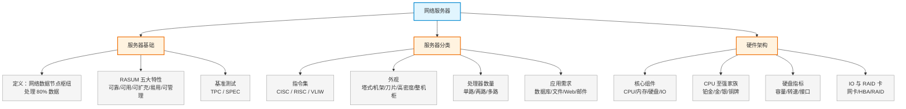

# 第十章：网络服务器

> 对应课件：`10-1 网络服务器.pdf`（共 34 页）
> 本章聚焦数据中心服务器硬件架构与选型，是云数据中心基础设施的入口章节。

## 1. 核心考点脑图 (Mindmap)

---

## 2. 深度理论解析 (Theory & Concepts)

### 2.1 什么是服务器

**服务器**是网络数据的节点和枢纽，是一种高性能计算机，存储、处理网络上 **80%** 的数据和信息，负责为网络中的多个客户端/用户同时提供信息服务，因此也被称为**网络的灵魂**。

*   形象比喻：服务器类似**公交车**（承载大家的业务），PC 类似**小汽车**（承载个人业务）。
*   工作模型：客户机发起文件请求 → 服务器查询数据库/文档 → 返回应答。

### 2.2 服务器 RASUM 五大特性 ⭐ 高频考点

服务器区别于 PC 的核心特征，记忆口诀 **RASUM**（可靠、可用、可扩充、易用、可管理）：

| 特性 | 英文 | 含义 |
| :--- | :--- | :--- |
| **可靠性** (Reliability) | Reliability | 保持可靠而一致的特性。数据完整性 + 故障前预警两方面，如硬件冗余、预警、RAID 技术 |
| **高可用性** (Availability) | Availability | 随时存在且可立即使用；从故障中迅速恢复、支持关键组件**热插拔**、新组件替换故障组件 |
| **可扩充性** (Scalability) | Scalability | 具备扩展空间和冗余件（磁盘架位、PCI/内存插槽）；可增加内存/处理器/磁盘容量 |
| **易用性** (Usability) | Usability | 是否容易操作——用户导航、机箱人性化设计、关键恢复功能、系统备份、培训支持 |
| **可管理性** (Manageability) | Manageability | 更高效管理、更少人力物力；提供简单基础架构，从最基础层面简化管理 |

> **易错点**：RASUM 中 **S 是 Scalability（可扩充/可扩展）**，不是 Storage（存储）。可靠性靠**冗余+RAID**，高可用性靠**热插拔+快速恢复**——两者常被混淆。

### 2.3 服务器基准测试体系（TPC / SPEC）

#### 两大基准体系

| 体系 | 全称 | 定位 |
| :--- | :--- | :--- |
| **TPC** | Transaction Processing Performance Council（事务处理性能委员会） | 在线事务处理能力 |
| **SPEC** | 标准性能评估机构 | 全球性第三方应用性能测试，CPU/Web/HPC/Java 等综合 |

#### 四大应用领域基准测试

| 应用领域 | 基准测试 |
| :--- | :--- |
| 高性能计算（HPC） | Linpack |
| 在线事务处理（OLTP） | **TPC-C** |
| Web 服务 | SPECWeb2005、TPC-W |
| Java 应用服务器 | SPECjbb2005 |

另有专用基准测试：Oracle 基准、SAP 基准等。

#### TPC-C（关键服务器基准）⭐

*   单位 **tpmC**：每分钟内系统处理**新订单**的个数。
*   主要模拟企业 **MIS、ERP** 等系统，考验服务器联机业务处理能力。
*   tpmC 越大性能越强；TPC 官网（tpc.org）可查询各厂商实测值。

#### TPC-C 选型估算公式 ⭐ 高频考点

$$TPC = \frac{TASK \times S \times F}{T \times C}$$

| 参数 | 含义 |
| :--- | :--- |
| **TASK** | 每分钟业务交易量 |
| **S** | 复杂程度比例 |
| **F** | 业务发展冗余 |
| **T** | 峰值交易时间 |
| **C** | CPU 处理余量 |

**例题**：某业务每秒 2000 次访问量（每分钟 120000 次），峰值交易时间 1 分钟，检索查询经验系数取 7.5，则估算 TPC-C ≈ **1670818**，即需要一台 TPC 值不小于该数的服务器。

#### SPEC（CPU 性能基线）

衡量 CPU 性能指标的参数，主要子项：

*   **SPEC CPU2000 / CPU2006**：针对 CPU 性能
*   **SPECWeb2005**：针对 Web 服务器
*   **SPECHPC2002 / SPECMPI2006**：针对高性能计算
*   **SPECjAppServer2004 / SPECjbb2005**：针对 Java 应用
*   关键指标：`SPECint_rate2006`（整型）、`SPECfp_rate2006`（浮点），按**每逻辑核**计量

| 物理 CPU 型号 | 逻辑核数量 | SPECint_rate2006 | SPECfp_rate2006 |
| :--- | :--- | :--- | :--- |
| E5620*2 | 16 | 13.75 | 10.5 |
| E5645*2 | 24 | 19.25 | 14.63 |

---

### 2.4 服务器分类

#### 2.4.1 按芯片架构（指令集）划分 ⭐

| 架构 | 全称 | 特点 | 典型 |
| :--- | :--- | :--- | :--- |
| **RISC** | Reduced Instruction Set Computing（精简指令集） | 封闭、UNIX 系，安全可靠、高速运算 | SPARC（Fujitsu/Sun）、Power（IBM）、PA-RISC/Alpha（HP）、MIPS、ARM |
| **CISC** | Complex Instruction Set Computing（复杂指令集） | 顺序执行、控制简单但利用率不高、速度慢 | Intel/AMD x86，Wintel 体系，Windows 居多 |
| **VLIW** | Very Long Instruction Word（超长指令集） | — | Intel 安腾处理器（已停产） |

> **易错点**：IA 架构服务器包含 **CISC 和 VLIW** 两种，不是只有 CISC。RISC 服务器用户一般看中 **UNIX 操作系统**的安全性、可靠性和专用高速运算能力。

#### CISC vs RISC 详细对比（高频考点）

| 对比项 | CISC（复杂指令集） | RISC（精简指令集） |
| :--- | :--- | :--- |
| 指令系统 | 复杂、庞大 | 简单、精简 |
| 指令数目 | 一般 > 200 条 | 一般 < 100 条 |
| 指令字长 | 不固定 | **定长（适合流水线）** |
| 寻址方式 | 支持多种 | 支持方式少 |
| 指令执行时间 | 相差较大 | **绝大多数一个周期内完成** |
| 指令使用频率 | 相差很大 | 都比较常用 |
| 通用寄存器数量 | 较少 | 多 |
| 目标代码 | 难用优化编译生成高效代码 | 优化编译，代码较高效 |
| 控制方式 | 绝大多数为**微程序控制** | 绝大多数为**组合逻辑控制**（硬布线+微程序） |
| 指令流水线 | 可以通过一定方式实现 | **必须实现** |

#### 2.4.2 按应用需求划分（硬件优先级）⭐ 高频考点

不同应用服务器对各硬件的需求优先级不同：

| 服务器类型 | 硬件需求优先级（从高到低） |
| :--- | :--- |
| **数据库服务器** | 内存 → 磁盘 → 处理器 |
| **文件服务器** | 网络系统 → 磁盘系统 → 内存 |
| **Web 服务器（静态）** | 网络系统 → 内存 → 磁盘系统 → CPU |
| **Web 服务器（密集计算/动态）** | 内存 → CPU → 磁盘子系统 → 网络系统 |
| **邮件服务器** | 内存 → 磁盘 → 网络系统 → 处理器 |

> **易错点**：数据库服务器对**内存**要求最高（不是 CPU）；静态 Web 服务器对**网络**要求最高，动态 Web 服务器对**内存**要求最高——动态/静态 Web 的优先级顺序是常考陷阱。

#### 2.4.3 按外观（形态）划分 ⭐ 高频考点

| 形态 | 状态 | 特点 |
| :--- | :--- | :--- |
| **塔式** (Tower) | 淘汰 | 立式/卧式，可放办公环境，机箱大（类似台式机）；密度低，多为单处理器（少部分双处理器）；噪音大 |
| **机架式** (RACK) | 主流 | 标准电信机房设备，宽 **19 英寸**，高度以 **U** 计量，每 U = **1.75 英寸 = 4.445cm**；常见 1U/2U/4U/8U，以 **2U 和 1U** 发货为主 |
| **刀片** (Blade) | 主流 | 更高密度平台，可插计算/存储/网络刀片；一个机箱可插 **8~20 块刀片**，每块即一块系统主板；类似高端交换机 |
| **高密度** | 主流 | 2U4 节点等紧凑形态 |
| **整机柜** | 主流 | 整机柜交付 |

> **易错点**：**1U = 4.445cm**（1.75 英寸）是常考数值。机架式服务器宽度 **19 英寸**。刀片服务器单机箱可插 8~20 块刀片。

#### 2.4.4 按处理器数量与应用场景划分

**核心概念辨析**（高频考点）：

| 术语 | 含义 |
| :--- | :--- |
| **路** | 一台服务器内部支持的 CPU 个数（单路/两路/多路） |
| **核** | 多个芯片集成在一个封装内 |
| **线程** | 线程越多性能越强 |
| **节点** | 2U4 节点 = 2U 空间放 4 台服务器 |
| **胖节点** | 大于两路的服务器 |

> **易错点**：**2U 四路服务器 ≠ 2U 四节点服务器**！
> *   2U 四路 = 1 台服务器装 4 颗 CPU（"1 个姚明"）
> *   2U 四节点 = 4 台独立服务器挤在 2U 空间（"4 个潘长江"）

按应用场景：文件、ERP、WEB、FTP、数据库、邮件、视频监控、流媒体、游戏服务器等。

#### 2.4.5 按使用群体划分

| 层级 | 典型应用 |
| :--- | :--- |
| 工作组服务器（入门级） | 文件服务器、打印服务器 |
| 部门级服务器 | WEB 服务器、ERP 服务器 |
| 企业级服务器 | 数据库服务器、虚拟化服务器 |

#### 2.4.6 超融合服务器

*   **刀片服务器**已集成交换机和存储设备（插卡）共享背板；但受冷却和紧凑机箱限制，CPU 性能较低，内存/硬盘扩展受限。
*   **超融合服务器**：高效利用空间（2U4 节点），网络一般仍用独立交换机，自带服务器虚拟化/存储虚拟化/云操作系统等软件。
*   **超融合云一体机** = 硬件融合 + 软件融合 + 软硬融合：计算、存储、网络融合，控制和管理融合，**一箱即云**，内置云管理平台，软硬件一体化交付。
*   架构演进：第一代（计算与存储分离）→ 第二代（计算存储分离+软件定义）→ 超融合（计算、存储与网络集成）。

---

### 2.5 服务器组成与硬件架构

#### 2.5.1 硬件组成

服务器核心硬件组件：

| 组件 | 决定指标 |
| :--- | :--- |
| **CPU** | 计算能力指标 |
| **内存** | 处理效率指标 |
| **硬盘** | 本地数据存储指标 |
| **I/O** | 数据吞吐指标 |

完整硬件：处理器、内存、芯片组、I/O（RAID 卡、网卡、HBA 卡）、硬盘、机箱（电源、风扇）。管理组件：iLO / BMC（支持 IPMI 2.0，提供远程 KVM、Virtual Media）。

#### 2.5.2 CPU 与内存

*   **酷睿系列**用于 PC；**至强系列**用于服务器。
*   内存分 **DDR4 / DDR5** 两种规格（16G/32G/48G/96G/128G/256G）。

**英特尔至强处理器家族**（按型号首位数字区分档次）：

| 档次 | 型号首位 | 定位 |
| :--- | :--- | :--- |
| **铂金 Platinum** | 8 或 9 开头（如 8452Y） | 高级双路、4 路和 8 路，从边缘到云的苛刻工作负载 |
| **金 Gold** | 5 或 6 开头（如 6438N） | 多达 4 个插槽，先进可靠性 + 高级安全 |
| **银 Silver** | 4 开头（如 4410Y） | 入门级计算、网络和存储的性能与能效 |
| **铜 Bronze** | 3 开头（如 3204） | 小企业和存储服务器，可靠性与可维护性 |

> **易错点**：至强 E3/E5/E7 是旧命名（V4 规格已下市），新命名改为**铂金/金/银/铜牌**，按型号首位数字区分档次——铂金(8/9) > 金(5/6) > 银(4) > 铜(3)。

#### 2.5.3 硬盘指标：容量与转速

硬盘命名示例：`UDS-HDD-2T-7.2K-3.5SAS-12Gb-LFF` → 2T 7.2k 3.5 SAS 12Gb 硬盘。

| 维度 | 取值 | 说明 |
| :--- | :--- | :--- |
| 尺寸 | 3.5 寸 / 2.5 寸 | 3.5 寸大尺寸便宜；2.5 寸占空间小 |
| 类型 | SSD / SAS / SATA | **SSD 最快最贵；SAS 适中；SATA 最慢最便宜** |
| 转速 | 7.2K / 10K / 15K | 转速越大读写越快，但越贵 |
| 吞吐 | 6Gb / 12Gb | 吞吐越大读写越快，也越贵 |
| 容量 | G 级 / T 级 | G 级一般装系统（2~3 块小容量装 OS）；T 级一般存业务数据 |

> **易错点**：硬盘速度排序 **SSD > SAS > SATA**；同接口下转速越高越快（15K > 10K > 7.2K）。装系统用小容量（G 级），存数据用大容量（T 级）。

#### 2.5.4 I/O 与 RAID 卡

| 卡类型 | 作用 | 面向 |
| :--- | :--- | :--- |
| **网卡** (NIC) | 服务器连 IP 网络 | 面向用户 |
| **HBA 卡** | 服务器连存储（FC） | 面向数据 |
| **RAID 卡** | 数据本地备份 | 板载或 PCIe 接口 |

*   **板载 IOM2 智能模块**：代表该卡已集成，无需单独配置（除非数量不够）；数量不足可加配，但需注意 PCIe 插槽数量。
*   **RAID 卡**支持级别：RAID 0/1/10/5/50，常见 1G/2G/4G/8G 缓存。
*   **电源冗余**：如 3*550W 电源，最大支持 4 颗，**N+N 冗余**。

---

## 3. 横向对比与易错辨析 (Comparisons & Pitfalls)

### 3.1 服务器形态对比

| 形态 | 状态 | 密度 | 典型场景 |
| :--- | :--- | :--- | :--- |
| 塔式 | 淘汰 | 低 | 办公环境、单处理器 |
| 机架式 | 主流 | 中 | 标准机房，1U/2U 为主 |
| 刀片 | 主流 | 高 | 集成交付，8~20 刀片/机箱 |
| 高密度/整机柜 | 主流 | 极高 | 超融合、2U4 节点 |

### 3.2 高频易错点速记

> **易错点 1**：RASUM 的 S = **Scalability（可扩充）**，非 Storage。
>
> **易错点 2**：CISC 用**微程序**控制、指令数 >200、字长不固定；RISC 用**组合逻辑**控制、指令数 <100、字长**定长**、必须实现流水线。
>
> **易错点 3**：数据库服务器优先级 **内存 > 磁盘 > CPU**；静态 Web 是 **网络 > 内存 > 磁盘 > CPU**，动态 Web 是 **内存 > CPU > 磁盘 > 网络**。
>
> **易错点 4**：**1U = 4.445cm**，机架宽 **19 英寸**。
>
> **易错点 5**：**2U 四路 ≠ 2U 四节点**——前者是 1 台 4 CPU，后者是 4 台独立服务器。
>
> **易错点 6**：硬盘速度 **SSD > SAS > SATA**；至强新命名铂金 > 金 > 银 > 铜。

---

## 4. 历年真题与解析 (Exam Questions)

### 4.1 网规 2020年11月 第41题 ⭐

**题目**：采用 B/S 架构设计的某图书馆在线查询阅览系统，终端数量为 400 台，下列配置设计合理的是（41）。
A. 用户端需要具备计算能力
B. 用户端需要配置大容量存储
C. 服务端需配置大容量内存
D. 服务端需配置大容量存储

**【参考答案】C**

**【解析】**：图书馆在线查询阅览系统采用 B/S 架构，用户端只需安装浏览器，对用户端要求较低，故 A、B 错误。图书查询系统偏数据库应用，对存储容量要求不高，对服务器**内存和 CPU** 要求相对较高，故 C 正确。

> **考点关联**：B/S 架构用户端轻量（仅需浏览器），重计算压力在服务端；数据库类应用内存优先——对应 2.4.2 节硬件优先级。

### 4.2 网规 2020年11月 第42题 ⭐

**题目**：以下关于延迟的说法中，正确的是（42）。
A. 在对等网络中，网络的延迟大小与网络中的终端数量无关
B. 使用路由器进行数据转发所带来的延迟小于交换机
C. 使用 internet 服务器可最大程度地减小网络延迟
D. 服务器延迟的主要影响因素是队列延迟和磁盘 IO 延迟

**【参考答案】D**

**【解析】**：
*   A 错误：在对等网络中，终端越多，相互提供服务的概率越大，会**加大**网络延迟。
*   B 错误：路由器数据转发延迟一般**大于**交换机（交换机硬件转发更快）。
*   C 错误：使用 internet 服务器不能减小网络延迟。
*   D 正确：延迟 = 处理延迟 + 排队延迟 + 发送延迟 + 传播延迟；若不考虑网络环境，服务器延迟的主要因素是**队列延迟和磁盘 IO 延迟**。

> **考点关联**：延迟四要素 = 处理 + 排队 + 发送 + 传播；服务器侧瓶颈在队列延迟与磁盘 IO。

---

## 5. 备考建议 (Exam Tips)

### 高频考点回顾

1.  **RASUM 五大特性**：可靠(R)/可用(A)/可扩充(S)/易用(U)/可管理(M)，注意 S 是 Scalability。
2.  **TPC-C**：单位 tpmC，每分钟处理新订单数，模拟 MIS/ERP；选型公式 `TPC = TASK×S×F / (T×C)`。
3.  **CISC vs RISC 对比表**：指令数、字长（定长 vs 不固定）、控制方式（微程序 vs 组合逻辑）、流水线（必须实现 vs 可实现）。
4.  **服务器应用硬件优先级**：数据库(内存>磁盘>CPU)、文件(网络>磁盘>内存)、静态Web(网络>内存>磁盘>CPU)、动态Web(内存>CPU>磁盘>网络)、邮件(内存>磁盘>网络>CPU)。
5.  **服务器形态**：1U=4.445cm、机架宽19英寸、刀片8~20块/机箱、塔式已淘汰。
6.  **路/核/线程/节点**：2U四路≠2U四节点。
7.  **硬盘速度**：SSD > SAS > SATA；至强铂金>金>银>铜。

### 记忆口诀

*   **RASUM**："可靠可用可扩充，易用管理五特性"
*   **硬件优先级**："数据库内存先，文件网络先，静态Web网络先，动态Web内存先"
*   **延迟四要素**："处排队发传（处理、排队、发送、传播）"
