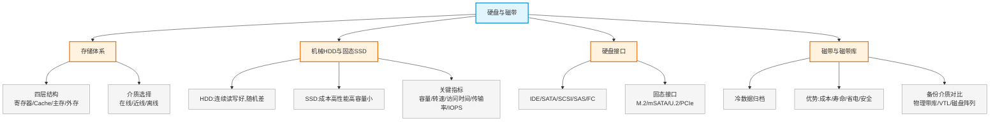

# 第十一章：硬盘与磁带

> 对应课件：`10-2 硬盘与磁带.pdf`（共 35 页）
> 本章聚焦存储介质基础：存储体系层次、机械/固态硬盘、硬盘接口与磁带库归档。

## 1. 核心考点脑图 (Mindmap)

---

## 2. 深度理论解析 (Theory & Concepts)

### 2.1 存储体系层次结构

存储体系结构分为四层，速度由快到慢、容量由小到大、价格由高到低：

| 层次 | 说明 | 速度/价格 |
| :--- | :--- | :--- |
| **寄存器**（CPU 内） | 最快、容量最小 | 最快 / 最贵 |
| **高速缓冲存储器**（Cache） | 缓解 CPU 与主存速度差 | 高速 / 贵 |
| **主存储器**（内存） | 存放运行中的程序数据 | 中速 / 中 |
| **外存储器**（硬盘/磁带） | 持久化存储 | 慢 / 便宜 |

层次关系：高速缓冲-主存层次、主存-外存层次，逐层用"缓存"思想弥合速度差。

#### 存储介质选择（按数据访问热度）

| 数据类型 | 含义 | 适用介质 |
| :--- | :--- | :--- |
| **在线数据**（热数据） | 频繁访问 | 内存、Flash/SSD/SAS 硬盘 |
| **近线数据**（温数据） | 偶尔访问 | SATA 硬盘、光盘、U 盘、软盘 |
| **离线数据**（冷数据） | 极少访问、归档 | 磁带、光盘 |

> **易错点**：速度/价格由快到慢、由贵到便宜：内存 > SSD > SAS > SATA > 磁带。**冷数据用磁带**，不是用 SSD。

### 2.2 机械硬盘 HDD 与固态硬盘 SSD ⭐

| 类型 | 特点 |
| :--- | :--- |
| **机械硬盘（HDD）** | 连续读写性能很好，但**随机读写性能很差**；成本低、性能低、容量大 |
| **固态硬盘（SSD）** | 成本高、性能高、容量小 |

按应用场景选盘：

| 应用特征 | 关注指标 | 推荐盘 |
| :--- | :--- | :--- |
| **随机读写频繁**（小文件存储/图片、数据库、邮件服务器） | **IOPS** | **SSD 最佳** |
| **顺序读写频繁**（视频监控、视频编辑） | **吞吐量** | 可用 HDD |

> **易错点**：选盘看访问模式——**随机多选 SSD（看 IOPS），顺序多可用 HDD（看吞吐量）**。数据库/邮件关心 IOPS 用 SSD；视频监控/编辑关心吞吐量可用机械盘。

### 2.3 硬盘关键指标 ⭐

| 指标 | 含义 | 关键点 |
| :--- | :--- | :--- |
| **硬盘容量**（Volume） | 单位 MB/GB | 受**单碟容量**和**碟片数量**影响 |
| **转速**（RPM） | 盘片旋转速度 | SATA：5.4K/7.2K；SAS：10K/15K；**SSD 无转速** |
| **平均访问时间** | = 平均寻道时间 + 平均等待时间 | — |
| **数据传输率/吞吐量** | 读写速度，单位 MB/s | 顺序读写（视频编辑/点播）关注此指标 |
| **IOPS** | 每秒输入输出量（读写次数） | 随机读写（OLTP）的关键衡量指标 |

> **易错点**：**IOPS** 是随机读写（OLTP、数据库）的核心指标；**吞吐量**是顺序读写（视频）的核心指标——两者常考对应关系。

### 2.4 硬盘接口

硬盘接口分为 **IDE、SATA、SCSI、SAS、FC** 五类。IDE 已淘汰；实际项目最多用 SATA（容量大）和 SAS（性能强）；FC 用于高性能服务器，成本较高。

#### 五大接口对比 ⭐ 高频考点

| 接口 | IDE | SATA | SCSI | SAS | FC |
| :--- | :--- | :--- | :--- | :--- | :--- |
| **指令系统** | ATA | ATA | SCSI | SCSI | SCSI |
| **接口类型** | 并行 | 串行 | 并行 | 串行 | 串行 |
| **接口速率** | 133MB/s | 3Gb/s、6Gb/s | 320MB/s | 6Gb/s、12Gb/s | 8Gb/s、16Gb/s |
| **主流容量** | 320G/500G | 1T/2T/4T/6T/10T | 300G | 1T/2T/4T | 300G/600G |
| **双工** | 半双工 | 半双工 | 半双工 | 全双工 | 全双工 |
| **最大连接设备数** | 2 | 1 或 15 | 16 | 16256 | 环网 127 / 交换 1600 万 |
| **线缆长度** | 0.4m | 1m | 12m | 6m | 30m（同轴）/ 10km（光纤） |
| **应用** | 普通 PC | PC 或服务器 | 服务器 | 中高端服务器 | 高端服务器 |

> **易错点**：
> *   **SATA 和 SAS 物理层完全兼容**（SAS 接口可插 SATA 盘，反之不行）。
> *   **SATA 半双工、SAS 全双工**——这是性能差异的关键。
> *   IDE/SCSI 是**并行**，SATA/SAS/FC 是**串行**。
> *   FC 用光纤，线缆可达 **10km**，连接设备数最多（交换网络 1600 万）。

#### 固态硬盘接口

| 接口 | 说明 |
| :--- | :--- |
| **M.2**（NGFF） | Intel 推出，替代 mSATA；速度更快体积更小，笔记本主流；分 SATA（AHCI 协议，读 550MB/s）和 NVMe（读 7461MB/s）两种 |
| **mSATA** | 占用空间小，但相对 M.2 性能差 |
| **U.2**（SFF-8639） | 兼容性、高速率、低延迟、低功耗；兼容 PCIe/SAS/SATA，适用企业级 SSD |
| **PCIe** | 高速接口，企业级 SSD 常用 |

> **易错点**：M.2 SSD 有两种——**SATA 协议（AHCI，慢）和 NVMe 协议（快）**；选 SSD 时协议比接口更影响速度。

#### 硬盘尺寸规格

*   **3.5 英寸**：大容量（1T~10T），多为 SAS/SATA 7.2K
*   **2.5 英寸**：小尺寸占空间小，多为 SAS 10K/15K 高转速

### 2.5 磁带与磁带库

#### 为什么需要磁带库（冷数据归档）

*   **市场背景**：企业 **70% 存储是冷数据**（类比衣柜里 70% 是很少穿、舍不得扔的衣服）。
*   **法规驱动**：
    *   2016《反恐法》：重要场所视频监控图像保存**不少于 90 天**。
    *   银监会规定：理财产品数据需在结束后 **20 年内**保留归档。
*   应用领域：视频监控、金融、运营商、测绘、医疗等海量/非结构化数据归档。

#### 磁带库优势 ⭐

对比硬盘类产品，磁带库五大优势：

| 优势 | 磁带库 | 硬盘类产品 |
| :--- | :--- | :--- |
| **成本** | 成本最低，存更多数据 | 同样钱存更少数据 |
| **寿命** | **30~50 年** | **3~5 年**（命短） |
| **省电/占地** | 不占地、不耗电、更轻 | 占地大、又重、耗电 |
| **皮实（抗物理损坏）** | 磁带断裂可重新接上，数据不全丢 | 震动易坏，坏则整盘数据完蛋 |
| **安全（离线防篡改）** | 离线存储，瞬间可销数据防篡改 | 在线易被攻击 |

#### 磁带库发展趋势

LTO（Linear Tape Open）磁带技术不断迭代（LTO-4 → LTO-5 → LTO-6 → LTO-8 → LTO-10），向**标准化和大容量**发展。海量/非结构化数据归档，磁带库是性价比最好的选择之一。

#### 主流备份介质对比 ⭐ 高频考点

| 特性 | 物理磁带库 | VTL（虚拟带库） | 磁盘阵列 |
| :--- | :--- | :--- | :--- |
| **存储介质** | 磁带（LTO、SDLT、AIT 等） | 硬盘（SSD/SAS/SATA） | 硬盘（SSD/SAS/SATA） |
| **IO 速度** | 标称 140MB/s（与主机和磁带种类相关） | 实测数百 MB/s | 实测数百 MB/s |
| **介质移动** | 可移动 | 物理磁盘不建议移动 | 可通过虚拟磁带导出到物理磁带 |
| **可维护性** | 低，需专业人员 | 高，一般 IT 人员可维护 | 高，一般 IT 人员可维护 |
| **环境影响** | 受湿度、粉尘影响**大** | 受湿度、粉尘影响小 | 受湿度、粉尘影响小 |
| **部件故障率** | 机械手等非封闭转动部件，故障率**高** | 封闭精密部件，故障率低，支持 RAID | 封闭精密部件，故障率低，支持 RAID |
| **备份类型** | **离线存储** | 近线存储 | 近线/在线存储 |

> **易错点**：
> *   物理磁带库 = **离线存储**，VTL/磁盘阵列 = 近线/在线存储。
> *   磁带库故障率**高**（机械部件）、受环境影响**大**，但成本低、寿命长、安全——优缺点要分清。
> *   VTL（虚拟带库）本质是用**硬盘模拟磁带**，速度更快但介质不可移动。

---

## 3. 横向对比与易错辨析 (Comparisons & Pitfalls)

### 3.1 HDD vs SSD 对比

| 维度 | HDD 机械硬盘 | SSD 固态硬盘 |
| :--- | :--- | :--- |
| 读写 | 连续好、随机差 | 随机读写强 |
| 成本 | 低 | 高 |
| 性能 | 低 | 高 |
| 容量 | 大 | 小 |
| 转速 | 有（5.4K/7.2K/10K/15K） | 无转速 |
| 适用 | 顺序读写（视频监控/编辑） | 随机读写（数据库/邮件/小文件） |

### 3.2 高频易错点速记

> **易错点 1**：存储四层 = 寄存器 > Cache > 主存 > 外存；介质选择 热数据(内存/SSD) > 温数据(SATA) > 冷数据(磁带)。
>
> **易错点 2**：随机读写看 **IOPS** 选 SSD；顺序读写看**吞吐量**可用 HDD。
>
> **易错点 3**：**SATA 与 SAS 物理层兼容**；SATA 半双工，SAS 全双工。
>
> **易错点 4**：IDE/SCSI 并行，SATA/SAS/FC 串行；FC 线缆可达 10km。
>
> **易错点 5**：M.2 分 SATA(AHCI,慢) 和 NVMe(快) 两种协议。
>
> **易错点 6**：磁带库寿命 **30~50 年**，硬盘仅 **3~5 年**；磁带库是**离线存储**、故障率高但成本低寿命长。
>
> **易错点 7**：路由器初始配置文件存 **NVRAM**（非易失）；VRP/IOS 系统软件存 **Flash**；引导程序存 **ROM**；运行配置存 **RAM（内存）**。

---

## 4. 历年真题与解析 (Exam Questions)

### 4.1 网规 2019年 第51题 ⭐

**题目**：以下有关 SSD，描述错误的是（51）。
A. SSD 是用固态电子存储芯片阵列而制成的硬盘，由控制单元和存储单元（FLASH 芯片、DRAM 芯片）组成
B. SSD 固态硬盘最大的缺点就是不可以移动，而且数据保护受电源控制，不能适应于各种环境
C. SSD 的接口规范和定义、功能及使用方法与普通硬盘完全相同
D. SSD 具有擦写次数的限制，闪存完成擦写一次叫做 1 次 P/E，其寿命以 P/E 作单位

**【参考答案】B**

**【解析】**：B 正好说反——固态硬盘**优点是可以移动**，而且**数据保护不受电源控制**，适应性较好。A、C、D 描述均正确（SSD 由控制单元+存储单元组成；接口与普通硬盘相同；有 P/E 擦写次数限制）。

### 4.2 网规 2020年11月 第60题 ⭐

**题目**：企业级路由器的初始配置文件通常保存在（60）上。
A. SDRAM　B. NVRAM　C. Flash　D. BootROM

**【参考答案】B**

**【解析】**：掌握几种常见存储的用途：
*   **NVRAM**（非易失存储器）：保存**启动配置文件**。
*   **Flash**（闪存）：保存华为 VRP / 思科 IOS **系统软件**。
*   **ROM**（只读）：存储**引导程序**。
*   **RAM**（内存/SDRAM）：保存当前**运行的配置**程序，系统关闭或重启信息会丢失。

> **考点关联**：路由器配置存储位置是高频考点——启动配置在 NVRAM，系统在 Flash，运行配置在 RAM。

### 4.3 网工 2020年11月 第8题 ⭐

**题目**：计算机上采用的 SSD（固态硬盘）实质上是（8）存储器。
A. Flash　B. 磁盘　C. 磁带　D. 光盘

**【参考答案】A**

**【解析】**：固态硬盘和 U 盘都是使用 **Flash** 作为存储介质。

### 4.4 网工 2019年11月 第66题 ⭐

**题目**：下列（66）接口不适用于 SSD 磁盘。
A. SATA　B. IDE　C. PCIe　D. M.2

**【参考答案】B**

**【解析】**：SSD 常用接口为 SATA、PCIe、M.2、U.2、mSATA 等；**IDE** 是已被淘汰的老式并行接口，不适用于 SSD。

> **考点关联**：SSD 接口 = SATA/M.2/U.2/PCIe；IDE 仅用于老式机械硬盘，已淘汰。

---

## 5. 备考建议 (Exam Tips)

### 高频考点回顾

1.  **存储四层结构**：寄存器 > Cache > 主存 > 外存；介质按热度分在线(SSD)/近线(SATA)/离线(磁带)。
2.  **HDD vs SSD**：HDD 连续读写好随机差、容量大成本低；SSD 随机强、性能高容量小成本高。
3.  **硬盘指标**：IOPS（随机/OLTP）、吞吐量（顺序/视频）、容量（单碟容量×碟片数）、平均访问时间=寻道+等待。
4.  **五大接口对比**：IDE/SCSI 并行、SATA/SAS/FC 串行；SATA 半双工、SAS 全双工且物理兼容；FC 10km。
5.  **SSD 接口**：M.2（SATA/NVMe 两种协议）、mSATA、U.2（SFF-8639）、PCIe；IDE 不适用。
6.  **磁带库**：冷数据归档、寿命 30~50 年、离线存储、成本低故障率高；LTO 迭代。
7.  **备份介质对比**：物理磁带库（离线/慢/故障率高）vs VTL（硬盘模拟磁带/快）vs 磁盘阵列（近线在线/快/支持 RAID）。
8.  **路由器存储**：NVRAM 存启动配置、Flash 存系统、ROM 存引导、RAM 存运行配置。

### 记忆口诀

*   **选盘**："随机 IOPS 选 SSD，顺序吞吐用 HDD"
*   **接口双工**："SATA 半双工，SAS 全双工，物理兼容 SAS 插 SATA"
*   **磁带库寿命**："磁带三五十，硬盘三五天"
*   **路由器存储**："启动 NVRAM，系统 Flash，引导 ROM，运行 RAM"
