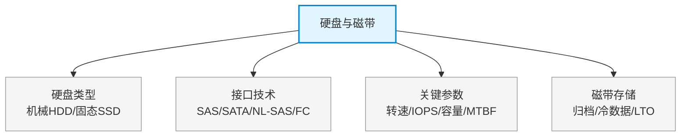

# 第十一章：硬盘与磁带

> 对应课件：`10-2 硬盘与磁带.pdf`
> 本章聚焦存储介质基础：硬盘接口技术（SAS/SATA/NL-SAS）与磁带归档存储。
> ⚠️ 本文件为骨架占位，具体内容待对照 PDF OCR 逐节补充。

## 1. 核心考点脑图 (Mindmap)

---

## 2. 深度理论解析 (Theory & Concepts)

> 待补充：HDD 结构与转速、SSD 闪存颗粒（SLC/MLC/TLC）、接口协议对比、磁带库与 LTO 代际。

## 3. 横向对比与易错辨析 (Comparisons & Pitfalls)

> 待补充：SAS vs SATA vs NL-SAS 对比、SSD vs HDD 对比、热盘 vs 冷盘 vs 磁带分级存储。

## 4. 历年真题与解析 (Exam Questions)

> 待补充：真实历年真题，标注出处年份。

## 5. 备考建议 (Exam Tips)

> 待补充：高频考点回顾、记忆口诀、易错提醒。
