# 第十二章：RAID 技术

> 对应课件：`10-3 RAID技术.pdf`（共 27 页）
> 本章是云数据中心存储模块的**高频考点**：RAID 各级别原理、条带/镜像/校验、磁盘阵列容量与可用率计算、RAID2.0。

## 1. 核心考点脑图 (Mindmap)

```mermaid
flowchart TD
    A["RAID 技术"] --> B["基本概念"]
    A --> C["传统 RAID 级别"]
    A --> D["级别对比与计算"]
    A --> E["RAID2.0"]

    B --> B1["定义:多盘组合成逻辑盘"]
    B --> B2["数据组织:分块/条带深度/条带"]
    B --> B3["热备(全局/专用)+重构"]
    B --> B4["逻辑卷 LUN"]

    C --> C1["RAID0 条带,无容错"]
    C --> C2["RAID1 镜像,利用率50%"]
    C --> C3["RAID3/5 奇偶校验"]
    C --> C4["RAID6 双校验,容坏2块"]
    C --> C5["RAID10/50 组合级"]

    D --> D1["容量公式"]
    D --> D2["允许坏盘=校验盘数"]

    E --> E1["快速重构(分布式热备)"]
    E --> E2["负载均衡+利用率提升"]

    style A fill:#e1f5fe,stroke:#0288d1,stroke-width:2px
    style B fill:#fff3e0,stroke:#ef6c00,stroke-width:2px
    style C fill:#fff3e0,stroke:#ef6c00,stroke-width:2px
    style D fill:#ffebee,stroke:#c62828,stroke-width:2px
    style E fill:#fff3e0,stroke:#ef6c00,stroke-width:2px
    style B1 fill:#f5f5f5,stroke:#9e9e9e
    style B2 fill:#f5f5f5,stroke:#9e9e9e
    style B3 fill:#f5f5f5,stroke:#9e9e9e
    style B4 fill:#f5f5f5,stroke:#9e9e9e
    style C1 fill:#f5f5f5,stroke:#9e9e9e
    style C2 fill:#f5f5f5,stroke:#9e9e9e
    style C3 fill:#f5f5f5,stroke:#9e9e9e
    style C4 fill:#f5f5f5,stroke:#9e9e9e
    style C5 fill:#f5f5f5,stroke:#9e9e9e
    style D1 fill:#f5f5f5,stroke:#9e9e9e
    style D2 fill:#f5f5f5,stroke:#9e9e9e
    style E1 fill:#f5f5f5,stroke:#9e9e9e
    style E2 fill:#f5f5f5,stroke:#9e9e9e
```

---

## 2. 深度理论解析 (Theory & Concepts)

### 2.1 RAID 基本定义

**RAID**（Redundant Array of Independent Disks，独立磁盘冗余阵列）将多个单独的物理硬盘以不同方式组合成一个**逻辑硬盘**，从而提高硬盘的**读写性能**和**数据安全性**。

### 2.2 RAID 数据组织与存取方式 ⭐

| 概念 | 定义 |
| :--- | :--- |
| **分块**（Block） | 将一个分区分成多个大小相等、地址相邻的块，是组成条带的元素 |
| **条带深度** | 由一个或多个分块构成 |
| **条带**（Stripe） | 同一磁盘阵列中多个磁盘驱动器上**相同"位置"（相同编号）**的分块 |

> **易错点**：条带是跨磁盘的"同一行"分块集合；条带深度是单盘上的一段。条带化（Striping）是 RAID0/3/5/6/10/50 提升性能的基础。

### 2.3 RAID 热备与重构 ⭐

**热备**（Hot Spare）：当冗余 RAID 组中某硬盘失效时，在不影响系统正常使用的情况下，用备用硬盘自动顶替失效硬盘，保证冗余性。

| 热备类型 | 说明 |
| :--- | :--- |
| **全局式** | 备用硬盘为系统中**所有**冗余 RAID 组共享 |
| **专用式** | 备用硬盘为系统中**某一组**冗余 RAID 组专用 |

**重构**（Rebuild）：失效盘数据通过校验信息（XOR 异或运算）恢复到热备盘的过程。

### 2.4 逻辑卷与 LUN

在 RAID 基础上可按不同容量创建**逻辑卷**，通过 **LUN**（Logic Unit Number，逻辑单元号）来标识。LUN 是主机看到的"逻辑盘"。

---

### 2.5 传统 RAID 级别 ⭐ 高频考点

#### RAID 0（条带）

*   **机制**：没有容错设计的条带硬盘阵列，数据以条带形式均匀分布在各盘。
*   **有效容量**：`N × 单盘`（利用率 **100%**）
*   **最少盘数**：2 块，**不允许坏硬盘**
*   **特点**：性能最高、无冗余、可靠性最低

#### RAID 1（镜像 Mirror）

*   **机制**：数据同时一致写到主硬盘和镜像硬盘。
*   **有效容量**：`N/2 × 单盘`（利用率 **50%**）
*   **最少盘数**：2 块，最多允许坏**一半**硬盘
*   **特点**：可靠性高、性能最低、空间利用率低

#### RAID 3 与 RAID 5（奇偶校验）⭐

两者均采用**奇偶校验**：

| 级别 | 机制 | 校验盘 |
| :--- | :--- | :--- |
| **RAID 3** | 带有校验的并行数据传输阵列，数据条带化分布在数据盘，使用**专用校验硬盘**存放校验数据 | 专用校验盘 |
| **RAID 5** | 与 RAID3 类似，但校验数据**均匀分布**在各数据硬盘上，成员盘同时保存数据和校验信息 | 分布式校验 |

*   **RAID 5 有效容量**：`(N-1) × 单盘`，最少 3 块，允许坏 **1 块**硬盘
*   RAID 5 是**最常用**的 RAID 方式之一

> **易错点**：RAID3 用**专用校验盘**（校验集中），RAID5 校验**分布式**（散布各盘）——这是两者核心区别。RAID5 空间利用率 `(N-1)/N`。

#### RAID 6（双校验）

*   **机制**：双重校验——**横向校验盘**（P1~P4）+ **斜向校验盘**（DP1~DP4）。
    *   横向校验：`P1 = A1 XOR A2 XOR A3 XOR A4`
    *   斜向校验：`DP1 = A1 XOR A6 XOR A11 XOR A16`
*   **有效容量**：`(N-2) × 单盘`，最少 4 块，允许坏 **2 块**硬盘
*   **特点**：可靠性高，可同时坏 2 盘

#### RAID 10 与 RAID 50（组合级）

| 级别 | 组合方式 | 说明 |
| :--- | :--- | :--- |
| **RAID 10** | 镜像 + 条带两级组合 | 第一级 RAID1 镜像对，第二级 RAID0；应用广泛，利用率 50%，允许坏 N/2 |
| **RAID 50** | RAID5 + RAID0 两级组合 | 最低一级 RAID5，第二级 RAID0 |

---

### 2.6 常用 RAID 技术对比 ⭐⭐ 高频考点

| RAID 级别 | RAID 0 | RAID 1 | RAID 5 | RAID 6 | RAID 10 |
| :--- | :--- | :--- | :--- | :--- | :--- |
| **可靠性** | 最低 | 高 | 较高 | 高 | 高 |
| **冗余类型** | 无 | 镜像冗余 | 校验冗余 | 校验冗余 | 镜像冗余 |
| **空间利用率** | 100% | 50% | (N-1)/N | (N-2)/N | 50% |
| **性能** | 最高 | 最低 | 较高 | 较高 | 高 |
| **允许坏盘数量** | 0 | N/2 | 1 | 2 | N/2 |

> **⭐ 核心规律**：**每种 RAID 有几块校验盘，就最多允许坏几块盘**。
> *   RAID0：0 校验盘 → 不允许坏
> *   RAID1/10：镜像 → 允许坏一半（N/2）
> *   RAID5：1 校验盘 → 允许坏 1
> *   RAID6：2 校验盘 → 允许坏 2

### 2.7 容量与可用率计算 ⭐⭐ 高频考点

#### 有效容量公式

| 级别 | 有效容量 | 空间利用率 |
| :--- | :--- | :--- |
| RAID 0 | N × 单盘 | 100% |
| RAID 1 | (N/2) × 单盘 | 50% |
| RAID 5 | (N-1) × 单盘 | (N-1)/N |
| RAID 6 | (N-2) × 单盘 | (N-2)/N |
| RAID 10 | (N/2) × 单盘 | 50% |

#### 关键计算规则

1.  **木桶原理**：若各盘容量不等，以**最小盘容量**为基准计算。
2.  **多 RAID 组**：总数据盘数 = 总盘数 − 热备盘数 − 各组校验盘数之和。
3.  **热备盘不参与数据存储**：先扣除热备盘，再按 RAID 级别扣校验盘。

> **易错点**：计算实际存储容量时，**先减热备盘，再按级别减校验盘**。如 25 块 8TB 做 2 个 RAID6 组 + 1 热备：数据盘 = 25 − 1(热备) − 2×2(每组2校验) = 20，容量 = 20×8 = 160TB。

---

### 2.8 RAID 2.0 技术

#### 传统 RAID 的痛点

*   需手动配置单独的全局或局部热备磁盘
*   多对一重构：重构数据流**串行写入单一热备盘**，存在写瓶颈
*   重构时间长、存在热点

#### RAID 2.0+ 的改进 ⭐

| 维度 | 传统 RAID | RAID 2.0+ |
| :--- | :--- | :--- |
| 热备空间 | 单独配置热备盘 | **分布式热备空间**，无需单独配置 |
| 重构方式 | 多对一，串行写单盘 | **多对多，并行写多盘** |
| 重构时间 | 长（存在热点） | 短（负载均衡） |

#### RAID 2.0 四大优势

1.  **快速重构**：热备空间分散在多盘，避免单热备盘写瓶颈，重构速度快。
2.  **硬盘负载均衡**：LUN 数据均匀分散到所有硬盘，防止局部过热，提升可靠性。
3.  **最大化盘资源利用率**：LUN 基于资源池创建，多盘读写性能提升；硬盘数量不受限 RAID 级别，配合智能精简配置提升容量利用率。
4.  **提升存储管理效率**：硬盘组合成存储池 → 设分层策略 → 划分 LUN；扩容只需插入新盘，系统自动调整数据分布。

#### 重构范围（案例考点）⭐

> **传统 RAID** 是**全盘重构**（无论空间是否分配都重构）；
> **RAID 2.0** 只重构**已使用的空间**（未分配空间不参与重构）。

#### RAID 2.0 创建步骤

创建硬盘域 → 创建存储池 → 创建 LUN（设置 RAID 策略、容量、SmartThin 精简配置等）。

---

## 3. 横向对比与易错辨析 (Comparisons & Pitfalls)

### 3.1 RAID 级别选型决策

| 需求 | 推荐 | 理由 |
| :--- | :--- | :--- |
| 极致性能、不要冗余 | RAID 0 | 性能最高、利用率 100%，但无容错 |
| 最高可靠性、不计成本 | RAID 1 | 镜像，可靠性高但利用率仅 50% |
| 性能与冗余平衡（最常用） | RAID 5 | 校验冗余，利用率 (N-1)/N，允许坏 1 |
| 高可靠性、怕同时坏 2 盘 | RAID 6 | 双校验，允许坏 2，利用率 (N-2)/N |
| 数据库（高可靠+高性能） | RAID 10 | 镜像+条带，性能高、可靠，利用率 50% |

### 3.2 高频易错点速记

> **易错点 1**：**允许坏盘数 = 校验盘数**。RAID5 允许坏 1，RAID6 允许坏 2，RAID0 不允许坏，RAID1/10 允许坏一半。
>
> **易错点 2**：空间利用率 RAID0=100%、RAID1/10=50%、RAID5=(N-1)/N、RAID6=(N-2)/N。
>
> **易错点 3**：**读写性能** RAID0 最高、RAID1 最低；**可靠性（冗余）** RAID1 最高、RAID0 最低——注意区分"性能"和"可靠性"两个维度，不要混。
>
> **易错点 4**：RAID3 **专用校验盘**，RAID5 **分布式校验**——核心区别。
>
> **易错点 5**：容量计算**先减热备盘，再按级别减校验盘**；各盘不等用**木桶原理**取最小盘。
>
> **易错点 6**：传统 RAID **全盘重构**，RAID2.0 **只重构已用空间**（未分配空间不参与）。
>
> **易错点 7**：RAID2.0 热备空间**分布式**、重构**多对多并行**、重构时间短；传统 RAID 热备**单独配置**、重构**多对一串行**、时间长。

---

## 4. 历年真题与解析 (Exam Questions)

### 4.1 网规 2015年11月 第49-50题 ⭐⭐（容量计算）

**题目**：假如有 3 块容量是 80G 的硬盘做 RAID5 阵列，则这个 RAID5 的容量是（49）。而如果有 2 块 80G 的盘和 1 块 40G 的盘，此时 RAID5 的容量是（50）。
（49）A. 240G　B. 160G　C. 80G　D. 40G
（50）A. 40G　B. 80G　C. 160G　D. 200G

**【参考答案】（49）B　（50）B**

**【解析】**：
*   （49）RAID5 可用磁盘数为 N-1，3 块 80G 做 RAID5：总容量 = (3-1)×80 = **160G** → B
*   （50）2 块 80G + 1 块 40G 组 RAID5，根据**木桶原理**以较小盘容量计算：(3-1)×40 = **80G** → B

> **考点关联**：RAID5 容量 = (N-1)×单盘；盘不等取最小盘（木桶原理）。

### 4.2 网工 2022年5月 第68题 ⭐⭐（多组+热备计算）

**题目**：某存储系统规划配置 25 块 8TB 磁盘，创建 2 个 RAID6 组，配置 1 块热备盘，则该存储系统实际存储容量是（68）。
A. 200TB　B. 192TB　C. 176TB　D. 160TB

**【参考答案】D**

**【解析】**：25 块盘 − 1 个热备盘 − 每个 RAID6 组校验用掉 2 块盘（2 组共 4 块）= **20 个数据盘**，实际存储容量 = 20×8 = **160TB** → D。

> **考点关联**：先减热备盘，再按 RAID6（每组 2 校验盘）减校验盘。20×8=160。

### 4.3 网规 2022年11月 第61题 ⭐（性能比较）

**题目**：硬盘做 RAID，读写性能最高的是（61）。
A. RAID 0　B. RAID 1　C. RAID 10　D. RAID 5

**【参考答案】A**

**【解析】**：RAID 0 无校验无镜像开销，读写性能最高。冗余性（可靠性）从好到坏：**RAID1 > RAID10 > RAID5 > RAID0**；但纯读写性能 RAID0 最高。

> **考点关联**：注意区分"性能"与"可靠性"——性能 RAID0 最高，可靠性 RAID1 最高。

### 4.4 网规 2018年11月 案例二 ⭐⭐（综合应用）

**【说明】**：图 2-1 为某服务器 RAID 示意图，由 4 块磁盘组成，P 表示校验段、D 表示数据段，每个数据块 4KB，每个条带在一个磁盘上的数据段包括 4 个数据块。

**【问题1】（6分）**：图示 RAID 方式是（1），该 RAID 最多允许坏（2）块磁盘而数据不丢失，通过增加（3）盘可以减小磁盘故障对数据安全的影响。

**【参考答案】**：（1）RAID5　（2）1　（3）热备

**【解析】**：4 块盘 + 分布式校验（P 散布各盘）= RAID5；RAID5 有 1 块校验盘，最多允许坏 1 块；增加**热备盘**可在故障时自动顶替。

**【问题4】（7分）**：磁盘 0 故障报警，管理员应采取什么措施？假设磁盘 0 被分配了 80% 空间，RAID 重构时未被分配的 20% 空间是否参与重构？

**【参考答案】**：1. 更换同样型号磁盘。2. 未分配的 20% 空间**参与重构**——传统 RAID 是全盘重构；最新的 RAID2.0 只重构使用的空间。

> **考点关联**：传统 RAID 全盘重构 vs RAID2.0 只重构已用空间——这是案例题的高频考点。

### 4.5 网工 2018年5月 案例分析二/问题4（2分）

**题目**：存储系统的 RAID 故障恢复机制为数据可靠保障，请简要说明 RAID2.0 较传统 RAID 在重构方面有哪些改进。

**【参考答案要点】**：
1.  **热备空间分布式**：传统 RAID 需单独配置热备盘，RAID2.0 热备空间分散在多盘，无需单独配置。
2.  **多对多并行重构**：传统 RAID 多对一串行写单热备盘（存在瓶颈）；RAID2.0 多对多并行写多盘。
3.  **重构时间短**：避免单盘写瓶颈和热点，负载均衡，重构速度快。

---

## 5. 备考建议 (Exam Tips)

### 高频考点回顾

1.  **RAID 定义**：多物理盘组合成逻辑盘，提升读写性能与数据安全性。
2.  **数据组织**：分块（Block）→ 条带深度 → 条带（Stripe，跨盘同行）。
3.  **热备**：全局式（共享）/ 专用式（单组）；重构用 XOR 异或运算恢复。
4.  **各级别容量与容错**：
    *   RAID0：100% 利用率，不允许坏
    *   RAID1/10：50%，允许坏一半
    *   RAID5：(N-1)/N，允许坏 1（分布式校验，最常用）
    *   RAID6：(N-2)/N，允许坏 2（双校验：横向+斜向）
5.  **允许坏盘数 = 校验盘数**（核心规律）。
6.  **容量计算**：先减热备盘，再按级别减校验盘；盘不等用木桶原理取最小。
7.  **性能 vs 可靠性**：性能 RAID0 最高；可靠性 RAID1 最高。
8.  **RAID3 专用校验盘 vs RAID5 分布式校验**。
9.  **RAID2.0**：分布式热备、多对多并行重构、重构时间短、负载均衡、只重构已用空间。
10. **传统 RAID 全盘重构 vs RAID2.0 只重构已用空间**（案例高频）。

### 记忆口诀

*   **容错规律**："几块校验盘，就容坏几块"（RAID5 坏1、RAID6 坏2、RAID0 不坏、RAID1/10 坏一半）
*   **利用率**："0 满百，1/10 对半，5 减一，6 减二"
*   **计算顺序**："先抠热备，再抠校验，盘不等取最小"
*   **重构**："传统全盘重，2.0 只重用过的"
*   **校验分布**："3 专用，5 分布"
