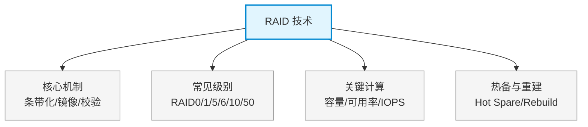

# 第十二章：RAID 技术

> 对应课件：`10-3 RAID技术.pdf`
> 本章是云数据中心存储模块的高频考点：RAID 各级别原理、条带/镜像/校验、磁盘阵列选型计算。
> ⚠️ 本文件为骨架占位，具体内容待对照 PDF OCR 逐节补充。

## 1. 核心考点脑图 (Mindmap)

---

## 2. 深度理论解析 (Theory & Concepts)

> 待补充：RAID 定义与三大机制、各级别原理详解（条带大小、校验算法、容错能力）。

## 3. 横向对比与易错辨析 (Comparisons & Pitfalls)

> 待补充：RAID 各级别对比表（最少盘数/容错盘数/空间利用率/读写性能）、容量与可用率计算公式与例题。

## 4. 历年真题与解析 (Exam Questions)

> 待补充：真实历年真题（RAID 计算题为高频考点），标注出处年份。

## 5. 备考建议 (Exam Tips)

> 待补充：高频考点回顾、容量计算口诀、易错提醒。
