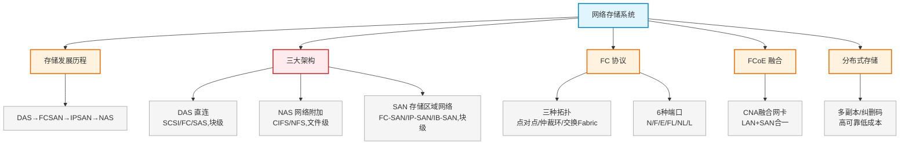

# 第十三章：网络存储系统

> 对应课件：`10-4 网络存储系统.pdf`（共 36 页）
> 本章聚焦存储架构三大形态（DAS/NAS/SAN）及协议（FC/iSCSI/FCoE）、FC 拓扑与端口、分布式存储，是数据中心存储组网核心。

## 1. 核心考点脑图 (Mindmap)

---

## 2. 深度理论解析 (Theory & Concepts)

### 2.1 存储发展历程

存储从**附属于服务器**逐步**剥离成独立系统**，演进路线：

| 时期 | 形态 | 说明 |
| :--- | :--- | :--- |
| 40~70 年代 | 硬盘在服务器内部 | 附属阶段 |
| 70 年代 | **DAS**（外挂硬盘阵列） | 直连附加存储，最早最简单 |
| 80~90 年代 | **SAN**（存储区域网络） | 存储网络化，FC-SAN |
| 90 年代后 | **NAS**（网络附加存储） | 专用存储设备，文件共享 |

> **易错点**：DAS → SAN → NAS 是按"存储独立性增强"演进的，但 NAS 出现时间（90 年代初）与 FC-SAN（90 年代中后期）接近，不要按字面顺序硬记时间。

### 2.2 DAS 直连附加存储

*   **时间**：70 年代
*   **背景**：数据量增多产生存储需求，最早最简单的存储架构。
*   **连接方式**：FC、SCSI、SAS（与服务器主机直连，通常 SCSI 连接）
*   **链路速率**：20/40/80/320 MB/s
*   **特点**：易于理解、兼容性好；但**难管理、扩展性有限**。
*   **数据类型**：**块级**
*   提供：快照、备份等功能。

### 2.3 SAN 存储区域网络 ⭐

为解决 DAS 扩展性差，将存储设备**网络化**，可同时连接上百台服务器。后端一台存储设备的存储空间划分为多个 LUN，**每个 LUN 只能属于一台前端服务器**。

#### 2.3.1 FC-SAN（光纤通道存储区域网络）

*   **时间**：90 年代中后期
*   **连接方式**：FC 光纤，专用 FC 交换机（2G/4G/8G/16G）
*   **链路速率**：2/4/8 Gbps
*   **传输类型**：FC，**块级**
*   **优点**：高扩展性、高性能高可用性
*   **缺点**：较昂贵、配置复杂
*   **典型应用**：数据库应用
*   提供：快照、容灾等高级数据保护功能。

#### 2.3.2 IP-SAN（IP 存储区域网络）

*   **时间**：2001 年
*   **背景**：为解决 FC-SAN 在**价格及管理**上的门槛。
*   **连接方式**：以太网作为连接链路，以太网交换机
*   **链路速率**：1/10/40/100 Gbps
*   **传输类型**：IP（**iSCSI**），**块级**
*   **优点**：高扩展性、易于安装、成本低
*   **缺点**：性能较低
*   **典型应用**：音视频
*   **iSCSI 被看好原因**：可采用成熟的 IP 网络管理工具和基础建设；IP 网络普遍，节省建设、管理及人事成本。

#### 2.3.3 IB-SAN（InfiniBand SAN）

*   **传输类型**：InfiniBand，**块级**
*   **优点**：带宽高、时延低
*   **典型应用**：高性能计算（HPC）

> **易错点**：三种 SAN 都是**块级**访问，区别在底层传输技术——FC-SAN 用 **FC**、IP-SAN 用 **iSCSI/IP**、IB-SAN 用 **InfiniBand**。这是高频考点。

### 2.4 NAS 网络附加存储 ⭐

*   **时间**：90 年代初
*   **背景**：网络飞速发展，大量数据需共享和交换；出现专用 NAS 存储设备，成为数据共享与交换核心。
*   **访问方式**：多台前端服务器**共享**后端存储设备，可对同一目录/文件**并发读写**。
*   **共享协议**：**CIFS**（Windows 系统）、**NFS**（Linux 系统）
*   **链路速率**：1/10 Gbps
*   **数据类型**：**文件级**
*   **文件系统位置**：位于**后端存储设备**（这是 NAS 与 SAN 的关键区别）
*   **优点**：易于安装、成本低
*   **缺点**：性能较低、存储空间利用率不高
*   **典型应用**：文件服务器

> **易错点**：**NAS 文件系统在后端存储设备**，SAN 文件系统在服务器端。NAS 是**文件级**共享（多机共享同一目录），SAN 是**块级**（每个 LUN 归一台服务器）——这是 NAS 与 SAN 最核心区别。

### 2.5 三种存储架构对比 ⭐⭐ 高频考点

| 维度 | DAS | NAS | FC-SAN | IP-SAN | IB-SAN |
| :--- | :--- | :--- | :--- | :--- | :--- |
| **传输类型** | SCSI/FC/SAS | IP | FC | IP | InfiniBand |
| **数据类型** | 块级 | **文件级** | 块级 | 块级 | 块级 |
| **典型应用** | 任何 | 文件服务器 | 数据库应用 | 音视频 | 高性能计算 |
| **优点** | 易理解、兼容好 | 易安装、成本低 | 高扩展、高性能高可用 | 高扩展、成本低 | 带宽高、时延低 |
| **缺点** | 难管理、扩展有限 | 性能低、利用率不高 | 昂贵、配置复杂 | 性能较低 | 对某些应用不适合 |

> **⭐ SAN 与 NAS 互补**：SAN 与 NAS 不是互相竞争的技术，二者通常**相互补充**。SAN 针对海量**面向数据块**的传输，NAS 提供**文件级**访问和共享。数据中心常采用 **SAN + NAS** 方式实现数据整合、高性能访问与文件共享。

### 2.6 FC 协议：三种拓扑 ⭐

| 拓扑 | 说明 | 最大设备数 |
| :--- | :--- | :--- |
| **点对点**（Point-to-Point） | 两个设备之间互连 | 2 |
| **仲裁环**（Arbitrated Loop） | 设备互连形成仲裁环 | **126** |
| **交换式 Fabric**（Switched Fabric） | 通过 FC 交换机互连 | **1600 万** |

### 2.7 FC 的 6 种端口 ⭐ 高频考点

| 端口 | 全称/含义 | 说明 |
| :--- | :--- | :--- |
| **N_Port** | Node Port | 终端节点端口（如 FC 存储或服务器） |
| **F_Port** | Fabric Port | 光纤交换环境下 N_Port 之间互连，所有节点可通信 |
| **E_Port** | Expansion Port | 光纤扩展端口，用于多路交换光纤环境（交换机级联） |
| **FL_Port** | Fabric Loop Port | 支持**仲裁环路的交换端口** |
| **NL_Port** | Node Loop Port | 支持**仲裁环路的节点端口**（**开放环**，可与环外 N_Port 通信） |
| **L_Port** | Loop Port | 支持**仲裁环路的节点端口**（**私有环**，封闭，仅环内通信） |

> **易错点**：
> *   **NL_Port** = 节点 + 仲裁环（开放环）；**FL_Port** = 交换 + 仲裁环。区分"节点端口"和"交换端口"。
> *   **N_Port**（节点）连到交换式 Fabric 时连接的是 **F_Port**（交换端口）。
> *   E_Port 是交换机之间级联用的扩展端口。

### 2.8 FCoE 以太网光纤通道 ⭐

**FCoE**（Fibre Channel over Ethernet）通过以太网封装光纤通道帧，允许 FC 协议使用万兆以太网（或更高），实现 **LAN + SAN 网络融合**。

*   **图1（融合前）**：每台服务器至少一个 HBA 卡（连 SAN）+ 一个以太网卡（连 LAN），两套网络。
*   **图2（融合后）**：服务器采用 **CNA**（Converged Network Adapter，融合网络适配器）网卡，融合以太网和存储网络，一套布线。

#### FCoE 优势

1.  减少数据中心适配器、线缆和交换机数量，降低供电和制冷负载（省电）。
2.  需要支持的点减少，降低管理负担和软件配置工作量，降低维护成本。
3.  能与现有 SAN 环境互操作，利用现有 FC-SAN。

#### FCoE 劣势

1.  网络和存储边界不清晰，管理容易混乱。
2.  引入新技术，对运维人员能力要求高。
3.  需更换 FCoE 交换机和服务器 CNA 网卡，增加成本。

> **易错点**：FCoE 用 **CNA 融合网卡**替代 NIC+HBA+HCA，**一套以太网布线**传输 LAN 和 SAN 流量。核心价值是"融合简化"。

---

### 2.9 分布式存储 / 超融合

在服务器上部署分布式存储软件，将服务器硬盘虚拟成**存储资源池**对外服务。

#### 三种分布式存储类型

| 类型 | 适合业务 |
| :--- | :--- |
| **分布式文件存储** | 带宽和吞吐较高（视频监控、云存储） |
| **分布式对象存储**（OSD） | 带宽和吞吐较高（视频监控、云存储） |
| **分布式块存储** | I/O 和时延敏感（数据库、云桌面） |

#### 组成与特点

分布式存储系统由 **3 部分**组成：**客户端、元数据节点（相当于目录）、数据存储节点**。数据存储节点采用**多副本或纠删码**实现冗余。

| 特点 | 说明 |
| :--- | :--- |
| **高性能** | 相比集中式存储提供更高 IOPS 和吞吐，随节点增加**线性增长**（如 12306 购票） |
| **高可靠** | 单机 RAID + 多机多副本冗余，单节点故障快速重建 |
| **容量大** | 扩展硬盘或服务器数量，海量资源池 |
| **成本低** | 核心是插大量硬盘的普通服务器，比专业 FC 存储便宜 |

> **易错点**：分布式存储底层用**多副本**（一般 3 副本）；数据分布多台服务器可并行读取，I/O 性能好；但多服务器互联需**较大带宽（至少 10G）**。对比集中共享存储：分布式存储**成本低、可实现多副本冗余**。

---

## 3. 横向对比与易错辨析 (Comparisons & Pitfalls)

### 3.1 DAS vs NAS vs SAN 选型

| 需求 | 推荐 | 理由 |
| :--- | :--- | :--- |
| 文件共享（多机访问同目录） | **NAS** | 文件级、CIFS/NFS、文件系统在后端 |
| 数据库（块级、高性能） | **FC-SAN** | 块级、FC、高性能高可靠 |
| 音视频（块级、低成本） | **IP-SAN** | 块级、iSCSI、成本低 |
| 高性能计算（低时延高带宽） | **IB-SAN** | InfiniBand |
| 小规模直连 | **DAS** | 简单、兼容好，但扩展有限 |

### 3.2 高频易错点速记

> **易错点 1**：**NAS 文件级、SAN/DAS 块级**。NAS 文件系统在**后端存储**，SAN 文件系统在**服务器**。
>
> **易错点 2**：三种 SAN 都是块级，区别在传输——FC-SAN=**FC**、IP-SAN=**iSCSI**、IB-SAN=**InfiniBand**。
>
> **易错点 3**：NAS 共享协议 **CIFS（Windows）/ NFS（Linux）**。
>
> **易错点 4**：SAN 每个 **LUN 只属于一台服务器**；NAS 多机**共享**同一目录并发读写。
>
> **易错点 5**：FC 三拓扑设备数——点对点 2、仲裁环 **126**、交换 Fabric **1600 万**。
>
> **易错点 6**：FC 端口——**NL_Port**=节点+仲裁环(开放环)、**FL_Port**=交换+仲裁环、**F_Port**=交换(连 N_Port)、**E_Port**=交换机级联扩展。
>
> **易错点 7**：FCoE 用 **CNA 融合网卡**，一套以太网布线融合 LAN+SAN。
>
> **易错点 8**：分布式存储 **多副本（3 副本）**冗余、成本低、需大带宽（≥10G）；文件/对象存储重吞吐，块存储重 I/O 时延。

---

## 4. 历年真题与解析 (Exam Questions)

### 4.1 网规 2020年11月 第58题 ⭐（FC 端口）

**题目**：每一个光纤通道节点至少包含一个硬件端口，按照端口支持的协议标准有不同类型的端口，其中 NL_PORT 是（58）。
A. 支持仲裁环路的节点端口　B. 支持仲裁环路的交换端口　C. 光纤扩展端口　D. 通用端口

**【参考答案】A**

**【解析】**：FC 协议端口类型：N_Port（终端节点）、F_Port（交换环境下 N_Port 互连）、E_Port（光纤扩展）、FL_Port（支持仲裁环路的**交换**端口）、NL_Port（支持仲裁环路的**节点**端口，开放环）、L_Port（支持仲裁环路的节点端口，私有环）。NL_Port 是**节点**端口 → A。

### 4.2 网规 2020年11月 第59题 ⭐（FC 拓扑）

**题目**：光纤通信提供了三种不同的拓扑结构，在光纤交换拓扑中，N_PORT 端口通过相关链路连接至（59）。
A. NL_PORT　B. FL_PORT　C. F_PORT　D. E_PORT

**【参考答案】C**

**【解析】**：F_Port 用于光纤交换环境下 N_Port 之间的互连。Fibre Channel 三种拓扑：点对点（2 设备）、仲裁环（最多 126 设备）、交换式 Fabric（最多 1600 万设备）。交换拓扑中 N_Port 连接到 **F_Port** → C。

### 4.3 网规 2015年 第65题 ⭐（SAN 协议）

**题目**：IPSAN 区别于 FCSAN 以及 IBSAN 的主要技术是采用（65）实现异地间的数据交换。
A. I/O　B. iSCSI　C. InfiniBand　D. Fibre Channel

**【参考答案】B**

**【解析】**：IP-SAN 底层采用 **IP/iSCSI** 技术，IB-SAN 底层采用 **InfiniBand**，FC-SAN 底层采用 **FC** 技术。IP-SAN 区别于其他两者的核心是 iSCSI → B。

### 4.4 网规 2019年 第69题 ⭐（分布式存储）

**题目**：服务器虚拟化使用分布式存储，与集中共享存储相比，分布式存储（69）。
A. 虚拟机磁盘 IO 性能较低　B. 建设成本较高　C. 可以实现多副本数据冗余　D. 网络带宽要求低

**【参考答案】C**

**【解析】**：分布式存储利用服务器硬盘资源，通过存储虚拟化软件虚拟成资源池，底层采用**多副本技术（一般 3 副本）**。直接用服务器硬盘比专业 FC 存储更便宜（B 错）；数据分布多台服务器可并行读取，I/O 较好（A 错）；多台存储服务器互联需较大带宽，至少 10G（D 错）。→ C

### 4.5 网工 2018年5月 案例二 问题4（4分）⭐（架构辨析）

**题目**：常见存储连接方式包括 DAS、NAS、SAN。图 2-1 中，文件共享存储的连接方式为（14），备份存储的连接方式为（15）。

**【参考答案】**：（14）**NAS**　（15）**SAN**

**【解析】**：**文件共享存储**是文件级共享 → NAS；**备份存储**通常通过 FC 交换机连接（块级）→ SAN。判断依据：文件共享用 NAS，块级/FC 连接用 SAN。

### 4.6 网规 2019年 案例二 问题4（4分）⭐（架构辨析）

**题目**：图 2-1 所示虚拟化平台连接的存储系统连接方式是（8），视频存储的连接方式是（9）。【已知：视频存储以 NFS 格式挂载为网络磁盘，存储视频文件】

**【参考答案】**：（8）**FC-SAN**　（9）**NAS**

**【解析】**：虚拟化平台经 **FC 交换机**连接存储系统 → FC-SAN；视频存储以 **NFS 格式挂载为网络磁盘**存储视频文件 → NAS 的标志（NFS 是 NAS 协议）。

### 4.7 网工 2020年11月 案例二 问题3（5分）⭐（SAN 对比）

**题目**：从（部署成本）和（传输效率）两个方面比较两种 SAN，比较结果为（9）。

**【参考答案】**：（7）FC-SAN　（8）IP-SAN　（9）**FC-SAN 部署成本高，传输效率较高**。

**【解析】**：FC-SAN 用专用 FC 设备，部署成本高但传输效率高；IP-SAN 基于以太网/iSCSI，成本低但效率相对较低。

### 4.8 网规 2015年11月 试题二（25分）⭐⭐（FCoE 综合）

**背景**：传统业务结构下，由于多种技术之间的孤立性，使得数据中心服务器总是提供多个对外 I/O 接口。在云计算模式发展的推动下，数据中心正在从过去的**存储处理中心**演变成为**应用中心**，并逐步向**服务中心**和**运营中心**转变。而对客户来说，由于技术、经验、资金等限制，在转变过程中会遇到各种挑战，例如：虚拟化带来的技术复杂性、规模扩大带来的运维压力、系统和数据迁移的困难以及数据中心的高能耗等。

传统业务结构存储下的数据中心网络拓扑结构如图 2-1 所示。

> 本题共四问，【问题1】含 3 个子问题，【问题2】【问题3】【问题4】各一问。

**【问题1】**（9 分，含 3 个子问题）

**①** 如图 2-1 所示，数据中心有多个网络，一个是前端用户通信网络，一个是后端做数据更新或者做集群计算的通讯网络，还有后台光纤存储网络。针对这三种网络分别举出一个例子。（3 分）

> **【参考答案】**：
> *   以太网（Ethernet）：前端的用户通信网络
> *   IB（互联结构 InfiniBand）：后端做数据更新或做集群计算的通讯网络
> *   FC 光纤网络：后台存储网络光纤的通道

**②** 如上所述，除以上三种网络外有的数据中心还有专门用于虚拟机迁移的网络，都会在服务器上做集中。这样一台服务器最多需要几块网卡与之相连？随着 TRILL 等技术的出现，这个专用网络还需要吗？（3 分）

> **【参考答案】**：最多需要 **8 块**网卡与之相连。如使用 TRILL（多链接透明互联）后，该网络无需存在。（实际服务器需与 4 个网络相连，每个网络需要两块网卡，故需要 8 块。）

**③** 网络成为数据中心资源的交换枢纽，当前数据中心分为 IP 数据网络、存储网络、服务器集群网络。随着数据中心规模的逐步增大，简单分析带来的问题。（3 分）

> **【参考答案】**：随着数据中心的不断扩大，将带来以下困难：
> 1.  每个服务器要多个专用适配器（网卡），要不同的布线系统
> 2.  机房要支持更多设备：需要更大的空间、耗电、制冷
> 3.  资源分散，多套网络系统无法统一管理，要更多维护人员
> 4.  部署、配置、管理、运维困难
> 5.  总体拥有成本高，安全性不好保证

**【问题2】**（4 分）FCoE 采用增强型以太网作为物理网络传输架构，是专为低延迟性、高性能、二层数据中心网络所设计的网络协议。目前国际标准化组织已经开发了针对以太网标准的扩展协议族，即"融合型增强以太网（CEE）"，这些扩展协议族可以进行所有类型的传输。试简述 FCoE 技术的优点。

**【参考答案】**：
1.  光纤通道映射到以太网，使用一根通信线缆传输 LAN 和 FC SAN 通信；
2.  减少数据中心设备和线缆数量，降低供电和制冷负载；
3.  需要支持的点减少，降低管理负担和软件配置工作量，降低维护成本；
4.  与现有的 SAN 环境可以互操作。

**【问题3】**（6 分）为了实现统一管理、简化运维，采用基于 FCoE 技术的数据中心统一 I/O 能够实现用少数的 CNA（Converged Network Adapter）代替数量较多的 NIC、HBA、HCA，所有的流量通过 CNA 万兆以太网传输。

按照 **18 台服务器**（单网卡）为例，使用 FCoE 后每台服务器只需要一块专用适配器（网卡），一套布线（以太网）系统，统一管理维护简单。表 2-1 为使用 FCoE 前 18 台服务器需要的网卡、交换机、电缆以及上联端口的数量；请核算出使用 FCoE 后的相应部件数量，填完表 2-2。

> **【参考答案】**（共 12 个填空，每空 0.5 分）：
>
> **表 2-1 使用 FCoE 前：**
>
> | 18台服务器 | Ethernet | FC | 合计 |
> | :--- | :---: | :---: | :---: |
> | 网卡 | 18 | 18 | 36 |
> | 交换机 | 2 | 2 | 2 |
> | 电缆 | 36 | 36 | 72 |
> | 上联端口 | 2 | 4 | 6 |
>
> **表 2-2 使用 FCoE 后（填空项标粗）：**
>
> | 18台服务器 | CEE | Ethernet | FC | 合计 |
> | :--- | :---: | :---: | :---: | :---: |
> | 网卡 | 18 | **(1) 0** | **(5) 0** | **(9) 18** |
> | 交换机 | 2 | **(2) 0** | **(6) 0** | **(10) 2** |
> | 电缆 | 36 | **(3) 36** | **(7) 0** | **(11) 36** |
> | 上联端口 | 2 | **(4) 36** | **(8) 0** | **(12) 36** |
>
> 答案：（1）0 （2）0 （3）36 （4）36 （5）0 （6）0 （7）0 （8）0 （9）18 （10）2 （11）36 （12）36
>
> > **⭐ 考点关联**：FCoE 后，FC 侧的网卡、交换机、电缆、上联端口**全部归零**，由 **CEE 融合以太网**统一承载，LAN 和 SAN 共用一套布线，实现"一网多用"。网卡总数从 36 块降至 18 块（CNA 融合网卡替代 NIC+HBA），交换机和电缆数量减半，这正是网络融合/I/O 融合的核心收益。

**【问题4】**（6 分）（注：本题与数据中心能耗相关，虽非存储核心考点，但原题同属本题）

1.  PUE 是评价数据中心能源效率的指标，是数据中心消耗的所有能源与 IT 负载使用的能源之比。
2.  数据中心总设备能耗 / IT 设备能耗，PUE 基准值是 2，越接近 1 表明能效水平越好。
3.  可以采用冷热通道设计，采取"面对面、背脊背"的机柜。

> **【参考答案】**：
> *   （1）PUE 是评价数据中心能源效率的指标，是数据中心消耗的所有能源与 IT 负载使用的能源之比；PUE = 数据中心总设备能耗 / IT 设备能耗，PUE 基准值是 2，越接近 1 表明能效水平越好。
> *   （2）可以采用冷热通道设计，采取"面对面、背脊背"的机柜。
> *   （3）免费冷却技术指全部或部分使用自然界的免费冷源进行制冷而减少压缩机或冷冻机消耗的能量。目前常用的免费冷源主要是冬季或春秋季的室外空气。

> **⚠️ 说明**：该题 PDF 课件（`10-4`）为扫描件，无文本层，上述真题内容通过 OCR 图像识别提取。答案与解析以 PDF 课件"解析"页（page-21~22）为准。

---

## 5. 备考建议 (Exam Tips)

### 高频考点回顾

1.  **存储演进**：DAS(70s) → SAN(80-90s) → NAS(90s)，存储从附属剥离为独立系统。
2.  **三大架构核心区别**：
    *   DAS：直连、块级、SCSI/FC/SAS、简单但扩展有限
    *   NAS：文件级、CIFS/NFS、文件系统在后端、多机共享
    *   SAN：块级、每 LUN 归一台服务器、FC-SAN/IP-SAN/IB-SAN
3.  **三种 SAN 协议**：FC-SAN=FC、IP-SAN=iSCSI、IB-SAN=InfiniBand，均块级。
4.  **NAS 协议**：CIFS（Windows）、NFS（Linux）。
5.  **FC 三拓扑设备数**：点对点 2、仲裁环 126、交换 Fabric 1600 万。
6.  **FC 6 端口**：N(节点)/F(交换连节点)/E(交换机级联)/FL(交换+环)/NL(节点+环,开放)/L(节点+环,私有)。
7.  **FCoE**：CNA 融合网卡、一套以太网布线、LAN+SAN 融合、省电省管理、可互操作现有 SAN。
8.  **分布式存储**：多副本(3)、高可靠低成本、需大带宽(≥10G)；文件/对象重吞吐、块重 I/O。
9.  **SAN+NAS 互补**：SAN 块级传输，NAS 文件级共享，常组合使用。
10. **架构辨析**：文件共享/NFS挂载→NAS；FC交换机连接/块级→SAN。

### 记忆口诀

*   **数据类型**："NAS 文件级，DAS/SAN 全块级"
*   **SAN 三协议**："FC 用 FC，IP 用 iSCSI，IB 用 InfiniBand"
*   **NAS 协议**："Win 用 CIFS，Linux 用 NFS"
*   **FC 端口**："N 节点 F 交换 E 扩展，FL 交换环 NL 节点环（开放）L 私有环"
*   **FC 设备数**："点对二，环一二六，交换一千六百万"
*   **FCoE**："CNA 一卡融两网，LAN SAN 合一省布线"
