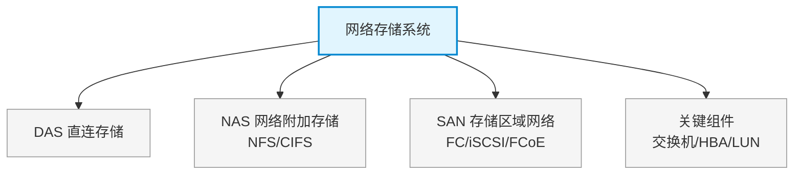

# 第十三章：网络存储系统

> 对应课件：`10-4 网络存储系统.pdf`
> 本章聚焦存储架构三大形态（DAS/NAS/SAN）及协议（FC-SAN/iSCSI/FCoE），是数据中心存储组网核心。
> ⚠️ 本文件为骨架占位，具体内容待对照 PDF OCR 逐节补充。

## 1. 核心考点脑图 (Mindmap)

---

## 2. 深度理论解析 (Theory & Concepts)

> 待补充：DAS/NAS/SAN 架构原理、三种 SAN 协议对比、FC 拓扑（点对点/仲裁环/交换式）、iSCSI 与 FCoE。

## 3. 横向对比与易错辨析 (Comparisons & Pitfalls)

> 待补充：DAS vs NAS vs SAN 对比表（协议/性能/共享/适用场景）、文件级 vs 块级访问辨析。

## 4. 历年真题与解析 (Exam Questions)

> 待补充：真实历年真题，标注出处年份。

## 5. 备考建议 (Exam Tips)

> 待补充：高频考点回顾、记忆口诀、易错提醒。
