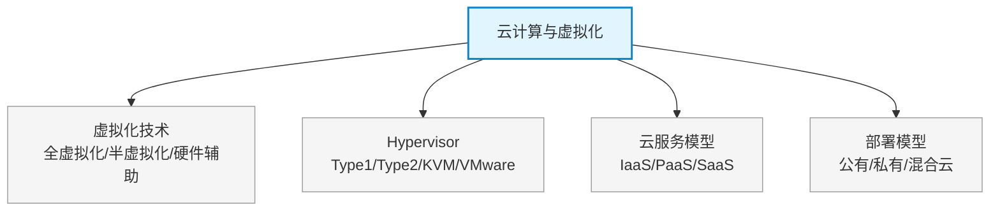

# 第十四章：云计算与虚拟化

> 对应课件：`10-5 云计算与虚拟化.pdf`
> 本章是云数据中心模块核心：虚拟化技术（Hypervisor/KVM/VMware）与云服务模型（IaaS/PaaS/SaaS）。
> ⚠️ 本文件为骨架占位，具体内容待对照 PDF OCR 逐节补充。

## 1. 核心考点脑图 (Mindmap)

---

## 2. 深度理论解析 (Theory & Concepts)

> 待补充：虚拟化原理与分类、CPU/内存/网络/存储虚拟化、云特征（弹性/按需自服务/广域接入/资源池/可计量）。

## 3. 横向对比与易错辨析 (Comparisons & Pitfalls)

> 待补充：Type1 vs Type2、IaaS/PaaS/SaaS 责任边界对比、公有/私有/混合云对比表。

## 4. 历年真题与解析 (Exam Questions)

> 待补充：真实历年真题，标注出处年份。

## 5. 备考建议 (Exam Tips)

> 待补充：高频考点回顾、记忆口诀、易错提醒。
