# 第十四章：云计算与虚拟化

> 对应课件：`10-5 云计算与虚拟化.pdf`（共 49 页）
> 本章是云数据中心模块**核心**：云计算概念与分类、云管平台/OpenStack、服务器虚拟化、桌面虚拟化、虚拟化高级应用（vMotion/DRS/HA/FT）。

## 1. 核心考点脑图 (Mindmap)

```mermaid
flowchart TD
    A["云计算与虚拟化"] --> B["云计算基础"]
    A --> C["云管平台/OpenStack"]
    A --> D["服务器虚拟化"]
    A --> E["桌面虚拟化"]
    A --> F["虚拟化高级应用"]

    B --> B1["服务类型<br>IaaS/PaaS/SaaS"]
    B --> B2["部署模型<br>公有/私有/行业/混合云"]

    C --> C1["云管平台消除虚拟化差异"]
    C --> C2["OpenStack组件<br>Nova/Neutron/Cinder/Glance..."]

    D --> D1["一物理机虚拟多VM"]
    D --> D2["平台:VMware/Xen/KVM"]

    E --> E1["重后端轻前端瘦客户机"]
    E --> E2["优势:安全/简化/降TCO"]

    F --> F1["vMotion热迁移"]
    F --> F2["DRS负载均衡"]
    F --> F3["HA高可用/FT容错"]
    F --> F4["Storage vMotion/DPM/SRM"]

    style A fill:#e1f5fe,stroke:#0288d1,stroke-width:2px
    style B fill:#ffebee,stroke:#c62828,stroke-width:2px
    style C fill:#fff3e0,stroke:#ef6c00,stroke-width:2px
    style D fill:#fff3e0,stroke:#ef6c00,stroke-width:2px
    style E fill:#fff3e0,stroke:#ef6c00,stroke-width:2px
    style F fill:#fff3e0,stroke:#ef6c00,stroke-width:2px
    style B1 fill:#f5f5f5,stroke:#9e9e9e
    style B2 fill:#f5f5f5,stroke:#9e9e9e
    style C1 fill:#f5f5f5,stroke:#9e9e9e
    style C2 fill:#f5f5f5,stroke:#9e9e9e
    style D1 fill:#f5f5f5,stroke:#9e9e9e
    style D2 fill:#f5f5f5,stroke:#9e9e9e
    style E1 fill:#f5f5f5,stroke:#9e9e9e
    style E2 fill:#f5f5f5,stroke:#9e9e9e
    style F1 fill:#f5f5f5,stroke:#9e9e9e
    style F2 fill:#f5f5f5,stroke:#9e9e9e
    style F3 fill:#f5f5f5,stroke:#9e9e9e
    style F4 fill:#f5f5f5,stroke:#9e9e9e
```

---

## 2. 深度理论解析 (Theory & Concepts)

### 2.1 云计算概念

**云计算**：把传统 IT 资源（服务器、存储、网络、安全等）整合为**资源池**，用户**按需购买服务**即可。

*   形象类比：用电不必自购发电机（用国家电网统一供电）、喝水不必自打井（自来水公司统一供水）→ 企业信息化不必自购设备，用云计算服务商提供的 IT 服务。

### 2.2 云计算分类 ⭐⭐ 高频考点

#### 按服务类型分（IaaS/PaaS/SaaS）

| 类型 | 全称 | 提供内容 | 案例 |
| :--- | :--- | :--- | :--- |
| **IaaS**（基础设施即服务） | Infrastructure as a Service | 计算、存储等**基础设施（硬件）** | 阿里云、腾讯云（云服务器、云存储） |
| **PaaS**（平台即服务） | Platform as a Service | 虚拟操作系统、数据库、Web 应用等**平台（操作系统）** | 百度 AI 开发平台、科大讯飞语音识别 |
| **SaaS**（软件即服务） | Software as a Service | 通过 Internet 向用户提供**软件服务**，采用 Web 技术和 SOA 架构 | ZOOM（视频会议账号）、Salesforce（CRM 账号） |

> **易错点**：IaaS=硬件、PaaS=操作系统/平台、SaaS=软件。三者从底层到上层，用户管理责任递减、服务商责任递增。

#### 按部署方式分（公有/私有/行业/混合云）

| 类型 | 说明 | 特点 |
| :--- | :--- | :--- |
| **公有云** | 公共云服务商提供（阿里云、腾讯云） | 价格低，但多人共享基础设施，隐私/安全有风险 |
| **私有云** | 企业自建自用，完全拥有设施 | 隐私性、安全性最好，但建设成本高 |
| **行业云** | 行业内主导组织建立维护（政务云、医疗云） | 比公有云贵，但隐私/安全/政策遵从更高 |
| **混合云** | 两种以上云组成，各自独立但用标准/专有技术组合 | 数据和应用可互通可移植；核心应用放私有云，对外服务放公有云，平衡安全与投资 |

> **易错点**：混合云核心是"**独立但可组合、可互通可移植**"；企业常把**核心应用放私有云、对外服务放公有云**以平衡安全与投资。

### 2.3 云管平台与 OpenStack ⭐

#### 云管平台

*   **目标**：消除虚拟化系统的差异性，实现统一调度、管理、安全和自动化服务。
*   虚拟化的目标：消除基础设施的差异性（服务器/存储/网络虚拟化）。
*   云管平台（OpenStack）= 云操作系统 + 计算 + 存储 + 网络资源统一管理。
*   业内云管平台（华为 FusionSphere、H3C H3CloudOS、浪潮云海 OS、锐捷 JCOS）基本都基于 **OpenStack** 开发。

#### OpenStack 核心组件 ⭐ 高频考点

| 组件 | 项目名 | 功能 |
| :--- | :--- | :--- |
| **Dashboard** | Horizon | 基于 Web 的**自助服务接口**（生成实例、分配 IP、配置接入控制） |
| **Compute** | **Nova** | 管理计算实例生命周期，按需生成、调度、停止**虚拟机** |
| **Networking** | **Neutron** | 提供**网络连接**服务，支持多网络设备商 |
| **Object Storage** | **Swift** | 通过 RESTful/HTTP API 存储检索非结构化数据对象（高容错，非文件系统） |
| **Block Storage** | **Cinder** | 提供永久**块存储**给运行中实例 |
| **Identity** | **Keystone** | 给其它服务提供**认证和授权** |
| **Image Service** | **Glance** | 存储**虚拟机磁盘镜像**，生成实例时调用 |
| **Telemetry** | **Ceilometer** | 监控和**计量**云使用情况（计费、配额、统计） |
| **Orchestration** | **Heat** | 通过 HOT/AWS CloudFormation 模板**编排部署**多组件云应用 |
| **Database** | **Trove** | 提供 DBaaS（数据库即服务） |

> **易错点记忆**：Nova=计算、Neutron=网络、Cinder=块存储、Swift=对象存储、Glance=镜像、Keystone=认证、Horizon=界面、Ceilometer=计量、Heat=编排。

---

### 2.4 云计算核心技术

云计算核心技术有：**虚拟化**、数据存储技术（海量/结构化）、任务和资源管理技术，其中**最核心的是虚拟化技术**。

虚拟化技术分类：**服务器虚拟化、桌面虚拟化、存储虚拟化、网络虚拟化**，重点掌握**服务器虚拟化和桌面虚拟化**。

#### 数据中心现状（虚拟化动因）

*   **9-9-1 规律**：90% 服务器 CPU 占用率低于 10%，90% 时间空闲，资源利用率极低。
*   双机/多机热备等冗余措施进一步浪费资源。
*   数据中心能耗：IT 设备耗能仅占 30%，70% 用于制冷散热加湿。

### 2.5 服务器虚拟化 ⭐

在物理服务器运行虚拟化软件，将一台物理服务器虚拟成多台虚拟机（一虚多）。

**优势**：
1.  提高服务器资源利用率。
2.  减少物理服务器采购数量，节省成本。
3.  节省服务器机房空间。
4.  降低能源消耗，提高数据中心能耗效率。
5.  虚拟机灵活迁移，降低服务器宕机风险。
6.  提高灵活性，内存/硬盘按需扩展。
7.  加快业务部署速度，缩短上线时间。

#### 主流服务器虚拟化平台

| 平台 | 说明 |
| :--- | :--- |
| VMware ESXi | 商业主流 |
| Citrix Xen | 华为早期基于 Xen |
| Microsoft Hyper-V | 微软 |
| **开源 KVM**（H3C CAS） | 华为后转移至 KVM；深信服、锐捷等均基于 KVM |

> **易错点**：华为虚拟化早期基于 **Xen**，后转移至 **KVM**；深信服、锐捷等国产厂商均基于 **KVM** 开发。

### 2.6 桌面虚拟化（云桌面） ⭐

桌面虚拟化也叫**云桌面**，主要用于替代传统 PC 办公。

*   **架构**：采用"**重后端轻前端**"——后端负责数据处理、存储、策略管理；前端（瘦客户机）只负责简单输入和显示。
*   **组成**：服务器、服务器虚拟化、存储系统、桌面虚拟化软件，将 VM 推送给用户，前端瘦客户机接收。

#### 优势

1.  **数据安全高**：数据存后端服务器（RAID/多副本冗余），可管控外设防非法拷贝。
2.  **简化管理**：操作系统和软件后端统一安装分发，故障一键重置。
3.  **降低 TCO**：瘦客户机功耗低、绿色节能，运维运行成本低。
4.  **支持移动办公**：手机/PAD 远程接入云桌面。

#### 劣势

1.  高度依赖网络，断网或拥塞则无法工作。
2.  整体性能偏弱，对视频/游戏支持欠佳。
3.  部分外设不兼容。
4.  建设成本相对较高。

> **易错点**：云桌面"**重后端轻前端**"，数据不落地（存后端）保安全，但**断网不可用**、性能/兼容性弱于物理机。

---

### 2.7 虚拟化高级应用（VMware）⭐⭐ 高频考点

#### vMotion 虚拟机动态迁移（热迁移）

*   将工作负载从一台服务器**实时迁移**到另一台服务器**无需停机**，保持系统访问连续性。
*   **计划内迁移**：手动/半自动/自动（结合 DRS），无缝迁移。
*   **原理**：将 VM 从一台物理服务器搬到另一台（**内存拷贝**）。

**vMotion 前提条件** ⭐：
1.  **大二层网络**（IP + MAC + VLAN 保持不变）。
2.  虚拟机必须**共享存储**（只拷贝活动内存和执行状态）。
3.  **CPU 类型一致**（不能一个 Intel 一个 AMD；同 Intel 不同型号可以）。
4.  需要 license 支持。

#### DRS 分布式资源调度

*   DRS 集群是一组 ESXi 服务器和相关联虚拟机的集合，由 vCenter 管理。
*   跨资源池**动态调整计算资源**，基于预定义规则智能分配。
*   能够动态在服务器上**平衡虚拟机负载**，执行资源策略（reservations/limits/shares）。
*   兼容 vMotion。

#### HA 高可用性（计划外保护）

*   **VMware HA**：服务器故障时在其它物理服务器上**自动重启虚拟机**。
*   保证整体停机时间不超过 **5~10 分钟**（需要 VM 重启）。
*   优势：对所有应用实现高可用且成本低；不需要完全一致的重复硬件；比传统集群成本更低、易用。

#### FT 容错（计划外保护，HA 强化）

*   在不同主机上**同步运行相同的虚拟机**。
*   出现硬件故障时实现**零停机、零数据损失**故障切换（VM 不用重启，直接在其它 HOST 运行）。

#### vMotion / HA / FT 对比 ⭐⭐

| 特性 | vMotion | HA | FT |
| :--- | :--- | :--- | :--- |
| 类型 | **计划内**迁移 | **计划外**宕机保护 | **计划外**宕机保护（HA 强化） |
| 触发 | 手动/半自动/自动 | 主机异常宕机 | 硬件故障 |
| 是否停机 | 不停机无缝迁移 | 需 VM **重启**，停机 5~10 分钟 | **零停机**、零数据损失，不重启 |
| 数据损失 | 无 | 有（需重启） | 无 |

> **易错点**：vMotion 是**计划内**热迁移；HA 是**计划外**保护但需重启（停机 5~10 分钟）；FT 是 HA 强化，**零停机零数据损失**不重启。

#### 其他高级应用

| 特性 | 功能 |
| :--- | :--- |
| **Storage vMotion** | Datastore 从一台存储设备**在线迁移**到另一台（存储迁移） |
| **DPM** 分布式电源管理 | 业务需求少时整合负载到更少服务器，将空闲服务器**待机**；需求增加时恢复，保证服务级别同时省电，VM 不中断 |
| **SRM** 站点容灾管理 | 生产中心与灾备中心间，存储阵列复制实现数据同步；RPO<10min（可达秒级），RTO 分钟级；国家标准 5 级 |
| **VAAI** 硬件加速 | 数据直接在存储内部传输，不经前端接口链路，性能提高 20 倍，无需虚拟机参与 |

#### 服务器集群与虚拟化环境共性 ⭐

> 服务器集群、虚拟化环境一般都需要：**共享存储** + **大二层网络**环境。

---

## 3. 横向对比与易错辨析 (Comparisons & Pitfalls)

### 3.1 业务连续性 vs 可用性（案例高频）

| 维度 | 业务连续性 | 可用性 |
| :--- | :--- | :--- |
| 定义 | 灾难/破坏性事件后，业务以可接受预定义级别**继续服务**的能力 | 服务在需要时执行约定功能的能力 |
| 关键因素 | **RTO**（服务恢复时间）+ **RPO**（数据恢复时间） | **MTBF**（平均故障间隔）+ **MTRS**（平均恢复时间） |
| 公式 | — | (约定服务时间 − 停机时间) / 约定服务时间 |

> **易错点**：业务连续性看 **RTO/RPO**；可用性看 **MTBF/MTRS**。服务器虚拟化故障迁移保障的是**业务连续性**（C），不是可用性。

### 3.2 备份方式对比（案例高频）

| 备份方式 | 优点 | 缺点 |
| :--- | :--- | :--- |
| **Host-Based** | 数据传输快、备份管理简单 | 不利于共享，不适合大量数据 |
| **LAN-Based** | 节省投资、磁带库共享、集中管理 | 对网络传输压力大 |
| **LAN-Free** | 统一管理、备份快、网络压力小、磁带库共享 | CPU 占用多、成本较高 |
| **Server-Free** | 短时间备大量数据、服务器资源占用最少 | **成本最高** |

> **易错点**：LAN-Free 和 Server-Free 基于 **SAN**，彻底解决传统备份占用 LAN 带宽问题。Server-Free 资源占用最少但成本最高。

### 3.3 高频易错点速记

> **易错点 1**：IaaS=硬件、PaaS=平台/OS、SaaS=软件；混合云"独立但可组合可互通"。
>
> **易错点 2**：OpenStack 组件——Nova 计算、Neutron 网络、Cinder 块存储、Swift 对象存储、Glance 镜像、Keystone 认证、Ceilometer 计量、Heat 编排、Horizon 界面。
>
> **易错点 3**：华为虚拟化 Xen→KVM；深信服/锐捷基于 KVM。
>
> **易错点 4**：云桌面"重后端轻前端"，数据不落地保安全，但断网不可用。
>
> **易错点 5**：vMotion 计划内热迁移（需大二层+共享存储+CPU一致）；HA 计划外需重启（5~10分钟）；FT 计划外零停机零损失。
>
> **易错点 6**：业务连续性看 RTO/RPO；可用性看 MTBF/MTRS。
>
> **易错点 7**：虚拟化/集群环境需**共享存储 + 大二层网络**。
>
> **易错点 8**：备份四方式——Host/LAN-Based/LAN-Free/Server-Free；后两者基于 SAN；Server-Free 占用最少但最贵。

---

## 4. 历年真题与解析 (Exam Questions)

### 4.1 网工 2022年5月 第8题 ⭐

**题目**：以下关于云计算的叙述中，不正确的是（8）。
A. 云计算将所有客户的计算都集中在一台大型计算机上进行
B. 云计算是基于互联网的相关服务的增加、使用和交付模式
C. 云计算支持用户在任意位置使用各种终端获取相应服务
D. 云计算的基础是面向服务的架构和虚拟化的系统部署

**【参考答案】A**

**【解析】**：云计算把所有用户计算集中到云数据中心的**海量服务器**上，而不是一台大型计算机。大型机/小型机在金融、公安等领域应用，目前已很少。B、C、D 描述正确。

### 4.2 网规 2015年11月 第53-54题 ⭐⭐（虚拟化与连续性）

**背景**：某高校构建财务系统，方案一传统部署+备份；方案二采用服务器虚拟化，故障时业务迁移到另一台物理服务器。

**（53）** 与方案一相比，方案二的优点是？
A. 网络安全性　B. 数据安全性　C. 业务连续性　D. 业务可用性

**【参考答案】C**

**【解析】**：方案二采用服务器虚拟化，物理服务器故障时业务迁移到另一台，保障了**业务连续性**。网络的/数据的安全性、业务可用性都未发生实质变化。

> **考点关联**：业务连续性 = 灾难后以可接受级别继续服务，取决于 **RTO/RPO**；可用性 = (服务时间−停机时间)/服务时间，取决于 MTBF/MTRS。虚拟化故障迁移保的是连续性。

**（54）** 下列不属于方案二缺点的是？
A. 缺少安全审计　B. 缺少网闸不能物理隔离　C. 缺少安全审计不便于记录分析　D. 缺少内部财务用户接口

**【参考答案】B**

**【解析】**：若增加网闸进行物理隔离，不能实现用户通过校园网访问财务系统；可部署防火墙实现**逻辑隔离**，既保证安全又能业务访问。故"缺少网闸"不属于缺点。

### 4.3 网规 2016年11月 试题二（25分）⭐⭐（虚拟化综合案例）

**背景**：4 台服务器（4CPU/256G/千兆网卡）使用率低，拟采用裸金属架构整合为虚拟资源池。业务存储 50TB（10TB OS、20TB Oracle、20TB 业务数据）。

**【问题1】** 业务存储系统和备份存储如何选择磁盘类型？如何进一步提升存储性能？

**【参考答案】**：
*   **SAS 盘**：企业级，高吞吐、低延迟、高可靠，满足企业级高可靠应用。
*   **SATA 盘**：面向普通用户，费用低廉、容量大，适合桌面/小企业存储及**数据备份**。
*   业务存储系统建议 **SAS 盘**，备份存储建议 **SATA 盘**。
*   提升性能措施：采用更高转速磁盘、增加磁盘数量、使用 SSD、配置 RAID、增加缓存等。

**【问题2】** 虚拟化方式（一虚多/多虚多）选哪种？

**【参考答案】**：采用**多虚多**——将多台服务器资源整合为一个资源池，再虚拟成多台虚拟机，提升资源利用效率。

**【问题3】** 业务存储和 OS/数据库分别采用什么存储方式？服务器本地磁盘存什么？

**【参考答案】**：
*   业务系统对 I/O 要求低 → **IP-SAN** 存储。
*   操作系统与数据库对 I/O 要求高、可靠性高 → **FC-SAN** 存储。
*   服务器本地磁盘存储**虚拟化管理系统与虚拟化底层软件及相关日志**。

**【问题4】** 备份方式（Host-Based/LAN-Based/LAN-Free/Server-Free）如何选择？

**【参考答案】**：建议采用 **Server-Free**——能在短时间备份大量数据，对服务器资源占用最少（缺点是成本最高）。LAN-Free/Server-Free 基于 SAN，彻底解决传统备份占用 LAN 带宽问题。

**【问题5】** 虚拟化后每台宿主机承载 VM 增多，带来什么问题？如何解决？

**【参考答案】**：服务器资源利用率过高影响整体性能和业务。解决：按服务类型限制每台服务器资源，重要服务优先占用；设置 **DRS** 让 VM 在不同服务器负载均衡；流量增加时升级万兆网卡和线路。

### 4.4 网规 2017年11月 案例二（25分）⭐⭐（桌面虚拟化案例）

**背景**：某企业桌面虚拟化网络拓扑，①~④ 处部署设备，含计算资源池、存储资源池。

**【问题1】**（6分）①~④ 分别部署什么？（备选：存储系统/网络交换机/服务器/光纤交换机）

**【参考答案】**：(1)B 网络交换机 (2)C 服务器 (3)D 光纤交换机 (4)A 存储系统

**【问题3】** 存储网络方式？磁盘如何选择？

**【参考答案】**：**FC-SAN**（光纤存储区域网络）。系统盘建议 **SSD**（性能强、成本较高）；数据盘建议 **SATA**（空间大、成本低，配合 RAID 保障冗余）。

**【问题4】** 桌面虚拟化相对物理终端的优缺点？

**【参考答案】**：
*   优势：简化终端管理和维护、提升运维效率；数据不落地保障安全；支持老旧软件安装使用。
*   不足：初期采购成本高；虚拟桌面性能和兼容性不如物理桌面；断网不可用。

**【问题5】** 虚拟化带来的问题（多选）及解决（多选）？

**【参考答案】**：(5) A、B、C（虚拟机相互攻击、防病毒扫描风暴、网络带宽瓶颈）；(6) A、D、C（安装虚拟化防护系统、提高服务器配置、提升网络带宽）。

---

## 5. 备考建议 (Exam Tips)

### 高频考点回顾

1.  **云计算定义**：IT 资源整合为资源池，按需购买服务；基础是 SOA + 虚拟化。
2.  **服务类型**：IaaS（硬件）/PaaS（OS 平台）/SaaS（软件）。
3.  **部署模型**：公有云（便宜共享）、私有云（安全贵）、行业云（政务/医疗）、混合云（独立可组合，核心私有+对外公有）。
4.  **OpenStack 组件**：Nova 计算、Neutron 网络、Cinder 块存储、Swift 对象存储、Glance 镜像、Keystone 认证、Ceilometer 计量、Heat 编排、Horizon 界面、Trove 数据库。
5.  **服务器虚拟化**：一物理机多 VM，提利用率降成本；平台 VMware/Xen/KVM（华为 Xen→KVM）。
6.  **桌面虚拟化**：重后端轻前端、瘦客户机、数据不落地保安全、断网不可用。
7.  **vMotion/HA/FT**：vMotion 计划内热迁移（大二层+共享存储+CPU一致）；HA 计划外需重启 5~10 分钟；FT 计划外零停机零损失。
8.  **业务连续性 vs 可用性**：连续性 RTO/RPO，可用性 MTBF/MTRS。
9.  **备份四方式**：Host-Based/LAN-Based/LAN-Free/Server-Free；后两者基于 SAN，Server-Free 占用最少最贵。
10. **虚拟化/集群共性**：需共享存储 + 大二层网络。
11. **SRM 容灾**：RPO<10min（秒级）、RTO 分钟级、国家标准 5 级。

### 记忆口诀

*   **云服务三层**："IaaS 硬件 PaaS 平台 SaaS 软件，责任从下到上用户递减"
*   **OpenStack**："Nova 算 Neutron 网 Cinder 块 Swift 对象 Glance 像 Keystone 认 Ceilometer 量 Heat 编排 Horizon 面"
*   **VMware 三剑客**："vMotion 计划内热迁移，HA 计划外要重启，FT 计划外零停机"
*   **连续性 vs 可用性**："连续看 RTO/RPO，可用看 MTBF/MTRS"
*   **vMotion 三前提**："大二网络共存储，CPU 同家方能迁"
*   **备份**："Host 快不共享，LAN 共享压网络，SAN 上两兄弟，Server-Free 最省最贵"
