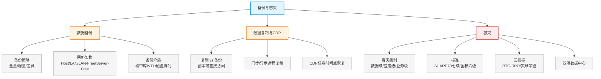

# 第十五章：备份与容灾

> 对应课件：`10-6 备份与容灾.pdf`（共 35 页）
> 本章聚焦数据保护：备份策略（全量/增量/差异）、备份网络架构、数据复制/CDP、容灾等级与 RPO/RTO、双活数据中心。

## 1. 核心考点脑图 (Mindmap)

---

## 2. 深度理论解析 (Theory & Concepts)

### 2.1 数据备份基础

**数据备份**（Backup）：利用备份软件（Veritas NetBackup、EMC Networker、CA BrightStor 等）把数据从磁盘备份到磁带进行**离线保存**。

*   备份数据格式为**磁带格式**，不能被数据处理系统直接访问，需备份软件恢复成可用数据。
*   最新技术支持**磁盘到磁盘（D2D）**备份，加快备份和恢复速度。

#### 备份系统组成

| 组成 | 说明 |
| :--- | :--- |
| **备份软件** | 完成备份策略制定、备份介质管理及扩展功能 |
| **备份介质** | 磁带库、磁盘阵列、虚拟磁带库、光盘库/光盘塔 |
| **备份服务器** | 运行备份软件，按预定策略将数据备份到介质 |

#### 备份原则

稳定性、高性能、全面性、操作简单、自动化。

### 2.2 备份网络架构 ⭐⭐ 高频考点

四种常见数据备份网络架构：

| 架构 | 原理 | 优点 | 缺点 |
| :--- | :--- | :--- | :--- |
| **Host-Based** | 磁带库直接连服务器，只为单台服务器备份 | 数据传输快、备份管理简单 | 不利于共享，不能满足大型备份 |
| **LAN-Based** | 以网络为基础，备份服务器负责整个系统备份，数据经网络传到磁带库 | 节省投资、磁带库共享、集中管理 | **网络传输压力大** |
| **LAN-Free** | 磁带库和磁盘阵列作为独立光纤节点，数据流不经过业务网络直接从磁盘阵列传到磁带库 | 统一管理、备份快、网络压力小、磁带库共享 | 投资高 |
| **Server-Free** | 在 **SAN 交换层**实现数据复制，数据不经业务网络也不经应用服务器 | 短时间备大量数据、服务器资源占用最少 | **成本最高** |

> **易错点**：
> *   LAN-Based 数据走**业务网络**（压力大）；LAN-Free/Server-Free 基于 **SAN**，数据不经业务网络（LAN-Free 解决占用 LAN 带宽问题）。
> *   Server-Free 在 **SAN 交换层**复制，连应用服务器都不经过，资源占用最少但最贵。
> *   选用顺序（按需求）：小量快→Host；共享集中→LAN-Based；不占网络→LAN-Free；不占服务器→Server-Free。

### 2.3 备份介质对比 ⭐

| 特性 | 物理磁带库 | VTL（虚拟带库） | 磁盘阵列 |
| :--- | :--- | :--- | :--- |
| **存储介质** | 磁带（LTO/SDLT/AIT） | 硬盘（SSD/SAS/SATA） | 硬盘（SSD/SAS/SATA） |
| **IO 速度** | 标称 140MB/s | 实测数百 MB/s | 实测数百 MB/s |
| **介质移动** | 可移动 | 物理磁盘不建议移动 | 可导出到物理磁带 |
| **可维护性** | 低，需专业人员 | 高，一般 IT 人员 | 高，一般 IT 人员 |
| **环境影响** | 受湿度/粉尘影响**大** | 影响小 | 影响小 |
| **部件故障率** | 机械部件，故障率**高** | 封闭精密，故障率低，支持 RAID | 封闭精密，故障率低，支持 RAID |
| **备份类型** | **离线存储** | 近线存储 | 近线/在线存储 |

### 2.4 数据备份策略 ⭐⭐ 高频考点

#### 三种备份类型

| 类型 | 含义 | 备份量 | 恢复速度 |
| :--- | :--- | :--- | :--- |
| **完全备份**（Full） | 备份系统中**所有数据** | 最大、最慢 | **最快** |
| **差量备份/差分备份**（Differential） | 备份**上一次完全备份后**有变化的数据 | 中 | 中 |
| **增量备份**（Incremental） | 备份**上一次备份后**（无论完全还是增量）有变化的数据 | 最小 | 最慢 |

> **⭐ 易错点（高频）**：
> *   **差分备份** = 上次**完全备份**后的变化（基准固定为最近一次全备份）。
> *   **增量备份** = 上次**任意备份**后的变化（基准是最近一次备份，无论全/增量）。
> *   完全备份数据量最大、备份最慢、但**恢复最快**；增量备份量最小、但恢复需逐次叠加最慢。

#### 备份策略要素

*   **数据类型**：文件、操作系统、数据库；裸设备备份、备份软件日志。
*   **备份介质**：磁盘、磁带、备份服务器。
*   **数据保留时间**：一周/一个月/一年。
*   **备份周期**：每天/每周备份。
*   **备份窗口**（Backup Window）：一个工作周期内留给备份系统进行备份的时间长度。

#### 典型备份组合

*   每天全备份
*   每周一天全备份 + 本周其余每天增量备份
*   每周一天全备份 + 本周其余每天差分备份

---

### 2.5 数据复制技术 ⭐

**数据复制**（Replication）：利用复制软件（EMC SRDF、H3C 同步/异步镜像等）把数据从一个磁盘复制到另一个磁盘，生成数据副本。

| 对比 | 数据备份 | 数据复制 |
| :--- | :--- | :--- |
| 介质 | 磁盘→磁带（离线） | 磁盘→磁盘 |
| 副本可访问性 | 需**恢复**才能访问 | **直接可访问**，无需恢复 |
| 这是两者**最大区别** | — | — |

> **易错点**：复制与备份最大区别——复制副本**可直接访问**，备份副本**需恢复**才能用。

#### 远程复制（远程镜像）

在两个或多个站点维护数据副本，利用长距离避免灾难时数据丢失。分两种：

| 类型 | 说明 | 适用 |
| :--- | :--- | :--- |
| **同步远程复制** | 写入主阵列后，向灾备中心发写入请求，灾备返回"完成"信号后才算完成 | 同城灾备（数据零丢失） |
| **异步远程复制** | 写入主阵列即返回，灾备异步完成 | 异地灾备（允许少量数据丢失） |

#### 远程复制按执行实体分

| 类型 | 说明 | 产品 |
| :--- | :--- | :--- |
| **基于主机** | 主机软件实施复制，**消耗 CPU** | Veritas VVR、HP OpenView SM |
| **基于存储设备** | 存储阵列执行复制 | EMC SRDF |
| **基于虚拟化存储管理平台** | 存储虚拟化平台执行 | 飞康 IPStor 同/异步镜像 |

### 2.6 持续数据保护 CDP ⭐

**持续数据保护**（CDP）跟踪数据变化，独立存放在生产数据之外，确保数据可**恢复到过去任意时间点**。

*   可基于**块、文件或应用**实现，提供足够细的恢复粒度，实现几乎无限多的恢复时间点。
*   业务系统的"实时"备份，对生产业务无影响，保证数据持续一致性。

#### 各技术恢复时间点对比 ⭐

| 技术 | 恢复时间点 |
| :--- | :--- |
| 传统备份 | N 天（每 24 小时恢复一次） |
| 快照技术 | 4-6 小时（每 3 小时恢复一次） |
| 复制技术 | 最后同步 |
| **CDP** | **任意时间点** |

> **易错点**：CDP 可恢复到**任意时间点**，是恢复粒度最细的技术；传统备份最粗（N 天）。

---

### 2.7 容灾

#### 灾难定义

《重要信息系统灾难恢复规划指南》：灾难是人为或自然原因造成信息系统严重故障或瘫痪，使业务功能停顿或服务水平不可接受，通常需切换到备用场地运行。

*   关键数据若 10 天内无法恢复，**50% 企业将倒闭**（德州大学：立即倒闭 34%、两年内倒闭 51%、幸存 6%）。

#### 容灾级别 ⭐

| 级别 | 说明 |
| :--- | :--- |
| **数据级容灾** | 建立异地数据系统复制本地关键数据；灾难时通过异地数据恢复 |
| **应用级容灾** | 异地建立完整、与本地相当的应用系统（AP/AA 模式）；需以数据容灾为基础，远程应用可承担业务 |
| **业务级容灾** | 含非 IT 系统：办公地点、人员、设施等（如医院断网、地震案例） |

#### 容灾国际标准 SHARE78 七级 ⭐

| 级别 | 说明 | RTO |
| :--- | :--- | :--- |
| Tier 1 | 卡车运送（仓库） | Weeks |
| Tier 2 | 卡车运送 + 热备站点 | Days |
| Tier 3 | 电子链接传输 | 24Hr |
| Tier 4 | 活动状态的备份中心（主备数据中心） | 8~12Hr |
| Tier 5 | 主备中心数据高度同步 | 4~8Hr |
| Tier 6 | 数据 0 丢失 | 1~4Hr |
| Tier 7 | 数据 0 丢失（RPO=0），自动系统故障切换 | 15Min |

> **易错点**：数据备份常应用 Tier1-Tier4，数据容灾常应用 Tier4-Tier7。Tier7 是最高级（RPO=0 + 自动故障切换）。

#### 容灾国内标准 六级（GB/T 20988）⭐⭐ 高频考点

| 等级 | RTO | RPO |
| :--- | :--- | :--- |
| 1 | 2 天以上 | 1 天到 7 天 |
| 2 | 24 小时以上 | 1 天到 7 天 |
| 3 | 12 小时以上 | 数小时到 1 天 |
| 4 | 数小时到 2 天 | 数小时到 1 天 |
| 5 | 数分钟到 2 天 | 0 到 30 分钟 |
| 6 | 数分钟 | 0（数据零丢失） |

> **易错点**：国标 6 级——等级 6 RPO=0（数据零丢失）+ 远程集群支持；等级越高 RTO/RPO 越小。

### 2.8 容灾三指标 ⭐⭐ 高频考点

| 指标 | 全称 | 含义 |
| :--- | :--- | :--- |
| **RTO** | Recovery Time Objective（恢复时间目标） | 灾难发生后到业务恢复所需时间；含数据恢复、系统切换、网络切换；衡量**业务恢复能力** |
| **RPO** | Recovery Point Objective（恢复点目标） | 业务系统允许的灾难过程中**最大数据丢失量**（以时间度量）；与备份技术相关；衡量**数据冗余备份能力** |
| **灾难半径** | — | 生产中心与灾备中心直线距离；衡量防御灾难影响范围 |

#### 灾难半径距离

*   **同城灾备**：100km 以内，一般 **40km 最佳**
*   **异地灾备**：一般 100km~400km

> **⭐ 易错点**：
> *   **RTO = 停机时间**（恢复业务的时间，越小越好）。
> *   **RPO = 数据丢失量**（以时间度量，越小越好，RPO=0 表示零丢失）。
> *   双活数据中心 RTO 和 RPO **都接近 0**。
> *   同城灾备最佳距离 **40km**。

### 2.9 容灾与备份的区别 ⭐

| 对比 | 备份 | 容灾 |
| :--- | :--- | :--- |
| 目的 | 将数据复制到其它存储介质 | 尽量减少/避免灾难造成的损失 |
| 关系 | 容灾的**基础** | 不仅是备份 |
| 能力 | 冷备份，有先天不足 | 灾难发生时全面及时恢复整个系统 |
| 本质 | 技术 | **工程**（承担核心业务，含技术+管理+流程） |

> **易错点**：备份是容灾的**基础**，但容灾≠备份；容灾是**工程**而非单纯技术。

### 2.10 双活数据中心 ⭐

传统主备模式存在资源利用低、可用性差、停机长、恢复慢等问题；双活数据中心解决这些弊端。

*   **双活架构分三层**：主机层、网络层、存储层。
*   分布于不同数据中心的存储系统**均处于工作状态**，两套存储承载相同前端业务，互为热备，同时承担生产和灾备服务。
*   **存储双活**通过**虚拟卷镜像**与**节点分离**两个核心功能实现。
*   双活需在存储、网络、数据库、服务器、应用等**各层面**实现双活，RTO 和 RPO **都趋于 0**。

#### 容灾技术方案分层

| 层次 | 技术 |
| :--- | :--- |
| **基于主机层** | 数据库复制、文件系统复制 |
| **基于 SAN 网络层** | VIS 镜像 |
| **基于阵列层** | HyperMirror/S 等 |

---

## 3. 横向对比与易错辨析 (Comparisons & Pitfalls)

### 3.1 备份类型对比

| 维度 | 完全备份 | 差分备份 | 增量备份 |
| :--- | :--- | :--- | :--- |
| 备份基准 | 全部数据 | 上次**完全**备份后 | 上次**任意**备份后 |
| 备份量 | 最大 | 中 | 最小 |
| 备份速度 | 最慢 | 中 | 最快 |
| 恢复速度 | **最快** | 中 | **最慢**（需逐次叠加） |
| 恢复复杂度 | 最简单 | 中 | 最复杂 |

### 3.2 高频易错点速记

> **易错点 1**：差分 = 上次**完全**备份后变化；增量 = 上次**任意**备份后变化。完全备份恢复**最快**。
>
> **易错点 2**：备份网络架构——LAN-Based 占网络带宽；LAN-Free 基于 SAN 不占网络；Server-Free 在 SAN 交换层复制不占服务器，资源最少最贵。
>
> **易错点 3**：物理磁带库 = **离线存储**，故障率高、受环境影响大，但成本低、寿命长。
>
> **易错点 4**：复制 vs 备份——复制副本**可直接访问**，备份需**恢复**。
>
> **易错点 5**：CDP 恢复到**任意时间点**（最细粒度）；传统备份 N 天、快照 4-6 小时、复制最后同步。
>
> **易错点 6**：RTO=停机时间（业务恢复），RPO=数据丢失量；双活 RTO/RPO 都接近 0。
>
> **易错点 7**：同城灾备最佳 **40km**，异地 100-400km。
>
> **易错点 8**：国标 6 级——等级 6 RPO=0 数据零丢失；SHARE78 Tier7 最高（RPO=0+自动切换）。
>
> **易错点 9**：备份是容灾**基础**，容灾是**工程**非单纯技术。
>
> **易错点 10**：双活存储层 = 负载均衡与故障接管 + 两个存储引擎同时工作瞬时切换。

---

## 4. 历年真题与解析 (Exam Questions)

### 4.1 网规 2015年11月 第48题 ⭐⭐（备份类型辨析）

**题目**：以下关于数据备份策略的说法中，错误的是（48）。
A. 完全备份是备份系统中所有的数据
B. 增量备份是备份上一次完全备份后有变化的数据
C. 差分备份指备份上一次完全备份后有变化的数据
D. 完全、增量和差分三种备份方式通常结合使用，以发挥出最佳的效果

**【参考答案】B**

**【解析】**：**差分备份**是备份上一次**完全备份**后有变化的数据（C 正确）。**增量备份**是备份上一次**任意备份**（含增量）后有变化的数据，而非仅"完全备份后"，故 B 错误。

> **考点关联**：差分基准 = 最近一次完全备份；增量基准 = 最近一次任意备份。这是最常考的辨析点。

### 4.2 网规 2021年11月 第49题 ⭐（备份策略选择）

**题目**：某公司要求数据备份周期为 7 天，考虑到数据恢复的时间效率，需采用（49）备份策略。
A. 定期完全备份
B. 定期完全备份 + 每日增量备份
C. 定期完全备份 + 每日差异备份
D. 定期完全备份 + 每日交替增量备份和差异备份

**【参考答案】A**

**【解析】**：完全备份备份的数据量最大、备份速度最慢，但**恢复速度最快**。题目强调"数据恢复的时间效率"，故选定期完全备份。若考虑备份效率则选增量/差分组合，但此处优先恢复效率 → A。

> **考点关联**：恢复速度优先 → 完全备份（恢复最快）；备份量优先 → 增量备份（量最小）。

### 4.3 网规 2016年11月 第48-50题 ⭐⭐（双活数据中心案例）

**背景**：传统主备模式资源利用率低、可用性差、停机长、恢复慢；双活数据中心成趋势。某双活方案分主机层、网络层、存储层。

**（48）** 对双活数据中心技术叙述错误的是？
A. 不同数据中心存储均处于工作状态，互为热备同时承担生产和灾备
B. 存储双活通过虚拟卷镜像与节点分离两个核心功能实现
C. 双活需在存储、网络、数据库、服务器、应用各层面实现双活
D. RTO 和 RPO（...恢复业务的最长时间）均趋于 1

**【参考答案】D**

**【解析】**：双活数据中心 RTO 和 RPO **都接近 0**（不是趋于 1）。RTO = 灾难发生后到业务恢复所需时间；RPO = 灾难发生后到业务恢复中间丢失的数据量。A、B、C 描述正确。

**（49）** 双活数据中心存储层需实现的功能是？
A. 负载均衡与故障接管　B. 多台设备构建冗余网络　C. 借助第三方软件（VVR/Oracle Data Guard）　D. 两个存储引擎同时工作，故障瞬间切换

**【参考答案】D**

**【解析】**：双活数据中心存储必须保证快速切换，两个存储引擎同时处于工作状态，出现故障瞬间切换 → D。C 是基于应用/主机卷管理借助第三方软件，非存储层双活。

**（50）** 双活数据中心网络规划时，SAN 网络包含？
A. 数据库服务器到存储阵列网络、存储阵列间双活复制网络、光纤交换机规划
B. 存储仲裁网络、存储阵列间双活复制网络、光纤交换机规划
C. 存储阵列间双活复制网络、光纤交换机、数据库私有网络规划
D. 存储阵列间双活复制网络、核心交换机、接入交换机规划

**【参考答案】A**

**【解析】**：SAN 网络包含**服务器到存储、存储之间、FC 交换机**的网络 → A。B 的存储仲裁网络、C 的数据库私有网络、D 的核心/接入交换机**都不是 SAN 网络**。

> **考点关联**：SAN 网络 = 服务器↔存储 + 存储间复制 + FC 交换机。仲裁网络、数据库私有网络、以太网核心/接入交换机不属于 SAN。

---

## 5. 备考建议 (Exam Tips)

### 高频考点回顾

1.  **备份系统组成**：备份软件 + 备份介质 + 备份服务器。
2.  **四种备份架构**：Host-Based（快不共享）、LAN-Based（共享占网络）、LAN-Free（SAN 不占网络）、Server-Free（SAN 交换层不占服务器，最贵）。
3.  **备份介质对比**：物理磁带库（离线/故障率高/成本低寿命长）vs VTL（近线）vs 磁盘阵列（近线在线/快/支持 RAID）。
4.  **备份类型**：完全（量大恢复快）、差分（上次完全后）、增量（上次任意后，量小恢复慢）。
5.  **复制 vs 备份**：复制副本可直接访问，备份需恢复。
6.  **远程复制**：同步（同城零丢失）、异步（异地可丢少量）；按实体分主机（耗CPU）/存储设备/虚拟化平台。
7.  **CDP**：恢复任意时间点（最细粒度）；传统备份 N 天、快照 4-6 小时、复制最后同步。
8.  **容灾级别**：数据级/应用级/业务级。
9.  **容灾标准**：SHARE78 七级（Tier7 最高 RPO=0+自动切换）；国标六级（等级6 RPO=0 数据零丢失）。
10. **RTO/RPO/灾难半径**：RTO=停机时间，RPO=数据丢失量；双活 RTO/RPO 都≈0；同城最佳 40km、异地 100-400km。
11. **备份是容灾基础**，容灾是工程非单纯技术。
12. **双活数据中心**：三层（主机/网络/存储），存储双活靠虚拟卷镜像+节点分离，RTO/RPO≈0；SAN 网络=服务器↔存储+存储间复制+FC交换机。

### 记忆口诀

*   **备份架构**："Host 快不共享，LAN 共享压网络，SAN 上两兄弟，Server-Free 最省最贵"
*   **备份类型**："差分跟完全，增量跟上次；完全恢复快，增量恢复慢"
*   **复制 vs 备份**："复制直接用，备份要恢复"
*   **CDP**："备份 N 天，快照几小时，复制最后同步，CDP 任意点"
*   **RTO/RPO**："RTO 停机时间，RPO 丢数据量，双活都趋零"
*   **灾难半径**："同城四十佳，异地百到四百"
*   **国标六级**："六级零丢失，越高越少丢"
*   **SAN 网络**："服务器到存储，存储间复制，光纤交换机"
