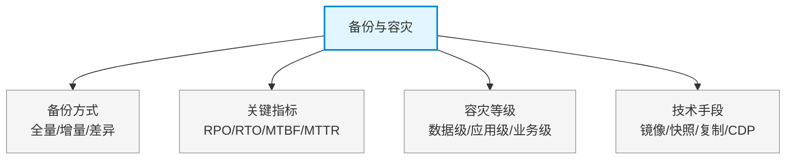

# 第十五章：备份与容灾

> 对应课件：`10-6 备份与容灾.pdf`
> 本章聚焦数据保护：备份策略（全量/增量/差异）、容灾等级、RPO/RTO 等关键指标。
> ⚠️ 本文件为骨架占位，具体内容待对照 PDF OCR 逐节补充。

## 1. 核心考点脑图 (Mindmap)

---

## 2. 深度理论解析 (Theory & Concepts)

> 待补充：三种备份方式原理与恢复流程、RPO/RTO 定义与权衡、容灾体系建设（两地三中心）。

## 3. 横向对比与易错辨析 (Comparisons & Pitfalls)

> 待补充：全量/增量/差异备份对比表、备份 vs 归档 vs 容灾辨析、RPO vs RTO 辨析。

## 4. 历年真题与解析 (Exam Questions)

> 待补充：真实历年真题（RPO/RTO 概念题为高频考点），标注出处年份。

## 5. 备考建议 (Exam Tips)

> 待补充：高频考点回顾、记忆口诀、易错提醒。
