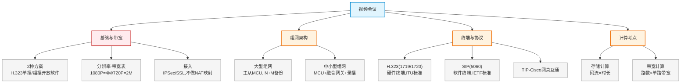

# 第十六章：视频会议

> 对应课件：`10-7 视频会议.pdf`（共 18 页）
> 本章聚焦视频会议系统：方案与协议（H.323/SIP）、MCU 多点控制、分辨率与带宽、组网方案，含存储与带宽计算。

## 1. 核心考点脑图 (Mindmap)

---

## 2. 深度理论解析 (Theory & Concepts)

### 2.1 视频会议基础

视频会议方案主要有 2 种：

| 方案 | 说明 | 组成 |
| :--- | :--- | :--- |
| **方案一** | 基于**单播网络**和 **H.323 协议** | MCU（多点控制单元）、GW（网关）、GK（网守） |
| **方案二** | 基于**组播网络**和开放软件 | — |

#### 接入方式

*   视频会议使用较多**动态端口**，一般**不采用端口映射（NAT Server）**方式访问。
*   总分机构之间建议部署 **IPSec**。
*   远程办公人员一般采用 **SSL** 接入视频会议网络。

> **易错点**：视频会议因动态端口多，**不做 NAT 映射**；机构间用 **IPSec**，远程人员用 **SSL**。

### 2.2 分辨率与带宽要求 ⭐⭐ 高频考点

| 分辨率 | 帧数 | 带宽要求 |
| :--- | :--- | :--- |
| **1080P**（1920×1080） | 30/60 | **4Mbps** |
| **720P**（1280×720） | 30/60 | **2Mbps** |
| 4CIF（704×576） | 25 | 1.5Mbps |
| CIF（352×288） | 15~25 | 128kbps~384kbps |
| QCIF（176×144） | 20~25 | 64kbps~128kbps |
| QCIF（176×144） | 15~20 | 56kbps |
| QCIF（176×144） | 4~6 | — |

> **⭐ 易错点（必记）**：**1080P = 4Mbps、720P = 2Mbps**。这是带宽与存储计算题的基础数据。

### 2.3 视频会议组网架构

#### 大型视频会议组网

*   **一级中心**：主 MCU（**N+M 备份**）、会议管理平台、电视墙服务器。
*   **二级中心**：从 MCU、高清终端。
*   **三级会场**：高清终端、软件终端。
*   带宽建议：
    *   一级中心到二级节点：最佳 **4M~8M**
    *   二级节点到三级会场：最佳 **768K~4M**

#### 中小型视频会议组网

主会场/控制室部署：会议管理平台 + MCU + 录制 + 电视墙 + 融合网关。

*   支持双流会议、视频+PC 等多流会议。
*   支持个人接入（会议电话、桌面终端）。
*   讨论性会议支持白板交互。

### 2.4 MCU 多点控制单元

全系列 MCU 提供不同容量平台服务：

| 型号 | 容量 |
| :--- | :--- |
| M9000C | 超大容量（最高 **1024 路**） |
| M910 | 中型容量（最高 512 路） |
| M900 | 中小型容量（最高 256 路） |
| 小型 | 最高 128 路 |

> **易错点**：主 MCU 采用 **N+M 备份**（N 个主用 + M 个备用），保证高可用。

### 2.5 终端与协议 ⭐⭐ 高频考点

#### 协议体系

| 协议 | 标准 | 端口 | 终端类型 |
| :--- | :--- | :--- | :--- |
| **H.323** | **ITU 标准**（国际电信联盟） | **TCP 1719、1720** | 硬件终端、可视电话 |
| **SIP** | **IETF 标准** | 5060 | 软件终端 |
| **TIP** | — | — | 与 Cisco 网真互通 |

#### 兼容性与互通

*   支持 **H.323 协议（1719/1720）**，与视频会议互通。
*   支持 **TIP 协议**，与 Cisco 网真互通。
*   支持 **SIP 协议**，与统一通信互通（IBM Sametime、Microsoft Lync、Skype）。

> **⭐ 易错点**：
> *   **H.323** = ITU 标准、硬件终端、**TCP 端口 1719/1720**。
> *   **SIP** = IETF 标准、软件终端、端口 5060。
> *   召开视频会议用 **H.323**，防火墙开放 **TCP 1719、1720** 端口。

---

### 2.6 计算考点（案例高频）⭐⭐

#### 存储空间计算

**公式**：存储空间 = 码流 × 时长

*   注意单位换算：码流 Mbps（兆比特/秒），1 Byte = 8 bit，故 **÷8** 换算为 MB。

**示例**（网规 2019.11 案例）：视频会议 1080p 码流 8Mbps，每个会议室每小时占用多少存储？

$$8 \text{ Mb/s} \times 3600 \text{ s} = 28800 \text{ Mbit} \div 8 = 3600 \text{ MB}$$

> 每个会议室每小时占用 **3600MB**。

#### 存储磁盘数计算

**示例**（接上题）：4 个会议室，每年用 100 天、每天 8 小时，视频保存 2 年。存储配 4TB（实际 3.63TB）RAID6 + 1 全局热备盘，需多少块盘？

$$3600\text{MB} \times 8 \times 100 \times 2 \times 4 = 23040000\text{MB} = 22500\text{GB} \approx 22\text{TB}$$

$$数据盘 = 22\text{TB} \div 3.63\text{TB} \approx 7 \text{ 块}$$

$$总盘数 = 7（数据）+ 2（RAID6 校验）+ 1（热备）= 10 \text{ 块}$$

> **⭐ 计算顺序**：先算总存储 → 除以单盘实际容量得数据盘 → 加 RAID6 的 2 块校验盘 → 加 1 块热备盘 = 总盘数。

#### 带宽计算

**公式**：总带宽 = IPC 路数 × 单路带宽

**示例**（网工 2022.11 案例）：1080P 单路带宽 4Mbps。
*   SwitchC 下 16 路 IPC：16 × 4 = **64M**，低于百兆（100M），可用百兆交换机。
*   SwitchA 下 160 路 IPC：160 × 4 = **640M**，远超百兆，**必须千兆交换机**。

> **易错点**：1080P 单路 4Mbps，累加后判断交换机端口速率是否够用——16 路 64M 可百兆，160 路 640M 需千兆。

---

## 3. 横向对比与易错辨析 (Comparisons & Pitfalls)

### 3.1 H.323 vs SIP 对比

| 维度 | H.323 | SIP |
| :--- | :--- | :--- |
| 标准组织 | **ITU**（国际电信联盟） | **IETF**（互联网工程任务组） |
| 端口 | **TCP 1719、1720** | 5060 |
| 终端类型 | 硬件终端、可视电话 | 软件终端 |
| 网络 | 单播 | 组播/开放软件 |

### 3.2 高频易错点速记

> **易错点 1**：**1080P=4Mbps、720P=2Mbps**（带宽与存储计算基础）。
>
> **易错点 2**：视频会议动态端口多，**不做 NAT 映射**；机构间 **IPSec**、远程人员 **SSL**。
>
> **易错点 3**：H.323 = ITU 标准、硬件终端、**TCP 1719/1720**；SIP = IETF 标准、软件终端、5060。
>
> **易错点 4**：召开视频会议用 **H.323**，防火墙开放 **TCP 1719、1720**。
>
> **易错点 5**：主 MCU 用 **N+M 备份**；大型组网一级→二级 4-8M、二级→三级 768K-4M。
>
> **易错点 6**：存储计算——码流 × 时长，**÷8 换算 bit→Byte**；磁盘数 = 数据盘 + 校验盘 + 热备盘。
>
> **易错点 7**：带宽计算——路数 × 单路带宽；16 路 64M 可百兆，160 路 640M 需千兆。

---

## 4. 历年真题与解析 (Exam Questions)

### 4.1 网规 2019年11月 案例分析二（25分）⭐⭐（视频会议综合案例）

**背景**：某政府部门新建大楼网络，三链路接入（电子政务外网/互联网/内网），4 个视频会议室部署视频会议系统，录播存储以 NFS 格式挂载为网络磁盘。

**【问题1】**（9分）大二层结构各层功能与优缺点？如何实现三类终端各只能访问对应网络？机要系统设计是否违规？

**【参考答案】**：
1.  **核心层**：高速数据转发，快速可靠骨干。**接入层**：终端接入 + 安全功能。
    *   优点：结构简单、部署/维护方便、扁平化管理、虚拟化利于资源利用。
    *   缺点：稳定性不够，接入扩展影响核心；内部流量经核心交换机，压力大。
2.  将三类终端划分不同 **VLAN**、配置不同 IP 地址段，设置**基于源地址的策略路由**。
3.  **违规**。电子政务内网与政务外网应**物理隔离**，机要系统也要与内部网络**物理隔离**；题目是逻辑隔离（VLAN），不满足合规性。

**【问题2】**（6分）1080p 码流 8Mbps，每会议室每小时占多少存储？4 会议室 2 年（每年 100 天每天 8 小时），存储 4TB(3.63TB) RAID6 + 1 热备，需多少块盘？

**【参考答案】**：
*   （4）**3600MB**：8Mb/s × 3600s = 28800Mbit ÷ 8 = 3600MB。
*   （5）**10 块**：3600MB × 8 × 100 × 2 × 4 = 22500GB ≈ 22TB；数据盘 22÷3.63≈7 块；RAID6 加 2 校验 + 1 热备 = **10 块**。

**【问题3】**（6分）视频终端和 MCU 是否需一对一 NAT？视频会议用什么协议？防火墙开放什么 TCP 端口？

**【参考答案】**：
*   （6）**不需要**一对一 NAT（浪费 IP 地址），可做**多对一 NAT**。
*   （7）协议 **H.323**，TCP 端口 **1719、1720**。

**【问题4】**（4分）虚拟化平台存储连接方式？视频存储连接方式？

**【参考答案】**：（8）**FC-SAN**（连 FC 交换机）；（9）**NAS**（NFS 格式挂载网络磁盘是 NAS 标志）。

> **考点关联**：本题综合考查存储计算（3600MB/10块盘）、协议（H.323/1719/1720）、NAT（多对一）、架构辨析（FC-SAN/NAS）。

### 4.2 网工 2022年11月 案例分析一（20分）⭐⭐（带宽计算案例）

**背景**：某仓储企业 500 亩，10 栋仓库每栋内外 16 台监控共 160 台 IPC。

**【问题3】**（4分）IPC 用 1080P 传输，SwitchC、SwitchA 选百兆交换机是否满足带宽？

**【参考答案】**：
*   **SwitchC 可用百兆**：下挂 16 路 IPC，16 × 4M = **64M**，低于 100M 且有富余。
*   **SwitchA 不能用百兆**：下挂 160 路 IPC，160 × 4M = **640M**，远超百兆，**至少需千兆交换机**。

> **考点关联**：1080P 单路 4Mbps；总带宽 = 路数 × 4M；与交换机端口速率（100M/1000M）比较判断是否够用。

---

## 5. 备考建议 (Exam Tips)

### 高频考点回顾

1.  **两种方案**：H.323 单播（含 MCU/GW/GK）；组播开放软件。
2.  **分辨率-带宽**：**1080P=4Mbps、720P=2Mbps**（必记）。
3.  **接入方式**：不做 NAT 映射（动态端口多）；机构间 IPSec、远程人员 SSL。
4.  **组网**：大型主从 MCU + N+M 备份；一级→二级 4-8M、二级→三级 768K-4M。
5.  **MCU 容量**：M9000C 最高 1024 路。
6.  **协议**：H.323（ITU/硬件/TCP 1719·1720）、SIP（IETF/软件/5060）、TIP（Cisco 网真）。
7.  **存储计算**：码流×时长 ÷8；磁盘数=数据盘+校验盘+热备盘。
8.  **带宽计算**：路数×单路带宽（4M）；判断交换机百兆/千兆是否够。

### 记忆口诀

*   **带宽**："1080 要 4 兆，720 两兆够"
*   **协议**："H.323 电信联，端口 1719 加 1720；SIP 互联网，软件终端 5060"
*   **接入**："动态端口不映射，机构 IPSec 远程 SSL"
*   **存储计算**："码流乘时长，除八变字节，数据加校验加热备"
*   **带宽计算**："路数乘四兆，百兆看十六，千兆看一百六"
