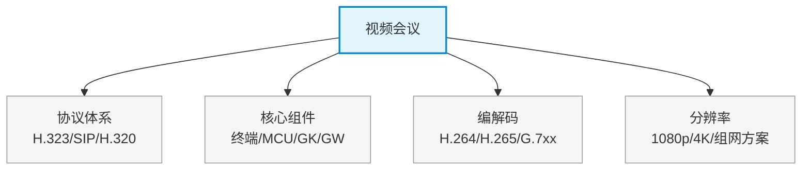

# 第十六章：视频会议

> 对应课件：`10-7 视频会议.pdf`
> 本章聚焦视频会议系统：信令协议（H.323/SIP）、MCU 多点控制、编解码与组网方案。
> ⚠️ 本文件为骨架占位，具体内容待对照 PDF OCR 逐节补充。

## 1. 核心考点脑图 (Mindmap)

---

## 2. 深度理论解析 (Theory & Concepts)

> 待补充：H.323 与 SIP 协议栈、MCU 工作模式（集中式/分布式）、视频编解码标准、QoS 保障。

## 3. 横向对比与易错辨析 (Comparisons & Pitfalls)

> 待补充：H.323 vs SIP 对比表、电路交换 vs 分组交换视频会议、MCU 处理模式辨析。

## 4. 历年真题与解析 (Exam Questions)

> 待补充：真实历年真题，标注出处年份。

## 5. 备考建议 (Exam Tips)

> 待补充：高频考点回顾、记忆口诀、易错提醒。
