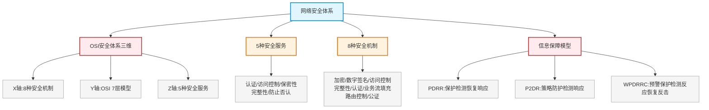

# 第十七章：网络安全体系

> 对应课件：`11-1 网络安全体系.pdf`（共 9 页）
> 本章是网络安全模块的**总纲**：OSI 安全体系三维模型、5 种安全服务与 8 种安全机制的对应关系、信息保障模型（PDRR/P2DR/WPDRRC）。
> ⚠️ 本章上午选择题考 5-8 分，案例分析试题三考 25 分，也可能出论文。

## 1. 核心考点脑图 (Mindmap)

---

## 2. 深度理论解析 (Theory & Concepts)

### 2.1 OSI 安全体系三维模型 ⭐

OSI 安全体系分为 **3 个维度**，共同构成网络安全空间：

| 维度 | 内容 | 数量 |
| :--- | :--- | :--- |
| **X 轴** | 安全机制 | **8 种** |
| **Y 轴** | OSI 7 层模型 | 7 层 |
| **Z 轴** | 安全服务 | **5 种** |

> **易错点**：记住三个数字——**8 种机制、7 层模型、5 种服务**。这是 ISO 7498-2 标准。

### 2.2 五种安全服务 ⭐⭐ 高频考点

ISO 7498-2 标准规定的五大安全服务：

| 序号 | 安全服务 | 含义 |
| :--- | :--- | :--- |
| 1 | **认证（鉴别）服务** | 通信双方能证实对方确实具有所声称的身份 |
| 2 | **访问控制服务** | 确保对信息源的访问可由目标系统控制 |
| 3 | **数据保密性（机密性）服务** | 信息仅能被授权读取的用户得到 |
| 4 | **数据完整性服务** | 仅授权用户能修改有价值的信息和传输信息 |
| 5 | **防止否认（不可抵赖）服务** | 发送方和接收方都不能抵赖所进行的信息传输 |

> **⭐ 易错点**："数字证书""抗抵赖""数据鉴别""数据完整性"中，**数字证书不属于五大安全服务**（2020.11 第 43 题）。抗抵赖 = 防止否认，是五大服务之一。

### 2.3 八种安全机制 ⭐⭐ 高频考点

8 种安全机制及其对应的算法技术：

| 序号 | 安全机制 | 对应安全服务 | 常用算法/技术 |
| :--- | :--- | :--- | :--- |
| 1 | **加密机制** | 数据保密性（防窃听嗅探等被动攻击） | 对称：DES、3DES、AES、**SM1**（国产）；非对称：RSA |
| 2 | **数字签名机制** | 认证（鉴别）+ 防止否认 | RSA、DSA、**SM2**（国产） |
| 3 | **访问控制机制** | 访问控制 + 认证 | 用户名口令验证、ACL 访问控制列表 |
| 4 | **数据完整性机制** | 数据完整性（防篡改） | 哈希算法：MD5、SHA、**SM3**（国产） |
| 5 | **认证机制** | 认证（鉴别） | 源认证（数字签名）、身份认证（用户名口令/证书） |
| 6 | **业务流填充机制** | 数据保密性 | 传输中填充随机数，加大破解难度 |
| 7 | **路由控制机制** | 访问控制 | 预设安全通信路径，避免不安全信道 |
| 8 | **公证机制** | 防止否认 | 资料交权威第三方公证，防事后抵赖 |

> **⭐ 易错点（机制↔服务对应，高频）**：
> *   加密 → 保密性
> *   数字签名 → 认证 + 防止否认
> *   访问控制 → 访问控制 + 认证
> *   数据完整性 → 完整性
> *   认证 → 认证（鉴别）
> *   业务流填充 → 保密性
> *   路由控制 → 访问控制
> *   公证 → 防止否认

> **⭐ 国产密码算法对应关系（必记）**：
> *   **SM1** = 对称加密（分组）
> *   **SM2** = 非对称加密 / 数字签名（椭圆曲线）
> *   **SM3** = 哈希（数据完整性）
> *   **SM4** = 对称加密（分组，无线）

### 2.4 信息保障模型 ⭐

常见信息保障模型有三种：

| 模型 | 含义 | 记忆 |
| :--- | :--- | :--- |
| **PDRR** | 保护 Protection、检测 Detection、恢复 Recovery、响应 Response | "保检恢响" |
| **P2DR** | 安全策略 Policy、防护 Protection、检测 Detection、响应 Response | 策略为核心 |
| **WPDRRC** | 预警 Warning、保护、检测、反应、恢复、反击 Counterattack | 最完整，6 环节 |

> **易错点**：P2DR 以**安全策略 Policy**为核心；WPDRRC 是最完整模型（含预警和反击，6 个环节）。PDRR 是 2020 年考过的模型（网规 2020 第 48 题）。

---

## 3. 横向对比与易错辨析 (Comparisons & Pitfalls)

### 3.1 安全服务 ↔ 安全机制 ↔ 算法 速查表

| 安全服务 | 对应安全机制 | 对应算法/技术 |
| :--- | :--- | :--- |
| 数据保密性 | 加密机制、业务流填充机制 | DES/3DES/AES/SM1、RSA |
| 认证（鉴别） | 数字签名、访问控制、认证机制 | RSA/DSA/SM2、证书、口令 |
| 访问控制 | 访问控制、路由控制机制 | ACL、用户名口令 |
| 数据完整性 | 数据完整性机制 | MD5/SHA/SM3 |
| 防止否认 | 数字签名、公证机制 | RSA/DSA/SM2、第三方公证 |

### 3.2 高频易错点速记

> **易错点 1**：OSI 安全体系三维 = **8 机制 × 7 层 × 5 服务**。
>
> **易错点 2**：五大安全服务 = 认证、访问控制、保密性、完整性、防止否认。**数字证书不属于**五大服务。
>
> **易错点 3**：机制↔服务对应——加密/业务流填充→保密性；数字签名/公证→防止否认；访问控制/路由控制→访问控制。
>
> **易错点 4**：国产算法——**SM1 对称、SM2 非对称签名、SM3 哈希**。
>
> **易错点 5**：P2DR 以**策略**为核心；WPDRRC 最完整（预警+反击）；PDRR = 保护/检测/恢复/响应。
>
> **易错点 6**：加密机制防**被动攻击**（窃听嗅探）；完整性机制防**主动攻击**（篡改）。

---

## 4. 历年真题与解析 (Exam Questions)

### 4.1 网规 2020年11月 第43题 ⭐

**题目**：（43）不属于 ISO7498-2 标准规定的五大安全服务。
A. 数字证书　B. 抗抵赖服务　C. 数据鉴别　D. 数据完整性

**【参考答案】A**

**【解析】**：五大安全服务包括：
1.  **认证（鉴别）服务**：通信双方能证实对方确实具有所声称的身份（"数据鉴别"属此类）。
2.  **访问控制服务**：对信息源的访问可由目标系统控制。
3.  **数据机密性（保密性）服务**：信息仅能被授权读取的用户得到。
4.  **数据完整性服务**：仅授权用户能修改有价值的信息。
5.  **防止否认/不可抵赖（抗抵赖）服务**：发送方和接收方都不能抵赖信息传输。

"**数字证书**"是认证机制的一种实现手段，不属于五大安全服务本身 → A。

> **考点关联**：抗抵赖 = 防止否认（是五大服务）；数据鉴别 = 认证服务（是五大服务）；数字证书是机制/技术，非服务。

### 4.2 网规 2020年 第48题（PDRR 模型）⭐

**题目**：PDRR 信息安全模型中的四个环节是？

**【参考答案】**：**保护（Protection）、检测（Detection）、恢复（Recovery）、响应（Response）**。

> **考点关联**：PDRR = 保护/检测/恢复/响应；P2DR 在前面加了策略（Policy）；WPDRRC 最完整（预警/保护/检测/反应/恢复/反击）。

---

## 5. 备考建议 (Exam Tips)

### 高频考点回顾

1.  **OSI 安全体系三维**：X 轴 8 机制、Y 轴 7 层、Z 轴 5 服务。
2.  **五大安全服务**：认证、访问控制、保密性、完整性、防止否认（数字证书不属于）。
3.  **八种安全机制**：加密、数字签名、访问控制、数据完整性、认证、业务流填充、路由控制、公证。
4.  **机制↔服务对应**：加密/业务流填充→保密性；数字签名/公证→防止否认；访问控制/路由控制→访问控制；数据完整性→完整性。
5.  **国产算法**：SM1 对称、SM2 非对称签名、SM3 哈希、SM4 对称（无线）。
6.  **信息保障模型**：PDRR（保检恢响）、P2DR（策略为核心）、WPDRRC（最完整 6 环节）。
7.  **攻击类型**：加密防被动攻击（窃听），完整性防主动攻击（篡改）。

### 记忆口诀

*   **三维**："八机制七层五服务"
*   **五大服务**："认访保完防否认"（认证、访问控制、保密、完整、防否认）
*   **八大机制**："加签访完认，流路公公证"（加密、签名、访问控制、完整性、认证、业务流填充、路由控制、公证）
*   **国产算法**："一密二签三哈希，四是无线对称密"（SM1 对称加密、SM2 签名、SM3 哈希、SM4 无线对称）
*   **模型**："PDRR 四环，P2DR 策略先，WPDRRC 最全"
