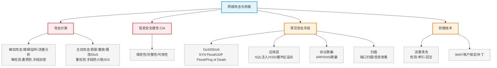

# 第十八章：网络攻击与防御

> 对应课件：`11-2 网络攻击与防御.pdf`（共 34 页）
> 本章聚焦网络攻击分类（主动/被动）、常见攻击手段（DoS/DDoS、SQL注入、XSS、ARP/DNS欺骗、缓冲区溢出）与防御技术。

## 1. 核心考点脑图 (Mindmap)

---

## 2. 深度理论解析 (Theory & Concepts)

### 2.1 主动攻击与被动攻击 ⭐⭐ 高频考点

| 类型 | 典型代表 | 特点 | 防御重点 |
| :--- | :--- | :--- | :--- |
| **被动攻击** | 嗅探、监听、流量分析 | **最难被检测** | 重点是**预防**，主要手段**加密** |
| **主动攻击** | 假冒、重放、欺骗、消息篡改、拒绝服务 | — | 重点是**检测**而非预防，手段防火墙、IDS 等 |

> **易错点**：被动攻击难检测重预防（加密）；主动攻击重检测（防火墙/IDS）。**流量分析属被动攻击**，**窃取属被动攻击**。

### 2.2 信息安全基本属性（CIA）⭐⭐ 高频考点

| 属性 | 含义 | 破坏该属性的攻击 | 保护手段 |
| :--- | :--- | :--- | :--- |
| **保密性**（Confidentiality） | 信息不泄露给非授权个人/实体 | 窃取、嗅探 | 访问控制 + 加密技术 |
| **完整性**（Integrity） | 存储传输提取中不被修改/延迟/乱序/丢失 | 篡改 | 访问控制 + 信息摘要算法 |
| **可用性**（Availability） | 合法用户可访问并按要求使用 | **DoS/DDoS** | 冗余配置 + 备份 |

> **⭐ 易错点（高频）**：
> *   **窃取/嗅探/流量分析 → 破坏保密性**（被动攻击）。
> *   **DoS/DDoS → 破坏可用性**。
> *   **篡改 → 破坏完整性**。
> *   保证可用性最常用方法 = **冗余配置 + 备份**。

### 2.3 计算机病毒分类 ⭐

| 类型 | 前缀/关键字 | 特征 | 典型代表 |
| :--- | :--- | :--- | :--- |
| **蠕虫病毒** | worm | 通过网络/系统漏洞传播，发送带毒邮件或阻塞网络 | 冲击波（阻塞网络）、小邮差（发带毒邮件）、**震网病毒** |
| **特洛伊木马** | Trojan/Hack | 隐藏进入系统，远程控制 | 游戏木马 Trojan.Lmir.PSW60 |
| **宏病毒** | Macro | 感染 word/excel 脚本病毒 | Macro.Word97 |
| **ARP病毒** | ARP | 发送虚假ARP欺骗网关或主机 | ARP网关欺骗、ARP路由欺骗 |
| **震网病毒** | Stuxnet | 攻击工控系统（核设施），本质是蠕虫病毒 | 震网 |
| **勒索病毒** | WannaCry | 加密文档/锁浏览器，交赎金解密，本质是蠕虫病毒 | WannaCry |

> **易错点**：震网病毒、勒索病毒**本质都是蠕虫病毒**。蠕虫前缀 worm、木马前缀 Trojan、宏病毒前缀 Macro。

### 2.4 信息收集与端口扫描

#### 信息收集方式

1.  **网络监测**：嗅探应用软件，捕捉传输中的密码等。
2.  **社会工程**：运用技巧获取信息（喝酒交谈套密码、伪装骗取）。
3.  **公共资源和垃圾**：从公开广告资料或垃圾收集信息。
4.  **后门工具**：掩盖计算机安全受威胁事实的工具包。
5.  **端口扫描**：判断目标开放的服务/操作系统（有回复=活动端口）。

#### 端口扫描分类 ⭐

| 扫描类型 | 原理 | 特点 |
| :--- | :--- | :--- |
| **全 TCP 连接** | 用三次握手建立标准TCP连接 | 古老，**最易被目标记录** |
| **半打开式扫描**（SYN扫描） | 发送SYN请求，不完成三次握手 | 连接未建立，**不易被记录、速度快** |
| **FIN扫描** | 发FIN=1报文，关闭端口返回RST，活动端口无回应 | 不涉及TCP连接，**最安全/秘密扫描** |
| **第三方扫描**（代理扫描） | 利用第三方主机代理 | — |

> **易错点**：安全性 FIN扫描 > SYN扫描 > 全TCP连接。FIN扫描最隐蔽（秘密扫描）。

### 2.5 拒绝服务攻击 DoS/DDoS ⭐⭐

#### DoS 与 DDoS

*   **DoS**（拒绝服务）：消耗主机 CPU、内存、磁盘、网络等资源，使主机不能向正常用户提供服务。
*   **DDoS**（分布式拒绝服务）：攻击者侵入多台计算机，控制它们同时向特定目标发起拒绝服务攻击。
*   传统 DoS 两大缺点：受网络资源限制、隐蔽性差；**DDoS 克服了这两大致命弱点**。

#### DDoS 三级结构 ⭐

| 层级 | 说明 |
| :--- | :--- |
| **Client 客户端** | 运行在攻击者主机，发起和控制攻击 |
| **Handler 主控端** | 运行在已入侵主机，控制代理端 |
| **Agent 代理端（肉鸡）** | 运行在已入侵主机，接收命令对目标实施实际攻击 |

#### 常见 DoS/DDoS 攻击 ⭐⭐ 高频考点

| 攻击类型 | 原理 | 防御 |
| :--- | :--- | :--- |
| **SYN Flooding**（同步包风暴） | 大量发SYN不回ACK，造成大量**半开连接**，耗尽资源 | 修改注册表、防火墙开SYN防范 |
| **UDP Flooding** | 大量发UDP数据，耗尽网络带宽 | 流量清洗、限带宽 |
| **Ping of Death** | 发大于65535字节(64KB)的ICMP包，使TCP/IP堆栈崩溃、死机 | 修改注册表防ICMP、升级打补丁 |
| **Teardrop**（泪滴） | 伪造**重叠偏移**的IP分段，使系统崩溃/挂起 | — |
| **Land** | SYN包源地址=目的地址=目标地址，造成自连接 | — |
| **Winnuke** | 针对Windows **139端口**发1字节TCP OOB数据(URG=1)，蓝屏 | — |
| **Hash DoS** | 构造恶意输入耗尽CPU/内存（算法漏洞） | — |

> **⭐ 易错点（攻击原理辨析，高频）**：
> *   SYN Flood → **半开连接**（TCP三次握手）
> *   Ping of Death → 大于64KB的ICMP包，**堆栈崩溃**
> *   Teardrop → IP分片**重叠偏移**
> *   Land → **源地址=目的地址**
> *   Winnuke → 139端口 + URG/OOB

#### DoS 防御通用方法

1.  加强数据包**特征识别**（搜寻特征字符串确定攻击类型/位置）。
2.  防火墙监控敏感端口（UDP 31335、UDP 27444、TCP 27665）。
3.  通信数据量**统计**（攻击前DNS异常查询、攻击时来源地址超量）。
4.  修复系统和漏洞。
5.  购买安全设备（防火墙、抗DDoS设备）和**流量清洗服务**。
6.  其他：CDN、增加带宽/服务器。

### 2.6 网络流量清洗技术 ⭐

流量清洗系统三步骤：

| 步骤 | 说明 |
| :--- | :--- |
| **流量检测** | 基于DPI（深度数据包检测）监测分析流量，快速识别攻击包 |
| **流量牵引与清洗** | 监测到攻击时，将目标系统流量动态转发到清洗中心清洗 |
| **流量回注** | 将清洗后的干净流量回送给目标系统，正常流量不受影响 |

#### 流量清洗应用

*   **畸形报文过滤**：LAND、Fraggle、Smurf、Winnuke、Ping of Death、Tear Drop、TCP Error Flag。
*   **抗拒绝服务攻击**。
*   **Web应用保护**：HTTP Get Flood、HTTP Post Flood、HTTP Slow Header/Post、HTTPS Flood。
*   **DDoS高防IP**：代理转发模式，业务流量牵引到高防IP，过滤清洗后回注源站。

### 2.7 缓冲区溢出攻击

*   **原理**：往程序缓冲区写超出其长度的内容，造成溢出，破坏堆栈，使程序执行预设指令。
*   **防御**：
    *   系统管理：关闭不需要的特权程序、及时打补丁。
    *   软件开发：编写正确代码确保不越界、程序指针完整性检查、改进C语言隐患函数库、编译器分离函数地址指针。

### 2.8 SQL 注入攻击 ⭐

*   **原理**：从正常网页端口访问，巧妙构建SQL语句，获取数据库敏感信息或插入恶意语句。
*   **特征码**：`select`、`1=1`。
*   **防御**：对用户输入严格检查；部署DBS数据库审计系统、**WAF防火墙**。

### 2.9 XSS 跨站脚本攻击 ⭐

*   **原理**：恶意攻击者往Web页面插入恶意html代码，用户浏览时嵌入的html代码被执行。
*   **特征码**：`script`、`alert`。
*   **危害**：窃取用户名密码（利用cookie和jsonp）、诱骗打开恶意网站。
*   **防御**：部署**WAF网页应用防火墙**；对用户输入过滤，特殊字符（`<` `>` 等）转义。

### 2.10 ARP 欺骗与 DNS 欺骗 ⭐

#### ARP 欺骗

*   **原理**：发送恶意ARP应答，刷新被攻击者ARP缓存，使其不能正确二层封装。
*   **防御**：
    1.  主机ARP静态绑定（`arp -s IP MAC`）。
    2.  主机和服务器双向绑定。
    3.  使用ARP服务器。
    4.  安装ARP防护软件或交换机启动**DAI**功能。

#### ARP 命令 ⭐ 高频考点

| 命令 | 作用 |
| :--- | :--- |
| `arp -a` | 查询ARP表 |
| `arp -d` | 删除ARP表 |
| `arp -s` | **静态绑定** |

#### DNS 欺骗

*   **原理**：冒充域名服务器，把查询IP设为攻击者IP，用户只能看到攻击者主页（冒名顶替，非真黑站）。
*   **检测**：被动监听检测、虚假报文探测、交叉检查查询。

### 2.11 TCP/IP 漏洞攻击

利用TCP/IP协议缺陷（IP头部 Total Length、Fragment offset、IHL、Source address 等字段），发送错误IP包使接收端无法重组，引起死机崩溃。

| 攻击 | 原理 |
| :--- | :--- |
| Ping of Death | ping大于65535字节，蓝屏/死机 |
| Teardrop | 恶意修改IP分组**偏移量**，不能重组、缓冲区溢出、崩溃 |
| WinNuke | 带外传输攻击，目标端口139/138/137/113/53，URG=1紧急模式，指针与数据位置不符 |
| Land | SYN包源地址=目的地址=服务器地址，自连接，Unix崩溃/Windows极慢 |

---

## 3. 横向对比与易错辨析 (Comparisons & Pitfalls)

### 3.1 攻击 ↔ 破坏属性 ↔ 类型 对照表 ⭐⭐

| 攻击 | 破坏属性 | 主动/被动 |
| :--- | :--- | :--- |
| 窃取/嗅探/流量分析 | **保密性** | 被动 |
| 篡改 | **完整性** | 主动 |
| DoS/DDoS | **可用性** | 主动 |
| 假冒/重放/伪造 | 真实性 | 主动 |

### 3.2 高频易错点速记

> **易错点 1**：被动攻击（嗅探/流量分析/窃取）难检测、重预防、用加密；主动攻击重检测、用防火墙/IDS。
>
> **易错点 2**：CIA——窃取破坏**保密性**，篡改破坏**完整性**，DoS/DDoS破坏**可用性**；保可用性用**冗余+备份**。
>
> **易错点 3**：震网病毒、勒索病毒本质是**蠕虫病毒**。
>
> **易错点 4**：端口扫描安全性 FIN > SYN > 全TCP连接；FIN扫描最隐蔽（秘密扫描）。
>
> **易错点 5**：SYN Flood=半开连接；Ping of Death=大于64KB ICMP；Teardrop=IP分片重叠偏移；Land=源=目的；Winnuke=139端口URG。
>
> **易错点 6**：DDoS三级结构 Client→Handler→Agent（肉鸡）。
>
> **易错点 7**：流量清洗三步=检测→牵引清洗→回注；基于DPI。
>
> **易错点 8**：SQL注入特征 `select`/`1=1`，防WAF；XSS特征 `script`/`alert`，防WAF+转义。
>
> **易错点 9**：ARP静态绑定 `arp -s`，查 `arp -a`，删 `arp -d`；防ARP欺骗用DAI。
>
> **易错点 10**：防穷举破解用**账户锁定策略**。

---

## 4. 历年真题与解析 (Exam Questions)

### 4.1 网规 2016年11月 第41题 ⭐（ARP 命令）

**题目**：某计算机遭到 ARP 病毒攻击，为临时解决故障，可将网关 IP 地址与其 MAC 绑定，正确的命令是（41）。
A. arp -a　B. arp -d　C. arp -r　D. arp -s

**【参考答案】D**

**【解析】**：掌握 ARP 相关命令：查询ARP表 `arp -a`，删除ARP表 `arp -d`，**静态绑定 `arp -s`**。绑定用 `-s` → D。

### 4.2 网规 2016年11月 第46题 ⭐（攻击分类）

**题目**：流量分析属于（46）方式。
A. 被动攻击　B. 主动攻击　C. 物理攻击　D. 分发攻击

**【参考答案】A**

**【解析】**：常见主动攻击有中断、篡改和伪造信息；被动攻击有嗅探、流量分析等。**流量分析是典型的被动攻击** → A。

### 4.3 网规 2018年11月 第52题 ⭐（穷举防御）

**题目**：在 Windows Server 2008 系统中，要有效防止"穷举法"破解用户密码，应采用（52）。
A. 安全选项策略　B. 账户锁定策略　C. 审核对象访问策略　D. 用户权利指派策略

**【参考答案】B**

**【解析】**：防止穷举攻击，方法是**账户锁定** → B。

### 4.4 网规 2020年11月 第39题 ⭐⭐（SYN Flood 原理）

**题目**：SYN Flooding 攻击的原理是（39）。
A. 利用TCP三次握手，恶意造成大量TCP半连接，耗尽服务器资源，导致拒绝服务
B. 不能很好处理TCP报文序列号查找，导致系统崩溃
C. 不能很好处理IP分片包重叠，导致系统崩溃
D. 重组后超大的IP数据报不能很好处理，缓存溢出而崩溃

**【参考答案】A**

**【解析】**：SYN Flood 原理——攻击者发送SYN报文请求连接，对返回的SYN+ACK不作回应，形成**半开连接**，大量半连接耗尽资源。B是TCP序列号攻击，**C是泪滴攻击**（Teardrop，IP分片重叠），**D是Ping of Death**（超大IP报） → A。

### 4.5 网规 2021年11月 第43-44题 ⭐⭐（CIA 属性）

**题目**：窃取是一种针对数据或系统的（43）的攻击。DDoS攻击可以破坏数据或系统的（44）。
（43/44）A. 可用性　B. 保密性　C. 完整性　D. 真实性

**【参考答案】（43）B　（44）A**

**【解析】**：窃取是被动攻击，针对**保密性**；DoS/DDoS是针对**可用性**的攻击。
*   窃取 → 保密性（B）
*   DDoS → 可用性（A）

> **考点关联**：CIA 属性对应——窃取/嗅探→保密性，篡改→完整性，DoS/DDoS→可用性。

---

## 5. 备考建议 (Exam Tips)

### 高频考点回顾

1.  **攻击分类**：被动（嗅探/流量分析/窃取，难检测重预防，加密）；主动（假冒/重放/篡改/DoS，重检测，防火墙/IDS）。
2.  **CIA 三属性**：保密性（窃取破坏，加密+访问控制）、完整性（篡改破坏，摘要算法）、可用性（DoS破坏，冗余+备份）。
3.  **病毒分类**：蠕虫(worm)、木马(Trojan)、宏病毒(Macro)；震网/勒索本质是蠕虫。
4.  **端口扫描**：全TCP连接(易记录)、SYN(半开不易记录)、FIN(最安全秘密扫描)、第三方(代理)。
5.  **DoS/DDoS**：DDoS三级(Client/Handler/Agent肉鸡)；常见攻击——SYN Flood(半连接)、UDP Flood(带宽)、Ping of Death(>64KB ICMP)、Teardrop(分片重叠)、Land(源=目的)、Winnuke(139端口URG)。
6.  **流量清洗**：检测(DPI)→牵引清洗→回注。
7.  **缓冲区溢出**：写超长内容破坏堆栈；防补丁+正确代码。
8.  **SQL注入**：特征`select`/`1=1`，防WAF+输入检查。
9.  **XSS**：特征`script`/`alert`，防WAF+字符转义。
10. **ARP欺骗**：`arp -s`静态绑定，防DAI；`arp -a`查、`arp -d`删。
11. **DNS欺骗**：冒充域名服务器，检测被动监听/虚假报文/交叉检查。
12. **TCP/IP漏洞**：Ping of Death/Teardrop/WinNuke/Land 原理辨析。
13. **穷举防御**：账户锁定策略。

### 记忆口诀

*   **攻击分类**："被动嗅探流量析，难检测来重预防，加密为主；主动假冒与篡改，重检测靠墙IDS"
*   **CIA**："窃取保密篡改整，DoS破坏可用性，冗余备份保可用"
*   **病毒**："蠕虫堵网发邮件，木马潜伏远控制，震网勒索皆蠕虫"
*   **端口扫描**："全连易记SYN半开，FIN最隐秘扫描"
*   **DoS攻击**："SYN半连接，UDP耗带宽，Ping死超大包，泪滴分片叠，Land源即目的，Nuke 一三九端口"
*   **流量清洗**："检测牵引再回注，DPI 识攻击"
*   **ARP命令**："a 查 d 删 s 绑定"
*   **注入特征**："SQL 找 select，XSS 找 script"
