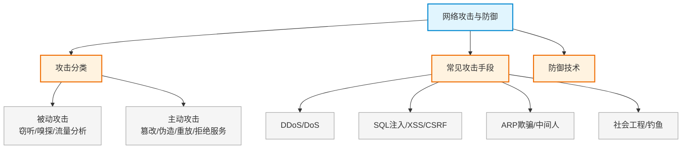

# 第十八章：网络攻击与防御

> 对应课件：`11-2 网络攻击与防御.pdf`（共 34 页）
> 本章聚焦网络攻击分类（主动/被动攻击）、常见攻击手段与防御技术。
> ⚠️ 骨架占位，内容待对照 PDF 补充。

## 1. 核心考点脑图 (Mindmap)

---

## 2. 深度理论解析 (Theory & Concepts)

> 待补充：主动攻击与被动攻击分类、各攻击手段原理与防御措施。

## 3. 横向对比与易错辨析 (Comparisons & Pitfalls)

> 待补充：攻击类型对比表、防御技术对照。

## 4. 历年真题与解析 (Exam Questions)

> 待补充：真实历年真题，标注出处年份。

## 5. 备考建议 (Exam Tips)

> 待补充：高频考点回顾、记忆口诀、易错提醒。
