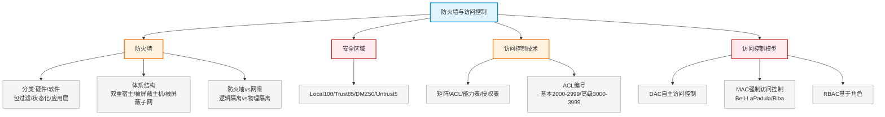

# 第十九章：防火墙与访问控制

> 对应课件：`11-3 防火墙与访问控制.pdf`（共 18 页）
> 本章聚焦防火墙技术（包过滤/状态检测/应用网关）、安全区域划分、网闸、访问控制技术与模型（DAC/MAC/RBAC）、ACL。

## 1. 核心考点脑图 (Mindmap)



---

## 2. 深度理论解析 (Theory & Concepts)

### 2.1 防火墙

防火墙实现**内部网络（信任网络）**与**外部网络（非信任网络）**之间或不同网络区域间的隔离与访问控制。

#### 防火墙分类

| 分类维度 | 类型 |
| :--- | :--- |
| 按软/硬件形式 | 硬件防火墙、软件防火墙 |
| 按过滤技术 | **包过滤、状态化防火墙、应用层防火墙** |
| 按经典体系结构 | 双重宿主主机体系结构、被屏蔽主机体系结构、被屏蔽子网体系结构 |

### 2.2 防火墙区域划分 ⭐⭐ 高频考点

根据网络的安全信任程度和需要保护的对象，划分安全区域：

| 安全区域 | 安全级别 | 说明 |
| :--- | :--- | :--- |
| **Local** | **100** | 防火墙设备本身（各接口本身） |
| **Trust**（信任区域） | **85** | 内部安全网络，内网终端用户所在区域（内部文件服务器、数据库） |
| **DMZ**（军事缓冲区） | **50** | 内外网之间，常放置公共服务设备，向外提供信息服务（内网服务器） |
| **Untrust**（非信任区域） | **5** | 外部网络（Internet 等不安全网络） |

#### 流量方向

*   **受信任程度**：**Local > Trust > DMZ > Untrust**
*   **Inbound（入方向）**：低安全级别 → 高安全级别（如 Untrust → Trust）
*   **Outbound（出方向）**：高安全级别 → 低安全级别（如 DMZ → Untrust）

> **⭐ 易错点（安全级别必记）**：Local=100、Trust=85、DMZ=50、Untrust=5。DMZ 放对外公共服务（Web/邮件服务器），安全级别居中。

### 2.3 防火墙与网闸对比 ⭐

| 对比 | 防火墙 | 网闸 |
| :--- | :--- | :--- |
| 隔离方式 | **逻辑隔离**设备 | **物理隔离**设备 |
| 技术 | 访问控制规则 | **GAP 技术**，电路上切断链路层连接 |
| 连接 | 内外网逻辑隔离但仍相连 | 内外网**不能直接相连**，通过数据交换区摆渡 |
| 工作方式 | 规则匹配过滤 | 数据交换区同一时刻只能与外网或内网之一通信 |

> **易错点**：网闸采用 **GAP 技术**实现**物理隔离**，内外网**不能实时连接**，数据通过**摆渡**互访。政府内外网物理隔离用网闸，不是防火墙。

### 2.4 访问控制技术 ⭐

访问控制指根据控制策略对客体/资源进行不同授权访问，包含 **3 要素**：

| 要素 | 说明 | 例子 |
| :--- | :--- | :--- |
| **主体** | 访问者 | 用户、进程、应用程序 |
| **客体** | 被访问的资源对象 | 文件、应用服务、数据 |
| **控制策略** | 是否允许访问的决策 | 拒绝访问、授权许可、禁止操作 |

#### 访问控制实现技术（4 种）

| 技术 | 说明 | 存储方式 |
| :--- | :--- | :--- |
| **访问控制矩阵** | 矩阵形式标识规则和用户权限 | 矩阵 |
| **访问控制列表（ACL）** | 每个客体有一个 ACL | **按列**保存访问控制矩阵 |
| **能力表** | 与 ACL 相反 | **按行**保存访问控制矩阵 |
| **授权关系表** | 表示能否访问，可延伸读/写/执行 | 关系表 |

> **易错点**：ACL **按列**保存（以客体为中心），能力表**按行**保存（以主体为中心）——两者相反。

### 2.5 访问控制列表 ACL ⭐

**ACL**（Access Control List）由一系列规则组成，通过规则对数据包分类，使设备对不同报文做不同处理。

#### ACL 规则匹配

*   报文到达时，取出信息组成查找键值，与规则匹配。
*   **只要有一条规则匹配就停止查找**（命中规则）。
*   查完所有规则无匹配 = 未命中规则。
*   规则分 `permit`（允许）、`deny`（拒绝）和未命中。

#### ACL 分类 ⭐ 高频考点

| 分类 | 编号范围 | 应用场景 |
| :--- | :--- | :--- |
| **基本 ACL** | **2000-2999** | 使用报文**源 IP 地址**和时间段定义规则 |
| **高级 ACL** | **3000-3999** | 基本ACL外，还支持**目的地址、IP优先级、报文类型、源目端口号**定义规则 |

> **易错点**：基本 ACL 2000-2999（仅源 IP）；高级 ACL 3000-3999（源/目的 IP、端口、协议类型等五元组）。高级 ACL 功能更强。

#### 高级 ACL 配置示例

限制 10.1.1.0/24 与 10.1.2.0/24 互访：

```
[Router] acl 3001
[Router-acl-adv-3001] rule deny ip source 10.1.1.0 0.0.0.255 destination 10.1.2.0 0.0.0.255
[Router] interface GigabitEthernet 0/0/1
[Router-GigabitEthernet0/0/1] traffic-filter inbound acl 3001
```

### 2.6 访问控制模型 ⭐⭐ 高频考点

#### （1）自主访问控制 DAC

*   客体**所有者**按自己安全策略授予其他用户访问权。
*   用户自行设置权限，**简单灵活**。
*   依赖用户安全意识和技能，**不能满足高安全等级**要求（误操作会泄密）。

#### （2）强制访问控制 MAC ⭐⭐

*   根据主体和客体的**安全属性**，强制方式控制访问。
*   每个进程、文件被赋予**安全级别和范畴**。
*   访问条件：进程安全级别**不小于**客体安全级别，**且**进程范畴**包含**文件范畴。
*   比 DAC 更严格，用于**政府部门、军事、金融**等领域。

**MAC 著名模型** ⭐⭐：

| 模型 | 特点 | 保护目标 |
| :--- | :--- | :--- |
| **Bell-LaPadula** | **只允许向下读、向上写** | 防止机密信息**向下级泄露**（保密性） |
| **Biba** | **不允许向下读、向上写** | 保护数据**完整性** |

> **⭐ 易错点（高频）**：
> *   **Bell-LaPadula** 模型：向下读、向上写 → 防**泄密**（保密性）。
> *   **Biba** 模型：不向下读、向上写 → 防**篡改**（完整性）。
> *   两者读写方向**相反**，保护目标不同（BLP 保保密性，Biba 保完整性）。

#### （3）基于角色的访问控制 RBAC ⭐

*   目前国际上流行的先进安全访问控制方法。
*   通过分配/取消**角色**完成用户权限授予/取消。
*   **4 个基本要素**：用户（U）、角色（R）、会话（S）、权限（P）。
*   访问权限与角色关联，角色再与用户关联，实现**用户与权限的逻辑分离**。
*   优点：便于授权管理、便于分级、便于赋予**最小特权**、便于任务分担、便于文件分级管理。

> **易错点**：RBAC 四要素 = 用户 U、角色 R、会话 S、权限 P；核心是"权限→角色→用户"解耦，便于最小特权管理。

---

## 3. 横向对比与易错辨析 (Comparisons & Pitfalls)

### 3.1 防火墙 vs 网闸 vs IDS/IPS

| 设备 | 隔离/部署 | 作用 |
| :--- | :--- | :--- |
| 防火墙 | 逻辑隔离，串联 | 访问控制 |
| 网闸 | **物理隔离**，GAP | 内外网摆渡，不能实时连接 |
| IDS | 旁路 | 只检测不阻断 |
| IPS | 串联 | 检测并阻断 |

### 3.2 高频易错点速记

> **易错点 1**：安全级别 Local(100) > Trust(85) > DMZ(50) > Untrust(5)；DMZ 放对外服务。
>
> **易错点 2**：防火墙逻辑隔离，网闸**物理隔离**（GAP技术，摆渡，不能实时连接）。
>
> **易错点 3**：ACL 按列保存（客体为中心），能力表按行保存（主体为中心）。
>
> **易错点 4**：基本 ACL 2000-2999（源IP），高级 ACL 3000-3999（五元组）。
>
> **易错点 5**：DAC 简单灵活但不够安全；MAC 强制严格（政府/军事/金融）；RBAC 角色分离便于最小特权。
>
> **易错点 6**：**Bell-LaPadula 向下读向上写防泄密（保密性）；Biba 不向下读向上写防篡改（完整性）**——读写方向相反。
>
> **易错点 7**：NTFS 权限与共享权限不一致时，取**更小（更严格）**的权限。
>
> **易错点 8**：ARP 不是传输协议，ARP 攻击不产生连接数。

---

## 4. 历年真题与解析 (Exam Questions)

### 4.1 网规 2016年11月 第55-58题 ⭐⭐（防火墙故障排查案例）

**背景**：企业防火墙保护内网，与外网连接丢包严重、延迟高，故障持续 2 周。检测步骤：1.登录防火墙检查（55），使用率低正常；2.查会话数吞吐量，一台设备异常连接数 7 万多；3.进行（56）操作后故障消失，判断原因不可能（57），排除方法在防火墙（58）。

**（55）** A.内存及CPU使用情况　B.进入内网报文数量　C.ACL规则执行情况　D.进入Internet报文数量

**【参考答案】（55）A**

**（56）** A.断开防火墙网络　B.重启防火墙　C.断开异常设备　D.重启异常设备

**【参考答案】（56）C**

**（57）** 产生故障原因不可能的是？A.DoS攻击　B.木马攻击　C.感染病毒　D.ARP攻击

**【参考答案】（57）D**

**（58）** 排除方法在防火墙？A.增加访问控制策略　B.恢复备份配置　C.初始化　D.升级软件版本

**【参考答案】（58）A**

**【解析】**：
*   （55）登录设备查看 CPU 和内存利用率 → A。
*   （56）发现异常设备应**断开异常设备**连接 → C。
*   （57）ARP 不是传输协议，ARP 攻击**不会产生连接**，而故障设备有 7 万多连接，故不可能是 ARP 攻击 → D。
*   （58）通过访问控制策略解决，如**限制每个终端的 TCP 连接数量** → A。

### 4.2 网规 2017年11月 第55-56题 ⭐⭐（网闸）

**题目**：政府内外网之间部署网络安全防护设备，设备 A 是（55），对设备 A 作用描述错误的是（56）。
（55）A.IDS　B.防火墙　C.网闸　D.UTM
（56）A.双主机系统，外网被攻击瘫痪也不影响内网　B.可防止外部主动攻击　C.采用专用硬件控制技术保证内外网**实时连接**　D.对外网任何响应都是对内网用户请求的回答

**【参考答案】（55）C　（56）C**

**【解析】**：政府内外网需**物理隔离**，设备是**网闸**。网闸隔离的内外网**不能实时连接**，数据通过**摆渡**互访。C 说"保证实时连接"是错误的 → C。

### 4.3 网规 2018年11月 第49题 ⭐（NTFS 权限）

**题目**：Windows Server 2008 中，某共享文件夹的 NTFS 权限和共享文件权限设置不一致，对于访问该文件夹的用户，下列（49）有效。
A.共享文件夹权限　B.共享文件夹的NTFS权限　C.两者累加　D.两者中更小的权限

**【参考答案】D**

**【解析】**：防止越权访问，NTFS 权限与共享权限不一致时，取**更小（更严格）**的权限 → D。

> **考点关联**：共享权限 vs NTFS 权限取交集（更小者），叠加取最严格。

---

## 5. 备考建议 (Exam Tips)

### 高频考点回顾

1.  **防火墙分类**：硬件/软件；包过滤/状态化/应用层；双重宿主/被屏蔽主机/被屏蔽子网。
2.  **安全区域级别**：Local(100) > Trust(85) > DMZ(50) > Untrust(5)；DMZ 放对外服务。
3.  **防火墙 vs 网闸**：逻辑隔离 vs 物理隔离（GAP技术，摆渡，不实时连接）。
4.  **访问控制 3 要素**：主体、客体、控制策略；4 技术：矩阵/ACL/能力表/授权表。
5.  **ACL**：按列保存；基本 2000-2999（源IP）、高级 3000-3999（五元组）；匹配即停止。
6.  **访问控制模型**：DAC（自主，所有者授权，不安全）、MAC（强制，安全级别+范畴，政府/军事/金融）、RBAC（角色，U/R/S/P 四要素，最小特权）。
7.  **MAC 两模型**：Bell-LaPadula（向下读向上写，保密性）；Biba（不向下读向上写，完整性）。
8.  **NTFS vs 共享权限**：取更小者。
9.  **ARP 攻击不产生连接数**（故障排查考点）。

### 记忆口诀

*   **安全级别**："本机一百信八五，DMZ 五十外网五"
*   **防火墙 vs 网闸**："墙逻辑闸物理，GAP 摆渡不实时"
*   **ACL**："列存客体行存能，基本二千高级三千"
*   **访问模型**："DAC 自主不够强，MAC 强制军政金，RBAC 角色四要素"
*   **BLP vs Biba**："BLP 下读上写保密性，Biba 反过来保完整性"
*   **权限**："NTFS 共享不一致，取小防越权"
