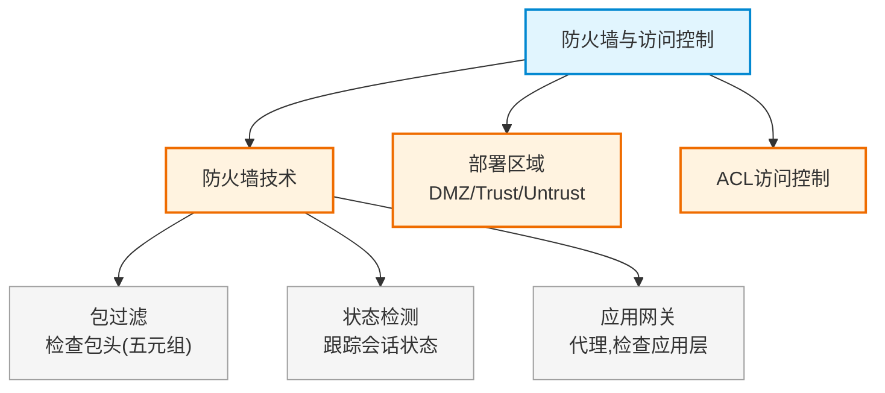

# 第十九章：防火墙与访问控制

> 对应课件：`11-3 防火墙与访问控制.pdf`（共 18 页）
> 本章聚焦防火墙技术（包过滤/状态检测/应用网关）、ACL 访问控制。
> ⚠️ 骨架占位，内容待对照 PDF 补充。

## 1. 核心考点脑图 (Mindmap)

---

## 2. 深度理论解析 (Theory & Concepts)

> 待补充：防火墙三种技术原理对比、安全区域划分、ACL 规则匹配顺序。

## 3. 横向对比与易错辨析 (Comparisons & Pitfalls)

> 待补充：防火墙技术对比表、DMZ 部署辨析。

## 4. 历年真题与解析 (Exam Questions)

> 待补充：真实历年真题，标注出处年份。

## 5. 备考建议 (Exam Tips)

> 待补充：高频考点回顾、记忆口诀、易错提醒。
