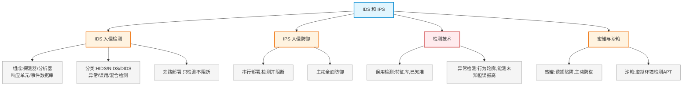

# 第二十章：IDS 和 IPS

> 对应课件：`11-4 IDS和IPS.pdf`（共 25 页）
> 本章聚焦入侵检测系统（IDS）与入侵防御系统（IPS）的原理、组成、检测技术、部署差异，以及蜜罐与沙箱。

## 1. 核心考点脑图 (Mindmap)



---

## 2. 深度理论解析 (Theory & Concepts)

### 2.1 IDS 定义与组成 ⭐

**入侵检测 IDS** 是防火墙之后的**第二道安全屏障**。

#### IDS 组成（4 部分）

| 组成 | 功能 |
| :--- | :--- |
| **探测器** | 负责**收集**各类数据 |
| **分析器** | 分析数据，判断是否有入侵 |
| **响应单元** | 对分析结果响应（报警、记录等） |
| **事件数据库** | 存放中间数据和结果数据，是系统的日志部件 |

#### IDS 分析方法（3 种）⭐

1.  **模式匹配**
2.  **统计分析**
3.  **数据完整性分析**

> **易错点**：IDS 三种分析方法 = 模式匹配、统计分析、数据完整性分析。**密文分析不属于**（2014.5 第 45 题）。

### 2.2 IDS 数据源与部署

*   **数据源**：操作系统审计记录/日志、网络数据。
*   **网络数据采集**：核心交换机**端口镜像**、服务器接入交换机端口镜像。
*   **部署方式**：**旁路部署**（不串入业务流量）。

#### 华为交换机端口镜像配置示例

将 g1/0/2 流量镜像到部署 Snort 的 g1/0/1：

```
<HUAWEI> system-view
[HUAWEI] observe-port 1 interface gigabitethernet 1/0/1    //定义观察端口
[HUAWEI] interface gigabitethernet 1/0/2                    //进入采集接口
[HUAWEI-GigabitEthernet0/0/2] port-mirroring to observe-port 1 inbound   //镜像入方向流量
```

### 2.3 入侵检测分类 ⭐⭐ 高频考点

#### 按信息来源分

| 类型 | 说明 |
| :--- | :--- |
| **HIDS** | 主机型 |
| **NIDS** | 网络型 |
| **DIDS** | 分布式 |

#### 按数据分析技术分（核心考点）⭐⭐

| 类型 | 原理 | 特点 |
| :--- | :--- | :--- |
| **异常检测** | 建立并维护系统**正常行为轮廓**，定义报警阈值，超过则报警 | 能检测**从未出现的攻击**，但**误报率高** |
| **误用检测** | 提取已知入侵行为特征，形成**入侵模式库**，匹配则报警 | 已知入侵**准确率高**，未知入侵准确率低，**高度依赖特征库**；技术=专家系统+模式匹配 |
| **混合检测** | 结合两者 | — |

> **⭐ 易错点（高频）**：
> *   **异常检测** = 检测未知攻击能力强，但**误报率高**（基于正常行为轮廓）。
> *   **误用检测** = 已知攻击准确率高，**依赖特征库**，未知攻击检测能力弱。
> *   误用检测技术 = **专家系统 + 模式匹配**。

### 2.4 入侵防御系统 IPS ⭐

**IPS** 是一种**抢先的**网络安全检测和防御系统，能检测出攻击并**积极响应**。

*   IPS 不仅具有 IDS 检测攻击行为的能力，还具有**拦截和阻断**攻击的功能。
*   IPS **不是 IDS 和防火墙功能的简单组合**，采取主动的全面深层次防御。
*   IPS 检测技术更丰富：基于特征的匹配、协议分析、抗 DoS/DDoS、智能化检测、**蜜罐技术**（主动防御）等。
*   **缺点**：因串行部署，可能存在**单点故障、性能瓶颈、漏报误报**，需保持特征库更新。

### 2.5 IDS vs IPS 对比 ⭐⭐ 高频考点

| 对比项 | IDS（入侵检测） | IPS（入侵防御） |
| :--- | :--- | :--- |
| **部署位置** | **旁路部署** | **串行部署** |
| **入侵响应能力** | 只能检测、记录日志、发出警报 | 能检测**并能主动防御阻断** |
| 主动性 | 被动检测 | 主动全面防御 |

> **⭐ 易错点（高频）**：
> *   **IDS 旁路部署、只检测不阻断**；**IPS 串行部署、检测并阻断**。
> *   IDS 不能消除病毒（病毒消除是防病毒软件功能）。
> *   部署 SQL 注入防御：IDS **不能**阻断（只能检测），需用 WAF/IPS。

### 2.6 安全扫描与蜜罐

#### 安全扫描

*   内容：漏洞扫描、端口扫描、密码类扫描（发现弱口令密码）。
*   由扫描器软件完成，是最有效的网络安全检测工具之一，自动检测远程/本地主机、网络系统的安全弱点和漏洞。

#### 蜜罐 ⭐

*   **主动防御技术**，是入侵检测技术的发展方向，是"**诱捕**"攻击者的陷阱。
*   蜜罐系统是**包含漏洞的诱骗系统**，模拟易受攻击的主机和服务，给攻击者提供容易攻击的目标。
*   作用：攻击者在蜜罐浪费时间，延缓对真正目标的攻击；为入侵取证提供信息和线索，便于研究攻击行为。

### 2.7 沙箱（APT 检测）⭐

*   **作用**：对 APT 攻击中的恶意文件深度检测，检测 APT 攻击的渗透阶段和控制建立阶段。
*   **原理**：动态和静态检测相结合，利用机器学习发现威胁；在**虚拟环境运行可疑文件**，天然解决恶意文件的分片分段、加壳等逃逸手段。
*   **检测文件类型**：Windows 可执行文件（EXE/dll）、Web 网页（JS/Flash/JavaApplet）、办公文档（Office/PDF/WPS）、图片（JPEG/PNG）、压缩文件/加壳文件。
*   华为 FireHunter6000 系列沙箱，全场景部署（互联网边界、分支接入边界、数据中心边界、核心部门边界）。

---

## 3. 横向对比与易错辨析 (Comparisons & Pitfalls)

### 3.1 安全设备功能对照

| 设备 | 部署 | 核心功能 | 能否阻断 |
| :--- | :--- | :--- | :--- |
| 防火墙 | 串联 | 访问控制、内外网隔离 | 能（按规则） |
| IDS | **旁路** | 检测、报警、记录 | **不能**阻断 |
| IPS | **串联** | 检测+防御阻断 | 能主动阻断 |
| 蜜罐 | 诱骗 | 诱捕攻击者 | 主动防御 |
| 沙箱 | — | APT 恶意文件检测 | 检测 |

### 3.2 高频易错点速记

> **易错点 1**：IDS 是防火墙后**第二道屏障**；4 组成 = 探测器/分析器/响应单元/事件数据库。
>
> **易错点 2**：IDS 三分析方法 = 模式匹配、统计分析、数据完整性分析（密文分析不属于）。
>
> **易错点 3**：异常检测能测**未知攻击但误报高**；误用检测已知准确但**依赖特征库**（专家系统+模式匹配）。
>
> **易错点 4**：**IDS 旁路只检测不阻断，IPS 串联检测并阻断**——最核心区别。
>
> **易错点 5**：IDS 不能消除病毒（防病毒软件才消除）；不能阻断 SQL 注入（需 WAF/IPS）。
>
> **易错点 6**：IDS 分类按来源 = HIDS/NIDS/DIDS；蜜罐是主动防御诱捕陷阱；沙箱虚拟环境检测 APT。
>
> **易错点 7**：IPS 缺点 = 单点故障、性能瓶颈、漏报误报、需更新特征库、串行增加延迟。

---

## 4. 历年真题与解析 (Exam Questions)

### 4.1 网规 2016年11月 案例三/问题1 ⭐⭐（安全设备部署案例）

**背景**：某互联网服务企业网络，主要对外提供网站消息发布、在线销售管理服务，采用访问控制、NAT、异常流量检测、非法访问阻断等安全措施。

**【问题1】**（6分）在不同位置部署安全设备：安全设备1处部署（1），设备2处部署（2），设备3处部署（3）。（备选：A.防火墙 B.IDS C.IPS）

**【参考答案】**：（1）A 防火墙　（2）B IDS　（3）C IPS

**【问题2】**（6分多选）防火墙可部署的防范措施（4）；IDS 可部署（5）；IPS 可部署（6）。
（备选：A访问控制 B.NAT C上网行为审计 D包检测分析 E数据库审计 F DDoS检测阻止 G负载均衡 H异常流量阻断 I漏洞扫描 J Web应用防护）

**【参考答案】**：（4）A、B　（5）D　（6）D、H、J

**【问题3】**（5分）说明 IPS 的不足和缺点。

**【参考答案】**：
1.  访问 Web 服务器的流量都要经过 IPS，会**加大网络延迟**。
2.  IPS 存在**单点故障和性能瓶颈**。
3.  IPS 安全策略设置不合理会导致**误报率高**。

### 4.2 网工 2014年5月 第45题 ⭐（IDS 分析方法）

**题目**：在入侵检测系统中，事件分析器接收事件信息并分析，判断是否为入侵行为或异常现象，其常用的三种分析方法中不包括（45）。
A. 匹配模式　B. 密文分析　C. 数据完整性分析　D. 统计分析

**【参考答案】B**

**【解析】**：三种分析方法 = **模式匹配、统计分析、数据完整性分析**。密文分析不属于 → B。

### 4.3 网工 2017年11月 第45题 ⭐（IDS 功能）

**题目**：以下关于入侵检测系统描述中，正确的是（45）。
A. 实现内外网隔离与访问控制　B. 对进出网络的信息进行实时监测与比对，及时发现攻击行为　C. 隐藏内部网络拓扑　D. 预防、检测和消除网络病毒

**【参考答案】B**

**【解析】**：A 是防火墙功能，C 是 NAT 功能，D 中 IDS **不能消除病毒**。IDS 的作用是对进出网络信息实时监测比对、及时发现攻击 → B。

### 4.4 网工 2017年11月 第65题 ⭐（入侵检测技术）

**题目**：（65）不属于入侵检测技术。
A. 专家系统　B. 模型检测　C. 简单匹配　D. 漏洞扫描

**【参考答案】D**

**【解析】**：入侵检测技术 = 异常检测、误用检测（专家系统和模式匹配）、混合检测。**漏洞扫描**不属于入侵检测技术（是安全扫描） → D。

### 4.5 网工 2022年5月 第45题 ⭐⭐（IDS vs IPS）

**题目**：SQL 注入是常见的 Web 攻击，以下不能够有效防御 SQL 注入的手段是（45）。
A. 对用户输入做关键字过滤　B. 部署 Web 应用防火墙防护　C. 部署入侵检测系统阻断攻击　D. 定期扫描系统漏洞并及时修复

**【参考答案】C**

**【解析】**：IDS 与 IPS 最主要两点差异：
1.  **IDS 只能检测，不能阻断攻击**。
2.  IDS 一般旁路部署，IPS 串行部署。

部署 IDS **不能阻断** SQL 注入（只能检测），需用 WAF/IPS → C。

> **考点关联**：防御 SQL 注入用 WAF/IPS（能阻断），IDS 只检测不阻断。

---

## 5. 备考建议 (Exam Tips)

### 高频考点回顾

1.  **IDS**：防火墙后第二道屏障；4 组成（探测器/分析器/响应单元/事件数据库）；3 分析方法（模式匹配/统计分析/数据完整性分析）。
2.  **IDS 数据源**：系统日志、端口镜像；**旁路部署**。
3.  **IDS 分类**：按来源 HIDS/NIDS/DIDS；按技术 异常/误用/混合检测。
4.  **异常检测 vs 误用检测**：异常能测未知但误报高；误用已知准但依赖特征库（专家系统+模式匹配）。
5.  **IDS vs IPS**：IDS 旁路只检测不阻断；IPS 串联检测并阻断、主动防御。
6.  **IPS 缺点**：单点故障、性能瓶颈、漏报误报、增加延迟、需更新特征库。
7.  **蜜罐**：主动防御诱捕陷阱，含漏洞诱骗系统。
8.  **沙箱**：虚拟环境运行可疑文件检测 APT，动静态结合+机器学习。
9.  **辨析**：IDS 不消除病毒、不阻断攻击；防火墙做隔离访问控制；NAT 隐藏拓扑。

### 记忆口诀

*   **IDS 四组成**："探测采，分析判，响应报，库存据"
*   **三分析方法**："模式统计完整性，密文分析不入选"
*   **异常 vs 误用**："异常测未知误报高，误用准但靠特征库"
*   **IDS vs IPS**："IDS 旁路只检测，IPS 串联能阻断"
*   **IPS 缺点**："单点瓶颈误报迟，特征库要常更新"
*   **蜜罐沙箱**："蜜罐诱捕主动防，沙箱虚拟测 APT"
