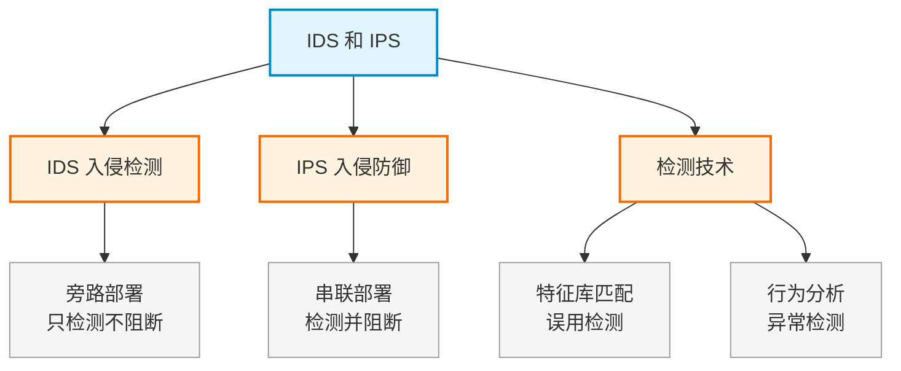

# 第二十章：IDS 和 IPS

> 对应课件：`11-4 IDS和IPS.pdf`（共 25 页）
> 本章聚焦入侵检测系统（IDS）与入侵防御系统（IPS）的原理、部署与区别。
> ⚠️ 骨架占位，内容待对照 PDF 补充。

## 1. 核心考点脑图 (Mindmap)

---

## 2. 深度理论解析 (Theory & Concepts)

> 待补充：IDS/IPS 原理、旁路 vs 串联部署、误用检测 vs 异常检测。

## 3. 横向对比与易错辨析 (Comparisons & Pitfalls)

> 待补充：IDS vs IPS 对比表。

## 4. 历年真题与解析 (Exam Questions)

> 待补充：真实历年真题，标注出处年份。

## 5. 备考建议 (Exam Tips)

> 待补充：高频考点回顾、记忆口诀、易错提醒。
