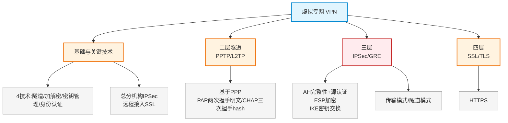

# 第二十一章：虚拟专网技术（VPN）

> 对应课件：`11-5 虚拟专网技术.pdf`（共 38 页）
> 本章聚焦 VPN 技术：隧道协议分层（L2TP/PPTP、IPSec/GRE、SSL/TLS）、PPP 认证（PAP/CHAP）、IPSec（AH/ESP/IKE、传输/隧道模式）、GRE/MPLS VPN。

## 1. 核心考点脑图 (Mindmap)



---

## 2. 深度理论解析 (Theory & Concepts)

### 2.1 虚拟专用网基础 ⭐

**虚拟专用网**（VPN）是建立在公网上的、由某一组织或某一群用户**专用**的通信网络。

#### VPN 协议分层 ⭐⭐ 高频考点

| 层次 | 协议 |
| :--- | :--- |
| **二层**（数据链路层） | **L2TP、PPTP**（基于 PPP） |
| **三层**（网络层） | **IPSec、GRE** |
| **四层**（传输层） | **SSL/TLS** |

#### VPN 四项关键技术

1.  **隧道技术**（Tunneling）
2.  **加解密技术**（Encryption & Decryption）
3.  **密钥管理技术**（Key Management）
4.  **身份认证技术**（Authentication）

#### VPN 解决方案选型 ⭐

| 场景 | 常用技术 |
| :--- | :--- |
| 总分机构互联（Site-to-Site） | **IPSec** |
| 远程用户接入（出差拨号访问内网） | **SSL** |

### 2.2 二层隧道协议（PPTP/L2TP）

PPTP 和 L2TP 都基于 **PPP 协议**：

| 协议 | 网络层要求 |
| :--- | :--- |
| **PPTP** | 只支持 TCP/IP 体系，网络层**必须是 IP** |
| **L2TP** | 可运行在 IP 上，也可在 **X.25、帧中继、ATM** 网络上使用 |

#### PPP 协议

*   PPP 包含**链路控制协议 LCP**和**网络控制协议 NCP**。
*   PPP 可在点对点链路传输多种上层协议数据包，有校验位。
*   PPP 是数据链路层协议，包含 3 类子协议：**封装协议、LCP、NCP**（PPTP/L2TP 基于 PPP 开发但**不属于 PPP**）。

> **易错点**：PPTP 必须 TCP/IP 支持，L2TP 不限于 IP（可 X.25/FR/ATM）。PPP 不含 PPTP。

### 2.3 PPP 认证方式：PAP 与 CHAP ⭐⭐ 高频考点

| 认证方式 | 握手次数 | 口令传输 | 发起方 |
| :--- | :--- | :--- | :--- |
| **PAP** | **两次握手** | **明文传送**口令 | 被验证方首先发起 |
| **CHAP** | **三次握手** | **不传口令**，传 **HMAC 散列值**（HASH） | 主认证方发质询（挑战报文） |

#### CHAP 认证过程

1.  主认证方发送**质询**（用户名 + 随机报文）。
2.  被认证方计算报文的 **HASH 值**返回。
3.  主认证方验证，通过或拒绝。

> **⭐ 易错点（高频）**：
> *   **PAP 两次握手、明文传口令**（不安全）。
> *   **CHAP 三次握手、传 HASH 值不传口令**（安全）；挑战报文计算 **HASH 值**返回。
> *   CHAP 是周期性验证身份。

### 2.4 IPSec 基础与原理 ⭐⭐ 核心

**IPSec**（IP Security）是 IETF 定义的协议组，用于增强 **IP 网络安全性**（网络层/三层）。

#### IPSec 提供的安全服务

*   数据完整性（Data Integrity）
*   认证（Authentication）
*   保密性（Confidentiality）
*   应用透明安全性（Application-transparent Security）

#### IPSec 三大功能组件 ⭐⭐ 高频考点

| 组件 | 功能 | 算法 |
| :--- | :--- | :--- |
| **AH**（认证头） | 数据完整性 + 数据源认证 + 抗重放攻击，**不提供加密/保密** | **MD5、SHA**（哈希） |
| **ESP**（封装安全负荷） | **数据加密**（也可完整性、源认证） | **DES、3DES、AES** |
| **IKE**（Internet 密钥交换） | 生成和分发 AH/ESP 使用的密钥 | **DH**（Diffie-Hellman） |

> **⭐⭐ 易错点（必考）**：
> *   **AH 不提供数据加密/保密性**（只完整性+源认证+抗重放），用 MD5/SHA 哈希。
> *   **ESP 提供数据加密**（也可完整性+源认证），用 DES/3DES/AES。
> *   **IKE** 用 **DH** 算法交换密钥（DH 是密钥交换算法，非数据加密算法）。
> *   AH 不封装在 TCP 内部（在 IP 层）。

### 2.5 IPSec 两种封装模式 ⭐⭐ 高频考点

| 模式 | 封装方式 | 是否新增 IP 头 |
| :--- | :--- | :--- |
| **传输模式**（Transport） | 在原有 IP 报文中插入 AH/ESP 头，**保留原 IP 头** | 否（不新增） |
| **隧道模式**（Tunnel） | 对**整个原 IP 报文**（含原 IP 头）封装 + 加密，再加**新的 IP 头** | **是（新增新 IP 头）** |

#### 封装结构

```
原始报文:   [原IP头] [TCP] [数据]
传输模式:   [原IP头] [AH] [TCP] [数据]          （原IP头不变，插入AH）
隧道模式:   [新IP头] [AH] [原IP头] [TCP] [数据]  （整个原报文封装，加新IP头）
```

> **⭐ 易错点**：
> *   **传输模式**：保留原 IP 头，只插入 AH/ESP，对**数据部分**重新封装。
> *   **隧道模式**：对含原 IP 头的**所有字段**封装，再加**新 IP 头**（更安全，常用）。
> *   IPSec 是**网络层（三层）**协议；为 IP 数据报加密选 IPSec（ESP）。

### 2.6 GRE 与 MPLS VPN

| 协议 | 特点 |
| :--- | :--- |
| **GRE**（通用路由封装） | 网络层隧道协议，对**组播**支持好，但**本身不加密** |
| **IPSec** | 可加密，但**对组播支持不佳** |
| **MPLS VPN** | 主要用于广域网实现**业务隔离** |

> **易错点**：语音/视频业务常**先用 GRE 封装（支持组播）再用 IPSec 加密**——GRE 不加密、IPSec 不善组播，两者互补。**自带加密功能的是 IPSec**（GRE/L2TP/MPLS-VPN 本身不加密）。

---

## 3. 横向对比与易错辨析 (Comparisons & Pitfalls)

### 3.1 IPSec AH vs ESP 对比 ⭐⭐

| 功能 | AH | ESP |
| :--- | :--- | :--- |
| 数据完整性 | ✅ | ✅ |
| 数据源认证 | ✅ | ✅ |
| 抗重放攻击 | ✅ | ✅ |
| **数据加密/保密性** | ❌（不提供） | ✅（核心） |
| 算法 | MD5/SHA | DES/3DES/AES |

### 3.2 VPN 协议分层速查

| 层 | 协议 | 加密 | 备注 |
| :--- | :--- | :--- | :--- |
| 二层 | PPTP/L2TP | 否（可用 IPSec 加密） | 基于 PPP |
| 三层 | IPSec | ✅ | AH/ESP/IKE |
| 三层 | GRE | 否 | 支持组播 |
| 四层 | SSL/TLS | ✅ | HTTPS |

### 3.3 高频易错点速记

> **易错点 1**：VPN 分层——二层 L2TP/PPTP、三层 IPSec/GRE、四层 SSL/TLS。
>
> **易错点 2**：总分机构用 IPSec，远程接入用 SSL。
>
> **易错点 3**：PPTP 必须 TCP/IP，L2TP 可 X.25/FR/ATM；PPP 不含 PPTP/L2TP。
>
> **易错点 4**：PAP 两次握手明文；CHAP 三次握手传 HASH 不传口令。
>
> **易错点 5**：**AH 不加密**（完整性+源认证+抗重放，MD5/SHA）；**ESP 加密**（DES/3DES/AES）；**IKE 用 DH** 交换密钥。
>
> **易错点 6**：传输模式保留原 IP 头只插 AH/ESP；隧道模式封装整个原报文+加新 IP 头。
>
> **易错点 7**：IPSec 是**网络层**协议，为 IP 报文加密用 IPSec（ESP）。
>
> **易错点 8**：DH 是**密钥交换算法**（非对称），不是数据加密算法。
>
> **易错点 9**：自带加密的隧道是 IPSec；GRE/L2TP/MPLS-VPN 本身不加密（GRE+IPSec 组合）。

---

## 4. 历年真题与解析 (Exam Questions)

### 4.1 网工 2014年11月 第19题 ⭐（PPP）

**题目**：PPP 是连接广域网的一种封装协议，下面关于 PPP 描述错误的是（19）。
A. 能够控制数据链路的建立　B. 能够分配管理广域网的IP地址　C. 只能采用IP作为网络层协议　D. 能够有效进行错误检测

**【参考答案】C**

**【解析】**：PPP 是多协议封装，**不只能用 IP**（可传输多种上层协议）。HDLC 才只能用 IP。PPP 能控制链路建立、分配 IP（NCP）、错误检测 → C 错误。

### 4.2 网工 2013年11月 第19-20题 ⭐⭐（CHAP）

**题目**：CHAP 协议采用（19）握手方式周期性验证通信对方身份，当认证服务器发出挑战报文时，终端计算该报文的（20）返回。

**【参考答案】（19）B 三次　（20）D HASH 值**

**【解析】**：CHAP **三次握手**，不传口令，传 **HASH 值**（散列值）。主认证方发挑战报文，被认证方计算 HASH 返回。

### 4.3 网工 2014年5月 第43题 ⭐⭐（IPSec AH/ESP）

**题目**：以下关于 IPSec 协议的描述中，正确的是（43）。
A. IPSec 认证头（AH）不提供数据加密服务
B. IPSec 封装安全负荷（ESP）用于数据完整性认证和数据源认证
C. IPSec 的传输模式对原来的 IP 数据报进行了封装和加密，再加上新的 IP 头
D. IPSec 通过应用层的 Web 服务器建立安全连接

**【参考答案】A**

**【解析】**：**AH 不提供数据加密**（只完整性+源认证）→ A 正确。ESP 主要用于**数据加密**（B 错，B 描述的是 AH 功能）。**隧道模式**才加新 IP 头（C 描述的是隧道模式却说传输模式，错）。IPSec 是**网络层**协议，非应用层（D 错）。

### 4.4 网工 2017年5月 第39题 ⭐（AH 位置）

**题目**：IPSec 用于增强 IP 网络的安全性，下面说法不正确的是（39）。
A. IPSec 可对数据进行完整性保护　B. IPSec 提供用户身份认证服务　C. IPSec 的认证头添加在 TCP 封装内部　D. IPSec 对数据加密传输

**【参考答案】C**

**【解析】**：**AH 没有封装在 TCP 内部**（AH 在 IP 层，不在 TCP 内）→ C 不正确。

### 4.5 网工 2021年5月 第39题 ⭐（IP 报文加密）

**题目**：通常使用（39）为 IP 数据报文进行加密。
A. IPSec　B. PPTP　C. HTTPS　D. TLS

**【参考答案】A**

**【解析】**：IP 数据是三层，选三层 VPN **IPSec**（ESP 提供数据加密）。PPTP 是二层、HTTPS/TLS 是四层。

### 4.6 网规 2015年11月 第14-15题 ⭐⭐（二层隧道）

**题目**：下面 4 组协议中，属于第二层隧道协议的是（14），第二层隧道协议中必须要求 TCP/IP 支持的是（15）。
（14）A.PPTP和L2TP　B.PPTP和IPSec　C.L2TP和GRE　D.L2TP和IPSec
（15）A.IPSec　B.PPTP　C.L2TP　D.GRE

**【参考答案】（14）A　（15）B**

**【解析】**：二层隧道 = **PPTP 和 L2TP**（14→A）。其中 **PPTP 必须 TCP/IP** 支持（15→B），L2TP 不限于 IP。

### 4.7 网规 2015年11月 第44题 ⭐（封装模式）

**题目**：关于 IPSec 认证头方式中，封装与模式匹配正确的是（44）。
A. 传输模式采用封装方式①　B. 隧道模式采用封装方式②　C. 隧道模式采用封装方式③　D. 传输模式采用封装方式③

**【参考答案】C**

**【解析】**：传输模式在原有 IP 报文插入 AH 头；**隧道模式需要重新封装认证头**（③ 隧道模式，含新 IP 头 + AH + 原 IP 头） → C。

### 4.8 网规 2015年11月 第45题 ⭐（加密算法辨析）

**题目**：下列协议中，不用于数据加密的是（45）。
A. IDEA　B. Diffie-Hellman　C. AES　D. RC4

**【参考答案】B**

**【解析】**：**Diffie-Hellman（DH）是密钥交换算法**（非对称），不是数据加密算法。IDEA/AES/RC4 都是加密算法 → B。

### 4.9 网规 2015年11月 第47题 ⭐（PPP 组成）

**题目**：PPP 协议不包含（47）。
A. 封装协议　B. 点对点隧道协议（PPTP）　C. 链路控制协议（LCP）　D. 网络控制协议（NCP）

**【参考答案】B**

**【解析】**：PPP 含 3 类子协议：封装协议、LCP、NCP。**PPTP/L2TP 基于 PPP 开发但不属于 PPP** → B。

### 4.10 网规 2017年11月/2020年11月 第44/45题 ⭐⭐（AH 不加密）

**题目**：下列关于 IPSec 的说法中，错误的是？
B. 认证头 AH 提供数据完整性认证、数据源认证和**数据机密性**服务

**【参考答案】B**

**【解析】**：**AH 不能加密，不提供数据机密性**；ESP 提供机密性。AH 采用哈希算法（MD5/SHA）防截断、防伪造、防抵赖。

### 4.11 网规 2020年11月 第44题 ⭐（网际层安全）

**题目**：能够增强和提高网际层安全的协议是（44）。
A. IPSec　B. L2TP　C. TLS　D. PPTP

**【参考答案】A**

**【解析】**：网际层即网络层（三层），**IPSec** 增强网络层安全。L2TP/PPTP 是二层，TLS 是四层。

### 4.12 网规 2022年11月 第39题 ⭐⭐（自带加密隧道）

**题目**：下列隧道技术中本身自带加密功能的是（39）。
A. GRE　B. L2TP　C. MPLS-VPN　D. IPSec

**【参考答案】D**

**【解析】**：**IPSec 自带加密**（ESP 实现数据加密）。GRE/L2TP/MPLS-VPN 本身不加密 → D。

### 4.13 网规 2022年11月 第44题 ⭐⭐（AH 功能）

**题目**：IPSec 两个基本协议是 AH 和 ESP，下面不属于 AH 协议的是（44）。
A. 数据保密性　B. 抵抗重放攻击　C. 数据源认证　D. 数据完整认证

**【参考答案】A**

**【解析】**：**数据保密性（加密）由 ESP 实现**，不属于 AH。AH 提供完整性、源认证、抗重放攻击 → A。

---

## 5. 备考建议 (Exam Tips)

### 高频考点回顾

1.  **VPN 分层**：二层 L2TP/PPTP、三层 IPSec/GRE、四层 SSL/TLS；4 关键技术（隧道/加解密/密钥管理/身份认证）。
2.  **选型**：总分机构 IPSec，远程接入 SSL。
3.  **PPTP/L2TP**：基于 PPP；PPTP 必须 TCP/IP，L2TP 可 X.25/FR/ATM；PPP 含封装/LCP/NCP（不含 PPTP）。
4.  **PAP vs CHAP**：PAP 两次握手明文；CHAP 三次握手传 HASH 不传口令、周期性验证。
5.  **IPSec 三组件**：AH（完整性+源认证+抗重放，**不加密**，MD5/SHA）；ESP（**加密**，DES/3DES/AES）；IKE（DH 密钥交换）。
6.  **传输 vs 隧道模式**：传输保留原 IP 头插 AH/ESP；隧道封装整个原报文加新 IP 头。
7.  **IPSec 是网络层协议**，为 IP 报文加密用 IPSec。
8.  **DH 是密钥交换算法**（非加密算法）。
9.  **GRE 不加密但支持组播**，IPSec 加密但组播不佳 → GRE+IPSec 组合；自带加密的隧道是 IPSec。

### 记忆口诀

*   **VPN 分层**："二层 L2TP 和 PPTP，三层 IPSec 加 GRE，四层 SSL/TLS"
*   **选型**："总分 IPSec，远程 SSL"
*   **PAP/CHAP**："PAP 两握明文传，CHAP 三握传 hash"
*   **IPSec 三件套**："AH 完整不加密 MD5/SHA，ESP 加密 DES/3DES/AES，IKE 用 DH 交换密钥"
*   **模式**："传输留原头，隧道加新头"
*   **GRE+IPSec**："GRE 不加密会组播，IPSec 加密组播差，两者互补"
