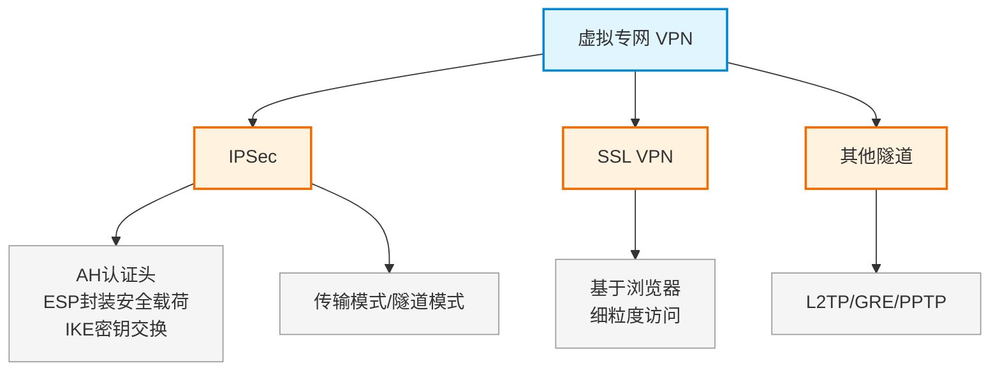

# 第二十一章：虚拟专网技术（VPN）

> 对应课件：`11-5 虚拟专网技术.pdf`（共 38 页）
> 本章聚焦 VPN 技术：IPSec、SSL VPN、L2TP/GRE 等隧道协议。
> ⚠️ 骨架占位，内容待对照 PDF 补充。

## 1. 核心考点脑图 (Mindmap)

---

## 2. 深度理论解析 (Theory & Concepts)

> 待补充：IPSec 三大协议（AH/ESP/IKE）、传输/隧道模式、SSL VPN 与 IPSec VPN 对比。

## 3. 横向对比与易错辨析 (Comparisons & Pitfalls)

> 待补充：IPSec vs SSL VPN 对比表、AH vs ESP 对比。

## 4. 历年真题与解析 (Exam Questions)

> 待补充：真实历年真题，标注出处年份。

## 5. 备考建议 (Exam Tips)

> 待补充：高频考点回顾、记忆口诀、易错提醒。
