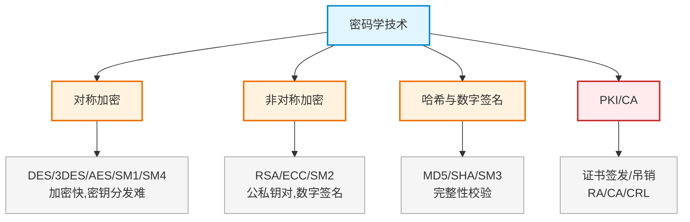

# 第二十二章：密码学技术

> 对应课件：`11-6 密码学技术.pdf`（共 59 页，模块最大章节）
> 本章是密码学核心：对称/非对称加密、哈希、数字签名、PKI/CA、密钥管理、国产算法。
> ⚠️ 骨架占位，内容待对照 PDF 补充。

## 1. 核心考点脑图 (Mindmap)

---

## 2. 深度理论解析 (Theory & Concepts)

> 待补充：对称/非对称加密原理与算法、哈希、数字签名流程、PKI 体系。

## 3. 横向对比与易错辨析 (Comparisons & Pitfalls)

> 待补充：对称 vs 非对称对比、各算法对比、国产 SM 系列对照。

## 4. 历年真题与解析 (Exam Questions)

> 待补充：真实历年真题，标注出处年份。

## 5. 备考建议 (Exam Tips)

> 待补充：高频考点回顾、记忆口诀、易错提醒。
