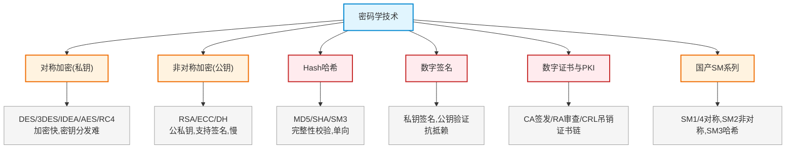
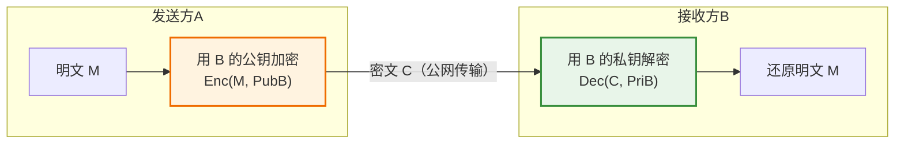
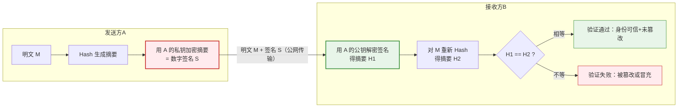
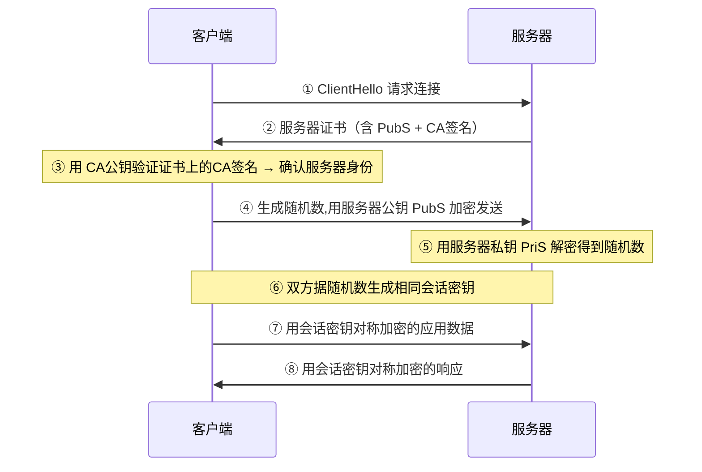
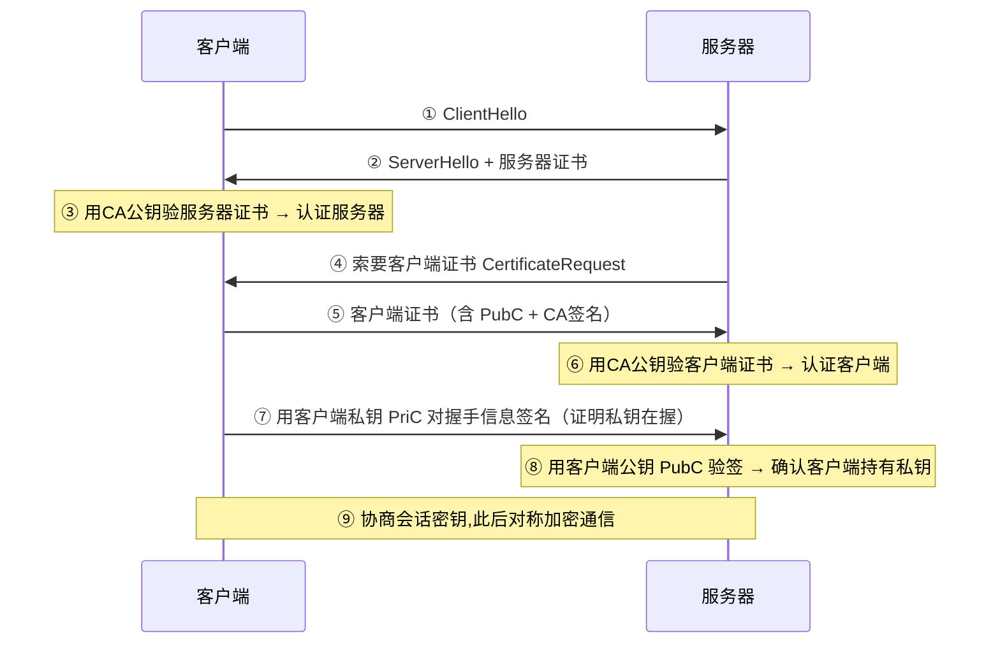
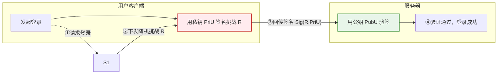
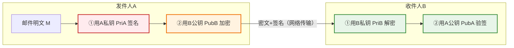

# 第二十二章：密码学技术

> 对应课件：`11-6 密码学技术.pdf`（共 59 页，模块最大章节）
> 本章是密码学核心：对称/非对称加密、Hash、数字签名、数字证书与 PKI、国产 SM 系列算法。

## 1. 核心考点脑图 (Mindmap)

---

## 2. 深度理论解析 (Theory & Concepts)

### 2.1 对称密码体制（私钥密码）⭐⭐

加密和解密使用**相同密钥**，收发双方须事先通过安全渠道交换密钥。

*   **优点**：加解密速度快、密文紧凑、长密钥难破解。
*   **缺点**：密钥分配问题、密钥管理问题、**无法认证源**。

#### 常见对称加密算法 ⭐⭐ 高频考点

| 算法 | 全称/说明 | 特点 |
| :--- | :--- | :--- |
| **DES** | 数据加密标准，分组加密 | 移位+替换，速度快；**分组 64 位、密钥 64 位、有效密钥 56 位** |
| **3DES** | 三重 DES（TDEA） | 加密-解密-加密（K1 加→K2 解→K1 加）；**密钥 112 位**（56×2） |
| **IDEA** | 国际数据加密算法，分组加密 | 明文/密文 64 位、**密钥 128 位**，用于 **PGP** |
| **AES** | 高级加密标准 | 硬件实现速度快；**分组 128 位**，支持 128/192/256 位密钥 |
| **RC4/5** | 流加密算法 | 用于 **WIFI**；速度快可达 DES 的 10 倍；分组和密钥长度可变 |

> **⭐ 易错点（密钥长度必记）**：
> *   DES 有效密钥 **56 位**（分组 64 位）
> *   3DES 密钥 **112 位**（=56×2）
> *   IDEA 密钥 **128 位**（用于 PGP）
> *   AES 分组 **128 位**，密钥 128/192/256 位
> *   RC4 是**流加密**（用于 WIFI），其余是分组加密

#### 3DES 加解密过程 ⭐

*   **加密**：K1 加密 → K2 解密 → K3 加密（一般 K1=K3）
*   **解密**：K3 解密 → K2 加密 → K1 解密
*   含 3 次加解密操作，2 个密钥（K1、K2），密钥长度 112 位

### 2.2 非对称密码体制（公钥密码）⭐⭐

加密和解密密钥**不同**，每个实体有**公钥（公开）**和**私钥（自己保存）**两个密钥。

*   **优点**：密钥分发方便、密钥保管量少、**支持数字签名**。
*   **缺点**：加密速度慢（计算量大，不适合加密大数据）、数据膨胀率高。

#### 公私钥用途 ⭐⭐ 高频考点

| 操作 | 用途 |
| :--- | :--- |
| **公钥加密，私钥解密** | 实现**保密通信**（加密） |
| **私钥加密，公钥解密** | 实现**数字签名**（签名/抗抵赖） |

#### 公私钥加解密流程图解 ⭐⭐

**① 公钥加密 / 私钥解密 —— 保密通信（防窃听）**

A 向 B 发机密消息：A 用 **B 的公钥**加密，只有 **B 的私钥**能解密。B 持密钥对（公钥 PubB 公开、私钥 PriB 保密）；公钥人人可得，但密文只有持私钥的 B 能解开 → 实现**保密性**。

> **作用辨析**：加密用的是**接收方**的公钥，保证**只有接收方**能解密 → 防窃听（保密性）。此过程与"谁发的"无关，不认证发送方身份。

**② 私钥加密 / 公钥解密 —— 数字签名（防抵赖/抗抵赖）**

A 用 **自己的私钥**对摘要签名，任何持有 **A 的公钥**者都可验证。A 持密钥对（公钥 PubA 公开、私钥 PriA 保密）→ 实现**身份认证 + 不可否认**。

> **作用辨析**：签名用的是**发送方**的私钥，证明**消息确由该发送方发出**且**未被篡改** → 防抵赖（抗抵赖）+ 完整性；验签用发送方公钥。

> **⭐ 一句话区分**：
> *   **保密**看接收方：用**对方公钥**加密 → 只有对方私钥能解。
> *   **签名**看发送方：用**自己私钥**签名 → 任何人都可用你的公钥验。

#### 常见非对称加密算法

| 算法 | 说明 |
| :--- | :--- |
| **RSA** | 512/1024 位密钥，计算量极大，难破解；**最常用签名算法** |
| **ECC** | 椭圆曲线算法 |
| **DH** | Diffie-Hellman，**密钥交换**算法（非数据加密） |
| **Elgamal、背包算法、Rabin** | 其他非对称算法 |

> **易错点**：RSA 既可加密又可签名；**DH 是密钥交换算法**（非加密算法）；ECC 椭圆曲线。

### 2.3 混合密码

发送方用**对称密钥**加密消息，再用接收方**公钥**加密对称密钥一起发送；接收方先用私钥解密得到对称密钥，再用对称密钥解密得到明文。

> **易错点**：PGP 是混合加密 = 对称（IDEA）+ 非对称（RSA）+ 散列（MD5）。PGP 用 **IDEA 加密数据**、**MD5 验证完整性**、RSA 签名。

### 2.4 国产加密算法 SM 系列 ⭐⭐ 高频考点

《密码法》将密码分为**核心密码、普通密码、商用密码**，分类管理。

| 算法 | 类型 | 特征 |
| :--- | :--- | :--- |
| **SM1** | **对称加密** | 分组长度和密钥长度都为 **128 比特** |
| **SM2** | **非对称加密** | 公钥加密、密钥交换、数字签名（**椭圆曲线**） |
| **SM3** | **杂凑（哈希）** | 分组 **512 位**，输出杂凑值 **256 位** |
| **SM4** | **对称加密** | 分组长度和密钥长度都为 **128 比特** |
| **SM9** | **标识密码** | 支持公钥加密、密钥交换、数字签名 |

> **⭐⭐ 易错点（必记）**：
> *   **SM1/SM4 = 对称加密**（分组+密钥均 128 位）
> *   **SM2 = 非对称加密**（椭圆曲线，签名/密钥交换）
> *   **SM3 = 哈希/摘要**（分组 512 位，输出 256 位）
> *   **SM9 = 标识密码**
> *   分组加密选 **SM4**（非 SM2/SM3/SM9）；摘要算法选 **SM3**。
> *   国密 SM2 数字证书采用 **ECC** 公钥算法（X.509 推荐 RSA）。

### 2.5 Hash 哈希算法 ⭐⭐

**HASH 函数**（杂凑/散列函数）将任意长度信息转换成**固定长度**的哈希值（数字摘要），不同消息生成的哈希值不同。

#### 哈希函数特性

1.  输入任意长度。
2.  输出固定长度。
3.  计算 h(M) 容易。
4.  找两个不同消息使 h(M1)=h(M2) 计算上不可行。
5.  **特性**：不可逆性（单向）、无碰撞性、**雪崩效应**。

#### 常见 Hash 算法 ⭐⭐ 高频考点

| 算法 | 分组 | 输出摘要 | 说明 |
| :--- | :--- | :--- | :--- |
| **MD5** | 512 位 | **128 位** | 常用于文件校验 |
| **SHA** | 512 位 | **160 位** | 比 MD5 更安全 |
| **SM3** | 512 位 | **256 位** | 国产 |

> **⭐ 易错点（摘要长度必记）**：MD5 输出 **128 位**，SHA 输出 **160 位**，SM3 输出 **256 位**。SHA-256 是**报文摘要**算法（非加密/签名）。

#### Hash 三大应用

1.  **文件完整性校验**：对比散列值判断文件是否被篡改。
2.  **账号密码存储**：明文存储无防护 → 哈希存储（彩虹表攻击）→ **盐+哈希**存储（防彩虹表）。
3.  **用户身份认证（MAC）**：增加随机数 R 做哈希，`MAC = Hash(密码+R)`；消除中间人攻击，实现**源认证+完整性校验**。

### 2.6 数字签名 ⭐⭐

签名方用**自己的私钥签名**，对方用**签名方的公钥验证**。

*   常用签名算法 **RSA**（采用发送者私钥签名，接收方用发送者公钥验证）。
*   可直接对明文签名（效率低），也可先由明文生成 Hash（如 MD5 128 位），再对 Hash 值签名（**效率更高**）。

#### 数字签名 6 大特点

1.  可信的
2.  不可伪造
3.  **不能重新使用**（不可重用）
4.  **签名文件不能改变**（不可修改）
5.  **不能抵赖**（不可否认）
6.  接收者能核实发送者身份

#### 数字签名两步与目的 ⭐⭐ 高频考点

| 步骤 | 算法 | 目的 |
| :--- | :--- | :--- |
| ① 生成消息摘要 | **MD5/SHA**（Hash） | **防止篡改**（完整性） |
| ② 对摘要加密（签名） | **RSA/DSA**（私钥） | **防止抵赖**（抗抵赖） |

> **⭐ 易错点**：
> *   生成摘要 = MD5/SHA → 防**篡改**（完整性）
> *   私钥加密摘要 = RSA/DSA → 防**抵赖**（抗抵赖）
> *   对**消息内容加密**才防**窃听**（保密性）——签名不是防窃听。
> *   签名不可重用、签名后文件不可修改。

### 2.7 数字证书与 CA ⭐⭐

#### 数字证书

*   类比身份证：CA 颁发，含**用户公钥**和**CA 的签名**，用于网络通信标识用户身份。
*   证书内容：姓名/地址/组织、**所有者公钥**、证书有效期、**CA 数据签名**。
*   用户可用 **CA 的公钥**验证证书真伪。

#### PKI 体系结构 ⭐⭐ 高频考点

| 组件 | 职责 |
| :--- | :--- |
| **用户/终端实体** | 向认证中心申请数字证书（个人/团体/政府机构） |
| **RA**（注册机构） | 受理申请、**验证用户身份**、资格审查（**不签发证书**，小机构可由 CA 兼任） |
| **CA**（证书颁发机构） | **颁发、管理、撤销证书** |
| **证书发布系统** | 证书发放（目录服务等） |
| **CRL 库** | 证书吊销列表，存放**过期或无效证书** |

#### 证书要点 ⭐⭐

*   数字证书是网上信息交换和商务活动的**身份证明**。
*   证书使用**公钥体制**，用户用**私钥**签名（不是公钥签名）。
*   证书包含**用户公钥**和 **CA 用私钥**为证书的签名。
*   用户端维护**有效证书 + CRL 吊销列表**。
*   数字证书**可以对外公开**。
*   X.509 证书标准推荐 **RSA**，国密 SM2 证书用 **ECC**。

> **⭐ 易错点（高频）**：
> *   证书含**用户公钥**（非私钥），CA 用**私钥**签名（非公钥）。
> *   负责验证用户身份的是 **RA**（非 CA）；CA 负责颁发管理。
> *   验证证书有效性看 **CA 的签名**；验证网站真伪靠证书中 CA 签名。
> *   HTTPS 加密 http 消息用**会话密钥+对称加密**（会话密钥通过公钥算法交换）。
> *   证书被撤销 → 客户端无法信任服务器、加密消息可能被第三方解密。

### 2.8 证书链 ⭐⭐

用户多时由多个 CA，每个 CA 为部分用户签发证书。两个 CA（X1、X2）彼此安全交换公钥、互相信任后，证书可形成**证书链**。

*   A（从 X1 获证书）获取 B（从 X2 获证书）公钥的证书链：`X1《X2》X2《B》`
*   B 获取 A 公钥的证书链：`X2《X1》X1《A》`

> **⭐ 易错点**：
> *   不同 CA 颁发的证书**不能直接互认**，需 CA 间先建立信任（交换公钥）形成证书链。
> *   A 和 B 同一 CA 可直接互认；不同 CA 需 CA 间交换**公钥**（私钥绝不交换）。

### 2.9 公私钥在认证机制中的应用场景 ⭐⭐

非对称加密的公私钥在多种认证场景中扮演不同角色，但核心规律不变：
**签名/认证 = 自己私钥签、对方公钥验；保密 = 对方公钥加、自己私钥解。**

#### 场景一：HTTPS 单向认证（服务器身份认证）

浏览器（客户端）验证服务器身份，服务器无需验证客户端。这是最常见的网站 HTTPS 场景。

> **公私钥作用**：
> *   **认证**：客户端用 **CA 公钥**验证证书上 **CA 的签名** → 证明证书真实可信 → 信任其中的**服务器公钥 PubS**。
> *   **保密**：客户端用 **服务器公钥 PubS** 加密随机数（预主密钥）→ 只有 **服务器私钥 PriS** 能解 → 协商出会话密钥。
> *   此后改用**对称加密**（会话密钥）传输数据——兼顾安全与速度（对应 4.14 题）。

#### 场景二：HTTPS 双向认证（mTLS，双方互认）

金融、企业内网等高安全场景，服务器也要验证客户端身份（客户端也持证书）。

> **公私钥作用**：
> *   **双向身份认证**：双方互验对方证书上的 **CA 签名**。
> *   **私钥在握证明**：客户端用 **自己的私钥 PriC** 对握手数据签名，服务器用 **客户端公钥 PubC** 验证 → 证明客户端确实持有私钥（防证书被盗用冒充）。
> *   单向认证只验服务器；双向认证在此基础上让服务器也验客户端，公私钥仍遵循"**自己私钥签、对方公钥验**"。

#### 场景三：SSH 公钥免密登录

用户把**自己的公钥**预先放到服务器，登录时用**自己的私钥**签名挑战，服务器用公钥验证——全程不传密码。

> **公私钥作用**：
> *   公钥预先部署在服务器（`~/.ssh/authorized_keys`），私钥由用户本地保管、从不出网。
> *   服务器发随机挑战 R，用户用**私钥签名**，服务器用**公钥验签** → 认证用户身份。
> *   本质是"**私钥签名 / 公钥验签**"的认证模型：抗窃听、抗重放，无需在网络中传输口令。

#### 场景四：S/MIME 安全邮件（签名 + 加密）

邮件需同时保证**防抵赖**（签名）和**保密**（加密），两套公私钥各司其职。

> **公私钥作用（两套密钥分工）**：
> *   **A 的密钥对**负责**签名/抗抵赖**：A 用 PriA 签，B 用 PubA 验 → 证明邮件来自 A。
> *   **B 的密钥对**负责**保密**：A 用 PubB 加密，B 用 PriB 解密 → 只有 B 能读。
> *   完整流程：先签后加（发）、先解后验（收），同时实现**保密性 + 完整性 + 抗抵赖**。

#### 场景总结：公私钥角色记忆法 ⭐⭐

| 场景 | 谁的私钥 | 谁的公钥 | 安全目标 |
| :--- | :--- | :--- | :--- |
| 保密通信 | 接收方私钥**解密** | 发送方用**接收方公钥**加密 | 防窃听（保密性） |
| 数字签名 | 发送方私钥**签名** | 接收方用**发送方公钥**验签 | 防抵赖 + 完整性 |
| HTTPS 单向认证 | 服务器私钥**解密握手** | 客户端用**服务器公钥**加密 | 服务器身份认证 + 保密 |
| HTTPS 双向认证 | 双方私钥**签名握手** | 双方互用**对方公钥**验证 | 双向身份认证 |
| SSH 免密登录 | 用户私钥**签挑战** | 服务器用**用户公钥**验签 | 用户身份认证 |
| S/MIME 邮件 | 发件方私钥签 + 收件方私钥解 | 发件方公钥验 + 收件方公钥加 | 防抵赖 + 保密 |

> **⭐ 通用口诀**：**"加密保密看对方公钥，签名认证看自己私钥"**——任何场景套用此规律即可判断公私钥角色。

---

## 3. 横向对比与易错辨析 (Comparisons & Pitfalls)

### 3.1 对称 vs 非对称加密

| 维度 | 对称（私钥） | 非对称（公钥） |
| :--- | :--- | :--- |
| 密钥 | 加解密**相同**密钥 | 公钥/私钥**不同** |
| 速度 | **快** | 慢（计算量大） |
| 密钥分发 | 难（需安全渠道） | 方便 |
| 数字签名 | ❌ 无法认证源 | ✅ 支持 |
| 适用 | 大数据加密 | 签名/密钥交换/小数据 |
| 算法 | DES/3DES/AES/IDEA/RC4 | RSA/ECC/DH |

### 3.2 国密算法速查 ⭐⭐

| 算法 | 类型 | 用途 |
| :--- | :--- | :--- |
| SM1 | 对称 | 加密（硬件实现） |
| SM2 | 非对称 | 加密/签名/密钥交换（ECC） |
| SM3 | 哈希 | 摘要（完整性） |
| SM4 | 对称 | 分组加密 |
| SM9 | 标识密码 | 加密/签名/密钥交换 |

### 3.3 高频易错点速记

> **易错点 1**：对称密钥长度——DES 56、3DES 112、IDEA 128、AES 分组 128；RC4 流加密用于 WIFI。
>
> **易错点 2**：公钥加密私钥解密=保密通信；私钥加密公钥解密=数字签名。
>
> **易错点 3**：DH 是**密钥交换**算法（非加密）；PGP=IDEA+RSA+MD5 混合。
>
> **易错点 4**：SM1/SM4 对称、SM2 非对称、SM3 哈希、SM9 标识密码。
>
> **易错点 5**：Hash 摘要长度——MD5 128、SHA 160、SM3 256；SHA-256 是报文摘要算法。
>
> **易错点 6**：盐+哈希防彩虹表；MAC=Hash(密码+R) 源认证+完整性。
>
> **易错点 7**：数字签名——MD5/SHA 生成摘要防篡改，RSA/DSA 私钥加密摘要防抵赖；签名不可重用、文件不可修改。
>
> **易错点 8**：证书含**用户公钥+CA私钥签名**；验证用户身份是 RA，颁发是 CA；CRL 存吊销证书。
>
> **易错点 9**：HTTPS 用会话密钥+对称加密（会话密钥公钥交换）；证书撤销则客户端无法信任服务器。
>
> **易错点 10**：不同 CA 证书不能直接互认，需 CA 间交换公钥形成证书链；私钥绝不交换。

---

## 4. 历年真题与解析 (Exam Questions)

### 4.1 网规 2016年11月 第44题 ⭐（3DES 密钥长度）

**题目**：DES 密钥长度 56 位，三重 DES 的密钥长度是（44）位。
A.168　B.128　C.112　D.56

**【参考答案】C**

**【解析】**：3DES 用 2 个密钥进行三次加解密，密钥长度 = 56×2 = **112 位** → C。

### 4.2 网规 2017年11月 第46题 ⭐（3DES 过程）

**题目**：假设两个密钥 K1 和 K2，正确使用三重 DES 加密明文 M 的过程是？
① K1 加密 M 得 C1　② K1 解密 C1 得 C2　③ K2 解密 C1 得 C2　④ K1 加密 C2 得 C3　⑤ K2 加密 C2 得 C3

**【参考答案】B（①③④）**

**【解析】**：3DES = K1 加密 → K2 解密 → K1 加密，即 ①K1 加密 → ③K2 解密 → ④K1 加密 → B。

### 4.3 网工 2022年5月 第44题 ⭐（SM 分组加密）

**题目**：我国自主研发的商用密码标准算法中，用于分组加密的是（44）。
A.SM2　B.SM3　C.SM4　D.SM9

**【参考答案】C**

**【解析】**：SM4 是对称分组加密。SM2 非对称、SM3 哈希、SM9 标识密码 → C。

### 4.4 网工 2017年5月 第37-38题 ⭐⭐（PGP）

**题目**：PGP 提供数据加密和数字签名，使用（37）数据加密，使用（38）数据完整性验证。
（37）A.RSA　B.IDEA　C.MD5　D.SHA-1　（38）A.RSA　B.IDEA　C.MD5　D.SHA-1

**【参考答案】（37）B　（38）C**

**【解析】**：PGP 是混合加密 = 对称（**IDEA**）加密数据 + 非对称（RSA）+ 散列（**MD5**）验证完整性 → 37选B（IDEA加密），38选C（MD5验证）。

### 4.5 网工 2018年11月 第44-45题 ⭐⭐（MD5）

**题目**：MD5 是（44）算法，对任意长度输入计算结果为（45）位。
（44）A.路由选择　B.摘要　C.共享密钥　D.公开密钥　（45）A.56　B.128　C.140　D.160

**【参考答案】（44）B　（45）B**

**【解析】**：MD5 是**摘要**算法，输出 **128 位** → 44选B，45选B。

### 4.6 网工 2020年11月 第42题 ⭐（SHA-256）

**题目**：SHA-256 是（42）算法。
A.加密　B.数字签名　C.认证　D.报文摘要

**【参考答案】D**

**【解析】**：SHA 和 MD5 都是 **HASH 算法**（散列/报文摘要） → D。

### 4.7 网工 2023年5月 第16题 ⭐（SM3 摘要）

**题目**：在我国商用密码算法体系中（16）属于摘要算法。
A.SM2　B.SM3　C.SM4　D.SM9

**【参考答案】B**

**【解析】**：SM3 是**摘要算法**（哈希） → B。

### 4.8 网规 2016年11月 第42-43题 ⭐⭐（数字签名算法）

**题目**：数字签名生成消息摘要，发送方用私钥对摘要加密，接收方用公钥验证。生成摘要的算法（42），对摘要加密的算法（43）。
（42）A.DES　B.3DES　C.MD5　D.RSA　（43）A.DES　B.3DES　C.MD5　D.RSA

**【参考答案】（42）C　（43）D**

**【解析】**：生成摘要用 **MD5/SHA**（42→C），对摘要加密（签名）用**公钥加密算法 RSA/DSA**（43→D）。

### 4.9 网规 2018年11月 第42-43题 ⭐⭐（签名目的）

**题目**：生成消息摘要的目的是（42），对摘要加密的目的是（43）。
（42/43）A.防止窃听　B.防止抵赖　C.防止篡改　D.防止重放

**【参考答案】（42）C　（43）B**

**【解析】**：消息摘要验证完整性 → **防止篡改**（42→C）；对摘要用私钥加密（数字签名）→ **抗抵赖**（43→B）。对消息内容加密才是防窃听。

### 4.10 网规 2022年11月 第46题 ⭐（签名特性）

**题目**：可用数字签名系统需满足签名可信、不可伪造、不可否认、（46）。
A.签名可重用和文件不可修改　B.签名不可重用和文件不可修改　C.签名不可重用和文件可修改　D.签名可重用和文件可修改

**【参考答案】B**

**【解析】**：签名一事一签**不可重用**，签名后文件**不可修改** → B。

### 4.11 网规 2015年11月 第46题 ⭐⭐（数字证书）

**题目**：下列关于数字证书的说法中，正确的是（46）。
A.网上信息交换和商务活动的身份证明　B.使用公钥体制，用户用公钥加密和签名　C.用户端只需维护有效证书列表　D.用于身份证明，不可公开

**【参考答案】A**

**【解析】**：数字证书是网上信息交换和商务活动的身份证明 → A。B 错（用户用**私钥**签名）；C 错（还需 CRL 吊销列表）；D 错（证书**可公开**）。

### 4.12 网规 2020年11月 第46-47题 ⭐⭐（PKI 组件）

**题目**：PKI 体系中，负责验证用户身份的是（46），（47）用户不能在 PKI 体系中申请数字证书。
（46）A.CA　B.RA　C.证书发布系统　D.PKI策略　（47）A.网络设备　B.自然人　C.政府团体　D.民间团体

**【参考答案】（46）B　（47）A**

**【解析】**：**RA 负责验证用户身份**（46→B）。传统上网络设备不能申请证书（47→A，注：最新应用可给网络设备颁发）。

### 4.13 网规 2021年11月 第47-48题 ⭐⭐（验证证书）

**题目**：Web 网站向 CA 申请数字证书。用户登录可通过验证（47）确认证书有效性，以（48）。
（47）A.CA的签名　B.网站的签名　C.会话密钥　D.DES密码　（48）A.确认自己身份　B.获取访问权限　C.双向认证　D.验证网站真伪

**【参考答案】（47）A　（48）D**

**【解析】**：通过验证证书中 **CA 的签名**确认有效性（47→A），以**验证网站真伪**（48→D）。

### 4.14 网工 2023年5月 第43-45题 ⭐⭐（HTTPS 加密）

**题目**：PKI 中 SSL/TLS 实现 HTTPS，浏览器和服务器加密 http 消息的方式（43）；证书被撤销的后果（44）；继续通信的安全隐患（45）。
（43）A.对方公钥+公钥加密　B.本方公钥+公钥加密　C.会话密钥+公钥加密　D.会话密钥+对称加密
（44）A.服务器不能加解密　B.不能签名　C.客户端无法信任服务器　D.客户端无法发加密消息
（45）A.消息丢失　B.加密消息可能被第三方解密　C.消息被篡改　D.客户端身份泄露

**【参考答案】（43）D　（44）C　（45）B**

**【解析】**：加密 http 消息用**会话密钥+对称加密**（会话密钥通过公钥算法交换）→ D。证书撤销 → 客户端无法信任服务器 → C。继续通信 → 加密消息可能被第三方解密 → B。

### 4.15 网规 2022年11月 第43题 ⭐⭐（证书内容）

**题目**：关于 CA 为用户颁发的证书，正确的是（43）。
A.含用户私钥，CA用公钥签名　B.含用户公钥，CA用公钥签名　C.含用户私钥，CA用私钥签名　D.含用户公钥，CA用私钥签名

**【参考答案】D**

**【解析】**：证书含**用户公钥**和 **CA 用私钥**的签名 → D。

### 4.16 网工 2022年11月 第43-44题 ⭐⭐（X.509 vs SM2）

**题目**：X.509 数字证书标准推荐算法（43），国密 SM2 数字证书采用的公钥算法（44）。
（43）A.RSA　B.DES　C.AES　D.ECC　（44）A.RSA　B.DES　C.AES　D.ECC

**【参考答案】（43）A　（44）D**

**【解析】**：X.509 推荐 **RSA**（43→A）；国密 SM2 证书用 **ECC**（椭圆曲线）（44→D）。

### 4.17 网规 2015年11月 第43题 / 2017年11月 第45题 / 网工 2022年5月 第43题 ⭐⭐（证书链）

**题目**：A、B 分别从 CA1/X1、CA2/X2 获取证书，要使 A 能对 B 认证，还需什么？证书链正确顺序？

**【参考答案】**：需 **CA 间交换各自公钥**（C）；不同 CA 证书不能直接互认。

**证书链**：A 获取 B 公钥的链 = `X1《X2》X2《B》`（网工 2022.5 第 43 题选 C）。

**【解析】**：私钥绝不交换（排除 B、D）；A/B 间交换证书只是互认身份，要让不同 CA 证书互认需 **CA 间交换公钥**形成证书链。不同 CA 颁发的证书不能直接相互认证。

---

## 5. 备考建议 (Exam Tips)

### 高频考点回顾

1.  **对称加密**：DES(56)/3DES(112)/IDEA(128,PGP)/AES(分组128)/RC4(流,WIFI)；快但密钥分发难、不能认证源。
2.  **非对称加密**：RSA/ECC/DH；公钥加密私钥解密=保密，私钥加密公钥解密=签名；慢但支持签名。
3.  **混合密码**：PGP=IDEA(对称)+RSA(非对称)+MD5(散列)。
4.  **SM 系列**：SM1/SM4 对称、SM2 非对称(ECC)、SM3 哈希(256位)、SM9 标识密码。
5.  **Hash**：MD5(128)/SHA(160)/SM3(256)；单向、无碰撞、雪崩；盐+哈希防彩虹表；MAC=Hash(密码+R)。
6.  **数字签名**：MD5/SHA 生成摘要防篡改，RSA/DSA 私钥加密摘要防抵赖；不可重用、文件不可改。
7.  **数字证书**：含用户公钥+CA私钥签名；验证身份用 CA 签名；可公开；HTTPS 用会话密钥+对称加密。
8.  **PKI**：RA 验证身份、CA 颁发管理、CRL 吊销列表；X.509 用 RSA，SM2 用 ECC。
9.  **证书链**：不同 CA 证书需 CA 间交换公钥形成证书链才能互认；私钥不交换。

### 记忆口诀

*   **对称密钥长度**："DES 五十六，三重一二二，IDEA 一二八，AES 分组一六八"
*   **公私钥用途**："公加私解保密信，私加公解数字签"
*   **PGP**："IDEA 加密 RSA 签，MD5 验证完整性"
*   **SM 系列**："一四对称二非对称，三是哈希九标识"
*   **Hash 长度**："MD5 一二八，SHA 一六零，SM3 二五六"
*   **数字签名**："摘要防篡改，私钥防抵赖，内容加密才防听"
*   **证书**："含公钥 CA 私钥签，验证身份看 CA 签，RA 验证 CA 颁发"
*   **证书链**："不同 CA 不互认，交换公钥成链条，私钥绝不互换"
