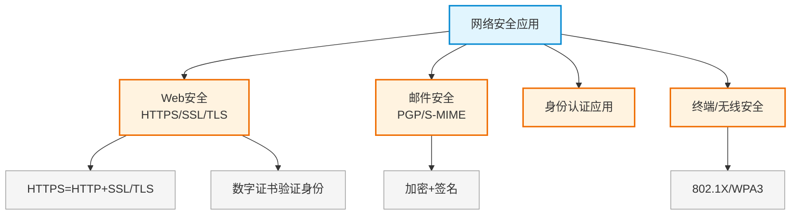

# 第二十三章：网络安全应用

> 对应课件：`11-7 网络安全应用.pdf`（共 28 页）
> 本章聚焦网络安全综合应用：HTTPS/SSL/TLS、邮件安全、Web 安全、终端安全等。
> ⚠️ 骨架占位，内容待对照 PDF 补充。

## 1. 核心考点脑图 (Mindmap)

---

## 2. 深度理论解析 (Theory & Concepts)

> 待补充：HTTPS/SSL/TLS 握手、邮件安全、Web 安全防护。

## 3. 横向对比与易错辨析 (Comparisons & Pitfalls)

> 待补充：SSL vs TLS、各安全应用对比。

## 4. 历年真题与解析 (Exam Questions)

> 待补充：真实历年真题，标注出处年份。

## 5. 备考建议 (Exam Tips)

> 待补充：高频考点回顾、记忆口诀、易错提醒。
