# 第二十三章：网络安全应用

> 对应课件：`11-7 网络安全应用.pdf`（共 28 页）
> 本章聚焦网络安全综合应用：EFS 文件加密、SSL/TLS/HTTPS、邮件安全（PGP/S/MIME/SET）、Kerberos 认证、链路加密。

## 1. 核心考点脑图 (Mindmap)

```mermaid
flowchart TD
    A["网络安全应用"] --> B["文件加密 EFS"]
    A --> C["SSL/TLS 与 HTTPS"]
    A --> D["邮件安全"]
    A --> E["Kerberos 认证"]
    A --> F["链路加密"]

    B --> B1["对称加密文件<br>非对称公钥加密对称密钥"]
    B --> B2["文件系统层透明"]

    C --> C1["SSL三协议:记录/警告/握手<br>握手协商参数"]
    C --> C2["HTTPS=HTTP+SSL/TLS<br>端口443"]

    D --> D1["PGP:IDEA+RSA+MD5"]
    D --> D2["S/MIME:MD5指纹/RSA签名/3DES加密"]
    D --> D3["SET:DES+RSA+SHA"]

    E --> E1["KDC=AS+TGS<br>AS初始票据,TGS会话票据"]
    E --> E2["单钥体制,防重放用时间戳"]

    F --> F1["点到点,交换节点明文"]

    style A fill:#e1f5fe,stroke:#0288d1,stroke-width:2px
    style B fill:#fff3e0,stroke:#ef6c00,stroke-width:2px
    style C fill:#ffebee,stroke:#c62828,stroke-width:2px
    style D fill:#ffebee,stroke:#c62828,stroke-width:2px
    style E fill:#fff3e0,stroke:#ef6c00,stroke-width:2px
    style F fill:#fff3e0,stroke:#ef6c00,stroke-width:2px
    style B1 fill:#f5f5f5,stroke:#9e9e9e
    style B2 fill:#f5f5f5,stroke:#9e9e9e
    style C1 fill:#f5f5f5,stroke:#9e9e9e
    style C2 fill:#f5f5f5,stroke:#9e9e9e
    style D1 fill:#f5f5f5,stroke:#9e9e9e
    style D2 fill:#f5f5f5,stroke:#9e9e9e
    style D3 fill:#f5f5f5,stroke:#9e9e9e
    style E1 fill:#f5f5f5,stroke:#9e9e9e
    style E2 fill:#f5f5f5,stroke:#9e9e9e
    style F1 fill:#f5f5f5,stroke:#9e9e9e
```

---

## 2. 深度理论解析 (Theory & Concepts)

### 2.1 文件加密 EFS ⭐

Windows 通过登录认证和 NTFS 权限控制文件存取，但若用户安装不同操作系统可绕过。Microsoft 提供**加密文件系统**（EFS），与 NTFS 紧密集成，给敏感数据深层保护。

*   **加解密用户**：只有加密用户和数据恢复代理用户能解密，其他用户取得所有权也不能解密。
*   **加密方式**：**对称密钥**加密文件，**非对称密钥的公钥**加密对称密钥（混合）。
*   **加密层级**：发生在**文件系统层**而非应用层，对用户和应用程序**透明**（像普通文件）。
*   **限制**：EFS 加密数据不能在 Windows 中直接共享；通过网络传输时以**明文**形式传输。

> **易错点**：EFS 用对称密钥加密文件、非对称公钥加密对称密钥；文件系统层透明；独立非联网计算机**能**用 EFS（D 错选项常考）。

### 2.2 SSL/TLS ⭐⭐ 高频考点

*   **SSL** 是**传输层安全协议**，用于实现 Web 安全通信。
*   IETF 基于 **SSL 3.0** 制定传输层安全标准 **TLS**。SSL/TLS 在 Web 安全通信中被称为 **HTTPS**。

#### SSL 三大子协议 ⭐⭐ 高频考点

| 子协议 | 功能 |
| :--- | :--- |
| **记录协议**（Record） | — |
| **警告协议**（Alert） | — |
| **握手协议**（Handshake） | **协商参数**，产生会话状态密码参数，协商加密算法及密钥 |

> **⭐ 易错点**：SSL 含**记录、警告、握手**三协议；**握手协议**用于协商加密算法和密钥等参数（产生会话状态密码参数）。**不含 AH/ESP**（那是 IPSec 的）。

### 2.3 HTTPS 与 S-HTTP ⭐⭐

| 协议 | 说明 | 端口 |
| :--- | :--- | :--- |
| **HTTP** | 普通超文本传输 | **80** |
| **HTTPS** | SSL/TLS + HTTP 结合，免于窃听和中间人攻击 | **443** |
| **S-HTTP** | 安全超文本传输协议，本质还是 HTTP，报文头有区别并加密 | — |

> **易错点**：HTTPS 默认端口 **443**，HTTP 是 **80**；HTTPS 是两个协议结合（SSL/TLS + HTTP），不是单独协议。访问 SSL 安全页面用 `https://`。

### 2.4 邮件安全：SET、PGP、S/MIME ⭐⭐ 高频考点

#### SET（安全电子交易）

为解决用户、商家、银行间信用卡支付交易设计，保证支付信息机密、完整、身份合法。
*   对称加密 **DES**，公钥密码 **RSA**，散列函数 **SHA**。

#### PGP ⭐⭐

*   完整的**电子邮件安全软件包**（应用层），提供数据加密和数字签名。
*   **RSA** 公钥证书身份验证，**IDEA** 数据加密，**MD5** 完整性验证。

#### S/MIME ⭐⭐ 高频考点

*   安全多用途互联网邮件扩展协议，提供电子邮件安全服务。
*   **MD5** 生成数字指纹，**RSA** 数字签名，**3DES** 加密数字签名。
*   注意：**MIME 不具备安全功能**，S/MIME 才有。

> **⭐ 易错点（邮件安全算法必记）**：
> *   **PGP** = RSA（签名）+ IDEA（加密）+ MD5（完整性）
> *   **S/MIME** = MD5（指纹）+ RSA（签名）+ 3DES（加密签名）
> *   **SET** = DES + RSA + SHA

#### S/MIME 报文处理四步骤 ⭐⭐

1.  **生成数字指纹**：Hash 运算（**MD5**）
2.  **生成数字签名**：公钥算法（RSA）
3.  **加密数字签名**：**对称密钥**（**3DES**）
4.  **加密报文**：对称加密

> **易错点**：数字指纹用 MD5（Hash），加密数字签名用 3DES（对称密钥）。

### 2.5 Kerberos 认证 ⭐⭐ 高频考点

**Kerberos** 是用于**身份认证**的安全协议，采用**单钥体制**（对称密钥）。

#### Kerberos 组件

| 组件 | 说明 |
| :--- | :--- |
| **KDC**（密钥分发中心） | 包含 AS 和 TGS，有分发票据 Ticket 功能；保存所有用户账号和密码 |
| **AS**（认证服务器） | 用户先向 AS 进行身份认证，获得**初始许可凭证** |
| **TGS**（票据分发服务器） | 用户向 TGS 请求**访问凭据**，获取访问权限凭证 |
| **应用服务器** | 用户递交访问权限凭据，获取资源访问 |

#### Kerberos 认证流程 ⭐

1.  用户先向 KDC 中的 **AS** 进行身份认证，通过则获得**初始许可凭证**。
2.  接着向授权服务器 **TGS** 请求访问凭据，获取访问权限凭证。
3.  向应用服务器递交访问权限凭据，获取资源访问。

#### Kerberos 特点 ⭐⭐

*   采用**单钥体制**（对称密钥），**不是公钥基础设施**。
*   **CA 不属于 Kerberos**，属于 PKI 公钥基础设施。
*   使用**时间戳**防止重放攻击。
*   KDC 中保存所有用户的账号和密码。

> **⭐ 易错点（高频）**：
> *   用户首先向 **AS**（认证服务器）申请初始票据，**不是 CA**。
> *   Kerberos 是**单钥体制**（对称），PKI 是公钥基础设施；CA 属于 PKI 不属于 Kerberos。
> *   Kerberos 用**时间戳防重放攻击**；KDC 保存所有用户账号密码。

### 2.6 链路加密 ⭐

*   **链路加密**：网络中每条链路**独立**实现加密。
*   在**交换节点是明文传输**，不需要对数据进行加解密（每个节点不加密控制信息）。
*   **仅适用于点到点网络**，**不适用于广播网络**。

> **易错点**：链路加密交换节点**明文**、仅**点到点**（不适用广播网络）；每个节点不对数据单元加解密。

---

## 3. 横向对比与易错辨析 (Comparisons & Pitfalls)

### 3.1 邮件/交易安全协议算法对照 ⭐⭐

| 协议 | 数字指纹/Hash | 数字签名 | 加密 |
| :--- | :--- | :--- | :--- |
| **PGP** | MD5 | RSA | IDEA |
| **S/MIME** | MD5 | RSA | 3DES |
| **SET** | SHA | RSA | DES |

### 3.2 Kerberos vs PKI ⭐⭐

| 维度 | Kerberos | PKI |
| :--- | :--- | :--- |
| 体制 | **单钥**（对称） | 公钥（非对称） |
| 中心 | KDC（含 AS+TGS） | CA |
| 票据 | AS 初始票据、TGS 会话票据 | 数字证书 |
| 防重放 | 时间戳 | — |
| 全称 | Kerberos 认证协议 | 公钥基础设施 |

### 3.3 高频易错点速记

> **易错点 1**：EFS 对称加密文件+非对称公钥加密对称密钥；文件系统层透明；网络传输明文。
>
> **易错点 2**：SSL 三协议=记录/警告/握手；**握手协商参数**；不含 AH/ESP。
>
> **易错点 3**：HTTPS 端口 443，HTTP 80；HTTPS=HTTP+SSL/TLS；访问用 https://。
>
> **易错点 4**：PGP=RSA+IDEA+MD5；S/MIME=MD5+RSA+3DES；SET=DES+RSA+SHA。
>
> **易错点 5**：S/MIME 数字指纹 MD5、加密签名 3DES（对称）；MIME 无安全功能。
>
> **易错点 6**：Kerberos 单钥体制；用户先向 **AS** 申请初始票据；CA 属 PKI 不属 Kerberos；时间戳防重放。
>
> **易错点 7**：链路加密交换节点明文、仅点到点（不适用广播网络）。

---

## 4. 历年真题与解析 (Exam Questions)

### 4.1 网规 2015年11月 第33-34题 ⭐⭐（S/MIME）

**题目**：S/MIME 发送报文对消息 M 处理包括生成数字指纹、生成数字签名、加密数字签名和加密报文 4 步，其中生成数字指纹采用（33），加密数字签名采用（34）。
（33）A.MD5　B.3DES　C.RSA　D.RC2　（34）A.MD5　B.RSA　C.3DES　D.SHA-1

**【参考答案】（33）A　（34）C**

**【解析】**：数字指纹是 Hash 运算结果，只有 MD5 是摘要算法（33→A）。生成数字签名用公钥算法，**加密数字签名用对称密钥**，只有 3DES 是对称（34→C）。

### 4.2 网规 2017年11月 第42题 ⭐（Kerberos 初始票据）

**题目**：在 Kerberos 认证系统中，用户首先向（42）申请初始票据。
A.认证服务器　B.密钥分发中心KDC　C.票据授予服务器TGS　D.认证中心CA

**【参考答案】A**

**【解析】**：用户首先向**认证服务器（AS）**申请初始票据，再向 TGS 请求服务器凭证 → A。

### 4.3 网规 2017年11月 第47题 ⭐（安全邮件）

**题目**：下面可提供安全电子邮件服务的是（47）。
A.RSA　B.SSL　C.SET　D.S/MIME

**【参考答案】D**

**【解析】**：RSA 是非对称加密算法（签名）；SSL 是四层安全协议（HTTPS）；SET 是安全电子交易（电商）；**S/MIME 用于保护邮件安全** → D。

### 4.4 网规 2018年11月 第44题 ⭐⭐（Kerberos vs PKI）

**题目**：下面关于第三方认证服务说法中，正确的是（44）。
A.Kerberos 采用单钥体制　B.Kerberos 中文全称是"公钥基础设施"　C.Kerberos 中保存数字证书的服务器叫 CA　D.Kerberos 用户首先向 CA 申请初始票据

**【参考答案】A**

**【解析】**：Kerberos 采用**单钥体制**（对称）→ A。公钥基础设施和 CA 属于 PKI 体系，不属于 Kerberos（B/C/D 错）。

### 4.5 网规 2018年11月/2022年11月 第45-46/47-48题 ⭐⭐（SSL 子协议）

**题目**：SSL 的子协议主要有记录协议、（45），其中（46）用于产生会话状态的密码参数，协商加密算法及密钥等。
（45）A.AH和ESP　B.AH和握手　C.警告和握手　D.警告和ESP
（46）A.AH　B.握手协议　C.警告协议　D.ESP

**【参考答案】（45）C　（46）B**

**【解析】**：SSL 含**记录协议、警告协议、握手协议**（45→C）；**握手协议**用于协商加密算法和密钥等参数（46→B）。AH/ESP 是 IPSec 的，不是 SSL。

### 4.6 网规 2019年11月 第45题 ⭐⭐（Kerberos vs PKI）

**题目**：下面关于第三方认证服务说法中，正确的是（45）。
A.Kerberos 中保存数字证书的服务器叫 CA　B.Kerberos 和 PKI 是第三方认证服务的两种体制　C.Kerberos 用户首先向 CA 申请初始票据　D.Kerberos 中文全称是"公钥基础设施"

**【参考答案】B**

**【解析】**：**Kerberos 和 PKI 是第三方认证服务的两种体制** → B。CA 属 PKI 不属 Kerberos（A/C/D 错）。

### 4.7 网规 2020年11月 第45题 ⭐⭐（Kerberos）

**题目**：以下关于 Kerberos 认证的说法中，错误的是（45）。
A.开放网络中为用户提供身份认证的方式　B.用户相互访问必须首先向 CA 申请票据　C.KDC 中保存所有用户账号和密码　D.使用时间戳防止重放攻击

**【参考答案】B**

**【解析】**：用户首先向 **AS**（认证服务器）申请初始票据，**不是 CA**（CA 属 PKI）。KDC 保存所有用户账号密码、用时间戳防重放。B 错误 → 选 B。

### 4.8 网规 2021年11月 第50题 ⭐（HTTPS 访问）

**题目**：某网站域名 www.xyz.com，使用 SSL 安全页面，用户可以使用（50）访问。
A.http://　B.https://　C.files://　D.ftp://

**【参考答案】B**

**【解析】**：SSL 安全页面用 **https://** 访问 → B。

### 4.9 网规 2021年11月 第51题 ⭐⭐（链路加密）

**题目**：以下关于链路加密的说法中，错误的是（51）。
A.每条链路独立实现加密　B.每个节点对数据单元的数据和控制信息均加密保护　C.每个节点均需对数据单元进行加解密　D.适用于广播网络和点到点网络

**【参考答案】BCD**

**【解析】**：链路加密在**交换节点是明文传输**，不需要加解密（B、C 错）；**仅适用于点到点网络**，不适用于广播网络（D 错）。每条链路独立加密（A 正确）。

### 4.10 网规 2021年11月 第45题 ⭐（EFS）

**题目**：以下关于 EFS 的描述中，错误的是（45）。
A.与 NTFS 文件系统集成，提供文件加密　B.使用对称密钥加密文件，非对称公钥加密共享密钥　C.文件加密在文件系统层而非应用层　D.独立的非联网计算机不能使用 EFS 为文件加密

**【参考答案】D**

**【解析】**：EFS 用对称加密文件+非对称公钥加密对称密钥；文件系统层透明。**独立非联网计算机能用 EFS**（D 错）→ 选 D。

---

## 5. 备考建议 (Exam Tips)

### 高频考点回顾

1.  **EFS**：对称加密文件+非对称公钥加密对称密钥；文件系统层透明；网络传输明文。
2.  **SSL/TLS**：传输层安全；三子协议=记录/警告/握手；握手协议协商参数；基于 SSL3.0 制定 TLS。
3.  **HTTPS**：HTTP+SSL/TLS；端口 443（HTTP 80）；用 https:// 访问。
4.  **邮件安全算法**：PGP=RSA+IDEA+MD5；S/MIME=MD5+RSA+3DES；SET=DES+RSA+SHA。
5.  **S/MIME 四步**：数字指纹(MD5)→数字签名(RSA)→加密签名(3DES对称)→加密报文。
6.  **Kerberos**：单钥体制；KDC(AS+TGS)；用户先向 AS 申请初始票据；CA 属 PKI 不属 Kerberos；时间戳防重放；KDC 存账号密码。
7.  **Kerberos vs PKI**：两种第三方认证体制；Kerberos 对称、PKI 公钥。
8.  **链路加密**：每链路独立、交换节点明文、仅点到点（不适用广播）。

### 记忆口诀

*   **EFS**："对称加密文件，公钥加密对称密，文件系统层透明"
*   **SSL 三协议**："记录警告握手三，握手协商加密参数"
*   **端口**："HTTP 八十 HTTPS 四四三"
*   **邮件算法**："PGP 加 IDEA 验 MD5，S/MIME 指纹 MD5 签 RSA 加 3DES，SET 是 DES RSA SHA"
*   **Kerberos**："单钥体制 KDC，AS 初始 TGS 会话，CA 属 PKI 不属它，时间戳防重放"
*   **链路加密**："每链独立交换明，仅点对点不广播"
