# 第二十四章：安全审计

> 对应课件：`11-8 安全审计.pdf`（共 7 页，模块最小章节）
> 本章聚焦安全审计：定义与功能、等保 2.0 技术要求层面划分、审计手段。

## 1. 核心考点脑图 (Mindmap)

```mermaid
flowchart TD
    A["安全审计"] --> B["审计定义与分类"]
    A --> C["审计功能"]
    A --> D["等保2.0技术要求"]
    A --> E["审计手段"]

    B --> B1["系统/数据/应用审计"]
    B --> B2["工具:LogBase/NetSC/Xlog"]

    C --> C1["监视异常/收集数据"]
    C --> C2["实时报警/网络控制"]
    C --> C3["数据维护查询/规则制定"]

    D --> D1["安全物理环境"]
    D --> D2["安全通信网络"]
    D --> D3["安全区域边界"]
    D --> D4["安全计算环境"]
    D --> D5["安全管理中心"]

    E --> E1["识别违规/审计内容"]
    E --> E2["响应阻断攻击"]

    style A fill:#e1f5fe,stroke:#0288d1,stroke-width:2px
    style B fill:#fff3e0,stroke:#ef6c00,stroke-width:2px
    style C fill:#fff3e0,stroke:#ef6c00,stroke-width:2px
    style D fill:#ffebee,stroke:#c62828,stroke-width:2px
    style E fill:#fff3e0,stroke:#ef6c00,stroke-width:2px
    style B1 fill:#f5f5f5,stroke:#9e9e9e
    style B2 fill:#f5f5f5,stroke:#9e9e9e
    style C1 fill:#f5f5f5,stroke:#9e9e9e
    style C2 fill:#f5f5f5,stroke:#9e9e9e
    style C3 fill:#f5f5f5,stroke:#9e9e9e
    style D1 fill:#f5f5f5,stroke:#9e9e9e
    style D2 fill:#f5f5f5,stroke:#9e9e9e
    style D3 fill:#f5f5f5,stroke:#9e9e9e
    style D4 fill:#f5f5f5,stroke:#9e9e9e
    style D5 fill:#f5f5f5,stroke:#9e9e9e
    style E1 fill:#f5f5f5,stroke:#9e9e9e
    style E2 fill:#f5f5f5,stroke:#9e9e9e
```

---

## 2. 深度理论解析 (Theory & Concepts)

### 2.1 安全审计定义与分类 ⭐

**安全审计**包括**识别、记录、存储、分析**与安全相关行为的信息，审计记录用于检查与安全相关的活动和负责人。

*   信息安全目标分为：**系统安全、数据安全、事务安全**。
*   根据被审计对象不同，安全审计分为：**系统的安全审计、数据的安全审计、应用的安全审计**。
*   常用审计工具：**LogBase、NetSC、Xlog** 等。

### 2.2 安全审计功能 ⭐

安全审计具有 7 大功能：

1.  **监视网络中的异常行为**。
2.  **收集**操作系统和应用系统内部产生的审计数据。
3.  **实时报警**，通知安全管理员及时处理。
4.  **网络控制**：具备自动响应的审计系统发现严重违规或重大入侵时，可**自动或手动中断网络连接**，减少损失。
5.  审计数据**维护和查询加密，权限控制**。
6.  **规则制定**：系统根据管理员制定的规则工作，适用不同应用需求。
7.  **附加功能**：提供审计接口，可与其他网络安全设备**联动协同防御**。

### 2.3 等保 2.0 技术要求 ⭐⭐ 高频考点

等保 2.0 技术要求五大层面：

| 层面 | 说明 |
| :--- | :--- |
| **安全物理环境** | 防盗防破坏、防火、防雷、防水防潮、防静电、温湿度控制、电力供应、电磁防护 |
| **安全通信网络** | 网络架构、通信传输、可信验证；入侵防范、访问控制策略、防地址欺骗 |
| **安全区域边界** | 边界防护、访问控制、入侵防范、恶意代码防范、安全审计 |
| **安全计算环境** | 主机安全（操作系统安全审计策略、身份鉴别、系统登录失败处理、最大并发数）、应用安全、数据安全 |
| **安全管理中心** | 系统管理、审计管理、安全管理、集中管控 |

#### 等保 2.0 各安全项与层面映射 ⭐⭐ 高频考点

| 安全项 | 所属层面 |
| :--- | :--- |
| **操作系统安全审计策略配置** | **主机**（安全计算环境） |
| **防盗防破坏、防火** | **物理**（安全物理环境） |
| **系统登录失败处理、最大并发数设置** | **应用**（安全计算环境） |
| **入侵防范、访问控制策略配置、防地址欺骗** | **网络**（安全通信网络） |

> **⭐ 易错点（必记）**：等保 2.0 五大技术要求 = 安全物理环境、安全通信网络、安全区域边界、安全计算环境、安全管理中心。主机安全审计、应用安全（登录失败处理、并发数）属于**安全计算环境**；物理防护属于**安全物理环境**；网络入侵防范属于**安全通信网络**。

### 2.4 安全审计手段 ⭐

安全审计的手段主要包括：

1.  **识别网络各种违规操作**。
2.  对**信息内容和业务流程**进行审计，防止信息非法泄露。
3.  **响应并阻断**网络攻击行为。

> **易错点**：审计手段 = ①识别违规 + ②审计内容防泄露 + ③响应阻断攻击；**④对系统运行情况进行日常维护**不属于安全审计手段（属运维）。

---

## 3. 横向对比与易错辨析 (Comparisons & Pitfalls)

### 3.1 等保 2.0 层面与典型安全项

| 层面 | 典型安全项 |
| :--- | :--- |
| 安全物理环境 | 防盗、防火、防雷、防水、防静电、温湿度、电力、电磁防护 |
| 安全通信网络 | 网络架构、入侵防范、访问控制、防地址欺骗 |
| 安全区域边界 | 边界防护、恶意代码防范 |
| 安全计算环境 | 操作系统审计策略、登录失败处理、最大并发数、身份鉴别、数据安全 |
| 安全管理中心 | 系统管理、审计管理、安全管理、集中管控 |

### 3.2 高频易错点速记

> **易错点 1**：安全审计 = 识别、记录、存储、分析；按对象分系统/数据/应用审计。
>
> **易错点 2**：等保 2.0 五大技术要求 = 物理环境、通信网络、区域边界、计算环境、管理中心。
>
> **易错点 3**：操作系统审计策略、登录失败处理、最大并发数 → **安全计算环境**（主机/应用安全）。
>
> **易错点 4**：防盗防火 → **安全物理环境**；入侵防范、防地址欺骗 → **安全通信网络**。
>
> **易错点 5**：审计手段 = 识别违规 + 审计内容防泄露 + 响应阻断；日常维护不属于审计。

---

## 4. 历年真题与解析 (Exam Questions)

### 4.1 网规 2017年11月 案例三/问题1 ⭐⭐（等保层面映射）

**题目**：信息系统从物理、网络、主机、应用、数据等层面安全设计，其中：
- "操作系统安全审计策略配置"属于（1）安全层面
- "防盗防破坏、防火"属于（2）安全层面
- "系统登录失败处理、最大并发数设置"属于（3）安全层面
- "入侵防范、访问控制策略配置、防地址欺骗"属于（4）安全层面

**【参考答案】**：
- （1）**主机**（安全计算环境）
- （2）**物理**（安全物理环境）
- （3）**应用**（安全计算环境）
- （4）**网络**（安全通信网络）

**【解析】**：等保 2.0 技术要求：安全物理环境、安全通信网络、安全区域边界、安全计算环境、安全管理中心。操作系统审计策略属主机、登录失败处理/并发数属应用（均归安全计算环境）；防盗防火属物理环境；入侵防范/访问控制/防地址欺骗属通信网络。

### 4.2 高项 2021年11月 第65题 ⭐（审计手段）

**题目**：安全审计的手段主要包括（65）。
①识别网络各种违规操作　②对信息内容和业务流程进行审计，防止信息非法泄露　③响应并阻断网络攻击行为　④对系统运行情况进行日常维护
A.①②③　B.②③④　C.①②④　D.①③④

**【参考答案】A**

**【解析】**：安全审计手段 = ①识别违规 + ②审计内容防泄露 + ③响应阻断攻击；**④日常维护不属于**安全审计手段 → A（①②③）。

---

## 5. 备考建议 (Exam Tips)

### 高频考点回顾

1.  **安全审计定义**：识别、记录、存储、分析；按对象分系统/数据/应用审计；工具 LogBase/NetSC/Xlog。
2.  **审计 7 功能**：监视异常、收集数据、实时报警、网络控制（中断连接）、数据维护查询加密、规则制定、附加功能（联动协同防御）。
3.  **等保 2.0 五大技术要求**：安全物理环境、安全通信网络、安全区域边界、安全计算环境、安全管理中心。
4.  **层面映射**：操作系统审计策略→计算环境(主机)；登录失败处理/最大并发数→计算环境(应用)；防盗防火→物理环境；入侵防范/防地址欺骗→通信网络。
5.  **审计手段**：识别违规 + 审计内容防泄露 + 响应阻断（日常维护不属于）。

### 记忆口诀

*   **审计定义**："识别记录存储分析，系统数据应用三类审"
*   **等保五大**："物理环境通信网，区域边界计算环，再加管理中心"
*   **层面映射**："审计策略主机算，登录失败应用算，防盗防火物理算，入侵防范网络算"
*   **审计手段**："识别违规审内容，响应阻断非维护"
