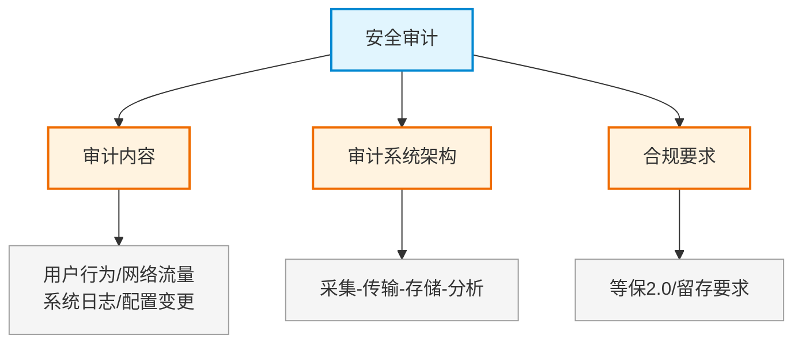

# 第二十四章：安全审计

> 对应课件：`11-8 安全审计.pdf`（共 7 页，模块最小章节）
> 本章聚焦安全审计：日志收集、审计系统架构、合规性。
> ⚠️ 骨架占位，内容待对照 PDF 补充。

## 1. 核心考点脑图 (Mindmap)

---

## 2. 深度理论解析 (Theory & Concepts)

> 待补充：审计对象、审计系统组成、日志留存合规要求。

## 3. 横向对比与易错辨析 (Comparisons & Pitfalls)

> 待补充：审计 vs 监控 vs IDS 辨析。

## 4. 历年真题与解析 (Exam Questions)

> 待补充：真实历年真题，标注出处年份。

## 5. 备考建议 (Exam Tips)

> 待补充：高频考点回顾、记忆口诀、易错提醒。
